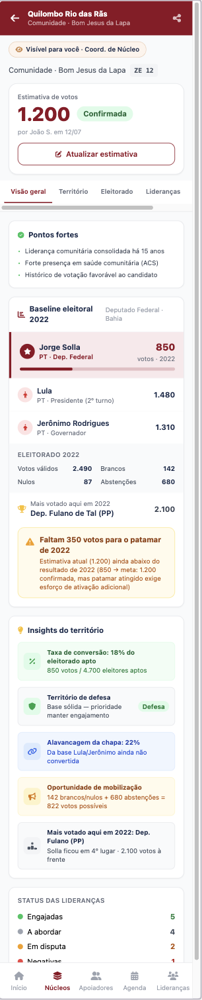
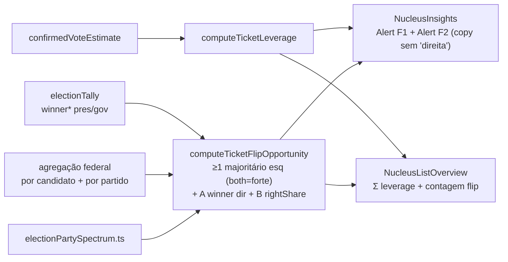

# Insight: alavancagem da chapa (conversão + oportunidade de virada)

Status: entregue (2026-07-19)
Atualizado em: 2026-07-19 (revisão auditoria: loader `loadNucleusListElectionOverview`; stack já tem Gap + conversão A5-1 + tendência E2; A7 F1 no detalhe ✓; **débito N+1 flip na lista → A7 F5** via `capture-review-debts` pós-`/simplify`)
Item do roadmap: [docs/roadmap.md](../roadmap.md) (Trilha A, item A5 — um dos cinco insights derivados do baseline)
Responsável: —

## Referência visual (UX Pilot)

Design: [`Baseline-Eleitoral-2022.png`](../design-refs/latest/Baseline-Eleitoral-2022.png) · [`Baseline-Eleitoral-2022.html`](../design-refs/latest/Baseline-Eleitoral-2022.html)

Como usar:

- **Adotar a estrutura:** card "Insights do território" no detalhe do núcleo — uma linha/Alert por insight (ícone + veredito curto + números de apoio). A linha existente "Alavancagem da chapa: 22% · Da base Lula/Jerônimo ainda não convertida" cobre a **Fase 1**. A **Fase 2** (oportunidade de virada) entra como **segunda linha** no mesmo stack quando algum gatilho dispara — não inventar tela nova.
- **Fora deste plano:** Gap vs 2022 (já em A4), conversão/classificação/mobilização/competitiva (outros planos A5), dobradinha 2026 (A6).
- **Ajustar cores e código:** o HTML/PNG usa a paleta antiga (vermelho escuro `#8E0E23`, navy `#1B2B4B`, dourado `#C8874B`) e Tailwind via CDN. Implementar com `Alert` / tokens do tema `data-theme='campaign'` (`src/app/(frontend)/styles.css`), no stack `NucleusInsights.tsx`.

## Contexto

Solla (PT) apoia a chapa majoritária de esquerda (Lula presidente, Jerônimo governador — `BASELINE_TICKET_2022` em `src/lib/electionResults.ts`). O baseline TSE 2022 (A3/A4) já expõe no detalhe do núcleo:

- votos da chapa (`president` / `governor` via `getNucleusElectoralBaseline`);
- `winnerFederal` (mais votado a dep. federal na geografia, com `party`);
- ranking federal agregável por candidato (hoje materializado no loader; A7 F1 deve agregar no SQL);
- em `electionTally`, por município×zona×cargo×turno: `winnerCandidateName` / `winnerParty` / `winnerVotes` (ainda **não** no view model do núcleo).

O stack `NucleusInsights` já expõe Gap vs 2022 (A4), taxa de conversão (A5-1) e tendência histórica (E2). Faltam dois sinais de alavancagem da majoritária:

1. **Conversão da base** — quanto da base Lula/Jerônimo a estimativa confirmada já captura.
2. **Oportunidade de virada** _(produto 2026-07-19)_ — território onde o eleitorado já escolheu (ou favorece) o time majoritário de esquerda, mas o voto **proporcional federal** ainda foi para a direita — seja porque o **mais votado** federal é de direita, seja porque a **soma dos votos de partidos de direita** é alta em relação ao total válido. Em ambos os casos o discurso de **completar a chapa / eleger o time** é operacionalmente útil.

A Fase 2 foi **absorvida neste plano** (não virou item A5 paralelo): mesma superfície (`NucleusInsights`), mesmos dados TSE, mesma taxonomia de espectro que a dobradinha A6 precisará depois. Precedente: Gap vs 2022 absorvido no baseline.

## Objetivos

- **Fase 1 — conversão:** `ticketLeverage` = `confirmedVoteEstimate / lulaVotes` (e `/ jeronimoVotes`); % capturada, teto da chapa e gap no detalhe; no overview, `Σ estimate / Σ lulaVotes` sobre o filtro.
- **Fase 2 — oportunidade de virada:** detectar, na geografia do núcleo (com **≥1** majoritário de esquerda), **qualquer** dos gatilhos abaixo e exibir Alert; no overview, contagem (+ destaque quando os dois majoritários alinham).
  - **Gatilho A — vencedor federal `direita`:** `winnerFederal.party` → espectro `direita`.
  - **Gatilho B — participação `direita` alta:** `rightShare = Σ votos (partido→direita) / Σ nominais federais` ≥ limiar — **mesmo se o mais votado não for de direita**.
- Guardrails: **leitura derivada** — sem escrita, sem `Consent`, sem migration; `overrideAccess: false`; falha fechada se faltar tally/voto ou partido fora do mapa.

## Decisões travadas

- **Duas fases no mesmo insight A5, não item novo.** Fase 1 = métrica contínua; Fase 2 = flag com gatilhos A e/ou B. _(produto 2026-07-19)_
- **Gatilho B é independente do vencedor.** Participação proporcional da direita basta; o vencedor de direita (A) é caso especial de B com share concentrado, mas A e B disparam o mesmo Alert com `trigger: 'winner' | 'share' | 'both'` para o copy citar o motivo certo. _(refino de produto 2026-07-19)_
- **Pré-condição majoritária em graus.** Basta **um** de (pres. | gov.) com espectro `esquerda` para liberar a Fase 2 (`majoritarianAlignment: 'president' | 'governor' | 'both'`). Os **dois** alinhados é sinal mais forte (`both`) — copy e eventual priorização no overview podem destacar, mas um já dispara. _(produto 2026-07-19)_
- **Espectro por partido = expert survey Bolognesi et al. (onda 2022).** Mapa estático `SG_PARTIDO` → `esquerda | centro | direita | null` em `src/lib/electionPartySpectrum.ts`, derivado da classificação categórica dos autores (escala 0–10):
  - `esquerda` ← média ≤ 4,49 (extrema-esquerda + esquerda + centro-esquerda) — ex.: PSTU, PCO, PCB, PSOL, UP, PCdoB, PT (2,68), PSB, REDE, PDT, PV
  - `centro` ← 4,5–5,5 _(vazio em 2022 — achado central do artigo)_
  - `direita` ← média ≥ 5,51 (centro-direita + direita + extrema-direita) — numerador do gatilho B e teste do gatilho A (alinha com copy “fora do campo da chapa”; inclui MDB/PSDB/PSD e PL/NOVO/UNIÃO etc.)
  - `null` ← sigla ausente da tabela
  - **Fonte:** Bolognesi, Codato, Ribeiro & Silva — _O desaparecimento do centro ideológico no sistema partidário brasileiro: a classificação mais atualizada dos experts_, Opinião Pública, v. 31, e31120 ([SciELO](https://www.scielo.br/j/op/a/hv8GBg9hfCCZLwcWktfYhtC/?lang=pt)); survey ABCP/brasilianistas 2018 e 2022; dataset Harvard Dataverse `doi:10.7910/DVN/MFIXKW`. Antecessor: Bolognesi, Ribeiro & Codato, Dados 66(2), 2023.
  - **Implementação:** versionar médias 2022 + aliases TSE (`UNIÃO`/`UNIAO`, `PCdoB`/`PC do B`, `PP`/`PROGRESSISTAS`/`PROGRE`, `REPUBLICANOS`/`REP`, `SOLIDARIEDADE`/`SDD`, `CIDADANIA`/`CDD`). Comentário no arquivo cita DOI + Tabela 1. Sem ML; atualizar só com nova onda do survey. Compartilhável com A6 (tiers podem usar a média contínua).
- **Share (gatilho B) soma espectro `direita` (≥ 5,51).** Denominador = nominais federais; partidos `null` entram no denominador e **não** no numerador.
- **Share usa votos nominais federais agregados por partido**, não legenda isolada no v1. Denominador = soma dos nominais na geografia (turno 1 dep. federal).
- **Vencedores majoritários vêm de `electionTally.winner*`** (turno decisivo); federal A usa `winnerFederal`; federal B precisa da soma por espectro — alinhar com A7 F1.
- **Campanha é esquerda via ticket** — `BASELINE_TICKET_2022.*.party` (PT; média 2,68 na onda 2022).
- **Copy do Alert: operacional, sem a palavra “direita”.** Tom de coordenação de campo. Internamente o código usa os buckets do survey; a UI fala em **“fora do campo da chapa”** / **“completar a chapa”**. Exemplos travados:
  - Gatilho A: _“Oportunidade de completar a chapa — o mais votado a dep. federal ficou fora do campo (Nome, PARTIDO).”_
  - Gatilho B: _“Oportunidade de completar a chapa — X% do proporcional federal ficou fora do campo da chapa.”_
  - Both: combina os dois numa linha + suporte.
  - `majoritarianAlignment === 'both'`: prefixo opcional _“Majoritários alinhados. ”_; se só um: _“Presidente alinhado. ”_ / _“Governador alinhado. ”_
  - Racional: “direita” é rótulo da escala acadêmica; na ferramenta o discurso útil é “eleger o time”. _(decisão 2026-07-19)_
- **Fase 2 opt-in na UI** — Alert só quando `status === 'opportunity'`.
- **i18n/naming:** `computeTicketLeverage`, `computeTicketFlipOpportunity`, `partySpectrum`, `rightShare`, `majoritarianAlignment`, `winnerPresident`, `winnerGovernor`; strings em pt-BR.

## Questões em aberto

- **Limiar do gatilho B (`RIGHT_SHARE_THRESHOLD`)?** **Recomendação:** `0.25` (25% dos nominais federais) como constante versionada em `electionInsights.ts`; validar com produto (faixa plausível 20–35%). Abaixo do limiar e sem gatilho A → sem Alert.
- **Turno decisivo dos majoritários?** **Recomendação:** 2º turno (pres./gov.); fallback para 1º se não houver tally de 2º.
- **Geografia multi-zona com vencedores majoritários diferentes?** **Recomendação:** somar `winnerVotes` por candidato; empate → `ambiguous` (não dispara). Share federal (B) soma todas as zonas sem ambiguidade.
- **Sigla TSE sem linha no survey (partido novo / fusão pós-2022, ex. PRD)?** **Recomendação:** `null` até nova onda ou regra explícita de herança (média dos partidos fundidos); documentar no arquivo.
- **Quando A e B disparam juntos?** **Recomendação:** um único Alert com `trigger: 'both'`.
- **`lideranca` vê?** **Recomendação:** sim (dado público).
- **Overview:** **Recomendação:** contagem de núcleos com oportunidade; destacar subset `majoritarianAlignment === 'both'` se couber sem ruído.

## Abordagem proposta

Componentes:

- **`electionPartySpectrum.ts`** (`src/lib/electionPartySpectrum.ts`): `partySpectrum(party) → 'esquerda' | 'centro' | 'direita' | null` a partir das médias 2022 de Bolognesi et al. (Tabela 1 + Dataverse); aliases TSE; teste de cobertura dos `SG_PARTIDO` do seed BA 2022.
- **`computeTicketLeverage`** (`src/lib/electionInsights.ts`): Fase 1 — `{ lulaLeverage, jeronimoLeverage, lulaGap, jeronimoGap, status }`.
- **`computeTicketFlipOpportunity`** (`src/lib/electionInsights.ts`): entrada `{ winnerPresident, winnerGovernor, winnerFederal, federalVotesByParty }` → `{ status, trigger, majoritarianAlignment, rightShare, rightVotes, totalFederalVotes, president, governor, federal, message }`. Pré-condição: `majoritarianAlignment ∈ {president, governor, both}`. Gatilho A: `winnerFederal` → `direita`. Gatilho B: `rightShare >= RIGHT_SHARE_THRESHOLD`. `status`: `opportunity | noOpportunity | ambiguous | unknownSpectrum | incomplete`.
- **Loader** (`nucleusElectoralBaseline.ts` + view model): `winnerPresident` / `winnerGovernor` a partir de tallies; `federalVotesByParty` derivado dos nominais federais agregados in-memory (A7 F1 reduz I/O depois, não bloqueia).
- **Overview:** `loadNucleusListElectionOverview` (substitui o antigo `loadNucleusBaseline2022Overview`) ganha agregados `leverage` e `flipOpportunity`.
- **UI:** `NucleusInsights.tsx` — Alert Fase 1; Alert Fase 2 só em `opportunity`, copy travado acima (sem a palavra “direita”). Overview: contagem + opcional subset `both`.
- **Testes:** unit — só pres. esq. / só gov. esq. / both / vencedor direita / share 40% com vencedor esquerda / share 10% sem oportunidade / nenhum majoritário esq. / partido desconhecido / empate; int do agregador multi-zona.
- **Migration:** nenhuma. Sem Consent.

## Dependências

- **Dura:** A4 Baseline no produto ✓ — `getNucleusElectoralBaseline`, `winnerFederal`, votos da chapa, `electionTally.winner*`, votes federais nominais.
- **Suave (forte na prática):** A7 F1 — agregar federal no detalhe; o gatilho B **precisa** de soma por partido e herda o custo do ranking se A7 atrasar.
- **Suave (saída):** A6 — reusa `electionPartySpectrum` → tiers em `electionAlliances.ts`.
- Reusa: `BASELINE_TICKET_2022`, `NucleusInsights`, `computeGapVs2022`, design `Baseline-Eleitoral-2022`.

## Não escopo

- Sugerir parceiros de dobradinha 2026 → [insight-dobradinha-2026.md](insight-dobradinha-2026.md) (A6).
- Ranking/margem competitiva (top-N, `sollaRank`) → [insight-inteligencia-competitiva.md](insight-inteligencia-competitiva.md) — reusa a mesma agregação, não o copy de virada.
- Classificação/conversão por aptos → outros planos A5.
- Kits WhatsApp ou scripts de discurso gerados — só o insight.
- Persistência do flag no núcleo — sempre derivado.

## Referências

- `docs/roadmap.md` — A5 Insights; grafo A4 → A5; Janela 3 ordem 19
- [baseline-eleitoral-tse.md](baseline-eleitoral-tse.md) — A3/A4
- [escala-dry-pos-a4.md](escala-dry-pos-a4.md) — A7 F1 (detalhe) ✓; F5 (batch flip/leverage na lista)
- [insight-dobradinha-2026.md](insight-dobradinha-2026.md) — taxonomia futura
- Bolognesi, Codato, Ribeiro & Silva (2025/2026), Opinião Pública e31120 — [SciELO](https://www.scielo.br/j/op/a/hv8GBg9hfCCZLwcWktfYhtC/?lang=pt); Dataverse `doi:10.7910/DVN/MFIXKW`
- Bolognesi, Ribeiro & Codato (2023), Dados 66(2) — onda 2018 / metodologia
- `src/lib/electionInsights.ts` — padrão `computeGapVs2022`
- `src/lib/electionResults.ts` — `BASELINE_TICKET_2022`
- `src/utilities/nucleusElectoralBaseline.ts` — loader + `winnerFederal`
- `src/utilities/nucleusViewModels.ts` — `NucleusElectoralBaselineViewModel`
- `src/collections/ElectionTally.ts` — `winnerParty` / `winnerVotes`
- `src/collections/ElectionCandidateVote.ts` — votos nominais + `party`
- `src/components/campaign/NucleusInsights.tsx`
- AGENTS.md — Election baseline; naming; `overrideAccess: false`; sem PII
