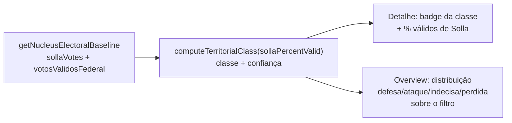

# Insight: classificação territorial (defesa/ataque/indecisa/perdida)

Status: rascunho
Atualizado em: 2026-07-17
Item do roadmap: [docs/roadmap.md](../roadmap.md) (A5 — Próximos / Janela 3)
Responsável: —

## Referência visual (UX Pilot)

Design: [`Baseline-Eleitoral-2022.png`](../design-refs/latest/Baseline-Eleitoral-2022.png) — card "Insights do território", linha "Território de defesa · Base sólida — prioridade: manter engajamento" com chip de classificação à direita (`Defesa` em verde). Os quatro estados usam pares de badge do tema `campaign`: defesa = verde, ataque = contorno vermelho, indecisa = âmbar, perdida = cinza. Implementar como um card do stack `NucleusInsights.tsx` ([baseline-eleitoral-tse.md](baseline-eleitoral-tse.md)), ajustando a paleta antiga do HTML/PNG para os tokens claros.

## Contexto

A literatura de territorialização eleitoral (Politipédia AVM, OPUS, Seja Eleito) classifica cada território em quatro zonas operacionais — **defesa** (voto histórico favorável, meta: manter), **ataque** (desfavorável mas relevante, meta: virar/reduzir margem), **indecisa** (pulverizada, baixa rejeição, meta: consolidar) e **perdida** (desfavorável e elástica, meta: minimizar perda) — para alocar esforço de forma proporcional ao retorno. Hoje o `/campanha` não classifica núcleos; com o baseline TSE 2022 (ver [baseline-eleitoral-tse.md](baseline-eleitoral-tse.md)) podemos derivar uma primeira classificação a partir do histórico.

## Objetivos

- Computar `sollaPercentValid = sollaVotes2022 / votosValidosFederal2022` por núcleo (soma sobre cidades∩zonas).
- Classificar o núcleo em defesa/ataque/indecisa/perdida por `sollaPercentValid` vs. limiares configuráveis.
- Exibir badge no detalhe do núcleo e distribuição por classe no overview da lista (sobre o conjunto filtrado).
- (Opcional, quando o domínio existir) refinar a classe cruzando com pesquisa de intenção de voto atual.

## Decisões travadas

- **Leitura derivada** — sem escrita, sem `Consent`, sem migration.
- **Limiares versionados** em `src/lib/electionInsights.ts` (constantes); decisão de produto por limiar. A classe é **sugestão automática**, não rótulo definitivo — coordenador pode discordar.
- **Reusa** `getNucleusElectoralBaseline` (Solla + válidos federal) do plano baseline.

## Questões em aberto

- Limiares exatos por classe — definir com produto (referência: alta % válidos → defesa; baixa + relevante → ataque; pulverizada → indecisa; baixa + alta rejeição → perdida).
- Como incorporar rejeição (não temos dado de rejeição por geografia hoje) — adiar até domínio de pesquisas.
- `lideranca` vê a classe do próprio núcleo? Recomendação: sim.

## Abordagem proposta

- **Helper** `src/lib/electionInsights.ts`: `computeTerritorialClass(sollaVotes, votosValidosFederal)` → `{ percentValid, class: 'defesa'|'ataque'|'indecisa'|'perdida'|'semBaseline' }`.
- **Componente** `src/components/campaign/NucleusTerritorialClassification.tsx` (server). Overview: bloco com contagem por classe.
- **Teste int** cenários limítrofes e `votosValidosFederal=0`.

## Arquivos a criar/alterar

- Criar: `src/components/campaign/NucleusTerritorialClassification.tsx`.
- Alterar: `src/lib/electionInsights.ts`, `nucleos/[slug]/page.tsx` + `nucleusDetailPageData.ts`, overview da lista.

## Dependências

- [baseline-eleitoral-tse.md](baseline-eleitoral-tse.md) — **única dependência dura**.
- [zonas-por-municipio.md](zonas-por-municipio.md) — dependência suave herdada do baseline (melhora a qualidade de `tseZones`; ver revisão 2026-07-17 no plano baseline).

## Não escopo

- Mapa/PostGIS com a classe pintada por território (roadmap (Fora de escopo / Próximos)).
- Pesquisa de intenção/rejeição (domínio inexistente; refinamento futuro).

## Referências

- Politipédia AVM — "Territorialização eleitoral em campanha"
- [baseline-eleitoral-tse.md](baseline-eleitoral-tse.md)
- AGENTS.md
