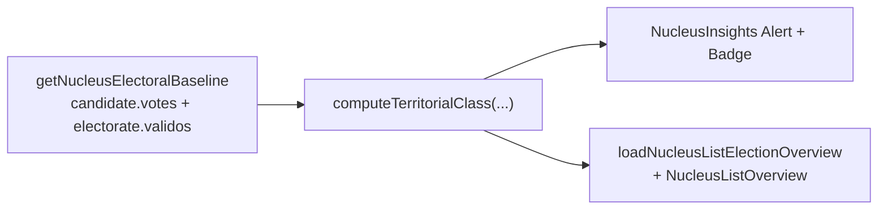

# Insight: classificação territorial (defesa/ataque/indecisa/perdida)

Status: entregue (slice A5-2, 2026-07-19)
Atualizado em: 2026-07-19
Item do roadmap: [docs/roadmap.md](../roadmap.md) (Janela 3, A5 — segundo dos cinco insights)
Responsável: —

**Revisão 2026-07-19:** as-built espelha A5-1 conversão — Alert no stack `NucleusInsights.tsx` (sem `NucleusTerritorialClassification.tsx`); overview via `loadNucleusListElectionOverview` + linha em `NucleusListOverview`; limiares 35%/20%/10% versionados em `electionInsights.ts` _(assumido — validar com produto)_; classificação sobre todos os núcleos filtrados com geografia + válidos > 0 (não exige estimativa confirmada).

## Referência visual (UX Pilot)

Design: [`Baseline-Eleitoral-2022.png`](../design-refs/latest/Baseline-Eleitoral-2022.png) — card "Insights do território", linha "Território de defesa · Base sólida — prioridade: manter engajamento" com chip de classificação à direita (`Defesa` em verde). Os quatro estados usam pares de badge do tema `campaign`: defesa = verde, ataque = contorno vermelho, indecisa = âmbar, perdida = cinza. Implementar como um card do stack `NucleusInsights.tsx` ([baseline-eleitoral-tse.md](baseline-eleitoral-tse.md)), com os tokens claros do tema `campaign` em vez da paleta antiga do HTML/PNG.

## Contexto

A literatura de territorialização eleitoral (Politipédia AVM, OPUS, Seja Eleito) classifica cada território em quatro zonas operacionais — **defesa** (voto histórico favorável, meta: manter), **ataque** (desfavorável mas relevante, meta: virar/reduzir margem), **indecisa** (pulverizada, meta: consolidar) e **perdida** (baixa base histórica, meta: minimizar perda) — para alocar esforço de forma proporcional ao retorno. Com o baseline TSE 2022 (ver [baseline-eleitoral-tse.md](baseline-eleitoral-tse.md)) derivamos a primeira classificação a partir de `sollaVotes2022 / votosValidosFederal2022`.

## Objetivos

- Computar `percentValid = sollaVotes2022 / votosValidosFederal2022` por núcleo (soma sobre cidades∩zonas).
- Classificar o núcleo em defesa/ataque/indecisa/perdida por `percentValid` vs. limiares configuráveis.
- Exibir Alert com badge no detalhe do núcleo e distribuição por classe no overview da lista (sobre o conjunto filtrado com geografia resolvível).

## Decisões travadas

- **Leitura derivada** — sem escrita, sem `Consent`, sem migration. Reusa `getNucleusElectoralBaseline` / `loadNucleusListElectionOverview`.
- **Limiares versionados** em `src/lib/electionInsights.ts`: `TERRITORIAL_DEFESA_MIN = 0.35`, `TERRITORIAL_INDECISA_MIN = 0.20`, `TERRITORIAL_ATAQUE_MIN = 0.10` _(assumido — validar com produto)_.
- A classe é **sugestão automática**, não rótulo definitivo — coordenador pode discordar.
- **Sem rejeição** por geografia (domínio inexistente); refinamento futuro com pesquisas.
- **`lideranca` vê** o insight (mesmo stack da Visão geral).
- **UI:** `Alert` em `NucleusInsights.tsx` (`data-insight="territorial-class"`), não componente separado; chip de classe no Alert (design-ref).
- **Overview:** distribuição sobre todos os núcleos filtrados com geografia + `validos > 0` (não exige estimativa confirmada).

## Questões em aberto

- Limiares exatos — **assumidos 35%/20%/10%** até validação de produto.
- Refinar com pesquisa de intenção/rejeição — adiado.

## Abordagem (as-built)

- **Helper** [`src/lib/electionInsights.ts`](../../src/lib/electionInsights.ts): `computeTerritorialClass`, `aggregateTerritorialClass`, `territorialClassBadgeVariant`, `territorialClassLabel`.
- **Detalhe** [`src/components/campaign/NucleusInsights.tsx`](../../src/components/campaign/NucleusInsights.tsx).
- **Overview** [`src/utilities/nucleusElectoralBaseline.ts`](../../src/utilities/nucleusElectoralBaseline.ts) (`classification.distribution`) + [`NucleusListOverview.tsx`](../../src/components/campaign/NucleusListOverview.tsx).
- **Testes** unitários em `tests/unit/electionInsights.unit.spec.ts`; UI em `tests/unit/nucleusElectoralBaselineUi.unit.spec.ts` e `tests/unit/campaignNucleusListOverview.unit.spec.ts`.

**Já resolvido no simplify / capture-review-debts (não reabrir):** `TERRITORIAL_CLASS_UI` + accessors; `sumFederalTallyForGeography` único; reuso de tallies union na conversão (sem 2º fetch); filtro `isComparableTerritorialClass` no loader; `TerritorialClassIcon`; branches `semBaseline` unificados em `computeTerritorialClass`.

**Débitos maiores (planos existentes):** batch federal flip/leverage na lista → [escala-dry-pos-a4.md](escala-dry-pos-a4.md) **A7 F5**; int `classification` + leverage/flip no loader → [escala-dry-pos-e2.md](escala-dry-pos-e2.md) **E7 F2 ext.**; fetch único 2022 lista+coroplético → **A7 F4**; DRY linha de distribuição no overview → [escala-dry-pos-e1.md](escala-dry-pos-e1.md) **E6 F3**; shell `NucleusInsightAlert` → **E7 F1** (adiado até estabilizar stack A5).

## Dependências

- [baseline-eleitoral-tse.md](baseline-eleitoral-tse.md) — **única dependência dura**.
- [zonas-por-municipio.md](zonas-por-municipio.md) — dependência suave herdada do baseline.

## Não escopo

- Mapa/PostGIS com a classe pintada por território (B3).
- Pesquisa de intenção/rejeição; override manual da classe; demais insights A5.

## Referências

- Politipédia AVM — "Territorialização eleitoral em campanha"
- [baseline-eleitoral-tse.md](baseline-eleitoral-tse.md)
- [insight-taxa-conversao.md](insight-taxa-conversao.md) — padrão as-built A5-1
- [escala-dry-pos-a4.md](escala-dry-pos-a4.md) — A7 F5 (batch flip/leverage)
- [escala-dry-pos-e2.md](escala-dry-pos-e2.md) — E7 F2 ext. (int loader)
- AGENTS.md
