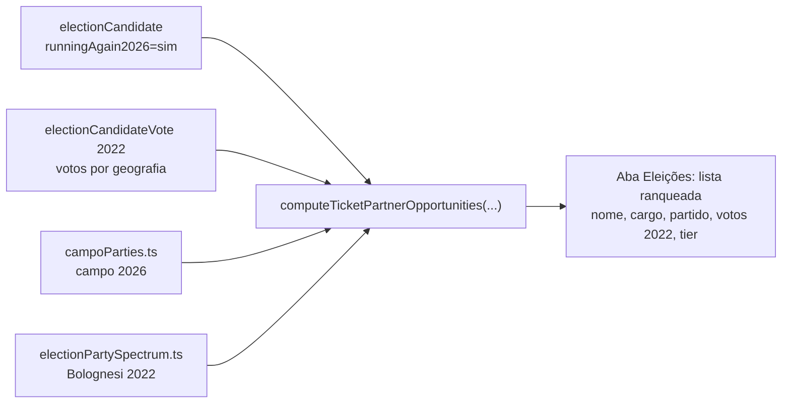

# Insight: oportunidades de dobradinha 2026

Status: **em execução** (Issue #27, claim 2026-07-31) — engenharia entra agora no estado "indisponível até 2026"; a ativação é automática quando a Fase 5 reconciliar `runningAgain2026` (gatilho externo: TSE publica candidaturas — pós-15/08)
Atualizado em: 2026-07-31 (freshness audit da execução — ver "Revisão 2026-07-31")
Item do roadmap: [docs/roadmap.md](../roadmap.md) (Próximos — Demais itens abertos, A6)
Responsável: —

> **Revisão 2026-07-31 (freshness audit, execução da #27):**
>
> 1. `src/lib/electionInsights.ts` **foi deletado** (Pass 2 W4a, 2026-07-25). A matemática nasce em módulo puro novo: `src/lib/ticketPartnerOpportunities.ts` (identificadores em inglês; "dobradinha" fica só na copy pt-BR — a vertical operacional já resolveu o mesmo problema chamando a entidade de `stateDeputy`).
> 2. `src/lib/electionAlliances.ts` **não é criado**. A taxonomia recomendada já existe no repo e se declarou para este uso: `electionPartySpectrum.ts` guarda a média contínua 0–10 de Bolognesi et al. (onda 2022) com o comentário "shared with future A6 tiers", e `campoParties.ts` guarda o campo PT/Solla curado por ano (2026 incluso, FE Brasil). O tier da A6 compõe os dois — sem terceiro mapa.
> 3. **Questões em aberto — resolvidas** (ver seção própria abaixo).
> 4. **Posição na UI:** o plano dizia "aba Visão geral", escrito antes das tabs pós-remodel. Hoje o detalhe tem aba **Eleições** dedicada aos derivados TSE (baseline + comparativo) — a lista de parceiros entra lá, streamed em Suspense próprio como as demais seções pesadas.
> 5. **Overview da lista — fora do escopo desta entrega.** "Agregar top parceiros por território filtrado" foi pensado para o overview territorial pré-remodel; hoje o overview da lista é um strip de métricas (`MunicipalityListOverview`), e um agregado que reage ao conjunto filtrado exigiria varredura estadual por request — padrão que o repo reserva a artefato CLI/build-time. Antes de 2026 carregado o agregado mostraria só o estado indisponível. Fica como follow-up possível depois que a Fase 5 popular 2026.
> 6. **Cache:** loader com `unstable_cache` sob a tag `election-tse`, como os irmãos. Quando a Fase 5 reconciliar `runningAgain2026` (script `scripts/reconcile-running-again.mjs`, ainda a criar), o runbook dele termina com `POST /api/revalidate?tag=election-tse` — mesmo passo pós-seed já documentado no AGENTS.md.

> **Revisão 2026-07-24:** desde a M4, as dobradinhas OPERACIONAIS já existem no produto — entidade `stateDeputy` + `municipality.stateDeputies` / `leadership.stateDeputies` + vertical `/campanha/dobradinhas`. A6 vira a **camada de insight TSE** sobre esse registro: sugerir candidatos 2026 (por força local 2022 + alinhamento) para o staff registrar/priorizar como `stateDeputy` — não criar um segundo registro paralelo. Referências antigas a "núcleo" abaixo foram renomeadas para município.

## Contexto

"Dobradinha" é a campanha conjunta entre dois candidatos que somam estrutura e votos num mesmo território. Sabendo, via baseline TSE 2022 + Fase 5 (ver [baseline-eleitoral-tse.md](baseline-eleitoral-tse.md)), **quais candidatos de 2022 voltam a concorrer em 2026** (`runningAgain2026`), podemos sugerir oportunidades de dobradinha por município/território — priorizando por (a) **alinhamento político** com a chapa PT/Solla e (b) **força eleitoral local** (votos recebidos ali em 2022). É o insight mais estratégico do conjunto e depende de dados de 2026, por isso é plano separado.

## Objetivos

- Por município, listar candidatos que concorrem de novo em 2026 (`runningAgain2026=sim`) com votos 2022 na geografia, partido/coligação e tier de alinhamento.
- Ranquear por score combinando alinhamento (peso a definir) e força eleitoral local (votos 2022).
- Exibir no detalhe do município (aba Visão geral) a lista ranqueada de potenciais parceiros de dobradinha; no overview, agregar top parceiros por território filtrado.
- Habilitar só quando 2026 estiver carregado; enquanto não, mostrar "indisponível até a candidatura de 2026".

## Decisões travadas

- **Leitura derivada** — sem escrita, sem `Consent`, sem migration.
- **Depende** do baseline TSE 2022 (Fase 1) **e** da Fase 5 (`runningAgain2026` populado).
- **Sem PII** — matching cross-ano via `identityKey` pública (já no plano baseline).
- **i18n/naming** seguem o AGENTS.md.

## Questões em aberto — RESOLVIDAS (2026-07-31)

- **Taxonomia de alinhamento político** — RESOLVIDA. Tiers derivados dos dois módulos existentes, sem mapa novo: `aliado` = partido do campo 2026 (`isCampoParty(party, 2026)` — FE Brasil: PT/PCdoB/PV); `aliadoHistorico` = bucket `esquerda` do espectro Bolognesi fora do campo; `neutro` = bucket `centro` **ou partido desconhecido** (falha "para o meio", nunca para aliado nem para adversário); `adversario` = bucket `direita`. Cortes: os do espectro (esquerda ≤4,49 · centro 4,5–5,5 · direita ≥5,51), já pinados em `electionPartySpectrum.ts`.
- **Fórmula do score** — RESOLVIDA (default documentado, revisável com produto). `score = 0,6 * tierWeight + 0,4 * normalizedVotes`, com `tierWeight`: aliado 1,0 · aliadoHistórico 0,7 · neutro 0,35 · adversário 0,1, e `normalizedVotes = votos2022 / max(votos2022)` **dentro da geografia do município** — leitura relativa e local, nunca % estadual (kernel de `docs/research/`). Alinhamento pesa mais que força: dobradinha é primeiro decisão de confiança política, depois conta de votos.
- **Cargos** — RESOLVIDO: só proporcionais (`deputado_federal` + `deputado_estadual`, 1º turno). Solla (nº 1313, federal) é excluído — ele é a referência, não um parceiro.
- **`lideranca` vê?** — RESOLVIDO pelo remodel: `leader` é lockdown e a página do município já barra (`noLeader`). O insight é staff-only como todo dado eleitoral — não há variante de view model por papel.

## Abordagem proposta (atualizada 2026-07-31)

- **Puro** `src/lib/ticketPartnerOpportunities.ts`: tiers (campo + espectro), score, ordenação, labels pt-BR. Client-safe, testado em unit.
- **Loader** `src/utilities/municipality/municipalityTicketPartnerData.ts` (server-only): `assertCanReadElectionData` + `unstable_cache` tag `election-tse`. Três queries pequenas — sonda "2026 reconciliado?" (`payload.count` de `runningAgain2026 ∈ {sim,nao}`), votos 2022 proporcionais na geografia, registry `sim` só dos números com voto local. Sem sonda positiva → `{ status: 'pending2026' }` ("indisponível até a candidatura de 2026").
- **Componente** `src/components/campaign/municipality/MunicipalityTicketPartnersCard.tsx` (server): estados pending2026 / vazio / lista top-10 + link para `/campanha/dobradinhas` (registro operacional — não cria segundo registro paralelo).
- **Testes:** unit do puro (tiers, score, ordenação, empates, zero votos) + int do loader (sem 2026 reconciliado → `pending2026`; só adversários; misto com ordem/score; votos de outra geografia fora; Solla fora). O int novo e `electionResultsImport.int.spec.ts` (que apaga TODA a tabela eleitoral) se serializam por lease advisory `election-collections` (`tests/helpers/testDatabaseLease.ts`).

## Arquivos a criar/alterar

- Criar: `src/lib/ticketPartnerOpportunities.ts`, `src/utilities/municipality/municipalityTicketPartnerData.ts`, `src/components/campaign/municipality/MunicipalityTicketPartnersCard.tsx`, `tests/unit/ticketPartnerOpportunities.unit.spec.ts`, `tests/int/municipalityTicketPartnerData.int.spec.ts`.
- Alterar: `municipios/[slug]/MunicipalityDetailTabs.tsx` (seção na aba Eleições), `tests/int/electionResultsImport.int.spec.ts` (lease compartilhado).

## Dependências

- [baseline-eleitoral-tse.md](baseline-eleitoral-tse.md) — Fase 1 (collections + `electionCandidateVote`) **e** Fase 5 (`runningAgain2026` + `identityKey`).
- 2026 publicado pelo TSE (externo; fora do nosso controle).

## Não escopo

- Fechar dobradinhas (decisão política humana) — só sugerimos oportunidades, não fechamos alianças.
- Cruzar com pesquisa de intenção (domínio inexistente).

## Referências

- [baseline-eleitoral-tse.md](baseline-eleitoral-tse.md) — baseline + Fase 5 (2026)
- [insight-inteligencia-competitiva.md](insight-inteligencia-competitiva.md) — fornece o quadro competitivo base
- AGENTS.md — naming, modelo Municípios
