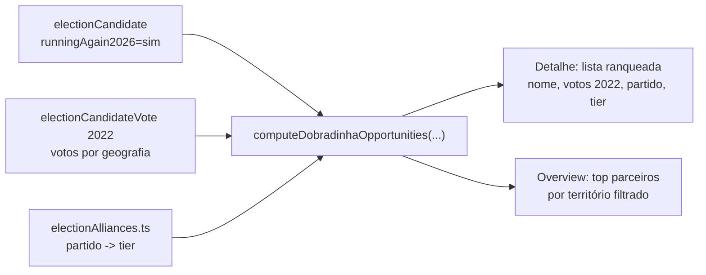

# Insight: oportunidades de dobradinha 2026

Status: rascunho
Atualizado em: 2026-07-17
Item do roadmap: [docs/roadmap.md](../roadmap.md) (seção "Campanha → Próximos ciclos")
Responsável: —

## Contexto

"Dobradinha" é a campanha conjunta entre dois candidatos que somam estrutura e votos num mesmo território. Sabendo, via baseline TSE 2022 + Fase 5 (ver [baseline-eleitoral-tse.md](baseline-eleitoral-tse.md)), **quais candidatos de 2022 voltam a concorrer em 2026** (`runningAgain2026`), podemos sugerir oportunidades de dobradinha por núcleo/território — priorizando por (a) **alinhamento político** com a chapa PT/Solla e (b) **força eleitoral local** (votos recebidos ali em 2022). É o insight mais estratégico do conjunto e depende de dados de 2026, por isso é plano separado.

## Objetivos

- Por núcleo, listar candidatos que concorrem de novo em 2026 (`runningAgain2026=sim`) com votos 2022 na geografia, partido/coligação e tier de alinhamento.
- Ranquear por score combinando alinhamento (peso a definir) e força eleitoral local (votos 2022).
- Exibir no detalhe do núcleo (aba overview) a lista ranqueada de potenciais parceiros de dobradinha; no overview, agregar top parceiros por território filtrado.
- Habilitar só quando 2026 estiver carregado; enquanto não, mostrar "indisponível até a candidatura de 2026".

## Decisões travadas

- **Leitura derivada** — sem escrita, sem `Consent`, sem migration.
- **Depende** do baseline TSE 2022 (Fase 1) **e** da Fase 5 (`runningAgain2026` populado).
- **Sem PII** — matching cross-ano via `identityKey` pública (já no plano baseline).
- **i18n/naming** seguem o AGENTS.md.

## Questões em aberto

- **Taxonomia de alinhamento político**: como classificar partidos/coligações em tiers (aliado / aliado histórico / neutro / adversário) relativos à chapa PT/Solla. Recomendação: mapear a **média contínua 0–10** de Bolognesi et al. (onda 2022; ver [insight-alavancagem-chapa.md](insight-alavancagem-chapa.md) / Dataverse `doi:10.7910/DVN/MFIXKW`) para tiers em `electionAlliances.ts`, em vez de inventar um segundo mapa. Decisão de produto pelos cortes de tier.
- **Fórmula do score**: como combinar alinhamento (ordinal) com força eleitoral (votos). Recomendação: score = `wAlign * tierWeight + wVotes * normalizedVotes`, com pesos `wAlign`/`wVotes` a definir com produto.
- Considerar só candidatos do mesmo cargo (dep. federal + estadual) ou também majoritários? Recomendação: só proporcionais (federal/estadual) para dobradinha com Solla.
- `lideranca` vê? Recomendação: sim, mas sem expor o tier de adversário (mostrar só aliados/neutros).

## Abordagem proposta

- **Helper** `src/lib/electionAlliances.ts`: mapeamento partido→tier (versionado, com proveniência das coligações 2022/2026).
- **Helper** `src/lib/electionInsights.ts`: `computeDobradinhaOpportunities(candidates2026, votes2022, alliances, nucleusGeography)` → `Array<{ candidate, party, coalition, tier, votes2022, score }>` ordenado por score.
- **Componente** `src/components/campaign/DobradinhaOpportunities.tsx` (server). Overview: bloco agregado no `NucleusListOverview`.
- **Teste int** cenários: sem 2026 carregado (`desconhecido` → estado indisponível); só adversários; misto.

## Arquivos a criar/alterar

- Criar: `src/lib/electionAlliances.ts`, `src/components/campaign/DobradinhaOpportunities.tsx`.
- Alterar: `src/lib/electionInsights.ts` (nova função), `nucleos/[slug]/page.tsx` + `nucleusDetailPageData.ts`, overview da lista.

## Dependências

- [baseline-eleitoral-tse.md](baseline-eleitoral-tse.md) — Fase 1 (collections + `electionCandidateVote`) **e** Fase 5 (`runningAgain2026` + `identityKey`).
- 2026 publicado pelo TSE (externo; fora do nosso controle).

## Não escopo

- Fechar dobradinhas (decisão política humana) — só sugerimos oportunidades, não fechamos alianças.
- Cruzar com pesquisa de intenção (domínio inexistente).

## Referências

- [baseline-eleitoral-tse.md](baseline-eleitoral-tse.md) — baseline + Fase 5 (2026)
- [insight-inteligencia-competitiva.md](insight-inteligencia-competitiva.md) — fornece o quadro competitivo base
- AGENTS.md — naming, "Bahia implícita no Núcleo"
