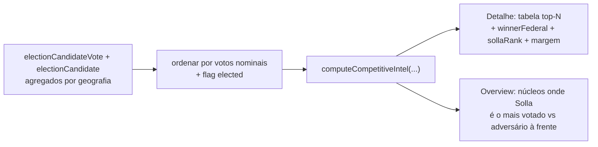

# Insight: inteligência competitiva (mais votado, ranking, margem)

Status: rascunho
Atualizado em: 2026-07-17
Item do roadmap: [docs/roadmap.md](../roadmap.md) (A5 — Próximos / Janela 3)
Responsável: —

## Referência visual (UX Pilot)

Design: [`Baseline-Eleitoral-2022.png`](../design-refs/latest/Baseline-Eleitoral-2022.png) — card "Insights do território", linha "Mais votado aqui em 2022: Dep. Fulano (PP) · Solla ficou em 4º lugar · 2.100 votos à frente"; a linha "Mais votado aqui em 2022" do bloco de baseline também alimenta este insight. Implementar como um card do stack `NucleusInsights.tsx` ([baseline-eleitoral-tse.md](baseline-eleitoral-tse.md)), com os tokens claros do tema `campaign` em vez da paleta antiga do HTML/PNG.

## Contexto

Saber onde Solla foi bem é só metade; a outra é saber **quem o superou localmente** e por quanto. O baseline TSE 2022 (ver [baseline-eleitoral-tse.md](baseline-eleitoral-tse.md)) guarda o conjunto completo de candidatos por geografia, com flag de eleito — podemos dizer, por núcleo, quem foi o mais votado para deputado federal ali em 2022, qual a margem sobre Solla, e em que colocação Solla ficou. É inteligência competitiva: onde há adversário forte a desmontar e onde Solla já é o referencial.

## Objetivos

- Por núcleo, listar o top-N candidatos a dep. federal 2022 por votos nominais na geografia, com `elected` e partido/coligação.
- Destacar `winnerFederal` (mais votado), `sollaRank` (colocação de Solla) e `marginToWinner = winnerVotes − sollaVotes` (e `marginToElectable` quando aplicável).
- Exibir no detalhe do núcleo (aba overview) uma tabela compacta; no overview, agregar "núcleos onde Solla foi o mais votado" / "onde há adversário à frente".

## Decisões travadas

- **Leitura derivada** — sem escrita, sem `Consent`, sem migration.
- **Reusa** `electionCandidateVote` + `electionCandidate` (e `elected`).
- **Top-N configurável** (default 5) em `src/lib/electionInsights.ts`.
- Cargo principal: **deputado federal** (cargo do Solla). Estadual como secundário opcional.

## Questões em aberto

- Mostrar só candidatos com `elected=true` no top, ou todos os mais votados localmente? Recomendação: todos os mais votados localmente, com flag de eleito destacada.
- `lideranca` vê o competidor? Recomendação: sim (dado público).
- Cruzar com `runningAgain2026` (plano [insight-dobradinha-2026.md](insight-dobradinha-2026.md)) para marcar quem volta — adiar ao plano de dobradinha.

## Abordagem proposta

- **Helper** `src/lib/electionInsights.ts`: `computeCompetitiveIntel(candidateVotes, sollaNumber=1313, topN)` → `{ winner, sollaRank, marginToWinner, topCandidates[] }`.
- **Componente** `src/components/campaign/NucleusCompetitiveIntel.tsx` (server). Overview: bloco agregado no `NucleusListOverview`.
- **Teste int** cenários: Solla é o mais votado; Solla fora do top-N; `sollaVotes=0`.

## Arquivos a criar/alterar

- Criar: `src/components/campaign/NucleusCompetitiveIntel.tsx`.
- Alterar: `src/lib/electionInsights.ts`, `nucleos/[slug]/page.tsx` + `nucleusDetailPageData.ts`, overview da lista.

## Dependências

- [baseline-eleitoral-tse.md](baseline-eleitoral-tse.md) (`electionCandidateVote` + `electionCandidate` com `elected`).

## Não escopo

- Sugerir dobradinha (plano [insight-dobradinha-2026.md](insight-dobradinha-2026.md)) — aqui só exibimos o quadro competitivo, não sugerimos parceiros.

## Referências

- [baseline-eleitoral-tse.md](baseline-eleitoral-tse.md)
- AGENTS.md
