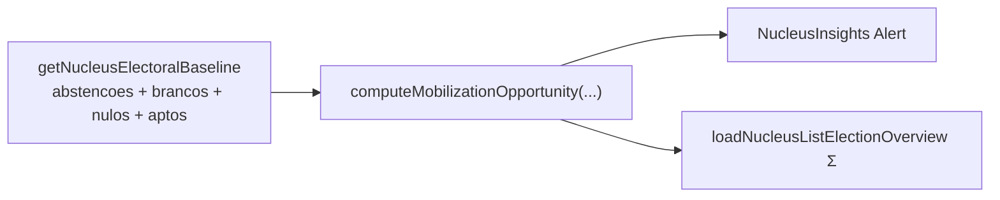

# Insight: oportunidade de mobilização (brancos/nulos/abstenções)

Status: entregue (slice A5 mobilização, 2026-07-19)
Atualizado em: 2026-07-19
Item do roadmap: [docs/roadmap.md](../roadmap.md) (Janela 2, A5 restante)
Responsável: —

**Revisão 2026-07-19:** implementado como Alert no stack `NucleusInsights.tsx` (sem componente separado); overview via `loadNucleusListElectionOverview` + linha em `NucleusListOverview`. Ranking por núcleo adiado (rabbit hole — gatilho: produto pedir sort na lista).

## Referência visual (UX Pilot)

Design: [`Baseline-Eleitoral-2022.png`](../design-refs/latest/Baseline-Eleitoral-2022.png) — card "Insights do território", linha "Oportunidade de mobilização: 142 brancos/nulos + 680 abstenções = 822 votos possíveis". Implementar como um card do stack `NucleusInsights.tsx` ([baseline-eleitoral-tse.md](baseline-eleitoral-tse.md)), com os tokens claros do tema `campaign` em vez da paleta antiga do HTML/PNG.

## Contexto

Em 2022, parte significativa dos eleitores aptos de cada geografia não gerou voto útil: **abstenções** (não compareceu), **votos em branco** e **votos nulos** (compareceu mas não votou em candidato válido). Esses eleitores são potencial de mobilização — gente que, bem engajada, pode virar voto. O baseline TSE 2022 (ver [baseline-eleitoral-tse.md](baseline-eleitoral-tse.md)) traz `electionTally.abstencoes`, `votosBranco` e `votosNulo` por município+zona; hoje o `/campanha` não os usa.

## Objetivos

- Computar `mobilizationPotential = abstencoes + votosBranco + votosNulo` por geografia do núcleo.
- Expressar como % de `aptos` (potencial relativo) e como absoluto (votos "deixados na mesa").
- Exibir no detalhe do núcleo: subtotais de brancos/nulos e abstenções com total e % do eleitorado apto.
- No overview da lista: soma do potencial sobre o conjunto filtrado (Σ absolute / Σ aptos).

## Decisões travadas

- **Leitura derivada** — sem escrita, sem `Consent`, sem migration.
- **Reusa** `getNucleusElectoralBaseline` (já expõe `abstencoes`, `brancos`, `nulos`, `aptos`).
- **Não somar anulados** (votos anulados por motivo de urna, não são mobilizáveis da mesma forma) — só brancos + nulos + abstenções.
- **UI:** `Alert` em `NucleusInsights.tsx` (`data-insight="mobilization"`), não componente separado.
- **Dois subtotais** na linha de apoio (`X brancos/nulos + Y abstenções = Z votos possíveis · W% do eleitorado apto`).
- **`lideranca` vê** (mesmo stack da Visão geral).
- **Overview:** Σ absolute + % ponderado; sem ranking por núcleo neste slice.

## Questões em aberto

- _(fechadas 2026-07-19 — ver Decisões travadas)_

## Abordagem (as-built)

- **Helper** [`src/lib/electionInsights.ts`](../../src/lib/electionInsights.ts): `computeMobilizationOpportunity`, `isComparableMobilization`, `aggregateMobilizationOverview`.
- **Detalhe** [`src/components/campaign/NucleusInsights.tsx`](../../src/components/campaign/NucleusInsights.tsx).
- **Overview** [`src/utilities/nucleusElectoralBaseline.ts`](../../src/utilities/nucleusElectoralBaseline.ts) (`MobilizationOverviewAggregate`) + [`NucleusListOverview.tsx`](../../src/components/campaign/NucleusListOverview.tsx).
- **Testes** unitários em `tests/unit/electionInsights.unit.spec.ts`.

## Dependências

- [baseline-eleitoral-tse.md](baseline-eleitoral-tse.md) (apuração por município+zona) — **única dependência dura**.

## Não escopo

- Disparar campanhas de mobilização efetivas (WhatsApp, eventos) — só o insight, não a ação.
- Ranking/sort da lista por potencial de mobilização — adiar até pedido de produto.

## Referências

- [baseline-eleitoral-tse.md](baseline-eleitoral-tse.md)
- AGENTS.md
