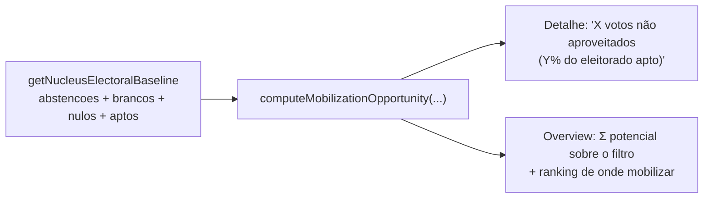

# Insight: oportunidade de mobilização (brancos/nulos/abstenções)

Status: rascunho
Atualizado em: 2026-07-17
Item do roadmap: [docs/roadmap.md](../roadmap.md) (seção "Campanha → Próximos ciclos")
Responsável: —

## Contexto

Em 2022, parte significativa dos eleitores aptos de cada geografia não gerou voto útil: **abstenções** (não compareceu), **votos em branco** e **votos nulos** (compareceu mas não votou em candidato válido). Esses eleitores são potencial de mobilização — gente que, bem engajada, pode virar voto. O baseline TSE 2022 (ver [baseline-eleitoral-tse.md](baseline-eleitoral-tse.md)) traz `electionTally.abstencoes`, `votosBranco` e `votosNulo` por município+zona; hoje o `/campanha` não os usa.

## Objetivos

- Computar `mobilizationPotential = abstencoes + votosBranco + votosNulo` por geografia do núcleo.
- Expressar como % de `aptos` (potencial relativo) e como absoluto (votos "deixados na mesa").
- Exibir no detalhe do núcleo: "X votos em branco/nulo + Y abstenções (Z% do eleitorado apto) — potencial de mobilização".
- No overview da lista: soma do potencial sobre o conjunto filtrado, ordenado para priorizar onde mobilizar.

## Decisões travadas

- **Leitura derivada** — sem escrita, sem `Consent`, sem migration.
- **Reusa** `getNucleusElectoralBaseline` (já expõe `abstencoes`, `brancos`, `nulos`, `aptos`).
- **Não somar anulados** (votos anulados por motivo de urna, não são mobilizáveis da mesma forma) — só brancos + nulos + abstenções.

## Questões em aberto

- Separar abstenção de brancos/nulos na UI (são naturezas diferentes: abstenção = não foi; branco/nulo = foi mas não votou válido)? Recomendação: sim, com dois subtotais.
- `lideranca` vê? Recomendação: sim.

## Abordagem proposta

- **Helper** `src/lib/electionInsights.ts`: `computeMobilizationOpportunity(abstencoes, brancos, nulos, aptos)` → `{ absolute, relative, abstencoes, brancosNulos, status }`.
- **Componente** `src/components/campaign/NucleusMobilizationOpportunity.tsx` (server). Overview: bloco agregado + ranking.
- **Teste int** cenários: `aptos=0`, tudo zero.

## Arquivos a criar/alterar

- Criar: `src/components/campaign/NucleusMobilizationOpportunity.tsx`.
- Alterar: `src/lib/electionInsights.ts`, `nucleos/[slug]/page.tsx` + `nucleusDetailPageData.ts`, overview da lista.

## Dependências

- [baseline-eleitoral-tse.md](baseline-eleitoral-tse.md) (apuração por município+zona).

## Não escopo

- Disparar campanhas de mobilização efetivas (WhatsApp, eventos) — só o insight, não a ação.

## Referências

- [baseline-eleitoral-tse.md](baseline-eleitoral-tse.md)
- AGENTS.md
