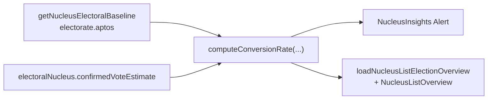

# Insight: taxa de conversão por núcleo

Status: entregue (slice A5-1, 2026-07-19)
Atualizado em: 2026-07-19
Item do roadmap: [docs/roadmap.md](../roadmap.md) (Janela 3, A5 — primeiro dos cinco insights)
Responsável: —

**Revisão 2026-07-19:** implementado como Alert no stack `NucleusInsights.tsx` (sem `NucleusConversionRate.tsx` separado); overview via `loadNucleusListElectionOverview` + linha em `NucleusListOverview`. Limiares 15%/40% versionados em `electionInsights.ts` _(assumido — validar com produto)_.

## Referência visual (UX Pilot)

Design: [`Baseline-Eleitoral-2022.png`](../design-refs/latest/Baseline-Eleitoral-2022.png) — card "Insights do território", primeira linha: "Taxa de conversão: 18% do eleitorado apto · 850 votos / 4.700 eleitores aptos" (ícone + veredito de uma linha + números de apoio). Implementar como um card do stack `NucleusInsights.tsx` (arquitetura definida em [baseline-eleitoral-tse.md](baseline-eleitoral-tse.md)), com os tokens claros do tema `campaign` em vez da paleta antiga do HTML/PNG.

## Contexto

Com o baseline TSE 2022 importado (ver [baseline-eleitoral-tse.md](baseline-eleitoral-tse.md)), temos `electionTally.aptos` (eleitores aptos) por município+zona. A estimativa confirmada do núcleo (`confirmedVoteEstimate`) hoje só é comparada com o voto histórico de Solla (Gap vs 2022). Falta medir a estimativa contra o **tamanho do eleitorado apto** da geografia — ou seja, qual % do eleitorado potencial da zona a estimativa representa. É o indicador que separa "reduto consolidado" de "oportunidade de crescimento", segundo a literatura de estratégia eleitoral.

## Objetivos

- Computar `conversionRate = confirmedVoteEstimate / aptos` por núcleo (soma de aptos nas cidades∩zonas do núcleo).
- Classificar o núcleo em faixas (limiares a definir com produto; referência da literatura: <15% oportunidade, >40% reduto).
- Exibir no detalhe do núcleo (aba overview) e como agregado no overview da lista (média de conversão e distribuição por faixa sobre o conjunto filtrado).

## Decisões travadas

- **Leitura derivada** — sem escrita, sem `Consent`, sem migration. Reusa as collections e helpers do plano baseline.
- **Mesma agregação geográfica** do baseline (cidades∩zonas, via `getNucleusElectoralBaseline`).
- **Limiares versionados** em `src/lib/electionInsights.ts` como constantes (`CONVERSION_OPPORTUNITY_MAX = 0.15`, `CONVERSION_REDUTO_MIN = 0.40`).
- **Principal = aptos**; linha de apoio inclui % do comparecimento (`aptos − abstencoes`) quando positivo.
- **`lideranca` vê** o insight (mesmo stack da Visão geral).
- **UI:** `Alert` em `NucleusInsights.tsx` (`data-insight="conversion-rate"`), não componente separado.
- **i18n/naming** seguem o AGENTS.md.

## Questões em aberto

- Limiares exatos das faixas — **assumidos 15%/40%** até validação de produto.
- Chip de banda (reduto/consolidado/oportunidade) no título do Alert — adiado (critique Impeccable).

## Abordagem (as-built)

- **Helper** [`src/lib/electionInsights.ts`](../../src/lib/electionInsights.ts): `computeConversionRate`, `aggregateConversionBand`, `conversionRateAlertVariant`.
- **Detalhe** [`src/components/campaign/NucleusInsights.tsx`](../../src/components/campaign/NucleusInsights.tsx).
- **Overview** [`src/utilities/nucleusElectoralBaseline.ts`](../../src/utilities/nucleusElectoralBaseline.ts) (`NucleusConversionOverviewAggregate`) + [`NucleusListOverview.tsx`](../../src/components/campaign/NucleusListOverview.tsx).
- **Testes** unitários em `tests/unit/electionInsights.unit.spec.ts` e integração electorate+conversão em `tests/unit/nucleusElectoralBaseline.unit.spec.ts`.

## Dependências

- [baseline-eleitoral-tse.md](baseline-eleitoral-tse.md) (fornece `electionTally` + `getNucleusElectoralBaseline`) — **única dependência dura**.
- [zonas-por-municipio.md](zonas-por-municipio.md) — dependência suave herdada do baseline.

## Não escopo

- Previsão estatística de votos (roadmap separado).
- Cruzamento com pesquisa de intenção de voto (domínio inexistente).
- Demais insights A5 (classificação, alavancagem, mobilização, competitiva).

## Referências

- [baseline-eleitoral-tse.md](baseline-eleitoral-tse.md) — baseline e agregação
- `src/utilities/nucleusViewModels.ts` — view models do núcleo
- AGENTS.md — naming, padrão de leitura
