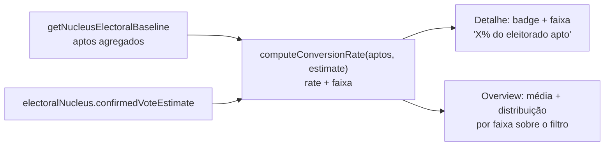

# Insight: taxa de conversão por núcleo

Status: rascunho
Atualizado em: 2026-07-17
Item do roadmap: [docs/roadmap.md](../roadmap.md) (seção "Campanha → Próximos ciclos")
Responsável: —

## Contexto

Com o baseline TSE 2022 importado (ver [baseline-eleitoral-tse.md](baseline-eleitoral-tse.md)), temos `electionTally.aptos` (eleitores aptos) por município+zona. A estimativa confirmada do núcleo (`confirmedVoteEstimate`) hoje só é comparada com o voto histórico de Solla (Gap vs 2022). Falta medir a estimativa contra o **tamanho do eleitorado apto** da geografia — ou seja, qual % do eleitorado potencial da zona a estimativa representa. É o indicador que separa "reduto consolidado" de "oportunidade de crescimento", segundo a literatura de estratégia eleitoral.

## Objetivos

- Computar `conversionRate = confirmedVoteEstimate / aptos` por núcleo (soma de aptos nas cidades∩zonas do núcleo).
- Classificar o núcleo em faixas (limiares a definir com produto; referência da literatura: <15% oportunidade, >40% reduto).
- Exibir no detalhe do núcleo (aba overview) e como agregado no overview da lista (média de conversão e distribuição por faixa sobre o conjunto filtrado).

## Decisões travadas

- **Leitura derivada** — sem escrita, sem `Consent`, sem migration. Reusa as collections e helpers do plano baseline.
- **Mesma agregação geográfica** do baseline (cidades∩zonas, via `getNucleusElectoralBaseline`).
- **Limiares versionados** em `src/lib/electionInsights.ts` como constantes (decisão de produto por limiar).
- **i18n/naming** seguem o AGENTS.md.

## Questões em aberto

- Limiares exatos das faixas (15% / 40% são referência da literatura, não decisão travada) — definir com produto.
- Mostrar conversão contra `aptos` ou contra `comparecimento` (eleitores que efetivamente votaram)? Recomendação: ambos, com `aptos` como principal.
- `lideranca` vê este insight? Recomendação: sim.

## Abordagem proposta

- **Helper** `src/lib/electionInsights.ts`: `computeConversionRate(aptos, confirmedVoteEstimate)` → `{ rate, band: 'reduto'|'consolidado'|'oportunidade'|'semEstimativa'|'semBaseline' }`.
- **Componente** `src/components/campaign/NucleusConversionRate.tsx` (server). No overview, bloco agregado no `NucleusListOverview`.
- **Teste int** cenários: `aptos=0`, `confirmedVoteEstimate=null`, faixas limítrofes.

## Arquivos a criar/alterar

- Criar: `src/components/campaign/NucleusConversionRate.tsx`.
- Alterar: `src/lib/electionInsights.ts` (nova função), `src/app/(campaign)/campanha/(app)/nucleos/[slug]/page.tsx` + `nucleusDetailPageData.ts` (detalhe), overview da lista.

## Dependências

- [baseline-eleitoral-tse.md](baseline-eleitoral-tse.md) (fornece `electionTally` + `getNucleusElectoralBaseline`) — **única dependência dura**.
- [zonas-por-municipio.md](zonas-por-municipio.md) — dependência suave herdada do baseline (melhora a qualidade de `tseZones`; a agregação funciona sem ele — ver revisão 2026-07-17 no plano baseline).

## Não escopo

- Previsão estatística de votos (roadmap separado).
- Cruzamento com pesquisa de intenção de voto (domínio inexistente).

## Referências

- [baseline-eleitoral-tse.md](baseline-eleitoral-tse.md) — baseline e agregação
- `src/utilities/nucleusViewModels.ts` — view models do núcleo
- AGENTS.md — naming, padrão de leitura
