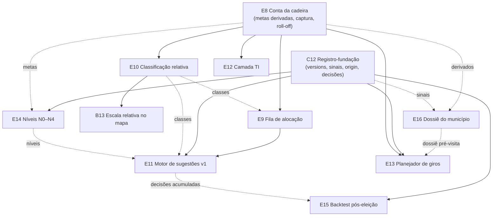

# Inteligência de campanha — do relatório de discovery ao produto (programa E8–E16 + B13 + C12; adjacentes A11/E17/E18)

Status: rascunho (plano-mestre; itens fatiados individualmente)
Atualizado em: 2026-07-24 (referências sincronizadas pós-remodelagem Municípios + hardening; remodelagem em produção desde 2026-07-23; validação de campo 2026-07-23 incorporada — G11, E16, âncora % da própria votação; **E18** registrado — documentação dos conceitos, gatilhado pela própria confusão do usuário ao ler os tooltips do E8)
Item do roadmap: [docs/roadmap.md](../roadmap.md) (seção "Inteligência de campanha"; trilhas E/B/C)
Impeccable: misto por item — E15 = A; E8/E9/C12/E10/B13/E14/E12/E16 = B; E11/E13 = C (classe final no plano de cada fatia)
Appetite: programa ~2–3 semanas eng no total, fatiado em slices de ~1–3 dias
Responsável: —

Fonte de produto: [`docs/research/relatorio-entrevista-persona-campanha.md`](../research/relatorio-entrevista-persona-campanha.md) (aprovado 2026-07-21) — kernel §2, playbook §6 (25 padrões P/T/I/J/K), OST §7 (O-A…O-K), anti-goals §8. Compêndio: [`docs/research/literatura-campanha-deputado-federal-ba.md`](../research/literatura-campanha-deputado-federal-ba.md).

## Contexto

O discovery (literatura → persona → entrevista sintética, 2026-07-21) fixou o diagnóstico: a disputa de DF na Bahia é uma conta de quociente fragmentada (cadeira ~80–150 mil votos; topo estadual 4,71% dos válidos), o gargalo é converter lealdade de campo em voto nominal município a município via rede de mediação, e a informação dessa rede hoje é oral e sem série. O Teqo já tem o **sistema de registro** (Municípios, lideranças, pledges, planos, demandas, baseline TSE 2014–2022 com brancos/nulos/abstenção por cargo). O que falta é a **camada de inteligência**: metas derivadas dos dados, leitura relativa do território, fila de decisão priorizada, sugestões dado→decisão com humano no loop, e o registro ex-ante que torna tudo auditável (backtest). Anti-goal do programa inteiro: "planilha chique" — KPI absoluto, cadastro bruto, mapa 0–100%.

**Validação de campo (2026-07-23 — [CUSTOMER.md](../CUSTOMER.md)):** a sessão real com o Coordenador Geral confirmou as apostas centrais da persona (ameaça nº 1 = fogo amigo intra-PT, nomeada com caso e número; canal = ZAP/ligação sem registro datado — Cairu −300 "ontem" só na memória/planilha; agenda = A decisão semanal; nenhuma métrica calculada além de voto) e **derrubou/calibrou duas**: a restrição dominante é **"perna"/estrutura**, não dinheiro (reprioriza E13 e o dossiê E16 na fila de corte), e a leitura relativa da mesa é **% da própria votação** (concentração da captura própria — ele manteve o critério mesmo confrontado com o % do eleitorado local), âncora a expor em E8/E9/E10/B13 ao lado de LQ/captura e entregue já em **A11** ([ranking-votos-municipio.md](ranking-votos-municipio.md)). O7 (registro datado de ganhos/perdas) confirma **C12 como não cortável** por evidência de campo; "Salvador cobrado 10×" valida a coluna da vergonha de **E9**; o piso projetado de **150 mil** (2022: 129 mil) resolve a meta inicial de **E8**; o pedido explícito de dossiê pré-agenda com emendas (Nazaré das Farinhas) vira **E16** + gap **G11**.

## Gaps de estrutura de dados (o que não estamos preparados para coletar/usar)

Auditoria relatório × schema atual (2026-07-21). O que **já existe e cobre**: `electionTally` tem `aptos/comparecimento/abstencoes/votosValidos/votosBranco/votosNulo` por cargo×ano×cidade×zona (roll-off e válidos projetados são deriváveis); `electionCandidate` tem `party`/`coalition`/`runningAgain2026` (P3/herança aberta); `municipality` tem `expectedVotes` (pessimista/média/otimista — única série por cenário desde 2026-07-24, quando `voteGoals` foi removido), `priority`, `politicalTrend`, `dobradinhaNotes`, `advisors`, `lastUpdateAt`; `votePledge` tem declarado×estimado com autores/datas; `municipalityUpdate` é imutável; `bahiaTerritories.ts` já mapeia município→Território de Identidade; `actionPlan` registra eventos com município/status/presença do deputado. Desde o hardening 2026-07-23 existe também o artefato commitado `src/lib/electionAggregates/bahia-federal-baseline.json` (loader `bahiaElectionAggregates.ts`): série Solla + válidos federais 2014/2018/2022 por município, já cortada na geografia do catálogo — insumo direto para válidos projetados/captura sem re-query de `electionTally`.

| #   | Gap                                                                                                                       | Hoje                                                                            | Como fechar                                                                                                                                                                                             | Fatia |
| --- | ------------------------------------------------------------------------------------------------------------------------- | ------------------------------------------------------------------------------- | ------------------------------------------------------------------------------------------------------------------------------------------------------------------------------------------------------- | ----- |
| G1  | **Trajetória de pledge** ("o que sabíamos em 15/08") — valor atual sobrescreve o anterior                                 | `votePledge` guarda só o corrente                                               | `versions: true` (sem drafts) em `votePledge` + leitura da série; **nunca sobrescrever** vira garantia de plataforma                                                                                    | C12   |
| G2  | **Sinal qualitativo de rede tipado** (invasão, esfriamento, visita de adversário, proposta a broker; fonte; triangulação) | `municipalityUpdate.kind` = semanal/urgente/nota, texto livre                   | Novo kind `sinal` + campos `signalType`, `signalSource`, `triangulated` (staff-only)                                                                                                                    | C12   |
| G3  | **Esforço/agenda por município** (o lado privado que evapora: dias de candidato, origem da visita, recurso)               | `actionPlan` tem evento+status; `campaignDemand` já relaciona plano e custo     | `actionPlan.origin` (`dado \| pedido_broker \| obrigacao_politica` — J-B) + custo derivado das `campaignDemand` vinculadas                                                                              | C12   |
| G4  | **Decisão registrada ex-ante** (sugestão dada, aceita/descartada, leitura alternativa, foto da classificação no momento)  | Nada                                                                            | Nova collection `allocationDecision` (municipality, patternId, suggestion, decision `aceita\|descartada\|adiada`, alternativeReading, snapshot, decidedBy/At) — também registra mudanças de nível N0–N4 | C12   |
| G5  | **Meta estadual e decomposição derivada** (QE projetado, faixa da cadeira, potencial por município)                       | `municipality.expectedVotes` manual, sem conta de cima para baixo nem cobertura | Global `campaignGoals` (meta estadual, margem, ano-base) + utilities de potencial (válidos projetados, captura, headroom) e cobertura Σpledges÷meta                                                     | E8    |
| G6  | **Definição de "campo" por ano** (share intracampo, teto do campo)                                                        | `electionCandidate.party` existe; não há lista de partidos do campo por eleição | Lib estática curada `src/lib/campoParties.ts` (ano → siglas/números) — dado de configuração, não collection                                                                                             | E8    |
| G7  | **Nível de envolvimento N0–N4** com regras de movimento e sinais de reversão                                              | `municipality.priority` = alta/normal                                           | `municipality.engagementLevel` (n0…n4) + `levelNote`/`levelChangedAt`; mudança de nível registrada como `allocationDecision`; `priority` mapeado e aposentado                                           | E14   |
| G8  | **Frescor como sinal de 1ª classe**                                                                                       | derivável (`declaredAt`, `lastUpdateAt`) mas não exposto/normatizado            | Utilities de frescor + exposição na fila/lista ("coluna da vergonha": município priorizado sem responsável/sem sinal) — sem migration                                                                   | E9    |
| G9  | Perfil de abstenção por município (sexo/idade/escolaridade, TSE Eleitorado)                                               | não importado                                                                   | **Adiado com gatilho** (só se I-C virar prática): extensão do seed TSE                                                                                                                                  | —     |
| G10 | Malha Regiões Imediatas IBGE (teste de sensibilidade MAUP)                                                                | só TI (`bahiaTerritories.ts`)                                                   | **Adiado com gatilho** (decisão cara sustentada por análise regional divergente): variante do `build:geometries`                                                                                        | —     |
| G11 | **Emendas parlamentares por município** (dossiê pré-agenda — O6 de campo: "emendas aportadas", caso Nazaré das Farinhas)  | não coletado                                                                    | **Manual-first**: valor/nota staff no dossiê (E16); fonte estruturada (Câmara/Portal da Transparência) **adiada com gatilho** (E16 em uso + pedido de dado sistemático)                                 | E16   |

Migrations do programa: uma consolidada por fatia que toca schema (C12: versions+kinds+origin+`allocationDecision`; E8: global `campaignGoals`; E14: `engagementLevel`). Todas antes do congelamento (~20/09).

## A fila de prioridade do coordenador (desenho canônico)

Uma única fila ordena "todos" heterogêneos (gatilhos do playbook, demandas, municípios sem responsável, sinais não triangulados, pledges velhos) pela hierarquia do relatório (§6.2), estendida aos objetos do produto:

1. **Estoque em risco confirmado** — P1 ameaçado/P8 triangulado em município de defesa relevante; demanda `escalada` de município N3/N4.
2. **Falha de canal** — P4 (broker único ≥ limiar), liderança-hub esfriando, município priorizado cujo responsável saiu.
3. **Cobertura zero onde a meta exige** — P6 priorizado, município N2+ sem responsável/lideranças ("coluna da vergonha"), metas sem dono.
4. **Oportunidade com janela** — P3 herança aberta (`runningAgain2026 = false`), P5 expansão quente, convites pendentes de liderança nova, J-A (município elegível maduro com giro passando perto).
5. **Otimização/higiene** — T4 benchmark, T5 agenda dispersa, pledges sem atualização há N semanas, planos `realizado` sem resultado, K-C metas implausíveis.

Regras transversais (de §6.2/§6.4, viram comportamento do produto): **barato-antes-de-caro** (todo gatilho gera primeiro a checagem de 48h para o assessor; só gatilho persistente/triangulado sobe para a reunião de realocação); **desempate por votos em jogo**; **histerese** (realocação cara exige 2 semanas de persistência; nível 1 fura a fila); **gatilho de ausência dispara auditoria de registro, nunca ação de campo**. A fila tem duas visões: _do assessor_ (checagens e tarefas dos seus municípios) e _do coordenador_ (decisões de recurso caro, pauta da reunião quinzenal).

**E18 (adjacente, registrado 2026-07-24):** ao ler os tooltips de diagnóstico do E8 pela primeira vez, o usuário reconheceu que os conceitos ("teto do campo", "captura", "share intracampo", "roll-off") são interessantes mas complicados, e pediu uma página de documentação explicando cada conceito de inteligência da vertical e como é calculado — [documentacao-conceitos-campanha.md](documentacao-conceitos-campanha.md). v1 cobre só os conceitos já entregues (E8); cada fatia subsequente da tabela abaixo estende o conteúdo quando entregar.

## Fatias (funcionalidades faltantes)

| ID  | Fatia (plano)                                                                   | Entrega                                                                                                                                                                                                                                                                                                                                                  | OST            | Classe | Appetite | Janela    |
| --- | ------------------------------------------------------------------------------- | -------------------------------------------------------------------------------------------------------------------------------------------------------------------------------------------------------------------------------------------------------------------------------------------------------------------------------------------------------- | -------------- | ------ | -------- | --------- |
| E8  | **[Conta da cadeira](conta-da-cadeira.md)**                                     | Global `campaignGoals`; potencial por município (válidos projetados, captura do campo, share intracampo via `campoParties.ts`, roll-off, headroom); decomposição meta estadual→município com sanity por TI; cobertura Σ(estimativa do cenário — default média via **A10**)÷meta no dashboard/lista; denominadores sempre válidos projetados (I-B)        | O-A            | B      | ~2d      | 2         |
| E9  | **[Fila de alocação](fila-de-alocacao.md)**                                     | Lista de decisão com as 7 colunas (§5.2 do relatório: votos em jogo, meta/cobertura/delta, classe, LQ/captura, rede+frescor, competição, tendência) + **% da própria votação** (âncora da mesa, via A11); ordenação default por déficit descoberto (default do staff quando houver metas); ordenação de risco (defesa por frescor); "coluna da vergonha" | O-B, O-F       | B      | ~1,5d    | 2         |
| C12 | **[Registro-fundação](registro-fundacao.md)**                                   | Versions em `votePledge`; sinais tipados no `municipalityUpdate`; `actionPlan.origin` + demandas/custo vinculado; collection `allocationDecision`; garantia "nunca sobrescrever"                                                                                                                                                                          | O-E, O-G(base) | B      | ~2d      | 2         |
| E16 | **[Dossiê do município](dossie-municipio.md)**                                  | Dossiê pré-visita/print compondo série+captura, pledges/cobertura, lideranças, conjuntura (`politicalTrend`), forças/riscos, dobradinhas, sinais recentes e perfil A8; emendas quando houver dado (G11) — pedido explícito de campo (O6 do CUSTOMER.md)                                                                                                  | O6 (campo)     | B      | ~1d      | 2         |
| E10 | **[Classificação territorial relativa](classificacao-territorial-relativa.md)** | Recalibra defesa/ataque/indecisa/perdida com âncoras relativas (LQ vs. share estadual próprio; múltiplos do share da cadeira marginal), multi-eixo (dominância+importância+competição+teto do campo); substitui limiares 35/20/10 de `electionInsights.ts` para DF                                                                                       | O-D            | B      | ~1d      | 3         |
| B13 | **[Escala relativa no mapa](escala-relativa-mapa.md)**                          | Modo de escala novo: quantis do próprio candidato (5 classes) default, LQ e rank no município; símbolo proporcional por votos em jogo sobre o polígono; % dos válidos mantido como opção; roll-off como métrica adicional                                                                                                                                | O-C            | B      | ~2d      | 3         |
| E14 | **[Níveis de envolvimento N0–N4](niveis-de-envolvimento.md)**                   | `engagementLevel` com critérios, promoção/rebaixamento com histerese e sinais de reversão (via `allocationDecision`); vocabulário duplo (nível nunca exposto fora do staff — access)                                                                                                                                                                     | O-K            | B      | ~1d      | 3         |
| E11 | **[Motor de sugestões v1](motor-de-sugestoes.md)**                              | Computa subconjunto dos padrões (P1, P2, P3, P5, P6, P7, K-A/K-B; demais por fase 2) por município; sugestão com menu/estatuto/leitura-alternativa; aceitar/descartar grava `allocationDecision`; triagem 1–5 + histerese; "pauta do silêncio" mensal                                                                                                    | O-H            | C      | ~3d      | 3         |
| E12 | **[Camada TI](camada-territorios-identidade.md)**                               | Rollups por Território de Identidade com salvaguardas MAUP (razão de agregados, mediana+amplitude+município crítico, Metropolitano decomposto); benchmark intra-TI (T4); gatilhos T1–T3/T5 no motor = fase 2 de E11; **estende a tabela TI do Início (E17 — [tabela-ti-inicio.md](tabela-ti-inicio.md), primeira fatia já sem E8)**                      | O-I            | B      | ~1,5d    | 3         |
| E13 | **[Planejador de presença/giros](planejador-de-giros.md)**                      | Elegibilidade (5 condições ✓/—), fase do calendário (construção/consolidação/ativação), compositor de giro (J-C âncora+satélites+semente), visita pedida×justificada (J-B, usa `actionPlan.origin`)                                                                                                                                                      | O-J            | C      | ~1,5d    | 3         |
| E15 | **[Backtest pós-eleição](backtest-pos-eleicao.md)**                             | Pledge (trajetória) vs. voto realizado por zona; calibração de limiares E10/E14; relatório de aprendizado                                                                                                                                                                                                                                                | O-G            | A      | ~1d      | pós-04/10 |

## Decisões travadas

- **Sugestão nunca decide; staff decide.** O motor detecta e faz diagnóstico diferencial estrutural; escolher/executar é humano, e a decisão (com leitura descartada) é registrada (relatório §6.3; anti-goal 8). **Rejeitado:** automação de ações (erro sem dono, custo político invisível ao dado); estimar probabilidades/elasticidades sem dado (falsa precisão).
- **Denominadores: válidos projetados do cargo, nunca aptos** (I-B; abstenção estrutural >35% em municípios pequenos infla potencial). **Rejeitado:** aptos (viés sistemático pró-município vazio); válidos da majoritária (cargo errado).
- **Histórico por versions do Payload, não collection paralela de snapshots** (G1). Menos código, mesma garantia, admin de graça. **Rejeitado:** collection `pledgeSnapshot` (duplicaria access/hooks); sobrescrever com `updatedAt` (destrói o backtest).
- **Nível N0–N4 é campo staff-only com access negando `leader`** — vocabulário duplo é requisito de produto, não polimento (relatório §6.8/anti-goal 11). **Rejeitado:** derivar nível só de `priority` existente (semântica insuficiente); expor nível na visão da liderança.
- **"Campo" por ano é lib estática curada** (`campoParties.ts`), editável por PR. **Rejeitado:** collection administrável (federações mudam raramente; curadoria exige contexto político, não CRUD).
- **i18n e naming** seguem AGENTS.md: identificadores em inglês (`campaignGoals`, `engagementLevel`, `allocationDecision`, `signalType`, `origin`), strings pt-BR; valores de enum expostos em URL/dado em pt quando forem dado (não é o caso aqui — enums internos ficam em inglês: `n0…n4`, `aceita|descartada|adiada` são… valores de dado exibidos; manter pt para paridade com enums existentes tipo `alta|normal`).

## Questões em aberto

- **Quais padrões entram no motor v1?** Opções: todos os 25 | subconjunto de maior confiança. **Recomendação:** os 8 listados em E11 (dados 100% disponíveis pós-E8/C12, menor risco de falso positivo); T/I/J na fase 2 após 2 semanas de uso real.
- **Meta estadual inicial?** **Resolvido em campo (2026-07-23):** piso projetado do coordenador = **150 mil** (2022: 129 mil) — topo da faixa da cadeira. Valor inicial do global `campaignGoals` = 150 mil, editável pelo coordenador (margem continua dele).
- **Limiar de broker único (P4)?** **Recomendação:** iniciar em 50% dos pledges do município / top-3 ≥ 40% do total, marcado calibrável; revisar no primeiro mês.

## Abordagem proposta (visão de programa)

Reuso obrigatório (depth check): `municipalityElectoralBaseline.ts`/`municipalityElectionGeography.ts` (células cidade×zona), `votePledgeData.ts` (agregação por cenário pós-**A10** — [cenarios-estimativa-votos.md](cenarios-estimativa-votos.md); default `central`), `aggregatePledgesByMunicipality`/`loadMunicipalityListPageBundle` (A9+), `BahiaMap`+`bahiaMapStyle.ts` (B6/B11/B12), `bahiaTerritories.ts` (TI), `bahiaElectionAggregates.ts` (artefato commitado — série Solla/válidos por município), `electionInsights.ts` (substituição E10), `CampaignPageShell`/`CampaignMetricStrip`, `src/utilities/access/*` (via re-export `campaignAccess.ts`), `withPayloadTransaction`.

## Dependências

- Duras: E8→E9/E10/E12/E13; C12→E11/E15. Satisfeitas: deploy da remodelagem (schema `municipality`/`votePledge` **em produção desde 2026-07-23**) e **A10** (cenários entregues — faixa pessimista/média/otimista antes da cobertura). Suaves: A6 dobradinha (melhora J-B/E13); dados reais da Onda 0 (o motor roda com dados fictícios no smoke, mas só vale com rede real); A10→C12 (versions capturam o group).
- Nenhuma dependência de site público/admin.

## Não escopo

- Previsão estatística de votos e elasticidades (fora de escopo do ciclo — roadmap "Fora de escopo"; E15 só compara ex-ante×resultado).
- Perfil de abstenção TSE e malha IBGE Imediatas (G9/G10 — adiados com gatilho acima).
- Polígonos dos Municípios-zona de Salvador (B8 F2) e qualquer mudança de geografia.
- Automação de mensagens/disparo (Res. TSE 23.610 art. 33; anti-goal).
- Import de planilhas de projeção (decisão E4 mantida).

## Rabbit holes

- **Motor v1 tentando cobrir os 25 padrões.** Se alguém "só adicionar mais um": cada padrão exige dado confiável + descartes + calibração; metade dos 25 depende de sinais que só existirão com C12 rodando semanas. **Mitigação:** subconjunto fixo em E11; fase 2 com gatilho (2 semanas de uso + primeiros `allocationDecision`).
- **Score de elegibilidade virar otimizador de rota.** Roteirização (TSP, mapas de estrada) é produto inteiro. **Mitigação:** E13 ordena e agrupa por contiguidade de TI; rota fina é humana.
- **Fila única virar segundo sistema de tarefas.** Já existem demandas/planos/tasks. **Mitigação:** a fila REFERENCIA objetos existentes (demanda, plano, município), não cria tarefa própria fora de `allocationDecision`.
- **Rollup TI sem salvaguardas** (média que mente). **Mitigação:** salvaguardas MAUP são requisito de aceite de E12, não polimento.

## Adiado com gatilho

- **G9 perfil de abstenção TSE.** Revisitar quando I-C (ativação de núcleo) entrar no motor e o time pedir segmentação.
- **G10 malha Regiões Imediatas.** Revisitar quando uma decisão cara for sustentada por análise regional que diverge entre malhas (teste de sensibilidade §6.5).
- **Padrões T/I/J no motor (fase 2).** Gatilho: 2 semanas de E11 em uso + primeiras decisões registradas.
- **Push de sugestões (D2).** Gatilho: sino in-app entregue e fila com uso semanal real.

## Referências

- `docs/research/relatorio-entrevista-persona-campanha.md` — §2 kernel, §5 análises, §6 playbook completo, §7 OST, §8 anti-goals
- `docs/research/literatura-campanha-deputado-federal-ba.md` — fontes e implicações (§9)
- `src/collections/Municipality.ts`, `src/collections/VotePledge.ts`, `src/collections/MunicipalityUpdate.ts`, `src/collections/ActionPlan.ts`, `src/collections/ElectionTally.ts`, `src/collections/ElectionCandidate.ts` — schema auditado nos gaps
- `src/utilities/municipalityElectoralBaseline.ts`, `src/utilities/votePledgeData.ts`, `src/utilities/municipalityMapData.ts`, `src/lib/electionInsights.ts`, `src/lib/bahiaTerritories.ts` — pontos de encaixe
- `docs/plans/remodelagem-municipios.md` — plano-mestre vigente da remodelagem (precedente: `remodelagem-pracas.md`); `docs/plans/escala-percentual-mapa-pracas.md` — precedente do mapa (identificadores da época; renomeados na M1)
- AGENTS.md — migrations (`pnpm migrate:create`), access (`overrideAccess: false`), transações, naming
