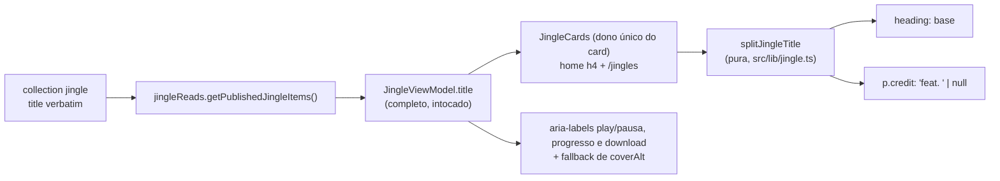

# Impl: Card de jingle — título completo e crédito "(feat. …)" visível (S26)

Status: aprovado (modo --auto)
Atualizado em: 2026-09-21
Issue: #1240
Intenção: docs/plans/jingle-titulo-credito-artista.md
Appetite restante: herdado (~0,5 dia eng; um outcome — título-base integral em até 2 linhas + crédito do artista sempre visível; sem ajuste de escopo, cortes em Rabbit holes)

## Leitura da intenção

- **Outcome:** no card de jingle (home e `/jingles`) o título-base para de truncar e o segmento final `(feat. <artista>)` vira uma linha própria, em corpo menor, visível parado e tocando; o dado é intocado (títulos, capas, áudio, slug, ordem, published e o nome do download) e o mesmo card serve as duas superfícies. Jingle sem `(feat. …)` (ex.: `Axé`) mantém o layout de hoje, apenas sem corte. Aria-labels seguem com o título completo.
- **O que NÃO negociar:** extração **apenas na exibição** (nada de schema/migration/reedição de título); crédito nunca truncado — nem no estado tocando, nem na home, nem em `/jingles`; aria-labels de play/pausa, progresso e download com o título COMPLETO; capa, botão amarelo, estado, progresso, download, filename truncado, grid, raios/sombras e o player da rádio (S25) intocados; metadata/OG de `/jingles` e a home cacheada (`unstable_cache` tag `jingles`) intocados; sem PII/Consent; editar o dono, sem twin.
- **O que reavaliar (hipóteses da "Direção no codebase"):**
  - Derivar no `JingleViewModel` **não** é o caminho barato: `tests/unit/jingle.unit.spec.ts:36-51` pina o objeto exato com `toEqual` e `jinglePlayer.unit.spec.tsx:7-24` / `jingleHomeSection.unit.spec.tsx` montam literais typechecked — campos novos quebrariam os três sem ganho (D1). A função pura em `src/lib/jingle.ts` é a casa (módulo client-safe, dono dos derivados de exibição como `jingleDownloadFilename`).
  - O heading tem um bump `md:text-[26px]` (`JingleCards.tsx:191`) que o design derruba — fica `text-2xl` (24px) em todos os viewports, com `wrap-anywhere` no lugar do `truncate` e `leading-[1.02]` no lugar do `leading-none` (D3).
  - O mesmo card já é único para home (`headingLevel="h4"`, `JingleHomeSection.tsx:81`) e `/jingles` (`JinglePlayer.tsx:11-13`) — corrigir no dono cobre as duas superfícies sem branching.
  - Os títulos do e2e atual (`Axé oficial`, `Forró oficial`, `Pagodão oficial`) não têm `(feat. …)`, então nada quebra — mas o aceite exige cobertura e2e própria com crédito (D4).

## Abordagem recomendada

**Opções consideradas:** A) derivar no `JingleViewModel` | B) função pura nova em `src/lib/jingle.ts` chamada pelo card no render | C) parsing inline no card.

**Recomendação:** B — a extração é regra de exibição e mora no módulo que já é dono dos derivados de display (`jingleDownloadFilename`), client-safe, testável sem render, sem tocar no contrato serializado nem nos literais typechecked; `jingle.title` completo continua alimentando aria-labels (`JingleCards.tsx:184,208,237`) e o fallback de `coverAlt` (`src/lib/jingle.ts:72`).

**Rejeitadas:** A) quebra `toEqual` exato e os literais dos três specs, transforma a leitura server em contrato de apresentação e ainda exigiria carregar o título completo no VM para aria/alt (dois campos, mais churn, zero ganho); C) enterra a regra no JSX, não é unit-testável isolada e duplicaria a leitura do título para os aria-labels.

### Decisões de engenharia

**D1. Onde quebrar título e crédito (caro: fronteira de módulo/contrato).**

- _Opções:_ A) campos `titleBase`/`artistCredit` no `JingleViewModel`, derivados em `toJingleViewModel` | B) função pura nova em `src/lib/jingle.ts`, chamada pelo card no render, shape do VM intocado | C) parsing inline no card.
- _Recomendação:_ B — `src/lib/jingle.ts` é o dono existente dos derivados de exibição e é client-safe (só importa `@/lib/slug`); o VM (e a leitura `jingleReads.ts:57-72`) fica intocado, então `tests/unit/jingle.unit.spec.ts:43-50` e os literais de `jinglePlayer`/`jingleHomeSection` seguem verdes; o card continua dono único do markup nas duas superfícies.
- _Rejeitadas:_ A porque o VM viraria contrato de apresentação e quebraria os três testes pinados, além de manter dois campos para o mesmo dado; C porque não há teste possível sem render e a regra ficaria duplicada entre heading e aria-labels.

**D2. Contrato e regra da função pura (caro: semântica de exibição).**

- _Opções:_ A) retorna `{ base, artist }` e o card monta `feat. ${artist}` | B) retorna `{ base, credit }` com `credit` pronto para exibição (`'feat. É O MT'`), sem parênteses | C) retorna o segmento literal `'(feat. É O MT)'` e o card remove os parênteses.
- _Recomendação:_ B — o unit pina exatamente a linha exibida, o card não concatena copy e o design (linha própria, sem parênteses) é atendido sem transformação no JSX. Regra: extrai **apenas o segmento final**, com reconhecimento case-insensitive de `feat.` (rótulo normalizado para `feat. `, casing do artista preservado), exigindo artista e base não vazios — senão não divide; sem segmento, `{ base: title, credit: null }` (título verbatim, sem linha reservada).
- _Rejeitadas:_ A porque espalha a copy no JSX e o unit não pina a string final; C porque o recorte com parênteses é conflito de responsabilidade e mantém a transformação no card. Case-sensitive estrito foi considerado e rejeitado: custa zero reconhecer `(Feat. …)` e o dado publicado não se reescreve; heurísticas de idioma (`part.`, `com`) e normalização de acento ficam de fora — sem sinal no dado real.

**D3. Port das classes (fill-in: design é a fonte).**

- Heading: remove `truncate`, `leading-none` → `leading-[1.02]`, ganha `wrap-anywhere`, remove `md:text-[26px]` (fica `text-2xl` = 24px em todos os viewports), mantém `tracking-[-0.02em]` e o resto. Bloco `JingleCards.tsx:179`: `items-center` → `items-start`. Crédito: `
` própria (`mt-1.5 text-[13px] leading-[1.25] font-bold text-(--campaign-muted)`) entre heading e a linha de estado. `wrap-anywhere` (Tailwind 4.1.18) porque o fail-safe exige quebrar palavra longa dentro do card; `line-clamp-*` está proibido pelo design.

**D4. Estratégia de testes (custo de spec).**

- _Opções:_ A) misturar um título com `feat.` nos fixtures do primeiro teste do `frontendJingles` | B) teste novo focado dentro do mesmo spec serial | C) novo spec e2e (+ entrada no manifest).
- _Recomendação:_ B — o spec serial já é o dono das linhas de jingle (publica via REST, `createJingle` em `frontendJingles.e2e.spec.ts:70-90`) e o manifest já mapeia `src/lib/jingle` e `src/components/jingles` para `frontendJingles`; o teste novo publica 1 jingle com `(feat. …)` e pina `/jingles` + home sem reindexar asserções de contagem/índice existentes (`toHaveCount(2)`, `cardStates(['stopped','playing'])`, downloads).
- _Rejeitadas:_ A porque muda counts e índices já pinados e mistura escopos; C porque paga entrada nova no manifest e cria um segundo dono das linhas de jingle. Unit do card usa fixture própria (sem tocar no `JINGLES` compartilhado, para não recontar `getAllByText('Pronto para tocar')`).

### Componentes / mudanças

- **`splitJingleTitle`** (`src/lib/jingle.ts`, novo export puro): regex ancorada no fim `/\s*\(\s*feat\.\s+([^()]+?)\s*\)\s*$/i`; `base = title.slice(0, match.index).trim()`, `artist = match[1].trim()`; se match e ambos não vazios → `{ base, credit: 'feat. ' + artist }`; senão → `{ base: title, credit: null }`. Sem import novo (client-safe como o resto do módulo); retorno inferido (sem tipo exportado sem consumidor — knip).
- **`JingleCards`** (`src/components/jingles/JingleCards.tsx`, dono único do card): no `map`, `const { base, credit } = splitJingleTitle(jingle.title)`; heading (`:191-193`) renderiza `{base}` com as classes de D3; `
` de crédito logo após o heading, só quando `credit`; bloco `:179` vira `items-start`; estados `:194-201`, aria-labels `:184/:208/:237`, download `:233-241` e filename `:242-244` intocados.
- **Sem mudanças:** `JinglePlayer.tsx`, `JingleHomeSection.tsx` (`headingLevel="h4"`), `jingleReads.ts` e a URL pública — o card compartilhado resolve as duas superfícies.
- **Testes:** `tests/unit/jingle.unit.spec.ts` (describe novo de `splitJingleTitle`); `tests/unit/jinglePlayer.unit.spec.tsx` (describe novo com fixture própria de `(feat. …)`, parado e tocando, aria completo, sem `truncate`); `tests/e2e/frontendJingles.e2e.spec.ts` (teste novo no describe serial).
- **`docs/changelog/2026-09-21-s26.md`:** entrada curta de entrega.
- **Migration:** nenhuma (nenhum schema; sem `generate:types`).
- **Access / Consent:** N/A — leitura pública, sem formulário, sem PII e sem chave de Consent.
- **UI:** Impeccable B — port classe-a-classe do artefato aprovado (`docs/plans/jingle-titulo-credito-artista-ui-design.html`, cenas 01/02/03) sobre o card existente; crítica final do designer (tier `openai/gpt-5.6-sol`).

### Port do design aprovado (spec das classes)

- Título-base: Exo 2, 24px, peso 900, line-height 1.02, letter-spacing -0.02em, `overflow-wrap: anywhere`; SEM `truncate`; até 2 linhas nos títulos reais (o estresse passa de 2 e nada corta — crédito continua inteiro). O design mostra desktop e mobile em 24px (sem bump `md:text-[26px]`). A cena 03 usa 22px apenas como recurso de cena — não é alvo do port.
- Crédito: `
` própria sob o heading, `feat. Nome do artista` SEM parênteses, 13px (mt-1.5/6px), peso 700, cor `--campaign-muted` (#6c615e). Nunca truncado.
- Layout do bloco: `flex items-start gap-4`; heading, crédito e linha de estado empilhados em `min-w-0 flex-1`. Sem crédito: nenhuma linha vazia reservada.
- Aria-labels preservam o título COMPLETO: `Tocar/Pausar jingle <completo>`, `Progresso do jingle <completo>`, `Baixar <completo> em MP3`.
- Capa, botão amarelo, estado, progresso, download, raios/sombras, grid e filename truncado: intocados.

### Dados → forma (se aplicável)

N/A — a intenção declara "Vou apresentar dados? Não"; a fatia é exibição de título já publicado, sem métrica, agregação, PII ou pergunta de data-presentation.

## Fases verificáveis

1. **Fase 1 — pura + unit (tracer, ~1 h):** `splitJingleTitle` em `src/lib/jingle.ts` + describe no `tests/unit/jingle.unit.spec.ts` (3 títulos reais — `Jorge Solla 1313 (feat. Felipe Forrozeiro)`, `(feat. Nagib Barroso)`, `(feat. É O MT)` — e bordas: `Axé`/`Forró`, `(ao vivo)`, `(feat. )`, só-crédito, `(FEAT. X)`, espaços, segmento final duplicado). Checkpoint: `pnpm vitest run tests/unit/jingle.unit.spec.ts` verde; nenhuma mudança visível.
2. **Fase 2 — port do card (~1,5 h):** classes/DOM em `JingleCards.tsx` (D3) + describe novo em `tests/unit/jinglePlayer.unit.spec.tsx` (fixture própria: parado → heading base, crédito e "Pronto para tocar"; tocando → crédito permanece + "Em reprodução"; aria de play/pausa, progresso e download com título completo; sem `(feat. …)` → nenhum crédito). Checkpoint: `pnpm gate:fast` verde e conferência visual 390/1280 contra as cenas 01/02/03.
3. **Fase 3 — e2e (~1 h):** teste novo no `frontendJingles.e2e.spec.ts` (serial): 1 jingle com `(feat. …)`, `/jingles` com heading base visível, crédito visível parado e tocando, aria completo nos três controles, `download` inalterado; home (`/?e2e=`) com o mesmo card. Checkpoint: `pnpm test:e2e -- tests/e2e/frontendJingles.e2e.spec.ts` verde.
4. **Fase 4 — fechamento (~0,5 h):** crítica final do designer contra o artefato (390/1280); `pnpm gate:fast`; `docs/changelog/2026-09-21-s26.md`; push via `pnpm push` (CI roda o restante). Checkpoint: PR com `Closes #1240`.

## Rabbit holes / Não escopo (engenharia)

- Campo/relação de artista, migration e curadoria dos títulos — a intenção já corta; revisitável só com gatilho de filtrar/ordenar por artista.
- "Limpar" o `JingleViewModel`/`coverAlt`/aria com o título-base: o título completo é contrato acessível e do `alt`; nada de reescrever o dado.
- Qualquer `truncate`/`line-clamp-*` como fail-safe no heading ou no crédito (o design proíbe; a cena 03 é o pin visual).
- Redesenho da seção, grid (`:143`), capas, player da rádio (`RadioEmbed`/S25), embed, metadata/OG de `/jingles` e o `truncate` do filename (`:242`).
- Splitter genérico para outros conteúdos (posts/tags) sem 3º call site; normalização de acento/idioma (`part.`, `com`), parênteses aninhados e múltiplos `feat.` num mesmo segmento.
- Analytics/telemetria de play/download, estados novos, animação.
- Novo spec e2e ou entrada no manifest (prefixos atuais já cobrem), snapshots de DOM.

## Riscos e mitigação

- **Accessible name do heading muda (base no lugar do completo):** deliberado pelo design; os controles seguem com o título completo — unit pina os quatro nomes e o e2e novo pina heading base; os títulos dos testes atuais não têm `(feat. …)`, então nada quebra.
- **Corte silencioso voltar:** o port remove `truncate` e não introduz clamp; unit do card pina a ausência de `truncate` no heading e a presença do crédito nos dois estados; e2e mede overflow 390 (asserção existente na home) e o visual é conferido contra as cenas.
- **Regex over/under-match:** unit cobre os 3 títulos reais (`É O MT` incluso) e as bordas; a função nunca devolve crédito vazio nem base vazia (fallback = título verbatim).
- **Crédito sumir no estado tocando:** a `
` fica fora do branch de estado; unit pina crédito + "Em reprodução" juntos.
- **Regressão nos testes pinados do VM:** D1 mantém o shape; rodar a suíte unit inteira (nada de `toEqual`/literais muda).
- **Altura/ritmo do card com título de 2 linhas:** `items-start` mantém o botão no topo e o bloco cresce no fluxo; cena 03 prova que nada sobrepõe/estoura; grid `md:grid-cols-3` segue.
- **Fonte menor no desktop (26→24px):** design fixa 24px; conferir a cena 01 e que nenhum seletor/teste dependa de `md:text-[26px]`.
- **Home cacheada:** mudança só de exibição; nenhuma tag/revalidação tocada; e2e da home navega com `/?e2e=`.
- **A11y do crédito:** é texto real (heading + crédito anunciados), sem `aria-hidden` e sem duplicar o crédito no heading.

## Aceite de engenharia

- [ ] `splitJingleTitle` puro em `src/lib/jingle.ts`, client-safe e sem import novo; contrato `{ base, credit }` com crédito pronto para exibição (`feat. …`) e nunca crédito vazio/base vazia.
- [ ] Card único (`JingleCards`) usa a função; heading sem `truncate`, com `leading-[1.02]`/`wrap-anywhere` e sem `md:text-[26px]`; bloco `items-start`; `
` de crédito só quando há crédito.
- [ ] Aria-labels de play/pausa, progresso e download continuam com `jingle.title` completo; fallback de `coverAlt` inalterado.
- [ ] Nada muda em schema/migration/Consent; títulos, capas, áudio, slug, ordem, published e download filename intocados; grid, player da rádio e metadata de `/jingles` intocados.
- [ ] Testes: unit puro (3 títulos reais + bordas), unit do card (parado e tocando + aria completo), e2e com `(feat. …)` (crédito visível, aria completo, download inalterado) nas duas superfícies.
- [ ] `pnpm gate:fast` verde; e2e do `frontendJingles` verde; CI verde.
- [ ] Changelog `docs/changelog/2026-09-21-s26.md` e PR com `Closes #1240`.

## Self-score decision-quality (gate ≥4)

| Critério                            | Nota | Justificativa                                                                                                                                                                                                                                          |
| ----------------------------------- | ---- | ------------------------------------------------------------------------------------------------------------------------------------------------------------------------------------------------------------------------------------------------------ |
| 1. Decisões caras têm rejeitadas    | 5    | D1 (onde derivar: VM × pura × inline), D2 (contrato/regra do split, incl. case-sensitivity) e D4 (estratégia de teste: fixture × teste novo × spec novo) com opções, recomendação e rejeitadas justificadas; D3 é fill-in do design e está registrado. |
| 2. Abordagem cabe no appetite       | 5    | ~0,5 dia: uma função pura no dono (`src/lib/jingle.ts`), classes/DOM no dono do card e três arquivos de teste estendidos; sem schema/migration/rota/componente/collection novo, sem novo spec e sem entrada no manifest.                               |
| 3. Rabbit holes nomeados            | 5    | Campo/schema de artista, curadoria de títulos, clamp/truncate de fail-safe, redesign da seção/player da rádio, splitter genérico, novo spec/manifest, snapshots e telemetria explicitamente cortados.                                                  |
| 4. Depth check (reusa donos/shells) | 5    | Nenhum módulo/componente novo: a regra entra no módulo puro existente, o card segue dono único do markup (home + `/jingles`), a leitura/cache não muda e os testes estendem os donos; sem twin.                                                        |
| 5. Intenção (aceite) preservada     | 4    | Todo o aceite mapeado; desvio visual deliberado documentado — o design derruba o bump `md:text-[26px]` (24px em todos os viewports) — e o crédito sem parênteses já era recomendação assumida no gate; nenhum afeta o outcome de produto.              |

Média: **4,8** (≥4).
