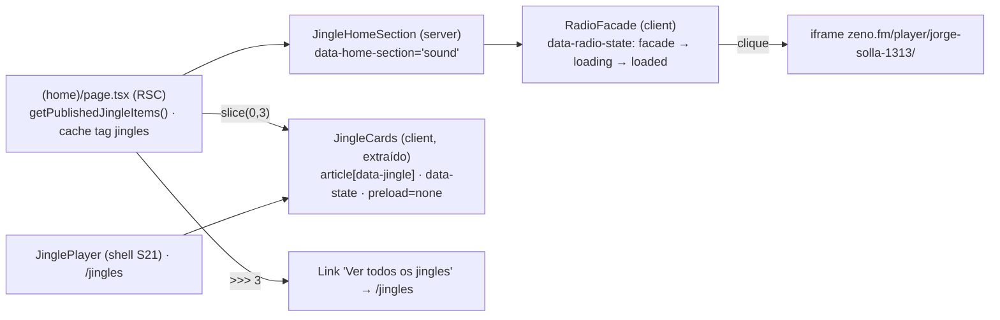

# Impl: Jingles e rádio na home — a seção de som (S22)

Status: aprovado — modo --auto
Atualizado em: 2026-09-20
Issue: #1228
Intenção: docs/plans/jingles-radio-homepage.md
Appetite restante: herdado (~1 dia eng; uma seção nova na home, sem rota nova) — sem ajuste de escopo; cortes em Rabbit holes.

## Leitura da intenção

- **Outcome:** a home passa a ter uma seção de som curta com a Rádio Jorge Solla 1313 (player do zeno só após o clique) e até 3 jingles publicados (capa, play um por vez, download MP3), linkando `/jingles` quando houver mais; zero jingles publicados deixa a rádio e esconde a grade (fail-closed); nada de terceiro, áudio ou PII antes do gesto do visitante.
- **O que NÃO negociar:** `/jingles` continua canônica, indexável e no rodapé (não mudar player nem página do S21); facade click-to-load da rádio (zero request de terceiro antes do clique; link externo como alternativa); até 3 jingles + "Ver todos" só quando houver mais; posição entre `CampaignStorySection` e `CampaignCardsSection`; fonte única é a collection `jingle` via `getPublishedJingleItems()` (sem collection/mídia nova); home estática (nada de `payload.find` cru); kill switch do S21 preservado; sem formulário/consent/PII.
- **O que reavaliar (hipóteses do plano de intenção):** (a) o `JinglePlayer` do S21 é reusável como está? — não: ele hardcoda o shell de página inteira (`JinglePlayer.tsx:134-135,261`) e a grade; a hipótese correta é extrair o core; (b) o fixture `e2eTest.ts` "aborta requests externos"? — não em geral: ele só roteia `youtube-nocookie` (`:108`) e `facebook.net` (`:114`); o iframe do zeno exige `page.route` próprio no spec, senão vira rede real/erro de console no guard; (c) o e2e da home mede overflow? — sim (`frontend.e2e.spec.ts:553-557`), mas não da seção nova: ela ganha asserção própria.

## Abordagem recomendada

**Opções consideradas:** A | B | C | D (por decisão, abaixo)
**Recomendação:** extrair o core do player (`JingleCards`) e montar a seção da home com ele + uma facade de rádio sob `src/components/jingles/`; leitura única do listing cacheado na page.
**Rejeitadas:** props de shell no `JinglePlayer` (arrisca `/jingles` sem ganho), grade reimplementada na home (duplica a máquina de estado), iframe direto da rádio (viola o aceite), spec e2e novo (segundo dono das linhas de jingle + entrada de manifest).

### Decisões de engenharia

**D1 — Reuso do player (caro: fronteira de módulo)**
Opções: A) props de shell/compacto no `JinglePlayer`; B) extrair `JingleCards` (core client) e deixar `JinglePlayer` como shell do S21; C) montar a grade na home sem reusar.
Recomendação: B — uma única dona da exclusividade (`activeId`/`playback`/refs em `JinglePlayer.tsx:83-131`), `/jingles` visual e contratualmente intacta (seletores pinados `article[data-jingle]`, `data-state`, `button[data-play]`, `audio[preload="none"]`, `download={downloadFilename}`) e nenhum branching novo no componente que o e2e `frontendJingles` pina.
Alternativas rejeitadas: A porque move o branching para o shell pinado e arrisca regressão visual em `/jingles`; C porque duplica a exclusividade, o catch do `play()` abortado e o progresso — drift garantido contra `jinglePlayer.unit.spec.tsx`.

**D2 — Facade da rádio (caro: componente client + contrato de terceiro)**
Opções: A) `RadioFacade` client em `src/components/jingles/`, sem sandbox, estados `facade/loading/loaded`, iframe oficial só no clique; B) iframe direto (como o YouTube da story); C) só link externo; D) facade com `sandbox` restritivo.
Recomendação: A — entrega o "embed tocável" pedido sem expor GA (`G-2T527NZWVM`) e redes de anúncio da zeno em todo pageview; fica sob o prefixo `src/components/jingles` (manifest `frontendJingles`, sem entrada nova); iframe com `src` do widget, `title` em pt-BR, `allow="autoplay"`, altura reservada; clique monta, `onLoad` promove `loading → loaded`; `aria-busy` no botão de carga; link "Abrir no Zeno" `target="_blank" rel="noopener noreferrer"` sempre visível na facade.
Alternativas rejeitadas: B porque carrega third-party/ads em toda abertura da home e viola o aceite; C porque não entrega o player pedido; D porque sandbox sem contrato do widget pode quebrar o player sem ganho de isolamento (o vendor já vê o que veria) — reavaliar apenas se a zeno documentar requisitos.
Lacuna de design: o artefato só tem `facade`/`loaded` (a cena 03 é "loaded", sem pending). Fase 0 estende o artefato com a cena de loading antes de qualquer markup.

**D3 — Leitura na home e derivação do rodapé (caro: cache/estático)**
Opções: A) uma chamada `getPublishedJingleItems()` na page e derivar `showJingles` e a seleção; B) manter `hasPublishedJingles()` + chamada extra ao listing; C) mover o slice para dentro de `JingleHomeSection`.
Recomendação: A — o listing cacheado (`unstable_cache` tag `jingles`, `jingleReads.ts:32-35`) já é a fonte do rodapé e o padrão existente é o dono da lista derivar o flag (`/jingles/page.tsx:84-100`, comentário em `CampaignFooter.tsx:21`); uma leitura só evita divergir "tem jingles" de "tem grade"; `slice(0,3)` em memória (limit 0 devolve todos; volume trivial).
Alternativas rejeitadas: B porque `hasPublishedJingles` vira pass-through de `length > 0` quando a lista já está em mãos (depth check); C porque esconde a regra de produto no componente e tira do teste da page a seleção.
`hasPublishedJingles` continua usado por `(home)/cards/page.tsx:27` — não fica órfão (knip ok). O mock de `tests/unit/campaignHome.unit.spec.tsx:41-43` passa a exportar `getPublishedJingleItems`.

**D4 — Posição e pino de ordem (caro: pin de e2e)**
Opções: A) `data-home-section="sound"` entre `story` e `cards` + atualizar o pino; B) renderizar sem `data-home-section` para não tocar o teste.
Recomendação: A — o pino (`frontend.e2e.spec.ts:1700-1706`) existe para proteger a ordem do bloco de conversão; a seção nova é parte da home e deve aparecer no contrato. Atualizar para `sound === story + 1` e `cards === sound + 1` (e manter `cards === newsletter - 1`).
Alternativa rejeitada: B porque deixa a seção invisível ao teste de ordem e qualquer reordenação futura passa silenciosa.

**D5 — Estratégia de testes (caro: superfície de spec/manifest)**
Opções: A) estender `frontendJingles.e2e.spec.ts` (serial, dono das linhas de jingle) + update do pino/overflow em `frontend.e2e.spec.ts`; B) criar `frontendJinglesHome.e2e.spec.ts`; C) só unit.
Recomendação: A — o spec serial controla publicação/kill switch e já visita a home (`frontendJingles.e2e.spec.ts:200-201,231-232`), então grade/facade/zero/overflow-com-conteúdo cabem nele; o dono da home mantém ordem e overflow independente-de-conteúdo. Os prefixos atuais do manifest (`src/components/jingles` → `frontendJingles`, `:99-108`; `src/app/(frontend)` → `frontend`, `:77`) já cobrem todos os arquivos tocados — sem mudança no manifest.
Alternativas rejeitadas: B porque exige entrada nova no manifest e cria segundo dono das linhas de jingle (serialização/limpeza duplicadas) sem cobertura extra; C porque não prova o facade sem request de terceiro nem o estado real da home.

### Componentes / mudanças

- **`src/app/(frontend)/(home)/page.tsx`** — troca o import de `hasPublishedJingles` (`:9`) por `getPublishedJingleItems`; `const jingles = await getPublishedJingleItems()`; `const homeJingles = jingles.slice(0, 3)`; `showJingles={jingles.length > 0}`; render `<JingleHomeSection jingles={homeJingles} showAll={jingles.length > homeJingles.length} />` entre `<CampaignStorySection/>` (`:241`) e `<CampaignCardsSection/>` (`:242`).
- **`src/components/jingles/JingleCards.tsx`** (novo, `'use client'`) — core extraído de `JinglePlayer.tsx:83-259`: estado de exclusividade, progresso e o grid (`max-w-6xl`, `gap-5 sm:gap-6 md:grid-cols-3`), com todo o markup/contrato dos cards (capa `next/image fill` sizes 33vw, título, `data-play`, `data-state`, progressbar, download com `downloadFilename` e `<audio preload="none">`). Props `{ jingles: readonly JingleViewModel[] }`; sem props de shell.
- **`src/components/jingles/JinglePlayer.tsx`** — fica só com o shell do S21 (`section[aria-label="Jingles publicados"]` + nota "Sem autoplay…", `:134,261`) renderizando `<JingleCards jingles={jingles} />`; sem `'use client'` (não guarda mais estado). Markup/contrato visual inalterados; `/jingles/page.tsx` intocado.
- **`src/components/jingles/JingleHomeSection.tsx`** (novo, server) — `section[data-home-section="sound"][aria-labelledby="sound-title"]` com o eyebrow "A trilha da nossa caminhada", h2 "Cante, baixe e espalhe" e a copy do design; `<RadioFacade />`; sub-bloco "Jingles oficiais / Dê o play. O próximo ritmo é seu." + "Um jingle toca por vez." com `<JingleCards jingles={jingles} />` **somente se** `jingles.length > 0`; link "Ver todos os jingles" → `/jingles` somente se `showAll`. Sem `JingleEmptyState` na home (o vazio da home é a rádio sozinha, sem estado de página).
- **`src/components/jingles/RadioFacade.tsx`** (novo, `'use client'`) — card `[data-radio][data-radio-state]`; facade com logo (`numero-negativo.png`), `button[data-load-radio]` "Ouvir a rádio", link "Abrir no Zeno" e nota "O player do zeno.fm só é carregado depois do seu clique."; clique monta o iframe oficial e marca `loading`; `onLoad` → `loaded`; altura reservada para CLS zero; copy pós-carregamento "Player fornecido por zeno.fm. Ao usar, você acessa um serviço externo."
- **`src/app/(frontend)/styles.css`** — regras novas no fim, padrão `campaign-radio-*` (arte/gradiente do card, wave decorativa `aria-hidden`, `motion-reduce`), reusando `campaign-section-eyebrow/title/copy` (`:371-389`) e os tokens `[data-theme='campaign-site']`; layout em utilitários Tailwind como os cards do S21. Nada de CSS existente alterado.
- **`docs/plans/jingles-radio-homepage-ui-design.html`** — estender (fase 0) com a cena da rádio em `loading` e a nota/cena de 1–2 jingles (grade sem "Ver todos").
- **Migration:** nenhuma (nenhum schema; sem `generate:types`).
- **Access / Consent:** N/A — leitura pública, sem formulário, sem PII, sem chave de Consent.
- **UI:** Impeccable C — nova seção em página existente; shells a reusar: `campaign-section-*`, card do S21, tokens `campaign-site`, linguagem do `CampaignStorySection` para a section band; processo shape (fase 0) → craft (fase 3) → critique → polish sobre o artefato aprovado no gate.

### Dados → forma (se aplicável)

- **N/A** — a intenção declara "Vou apresentar dados? Não"; superfície de mídia (áudio + capa), sem agregação, sem PII e sem pergunta de data-presentation a responder.

## Fases verificáveis

1. **Fase 0 — design gate (~0,5 h):** estender `docs/plans/jingles-radio-homepage-ui-design.html` com o estado `loading` da rádio (pós-clique, altura reservada, `aria-busy`, affordance de carregando) e a nota de 1–2 jingles; sem markup antes disso. Checkpoint: artefato commitado e aprovado.
2. **Fase 1 — tracer behavior-preserving (~2 h):** criar `JingleCards`, emagrecer `JinglePlayer`; rodar `pnpm test:unit -- jinglePlayer` e e2e `frontendJingles` (fluxo `/jingles`) — verdes sem nenhuma mudança de `/jingles`. Checkpoint: extração sem regressão.
3. **Fase 2 — facade da rádio (~2 h):** `RadioFacade` + unit novo (sem iframe no idle; iframe e `data-radio-state` após clique; `onLoad` → loaded; link externo `noopener noreferrer`). Checkpoint: `pnpm test:unit` verde.
4. **Fase 3 — seção na home (~2,5 h):** `JingleHomeSection`, `styles.css`, page.tsx (leitura única/slice/showAll/rodapé derivado), update de `tests/unit/campaignHome.unit.spec.tsx` + `tests/unit/jingleHomeSection.unit.spec.tsx` (novo) e pino de ordem no `frontend.e2e.spec.ts`. Checkpoint: home renderiza 0 / 1–3 / 4+.
5. **Fase 4 — e2e da home (~1,5 h):** estender `frontendJingles.e2e.spec.ts` (facade sem request zeno antes do clique com `page.route('https://zeno.fm/**')`, iframe após clique, >3 → 3 cards + "Ver todos" → `/jingles`, kill switch zero → só rádio, sem request de MP3 antes do play, overflow 390 com 3 cards) e a asserção de overflow da seção no `frontend.e2e.spec.ts`; nav da home por `/?e2e=<ts>` (padrão `gotoHomeFresh`, ISR + cache heurístico). Rodar `pnpm test:e2e -- frontendJingles frontend`.
6. **Gates (~0,5 h):** `pnpm gate:fast`; registro em `docs/changelog/2026-09-20-s22.md`; push via `pnpm push` (CI roda o restante).

## Rabbit holes / Não escopo (engenharia)

- "Melhorar o player" durante a extração: o core mantém o S21 como está (sem velocidade, playlist, waveform, scrub).
- Player de rádio próprio ou stream direto em `<audio>` (CORS/mixed content sem aviso): fica o iframe oficial sob clique + link externo.
- Analytics de play/download, contagem de ouvintes, status "no ar", share kit, letras/transcrição/páginas por jingle.
- Sandbox do iframe, CSP para zeno, consent de terceiro: a mitigação é a facade; nada além disso.
- Novo schema/collection/mídia e migration; publicação dos 3 jingles no admin é dependência de ops do S21 (o código do S22 não publica conteúdo — sem isso a home mostra só a rádio).
- Embed da rádio em nav/rodapé/outras páginas e redesign do shell/home.
- Novo spec e2e ou entrada nova no manifest (prefixos atuais cobrem); abstrair uma "media section" genérica com <3 call sites (DRY <3).

## Riscos e mitigação

- **Regressão do S21 na extração:** fase 1 é movimentação pura de estado/markup; rodar `jinglePlayer.unit.spec.tsx` (pina um-por-vez, `preload="none"`, download) e e2e `frontendJingles` de `/jingles` antes/depois; nenhum seletor ou `data-*` muda.
- **Terceiro antes do clique (aceite central):** unit pina "sem iframe no idle"; e2e coleta requests `zeno.fm` e exige zero antes do clique; `page.route('https://zeno.fm/**', fulfill vazio)` no spec antes do clique evita rede real/GA no CI (o fixture `e2eTest` não intercepta zeno e o guard de console trata erro externo como falha).
- **Home deixa de ser estática ou ganha read cru:** só `getPublishedJingleItems()` (cache tag `jingles`); nenhum `payload.find` novo; slice em memória; rodapé derivado do mesmo listing (padrão de `/jingles`).
- **Pino de ordem quebra:** atualização deliberada e registrada (D4); o teste passa a pinar `sound` entre `story` e `cards`.
- **Overflow mobile:** medir em 390 nos dois specs (com 3 cards no `frontendJingles`, rádio-only no `frontend`); `min-w-0`/`truncate` já presentes nos cards, arte do rádio com largura fluida e logo limitado.
- **Corrida de conteúdo no `frontend.e2e.spec.ts`** (roda em paralelo com o spec que mexe nas linhas de jingle): na home do spec `frontend`, assertar só o que independe de publicação (seção, ordem, facade, overflow), nunca contagem de cards; contagens ficam no `frontendJingles` (serial, dono das linhas).
- **CLS/estado de loading não desenhado:** fase 0 estende o artefato (altura reservada + `aria-busy`) antes do markup.
- **1–2 jingles:** regra `length > 3` cobre; nota/cena na fase 0.
- **A11y:** `title` no iframe, `aria-busy` no botão de carga, nota de serviço externo, wave decorativa `aria-hidden` com `motion-reduce`.
- **knip/ciclos/import map:** `JingleCards`/`RadioFacade` no mesmo diretório sem ciclo; `hasPublishedJingles` segue usado por `(home)/cards`; sem campos novos, sem import map novo.

## Simplify + débitos (2026-09-20)

Dois revisores (estrutural + qualidade) sobre o diff: 11 achados, 9 resolvidos no
lugar (grid mobile do card sem `col-start-2` condicional, arte sem faixa branca
com `md:h-auto`, CLS facade↔loaded zerado com footprint reservado 330/312 medido,
classe/hooks sem consumidor removidos, anel de foco em `focusRing.ts`, heading
level dos cards na home, foco do teclado movido para a região de status, mock
morto, testes redundantes) e 2 descartados com respaldo:

- **Asserções da seção de som em dois specs.** O `frontend` cobre ordem/estrutura
  independentes de publicação (roda em paralelo ao spec serial que flipa
  jingles); o `frontendJingles` cobre conteúdo/clique. Decisão D5; DRY <3.
- **`aria-busy` persistente no `role="status"`.** Contrato do artefato (Cena 04)
  pinado no unit; o loading é transitório e o foco vai para a região.

Nenhum débito virou Issue nova (0 `expensive_lock` score ≥4).

## Aceite de engenharia

- [ ] Aceite de produto da intenção ainda coberto: seção na home com jingles (capa/play um por vez/download), rádio sob clique sem terceiro antes, kill switch individual + zero-jingles→só rádio, `/jingles` canônica intacta + "Ver todos" quando houver mais, home estática sem áudio/iframe no load, mobile/LGPD.
- [ ] Invariantes AGENTS/engineering-standards: sem collection/Consent/migration; `unstable_cache` preservado; `push:false` intocado; nenhuma URL pública nova ou alterada; `/jingles` e rodapé intocados.
- [ ] Testes de domínio previstos: unit (facade idle→loading→loaded sem iframe no idle; home 0/1–3/4+ com slice e "Ver todos"; player do S21 preservado) e e2e (home no `frontendJingles`; ordem/overflow no `frontend`); int N/A (sem write path).

## Self-score decision-quality

1. Decisões caras com rejeitadas: **sim** — D1 (A/C), D2 (B/C/D), D3 (B/C), D4 (B), D5 (B/C).
2. Abordagem dentro do appetite: **sim** — uma seção, sem rota/schema; fases somam ~1 dia e a fase 1 é behavior-preserving.
3. Rabbit holes nomeados: **sim** — player, stream direto, analytics/"no ar", sandbox/CSP, share kit, spec novo, publicação ops, DRY <3.
4. Depth check: **sim** — extrai o core em vez de duplicar; reusa `jingleReads`, `campaign-section-*`, tokens `campaign-site` e o vocabulário de teste `data-home-section`/`data-radio`.
5. Outcome preservado: **sim** — nenhuma decisão de engenharia reescreveu o produto (facade, até 3 + ver todos, fail-closed, `/jingles` canônica).

**Self-score: 5/5** — gate ≥4 atendido.
