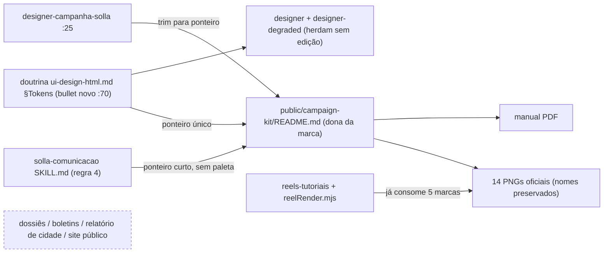

# Impl: Kit 1313 como fonte de marca única (doutrina + ativos oficiais)

Status: aprovado
Atualizado em: 2026-09-19
Issue: #1193
Intenção: docs/plans/kit-1313-fonte-de-marca.md
Appetite restante: herdado (~0,5 dia eng) — sem corte; as três fases cabem

## Leitura da intenção

- **Outcome:** o kit 1313 vira a fonte única de marca das peças de campanha: a doutrina de design aponta `public/campaign-kit/README.md` + manual (alcançando `designer`, `designer-degraded` e `designer-campanha-solla` sem regra copiada), a skill `solla-comunicacao` ganha o mesmo ponteiro curto, e os 14 ativos ficam versionados com mapa de uso e origem. Quem desenha acha o ativo certo sem adivinhar; quem escreve não inventa identidade.
- **O que NÃO negociar:** (1) fonte única — regra de marca mora só no README do kit + manual; doutrina e skills apenas apontam; (2) nenhuma segunda paleta (laranja `#f89c0e` segue fora; paleta legada do site intocada); (3) fail-closed institucional — dossiês, boletins, relatório de cidade e UI pública não encostam em marca de campanha; (4) nomes de arquivo preservados (`coração.png` incluso) e nenhum arquivo pesado versionado; (5) docs/assets-only — sem código, schema, migration, access, Consent ou UI.
- **O que reavaliar (hipóteses da intenção):**
  - O encaixe do ponteiro é o §Tokens (`ui-design-html.md:66-71`), mas **sem** reescrever o bullet `:69`: entra como bullet irmão em `:70`, antes de shadcn (diff mínimo; nenhum teste pina esse texto).
  - `designer-campanha-solla.md:25` copia paleta e regras — remover **não quebra nada**: nenhum teste/script referencia o agente ou os hexes (grep em `tests/`, `scripts/` vazio), e a linha já aponta o kit.
  - A "duplicação" em `reels-tutoriais/SKILL.md:156-173` **não é regra de marca geminada**: é delta operacional do render (arquivos lidos em `scripts/lib/reelRender.mjs:121-138` + exceção "cenas de captura preservam a paleta do site" `:166-168`), e a própria skill declara o README como mapa de uso (`:158-160`). Fica como está.
  - O manual PDF **não** tem legenda de ícones: `pdftotext` extrai só títulos (7 páginas: conceito, marca vertical/horizontal, variações de paleta, aplicações) → o fallback C do gate se aplica aos 7 ativos novos.
  - `public/` e `.agents/` estão no `.prettierignore`; `.opencode/**` **é** checado por `format:check` — o diff em `solla-comunicacao` e `designer-campanha-solla` precisa passar por `pnpm format`.

## Abordagem recomendada



**Opções consideradas:** A) ponteiro único na doutrina + README dono + trim do `designer-campanha-solla` + ponteiro na `solla-comunicacao`; B) completar as regras de marca em cada agente de design; C) deixar os agentes como estão e só arrumar o README.
**Recomendação:** A — a doutrina já é o contrato lido por `designer` e `designer-degraded` (`designer.md:51`, `designer-degraded.md:50`) e o `designer-campanha-solla` tem doutrina própria, então cada um recebe o ponteiro no lugar certo, sem geminar regra.
**Rejeitadas:** B porque garante drift entre três prompts e o README (o anti-goal exato); C porque só `reels-tutoriais` e o agente de campanha conheceriam o kit — o problema da intenção continua (é o estado atual).

### Decisões de engenharia (caro vs barato)

- **D1 — Dono do ponteiro.** Opções: A) doutrina (bullet novo) com README dono; B) regra completa em `designer`/`designer-degraded`; C) só README. **Recomendação: A** — um dono, dois pontos de entrada. Rejeitadas: B (drift/manutenção em três prompts), C (não alcança os agentes de design).
- **D2 — Duplicação em `designer-campanha-solla` × `reels-tutoriais`.** Opções: A) trim dos dois; B) manter os dois; C) trim só do `reels`. **Recomendação: trim do agente, manter o `reels`** — o agente é agente (aceite: sem regra duplicada em cada agente); o `reels` documenta a operação do render + a exceção de captura, que não é regra de marca. Rejeitadas: A (a exceção "captura preserva a paleta do site" viraria regra de vídeo no README, poluindo o dono), C (o agente seguiria com cópia da paleta, violando o aceite).
- **D3 — Pin de teste × inspeção.** Opções: A) inspeção com comandos no plano; B) novo spec em `tests/unit/` pinando doutrina + 14 nomes + entradas do README. **Recomendação: A** — o aceite da intenção diz "verificação por inspeção"; o repo só pina doutrina onde o invariante é operacional (`opencodeAgents.unit.spec.ts:104-136`, `openaiProviderScope.unit.spec.ts:84-95` — dispatch/quota/provider), não inventário de conteúdo; um spec de 14 nomes vira segunda fonte de verdade, falha a cada evolução legítima do kit e não pega o risco real (README desatualizado — julgamento). Rejeitada: B (barato em linhas, caro em manutenção e falsa segurança). **Gatilho de revisitação:** se um PR futuro mexer no ponteiro ou no kit sem atualizar o README, reabrir a decisão (caminho barato: estender `opencodeAgents.unit.spec.ts`).
- **D4 — Forma do mapa no README.** Opções: A) bullets agrupados, 1 por arquivo (7 verbatim + 7 novos); B) tabela única `Ativo × Quando usar`; C) recopiar a seção de aplicações do manual. **Recomendação: A** — preserva o estilo e os textos da C196 (diff mínimo), o consumidor busca pelo nome do arquivo e a contagem 14×14 é inspecionável por grep; o agrupamento separa "marcas/lockups" de "ícones/pattern (uso a confirmar)". Rejeitadas: B (reescreveria os 7 textos existentes sem ganho de busca), C (anti-goal "manual paralelo").
- **D5 — Uso dos 7 ativos novos.** Decisão do gate: **A com fallback C** — ler o manual; como não há legenda de ícones, cada entrada nova é descrição literal da forma + `uso a confirmar no manual`, sem inventar job. Rejeitadas: B (travar a entrega por legenda) e inventar significado.

### Componentes / mudanças

- **7 PNGs novos** (`public/campaign-kit/`): copiar `bahia.png`, `coração.png`, `estrela-2.png`, `pattern-shapes.png`, `punho.png`, `saude.png`, `saude-2.png` de `/home/fsolla/Downloads/OneDrive_2026-09-19/kit solla 1313/PNGs/`, bytes e nomes preservados. Não sobrescrever os 7 já mesclados; não copiar `FOTO SOLLA CAMISA BRANCA.png` nem o `.ai`.
- **`public/campaign-kit/README.md`**: dona da marca. (1) linha de origem externa no intro; (2) `## Ativos e quando usar` com **14 entradas**, 1 bullet por arquivo, agrupadas (`### Marcas completas`, `### Lockups do nome`, `### Número`, `### Estrela`, `### Ícones e pattern`); os 7 textos existentes verbatim (só separar `numero-positivo`/`numero-negativo` em dois bullets), as 7 novas com as descrições de D4/D5; (3) `## Regras do manual` e a paleta intocadas (são dela).
- **`.agents/skills/plan-issue/ui-design-html.md`**: inserir como novo bullet logo após `:69`, antes de "shadcn/lucide primeiro" (`:70`), no §"Tokens, brand e shadcn":

```text
- **Marca de campanha tem fonte única: o kit 1313.** Ativos e regras de uso em `public/campaign-kit/README.md` (manual: `docs/campaign-kit/manual-campanha-jorge-solla-1313.pdf`); não recriar lockup nem inventar paleta — o README é a dona, a doutrina só aponta.
```

Não tocar nas strings pinadas por teste (`Escopo de dispatch`, `NUNCA vai para o \`designer\` frontier`, `muda UI`, `permission`, provider `openai`).

- **`.opencode/skills/solla-comunicacao/SKILL.md`**: novo item 4 ao fim de "Regras rápidas" (depois de `:26`), sem hex:

```text
4. **Identidade visual oficial é o kit 1313**: ativos e regras de uso em `public/campaign-kit/README.md` (+ manual em `docs/campaign-kit/manual-campanha-jorge-solla-1313.pdf`). Não invente identidade nem copie a paleta; se a peça pedir visual, o caminho é o kit.
```

- **`.opencode/agent/designer-campanha-solla.md:25`**: substituir o item 6 por ponteiro puro (1 linha, sem hex nem regras de uso):

```text
6. **Kit de marca oficial** (`public/campaign-kit/README.md` + manual em `docs/campaign-kit/manual-campanha-jorge-solla-1313.pdf`): fonte única dos ativos e das regras de uso — leia antes de desenhar peça de campanha.
```

- **Intocados (por aceite):** `.agents/skills/reels-tutoriais/SKILL.md:156-173`, `scripts/lib/reelRender.mjs`, `scripts/build-reel.mjs`, builders de dossiê/boletim/cidade, `src/components/campaign/shell/campaign-logo.tsx`, `src/app/(frontend)/styles.css`, `DESIGN.md`.
- **`docs/changelog/2026-09-19-c204.md`**: uma entrada curta (convenção OPS85) — não editar `docs/CHANGELOG-AGENTS.md` nem o HISTORY.
- **Migration:** sem migration (nenhum schema).
- **Access / Consent:** N/A — nenhum write path, nenhuma chave `Consent`, nenhuma PII.
- **UI:** Impeccable **A — N/A sem UI**; nenhum shell a reusar, nenhum `-ui-design.html` (o campo `Design UI: N/A` da intenção permanece).

### Dados → forma

- **Forma escolhida (pergunta 3):** bullets agrupados, 1 por arquivo — preserva os 7 textos da C196 verbatim e fecha a contagem `14 arquivos × 14 entradas` por `ls` + grep; o grupo "Ícones e pattern" carrega as descrições literais com `uso a confirmar`, separando regra conhecida de forma observada.
- **Descrições propostas para os 7 novos** (ponto de partida; refináveis na passada A do manual): `bahia.png` — silhueta da Bahia em branco recortada em quarto de círculo vermelho; `coração.png` — coração verde cortado por linha de pulso (ECG) branca; `estrela-2.png` — grade 2×2 de discos alternando amarelo liso e verde com estrela branca; `pattern-shapes.png` — faixa superior com os ícones da marca (Bahia, punho, pulso, cruz, estrela, coração) em vermelho/azul/verde/amarelo sobre transparente; `punho.png` — punho erguido branco sobre quarto de círculo azul; `saude.png` — cruz verde (ícone de saúde); `saude-2.png` — disco amarelo com linha de pulso branca (ícone de saúde — variação 2). Todas com _uso a confirmar no manual_, exceto se a passada A achar aplicação no PDF.
- **Rejeitadas:** tabela única (reescreve os textos existentes e não melhora a busca por nome); recopiar seções do PDF (manual paralelo).

## Fases verificáveis

1. **Tracer (doutrina → README → ativo)** — ~0,15 dia: bullet na doutrina `:70` + copiar `punho.png` + 1 entrada no README; prova a fatia ponta-a-ponta do ponteiro único. Verificação: `grep -n 'campaign-kit' .agents/skills/plan-issue/ui-design-html.md` e `ls public/campaign-kit/punho.png`.
2. **Completar o mapa e os ponteiros (sem UI — N/A)** — ~0,25 dia: 6 PNGs restantes; README com origem + 14 entradas; passada A no manual (7 páginas; se alguma mostrar ícone em aplicação, refinar a entrada e remover o "uso a confirmar"); regra 4 da `solla-comunicacao`; trim do `designer-campanha-solla`. Verificação:

```bash
ls public/campaign-kit/*.png | wc -l   # → 14
diff <(ls public/campaign-kit/*.png | xargs -n1 basename | sort) \
     <(grep -o '`[^`]*\.png`' public/campaign-kit/README.md | tr -d '`' | sort -u)   # → vazio
grep -n 'public/campaign-kit/README.md' .agents/skills/plan-issue/ui-design-html.md .opencode/skills/solla-comunicacao/SKILL.md
grep -nE '#(e4102f|184e92|ffeb00|009647)' .opencode/agent/designer-campanha-solla.md   # → vazio
git diff --name-only   # → sem builders de dossiê, src/**, DESIGN.md
```

3. **Gates** — ~0,1 dia: `pnpm format` (só `.opencode/**` é checado; `public/` e `.agents/` são prettier-ignored), `pnpm format:check`, `pnpm gate:fast`; changelog `docs/changelog/2026-09-19-c204.md`; push via `pnpm push`. Diff `.md`/`.png`-only → `ci-scope` marca e2e `none`, mas o check requerido `checks` roda a cascata normal.

## Rabbit holes / Não escopo (engenharia)

- Regenerar, re-exportar ou otimizar os PNGs (WebP/SVG): os ativos oficiais entram como estão.
- Ligar os 7 ícones em `scripts/lib/reelRender.mjs`/`build-reel`: catálogo não é consumo; o render lê o que a peça usa.
- Site público/admin: logo legado e paleta `#a21c1c`/`#ffe607`/creme (item próprio; gatilho: entrega de identidade do site).
- Dossiês, boletins e relatório de cidade: fail-closed institucional, builders intocados.
- Versionar `FOTO SOLLA CAMISA BRANCA.png` (34 MB) e o `.ai` (3,3 MB).
- README virar manual paralelo (recopiar PDF) ou ganhar regra de vídeo (exceção de captura do reels).
- Copiar paleta/regras para `designer`/`designer-degraded` ("só completar") — a doutrina é o único caminho.
- Renomear `coração.png` para ASCII (nomes preservados é aceite).
- Pin unitário de prosa/inventário (decidido em D3, com gatilho).
- Tocar `DESIGN.md`, tokens do site ou qualquer `src/**`.

## Riscos e mitigação

- **Drift após o trim do `designer-campanha-solla`:** o ponteiro manda ler o README antes de desenhar; o grep do aceite confirma que nenhum hex restou no agente; o PR mostra remoção de cópia, não de capacidade.
- **Significado inventado nos ícones novos:** passada A no PDF + fallback C literal + `uso a confirmar` em toda entrada sem aplicação documentada; nada de job afirmado além do que o nome do arquivo carrega (saúde).
- **`coração.png` (Unicode NFC/NFD):** copiar preservando bytes e nome da origem; conferir com `git ls-files`/`ls`; nenhum código consome o ativo — referência futura deve copiar o nome do repo, nunca redigitar.
- **Ponteiro não alcança `designer-campanha-solla` via doutrina:** ele tem doutrina própria — por isso o trim é no prompt dele; o aceite cobre os três caminhos (doutrina para `designer`/`designer-degraded`, prompt + README para o de campanha).
- **Format/CI:** `.opencode/**` está sob `format:check`; `pnpm format` antes do push evita falha de formato no check requerido.
- **Testes que pinam a doutrina:** não tocar nas strings existentes; o bullet novo não colide; `pnpm test:unit` no `gate:fast` confirma.
- **Exposição:** o README em `public/` é servido publicamente — a linha de origem usa apenas um caminho de workstation, sem conteúdo sensível.

## Aceite de engenharia

- [ ] **Aceite 1 (doutrina):** `ui-design-html.md` §Tokens aponta `public/campaign-kit/README.md` + manual; `designer`/`designer-degraded` herdam sem edição; nenhum dos três agentes de design guarda paleta/regra copiada.
- [ ] **Aceite 2 (ativos):** `public/campaign-kit/` com os 14 PNGs (nomes preservados) e README com 14 entradas de uso + origem externa.
- [ ] **Aceite 3 (`solla-comunicacao`):** ponteiro curto presente, sem cópia de paleta.
- [ ] **Aceite 4 (nada geminado / instituições):** dossiês, boletins, relatório de cidade e site público intocados (`git diff --name-only` não lista esses paths).
- [ ] **Invariantes AGENTS/engineering-standards:** docs/assets-only — sem migration, schema, access, Consent, PII ou código; a dona da marca é o README ("edit the owner, don't twin"); texto pt-BR, paths/decisões em inglês.
- [ ] **Testes de domínio:** N/A — nenhum access/write path; D3 registra inspeção com comandos e o gatilho de reabertura (sem spec novo).
- [ ] **Qualidade:** `pnpm format:check` + `pnpm gate:fast` verdes; `pnpm push`; changelog `docs/changelog/2026-09-19-c204.md`.

## decision-quality self-score (0–5, gate ≥4)

1. **Decisões caras com rejeitadas — 5/5:** D1 (dono do ponteiro), D2 (trim × manter nos dois pontos), D3 (pin × inspeção), D4 (forma do mapa) e D5 (uso dos ícones) têm Opções/Recomendação/Rejeitadas, e as hipóteses da intenção foram reavaliadas uma a uma.
2. **Cabe no appetite — 5/5:** ~0,5 dia em três fases (0,15 + 0,25 + 0,1); sem migration, schema, UI ou código; nenhum corte necessário.
3. **Rabbit holes nomeados — 5/5:** regenerar assets, ligar no render, site legado, dossiês, arquivos pesados, manual paralelo, paleta copiada, rename do `coração.png`, pin de prosa e `DESIGN.md` estão fora.
4. **Depth check reusa os donos — 5/5:** nenhum arquivo de código novo; README é a dona, doutrina é o contrato já lido, `solla-comunicacao` e o agent de campanha são os pontos de entrada existentes — zero twin.
5. **Intenção permanece satisfeita — 5/5 (score final):** os 4 aceites de produto têm evidência de inspeção no checklist e os guardrails (sem regra geminada, instituições/site intocados, nomes preservados, nada pesado) ficam.
