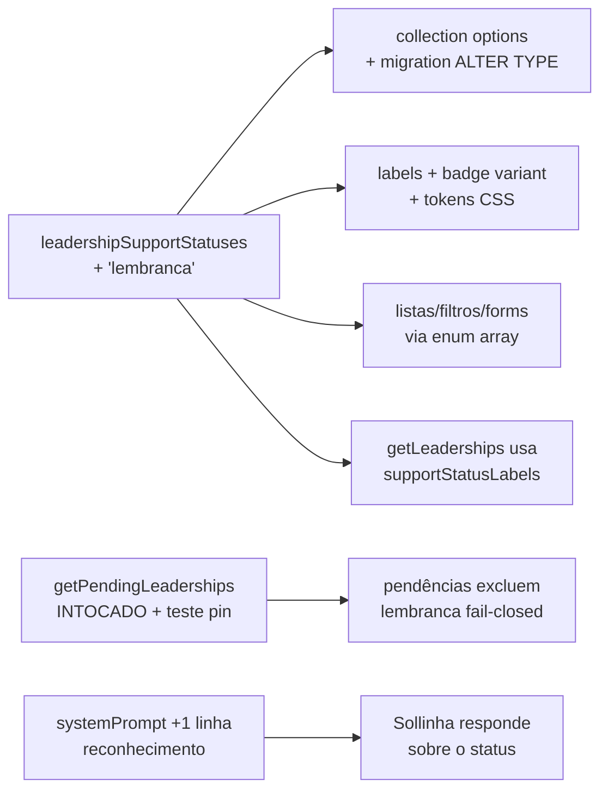

# Impl: Status de apoio "Lembrança" em lideranças

Status: em execução
Atualizado em: 2026-08-11
Issue: #661
Intenção: docs/plans/lembranca-status-liderancas.md
Appetite restante: herdado (~1 dia eng) — item pequeno, cabe folgado

## Leitura da intenção

- **Outcome:** novo valor `lembranca` no enum `supportStatus` de `leadership` (entre `em_disputa` e `negativo` no seletor), visível e marcável em TODAS as superfícies onde os 4 status atuais aparecem (célula da lista com auto-save, ficha/wizard/admin, filtro das listas de lideranças e de pessoas, Sollinha); **nunca** entra no critério de pendência de abordagem (fail-closed na query, não só na UI); badge visualmente distinto; nenhuma leitura existente quebra.
- **O que NÃO negociar:** liderança "Lembrança" é favorável e não é pendente — exclusão das pendências espelhando o "Negativo" (na query `getPendingLeaderships`, que já é fail-closed); sem segundo eixo de classificação; sem fluxo próprio de votos (usa o campo de votos declarados existente); leader lockdown intacto (status é staff-only).
- **O que reavaliar:** a hipótese da intenção cobre as áreas certas, mas encontrei duas superfícies que ela não nomeou: (1) `peopleData.ts` `leadershipStatusesInOrder` — lista dura dos 4 valores que **silenciosamente omitiria** o novo status do facet da lista de pessoas; (2) `getLeaderships.ts` mantém uma tabela de rótulos duplicada (`SUPPORT_LABELS`) que também esqueceria o valor novo — candidata a DRY com `supportStatusLabels`.

## Abordagem recomendada

**Opções consideradas:** A (valor novo no enum existente, fonte única) | B (segundo campo/eixo de classificação) | C (status composto em string)
**Recomendação:** A — o produto decidiu no gate que é um valor a mais no enum; a engenharia tem um único source of truth (`leadershipSupportStatuses` + `supportStatusLabels`) e as superfícies que derivam dele (listas, forms, URLs, omnibox) ganham o valor automaticamente.
**Rejeitadas:** B porque a intenção corta explicitamente o segundo eixo (matriz de combinações); C porque destrói filtro `in` no Postgres e indexação.

### Decisões de engenharia

- **D1 — Migration do enum.** `ALTER TYPE "public"."enum_leadership_support_status" ADD VALUE 'lembranca' BEFORE 'negativo'` — o `BEFORE` preserva a ordem do enum no Postgres igual à do seletor (decisão do gate: entre "Em disputa" e "Negativo"), então `sort: 'supportStatus'` na lista ordena igual ao seletor.
  - _Rejeitadas:_ `ADD VALUE` sem `BEFORE` (anexa no fim → ordenação por status divergiria do seletor); recriar o tipo inteiro (rename+create+cast, precedente C14) — destrutivo demais para um valor novo, risco desnecessário em prod.
  - Precedentes: `20260723_025513` (ADD VALUE … BEFORE), `20260728_041547` / `20260724_180000` (ADD VALUE). Se o `migrate:create` gerar `ADD VALUE` sem `BEFORE`, editar o `.ts` da migration nova (migration não shipada — editável; nunca editar as antigas).
- **D2 — Badge distinto.** Novo variant `support-remembered` no `Badge` + tokens `--support-remembered`/`-foreground` (índigo suave: `#e0e7ff` / `#3730a3`) — distinto dos 4 atuais (verde/cinza/âmbar/vermelho) e semanticamente "resolvido e favorável".
  - _Rejeitadas:_ reusar `estimate-*` (âmbar colide com "Em disputa"); variant `default` (não distinto).
- **D3 — `getLeaderships.ts`: matar a tabela duplicada.** Substituir `SUPPORT_LABELS` por `supportStatusLabels` de `leadershipLabels.ts` (tabela de strings pura, client-safe, importável do server). Um valor novo no enum seria propagado pela fonte única em vez de exigir lembrar da duplicata.
  - _Rejeitada:_ só adicionar `lembranca` na duplicata — deixa a segunda fonte de verdade viva para o próximo status.
- **D4 — `peopleData.ts` `leadershipStatusesInOrder`:** trocar a lista dura `['engajado','a_abordar','em_disputa','negativo']` por `leadershipSupportStatuses.filter(s => statuses.has(s))`. Sem isso o status novo não apareceria no facet da lista de pessoas (miss silencioso, sem teste pegando).
- **D5 — Pendência: não tocar.** `PENDING_SUPPORT_STATUSES = ['a_abordar','em_disputa','engajado']` e `PENDING_CRITERION` ficam como estão — "Lembrança" e "Negativo" já são excluídos pela ausência da lista (fail-closed na query) e o critério declarado continua sem o novo estado (aceite: "pendências declaram o critério sem o novo estado"). Adicionar teste que pin a exclusão.
- **D6 — Sollinha reconhece o status:** +1 linha na seção "Lideranças pendentes de abordagem" do `systemPrompt.ts` (ex.: "Liderança com status 'Lembrança' é favorável sem compromisso — não conta como pendente de abordagem"). O rótulo na leitura vem de D3.
- **Semânticas que excluem "Lembrança" intencionalmente (verificar com testes, não mudar):** convite de login exige `engajado` (`campaignInvite*`), acesso ao app exige `engajado` (`access/contacts.ts`, `access/municipalities.ts`), opção de "responsável" de atividade exige `engajado` (`activityLeadershipOptions.ts`) — uma "Lembrança" não é engajada, comportamento correto.

### Componentes / mudanças

- **`leadershipSupportStatuses`** (`src/lib/schemas/leadership.ts`): `['engajado', 'a_abordar', 'em_disputa', 'lembranca', 'negativo']` — tipo `SupportStatus` e `isSupportStatus` derivam sozinhos.
- **`Leadership.ts`** (collection): opção `{ label: 'Lembrança', value: 'lembranca' }` na posição 4 (admin select + admin filter automáticos).
- **Migration:** `add_lembranca_support_status` via `pnpm migrate:create`, SQL conforme D1.
- **`payload-types.ts`:** regenerar via `pnpm generate:types`.
- **`leadershipLabels.ts`:** `lembranca: 'Lembrança'`.
- **`SupportStatusBadge.tsx`:** `lembranca: { variant: 'support-remembered' }`.
- **`Badge.tsx`** + **`styles.css`:** variant e tokens (D2).
- **`getLeaderships.ts`:** `SUPPORT_LABELS` → `supportStatusLabels` (D3).
- **`systemPrompt.ts`:** linha de reconhecimento (D6).
- **`peopleData.ts`:** `leadershipStatusesInOrder` via enum canônico (D4).
- **Automático (sem edição):** `LeadershipListSupportStatusControl`, `LeadershipForm`/`LeadershipInternalForm`/`WizardLeadershipForm`, `leadershipListFilters`/`peopleListFilters`, `leadershipListUrl`/`peopleListUrl` (parse enum exaustivo), omniboxes, `leadershipData`, `wizardLeadershipContract`, `municipalityV2Network*`, actions/routes zod (`z.enum(leadershipSupportStatuses)`), `support-status/route.ts`.
- **Access / Consent:** nenhum — status é staff-only (`canManageCampaignStaffField`), leader lockdown intocado.

### Dados → forma

Não se aplica (nenhuma superfície de dado nova; valor de enum flui por filtros/facets existentes — decisão de produto do gate).

## Fases verificáveis

1. **Schema+server** — enum array + collection options + migration + `generate:types`; verificação: `pnpm migrate:status` e `pnpm migrate` local.
2. **UI** — labels + Badge + tokens + `SupportStatusBadge`; verificação: badge unit test (it.each) renderiza `Lembrança`.
3. **IA + pessoas** — `getLeaderships` DRY, `systemPrompt`, `peopleData` ordem; verificação: testes de tool e listas.
4. **Testes** — atualizar os que enumeram status (badge it.each, "every status member" do `leadershipListUrl`, fixture e2e, int spec com `lembranca` persistindo, pin de exclusão de pendência); NENHUM teste novo de feature em volume.
5. **Gates** — `tsc --noEmit`, `pnpm lint`, `pnpm format:check`, `pnpm exec knip`, `pnpm check:cycles`, `pnpm test`, `pnpm build` local.

## Rabbit holes / Não escopo (engenharia)

- Migração destrutiva do enum (recreate) — desnecessária com `BEFORE`.
- Reordenar `a_abordar` no seletor — produto não pediu.
- Tratamento especial de votos para "Lembrança" — decidido no gate: campo de votos declarados já existente.
- Qualquer mudança em convites/acesso-app/atividade (engajado-only é o comportamento correto).

## Riscos e mitigação

- **Migration `ADD VALUE` + transação Postgres:** permitido desde PG 12 dentro de transação (novo valor não usado na mesma transação); precedente shipado em prod (`20260723_025513`). Mitigação: verificar `pnpm migrate` local e `migrate:status` antes do push.
- **Superfície enumerada esquecida:** mitigado por D3/D4 (fonte única) + teste de badge it.each + teste "every status member" da URL.
- **Filtro `lembranca` vazando para pendências:** fail-closed já está na query; o teste unit do `getPendingLeaderships` passa a incluir `lembranca` na exclusão pinada.

## Aceite de engenharia

- [x] Aceite de produto da intenção ainda coberto (superfícies todas + pendências excluem + badge distinto + Sollinha reconhece)
- [x] Invariantes AGENTS/engineering-standards (sem transações novas, sem access novo, nomes EN, rótulos pt-BR)
- [x] Testes de domínio previstos (badge it.each, URL enum exaustivo, pin pendência, int persistence)
