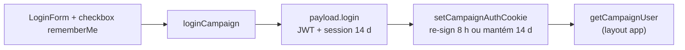

# Lembrar de mim / sessão longa em `/campanha`

Status: entregue em código (2026-07-27)
Atualizado em: 2026-07-27
Item do roadmap: [docs/roadmap.md](../roadmap.md) (Trilha B, item B39)
Impeccable: B — encaixe no `LoginForm` + cookie `campaign-token`; sem rota nova
Appetite: ~0,5 dia eng; checkbox + duas durações de JWT/cookie + testes; sem migration
Responsável: —

## Design (Impeccable)

Âncoras: `PRODUCT.md` (register `product` — Field Desk; uso em campo sob pressão) / `DESIGN.md` (tema `data-theme='campaign'`) · shell de auth existente (`CampaignAuthCardHeader`, `LoginForm`).

Na implementação (`implement-roadmap-item`): craft compacto → critique → polish.

Brief compacto:

- **Persona / contexto:** Assessor / CG no celular ou PWA instalado (D1 ✓), abrindo `/campanha` várias vezes no dia; hoje a sessão cai em ~2 h e o login vira atrito diário.
- **Job principal:** permanecer autenticado no dispositivo próprio pelo dia de trabalho (default) ou por dias (opt-in "Lembrar de mim"), sem enfraquecer o logout explícito nem o isolamento do cookie.
- **Estratégia de cor:** Restrained — checkbox + label no formulário existente; sem hero de "segurança".
- **Edit where you see:** não — superfície de auth.
- **Anti-goals:** "ficar logado para sempre" sem opt-in; segundo cookie de sessão; armazenar senha no `localStorage`; misturar sessão de `users` (`/admin`).

## Dados → decisão → apresentação

Dados: N/A — auth/sessão; nenhum KPI/série/mapa.

## Contexto

A sessão de `/campanha` era o cookie httpOnly `campaign-token` (`path: '/campanha'`, `sameSite: 'lax'`, `secure` em produção), setado por [`setCampaignAuthCookie`](../../src/utilities/campaignAuth.ts) após `payload.login` em [`loginCampaign`](<../../src/app/(campaign)/campanha/actions/auth.ts>). Antes desta entrega, Payload aplicava seu default de **7.200 s** (2 horas) ao JWT e o helper repetia esse valor no `maxAge`. Não havia checkbox "Lembrar de mim"; o `LoginForm` só pedia identificador + senha.

Pedido de produto (2026-07-26): o usuário é deslogado com frequência; oferecer "Lembrar de mim neste dispositivo" e manter a sessão por mais tempo.

PWA (D1 ✓): o SW envia o cookie automaticamente nos `fetch`; logout já limpa caches (`clearCampaignPwaCaches`). Sessão mais longa beneficia o PWA instalado sem mudar o modelo de auth.

## Revisão na entrega

- **`payload.login` não aceita TTL por chamada.** `CampaignUser.auth.tokenExpiration` passou ao teto de 14 dias e `setCampaignAuthCookie` re-assina o mesmo conjunto de claims com 8 horas no caminho padrão.
- **`useSessions` é `true` por default no Payload.** A sessão armazenada precisa nascer com o teto longo; deixá-la em 8 horas e só alongar o JWT lembrado faria outro login podar a sessão longa como expirada.
- **Logout só apagava o cookie.** Com TTL de 14 dias, isso deixaria um token reutilizável no aparelho. `logoutCampaign` agora autentica o token e delega a remoção da sessão corrente à operação transacional pública `logoutOperation` do Payload antes de apagar o cookie; falha de revogação nunca impede a limpeza local.
- **Custo aceito:** `POST /api/campaignUser/login` direto emite o `payload-token` de 14 dias. A aplicação `/campanha` não lê esse cookie: usa apenas `campaign-token`, path `/campanha`, re-assinado para 8 horas salvo opt-in.
- **Medições:** `pnpm migrate:create __probe` informou “No schema changes detected”; o smoke E2E confirmou `campaign-token.expires` em ~14 dias com o checkbox marcado.

## Objetivos

- No login, checkbox **"Lembrar de mim neste dispositivo"** (default **desmarcado**).
- Sessão **sem** lembrar: duração de **dia de trabalho** (recomendação: **8 h**), não 2 h.
- Sessão **com** lembrar: duração **longa** (recomendação: **14 dias**), JWT + cookie alinhados.
- Logout explícito revoga a sessão no servidor, invalida o cookie (`maxAge: 0`) e mantém a limpeza de caches PWA.
- Guardrails: sem migration, sem collection, sem Consent novo; cookie permanece httpOnly / path `/campanha` / isolado de `payload-token`; `leader` e staff no mesmo contrato.

## Decisões travadas

- **Duas durações via checkbox, não um único `tokenExpiration` global longo.** O caro de reverter é o tempo de vida do JWT em dispositivo compartilhado: opt-in explícito para a faixa longa; default só alonga o dia de trabalho. **Rejeitado:** (a) só subir o default para 14/30 dias sem checkbox (dispositivo de mesa compartilhada fica aberto demais); (b) manter 2 h e só alongar com "lembrar" (o atrito reportado acontece no default); (c) sliding session / refresh token (segundo protocolo, appetite e superfície de ataque).
- **Cookie `maxAge` = `tokenExpiration` do login que emitiu o JWT.** Continua o padrão de `setCampaignAuthCookie`; o login passa a escolher qual expiração pedir ao Payload (ou emitir com `exp` coerente). **Rejeitado:** cookie longo com JWT curto (usuário "parece" logado e falha no próximo `getCampaignUser`); cookie curto com JWT longo (sessão morre cedo sem o token ter expirado).
- **Sem persistir a senha no cliente.** "Lembrar" = duração do token, não Credential Manager nem `localStorage` de senha. Biometria / WebAuthn fica em **B40**. **Rejeitado:** autofill como "feature" de produto (já é do browser); guardar credenciais em plain storage.
- **i18n e naming** (AGENTS.md): identificadores `rememberMe`, `CAMPAIGN_SESSION_TTL_SHORT` / `_LONG` (ou nomes equivalentes); copy pt-BR "Lembrar de mim neste dispositivo".

## Questões resolvidas

- **Durações:** 8 horas sem opt-in e 14 dias com “Lembrar de mim”, decididas pelo produto nesta entrega.

## Abordagem proposta

Componentes:

- **`src/lib/schemas/campaign-login.ts`**: campo opcional `rememberMe` (boolean / "on").
- **`LoginForm.tsx`**: `Checkbox` + label; `name="rememberMe"`; `autoComplete` inalterado.
- **`loginCampaign` / `setCampaignAuthCookie`**: aceitar TTL explícito; alinhar JWT + cookie; constantes numéricas num módulo pequeno (`campaignSessionTtl.ts` em `lib/` se puro).
- **`CampaignUser` auth config**: `tokenExpiration = CAMPAIGN_SESSION_TTL_LONG`; o caminho curto re-assina por API pública `jwtSign`, com `payload.secret`.
- **Logout:** autentica o token, revoga só a sessão corrente via `logoutOperation` do Payload e sempre apaga o cookie.
- **Testes:** unit de claims/`exp`/`maxAge` e action/FormData; int de autenticação após revogação; e2e do checkbox e expiração longa.
- **Migration:** nenhuma.

Depth check: reusa `setCampaignAuthCookie`, `CAMPAIGN_TOKEN_COOKIE`, form action existente. Não cria sessão paralela nem collection de refresh.

## Dependências

- Nenhuma dura de outro plano. Soft: **B40** (login biométrico) pousa no mesmo `LoginForm` depois; **D1 ✓** PWA já convive com o cookie.

## Não escopo

- WebAuthn / digital / Face ID → **B40**.
- "Manter logado" em `/admin` (`users`) → Admin Payload / outro ciclo.
- Sliding expiration, "sessão ativa enquanto a aba estiver aberta", SSO.
- Mudar `path`/`sameSite` do cookie ou unificar com `payload-token`.

## Rabbit holes

- **Refresh-token / dual-cookie.** Se alguém “só completar” com refresh: segundo segredo, rotação, invalidação no logout, testes de race. **Mitigação:** uma JWT + um cookie, duas durações no emit.
- **`tokenExpiration` estático na collection vs por login.** Resolvido: Payload não aceita TTL por request, mas exporta `jwtSign`; config = longo e o helper re-assina para o curto preservando `id`/`collection`/`role`/`email`/`sid`.

## Adiado com gatilho

- **TTL 30 dias ou "até eu sair".** Revisitar quando: mesa pedir após uso real com B39 + assessoria confirmar teto LGPD para sessão em dispositivo com PII.
- **Aviso "este dispositivo será lembrado" no primeiro remember.** Revisitar quando: critique/R6 acusar surpresa em tablet compartilhado.

## Referências

- `docs/roadmap.md` (Trilha B · B39)
- `src/utilities/campaignAuth.ts` — re-assinatura, cookie e revogação de sessão
- `src/app/(campaign)/campanha/actions/auth.ts` — `loginCampaign` / logout
- `src/app/(campaign)/campanha/login/LoginForm.tsx`
- `src/collections/CampaignUser.ts` — auth
- `docs/plans/pwa-campanha.md` — cookie + logout limpa cache
- AGENTS.md — Campaign auth
- `PRODUCT.md` / `DESIGN.md` — Field Desk
