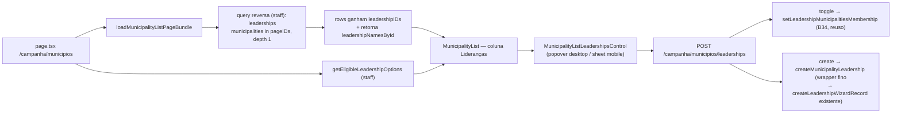

# Impl: Coluna de lideranças na tabela de municípios

Status: aprovado
Atualizado em: 2026-08-04
Issue: #359
Intenção: docs/plans/liderancas-coluna-municipios.md
Appetite restante: herdado (~0,5–1 dia eng)

## Leitura da intenção

- **Outcome:** staff vê e edita, direto na lista `/campanha/municipios`, as lideranças vinculadas a cada município — chips com nome do contato, popover com busca, adição/remoção com auto-save otimista, e criação inline (nome + telefone) sem sair da tabela. Coluna ao lado de "Assessores".
- **O que NÃO negociar:** líder (`leader`) não vê a coluna (nem acessa a página — `gate: noLeader` já cobre); assessor só vê/edita lideranças dos municípios que administra (`canReadLeadership` + `assertMunicipalitiesWithinScope`); sem collection nova; sem migration fora do padrão; `Consent` permanece fail-closed (a criação inline reusa `createValidatedLeadershipRecord`, que não introduz chave nova — mesmo comportamento do form completo).
- **O que reavaliar:** a hipótese da intenção ("novo field `leadership` no `Municipality`, mirror de `advisors`", com migração de reconciliação) é **rejeitada** neste impl plan. A relação canônica já existe (`leadership.municipalities`) e o B34 já escreve esse lado. Ler por query reversa + reusar as actions B34/B154 elimina migration, join table nova e sync bidirecional.

## Abordagem recomendada

**Opções consideradas:** A | B | C
**Recomendação:** **B** — leitura reversa de `leadership.municipalities` + reuso das actions B34/B154/wizard. Zero migration, fonte única de verdade (uma ponta canônica), consistência automática com a coluna "Municípios" de `/campanha/liderancas` (B34) e com a ficha da liderança — sem hooks de sync que possam divergir. Depth check: reusa actions, schemas, `CampaignCellEditOverlay`, padrão de provider do B154.
**Rejeitadas:**

- **A** — novo campo `municipality.leaderships` (hasMany) + migration + migração de reconciliação + sync bidirecional com `leadership.municipalities` por hooks nas duas collections. Custo de reverter alto (join table nova numa collection "system" de 435 rows + hooks de sync que divergem silenciosamente — o classic footgun do Payload); não traz aceite adicional.
- **C** — coluna read-only para assessor (só coordenação edita). Viola o aceite: "Assessor só vê e edita lideranças dos municípios que administra".

### Componentes / mudanças

- **`MunicipalityListColumnId`** (`src/utilities/municipality/municipalityLabels.ts`): ganha `'leaderships'` (closed union). `municipalityColumnDescriptions` ganha entrada. **`municipalityColumnLabels`** (`src/utilities/municipality/municipalityListUrl.ts`): `leaderships: 'Lideranças'`.
- **`MunicipalityListViewModel`** (`src/utilities/municipality/municipalityViewModels.ts`): ganha `leadershipIDs: number[]` (default `[]`, populado pelo bundle só na staff view). Novos tipos `MunicipalityLeadershipSummary` (`{ id, name }`) e `EligibleLeadershipOption` (`{ id, name }`), mais os helpers `loadMunicipalityLeadershipSummaries(payload, user, municipalityIDs)` (uma query reversa batch) e `getEligibleLeadershipOptions(payload, user)` (espelho de `getEligibleAdvisorOptions`; escopo via `overrideAccess: false` + user).
- **`loadMunicipalityListPageBundle`** (`src/utilities/municipality/municipalityPageData.ts`): para staff, uma query `leadership where { municipalities: { in: pageIDs } }` com `depth: 1` (`contact`), `user`/`overrideAccess: false` → injeta `leadershipIDs` nos rows e devolve `leadershipNamesById` no bundle.
- **`page.tsx`** (`(app)/municipios`): staff carrega `getEligibleLeadershipOptions` e repassa `leadershipNamesById` + `leadershipOptions` ao `MunicipalityList`.
- **`MunicipalityList.tsx`** + **`MunicipalityListMobileCards.tsx`** (+ pass-through de props em `MunicipalityListMobileSection`): coluna `'leaderships'` no bloco staff **após `advisors`** (sem `MunicipalitySortableHead` — header default via `column.label`; não ordena nem filtra). Picker: entrada em `municipalityListPickerColumns`. Célula = controle novo para **todo** staff (advisors também gerenciam); card mobile ganha a linha "Lideranças" com `variant="sheet"`. Envolve a lista no novo provider.
- **`MunicipalityListLeadershipsControl.tsx`** (novo, client): espelho de `MunicipalityListAdvisorsControl` — chips de nome (sort pt-BR), trigger com `aria-label` por extenso, `CampaignCellEditOverlay` (popover/sheet), `Command` com busca `matchesAtWordStart`, delta otimista (seq/pending/revert/`latestConfirmedRef`), `Alert` de erro. **Branch de criação** (diferente do B154 que cria em um clique só porque `name` bastava): `CommandItem` "+ Criar liderança" → mini-form inline (Nome pré-preenchido + Telefone `type="tel"`) → POST → chip otimista com temp id negativo → swap pelo id real. Chips de temp-create sem × (mesmo contrato do B154).
- **`MunicipalityLeadershipCreateProvider.tsx`** (novo, client): bridge de opções criadas inline para todo o surface (espelho de `MunicipalityAdvisorCreateProvider`; 2 call sites → mirror, não abstrair).
- **`src/app/(campaign)/campanha/(app)/municipios/leaderships/route.ts`** (+ `types.ts`, novos): `POST` via `campaignJsonMutationRoute`, body `z.union` (toggle `{ municipalityId, leadershipId, assigned }` | create `{ municipalityId, name, phone }`). Resposta `{ status: 'success', leadershipIDs, createdLeadership?: { id, name } }` — `leadershipIDs` = ids das lideranças do município após o write (query reversa id-only, `overrideAccess: true` — o write acabou de ser access-checkado; precedente B34).
- **`src/app/(campaign)/campanha/actions/leadership.ts`**: **toggle** reusa `setLeadershipMunicipalitiesMembership` tal qual (o B34 já revalida ficha da liderança + detalhe do município; a lista onde estamos NÃO é revalidada — o chip é otimista, mesmo contrato do B34). **create**: wrapper fino `createMunicipalityLeadership({ municipalityId, name, phone })` → `createLeadershipWizardRecord` + slug lookup + revalidate (`/campanha/liderancas` lista + `/campanha/municipios/<slug>`), espelhando `createMunicipalityAdvisor`.
- **Schemas / safe messages:** union parseado no route (padrão advisors, zod inline); allowlist = `LEADERSHIP_MUNICIPALITY_FLOOR_MESSAGE`, `LEADERSHIP_MUNICIPALITY_CAP_MESSAGE`, `LEADERSHIP_MUNICIPALITY_SCOPE_MESSAGE`, `LEADERSHIP_STAFF_MESSAGE`, `LEADERSHIP_DUPLICATE_MESSAGE`, `CONTACT_PHONE_AMBIGUOUS_MESSAGE`, `BRAZILIAN_PHONE_INVALID_MESSAGE`, `POSTGRES_DEDUP_LOCK_MESSAGE` — todas lançadas pelas actions reusadas.
- **Migration:** **nenhuma**.

### Dados → forma

- Forma escolhida: **chips de nome do contato** na célula (espelho de assessores; sem avatar — liderança não tem `user` necessariamente). Popover: chips + Command. Vazio: "Nenhuma" (texto muted) — o `MissingAdvisorBadge` é sobre responsabilidade e não se aplica. Rejeitadas: avatar stack (presume conta); contagem/ranking (intenção é qualitativa — `Dados: N/A`).

## Fases verificáveis

1. **Schema/server** — view model + bundle + helpers + route + wrapper `createMunicipalityLeadership` + int tests (toda a lógica de domínio é reuso: B34 toggle, wizard create; o que é novo é a superfície município + reconcile).
2. **UI** — coluna + picker + `MunicipalityListLeadershipsControl` (shape → craft → critique → polish, Impeccable B) + provider + cards mobile.
3. **Gates** — unit tests (controle + colunas), `pnpm gate:fast` na iteração, `pnpm push` no fechamento; entrada curta em `docs/CHANGELOG-AGENTS.md`.

## Rabbit holes / Não escopo (engenharia)

- **Generalizar** `MunicipalityAdvisorCreateProvider` em um bridge genérico — 2 call sites, não abstrair (mirror).
- **Sync bidirecional / campo novo** — cortado pela Opção B (sem migration).
- **Filtro/ordenação por liderança no header** — fora de escopo (a intenção não pede; o gatilho análogo B29 é da dobradinha).
- **Server-side search das opções** (catálogo grande) — v1 carrega o conjunto visível como `getEligibleAdvisorOptions`; se ficar pesado, trocar para busca server-side tipo `searchActivityLeadershipOptions` (gatilho de revisitação, não fazer agora).
- **e2e do fluxo completo** — opcional na fase 3 (o e2e de municípios existe; decidir na execução se o custo cabe no appetite).

## Riscos e mitigação

- **Assessor adiciona liderança fora da carteira** → `assertMunicipalitiesWithinScope` (B34/create) rejeita com `LEADERSHIP_MUNICIPALITY_SCOPE_MESSAGE` (allowlisted) + rollback otimista.
- **Remover o último município de uma liderança** → floor de 1 do `nextMunicipalityIdsAfterLeadershipMembership` → `LEADERSHIP_MUNICIPALITY_FLOOR_MESSAGE` (allowlisted); chip volta (rollback).
- **Cap `MAX_LEADERSHIP_MUNICIPALITIES` (30)** → `LEADERSHIP_MUNICIPALITY_CAP_MESSAGE` (allowlisted).
- **Concorrência no toggle** → lock advisory `leadership-municipalities:{id}` já presente no B34.
- **Criação de pessoa duplicada** → `Contact` dedup por telefone + `LEADERSHIP_DUPLICATE_MESSAGE` (allowlisted); toast no popover.
- **`MunicipalityListViewModel` consumido por outros surfaces** → campo novo opcional com default `[]`; nenhum consumidor quebra.
- **Branch/worktree**: o worktree está na branch `plan/b157-…` com um edit não commitado do plano B157. Ao executar, criar `agent/359-liderancas-coluna-municipios` a partir de `origin/main`; o edit do B157 fica preservado (não commitar) — confirmar com o humano como tratar.

## Aceite de engenharia

- [x] Aceite de produto da intenção ainda coberto (coluna staff, chips, popover, criação inline, scopes)
- [x] Invariantes AGENTS/engineering-standards: sem migration, sem collection nova, access reusado (`overrideAccess: false` onde o ator importa), transação nas escritas multi-collection (já nas actions reusadas), copy pt-BR / identificadores em inglês
- [x] Testes de domínio: int spec novo (`campaignMunicipalityLeadershipList.int.spec.ts` — toggle e create pela superfície município, scopes advisor/coordinator/leader, floor/cap, duplicata) + unit do controle

## Pós-revisão (/simplify, 3 revisores paralelos — read-only)

Aplicados: reconcile **scoped** reusando `loadMunicipalityLeadershipSummaries` nas duas wrappers (elimina o único bypass novo e o gêmeo da query reversa; o create devolve o **nome real do contato** — `contactReused` — para o chip otimista); toggle passa a revalidar `/campanha/liderancas` (a rationale do B34 não transfere: o chamador NÃO está nessa lista); validação cliente espelha o schema (nome `maxLength 120`, telefone via `normalizeBrazilianPhone`); copy "staff" → "a equipe"; ids do mini-form via `useId` (tabela + cards mobile são árvores irmãs); refoco no CommandInput ao fechar o form (foco não cai no body). Deferidos com gatilho: query reversa do bundle fora do `Promise.all` (1 RTT serial no caminho crítico — otimizar se a lista ficar lenta); slug lookup defensivo pós-commit do create.
