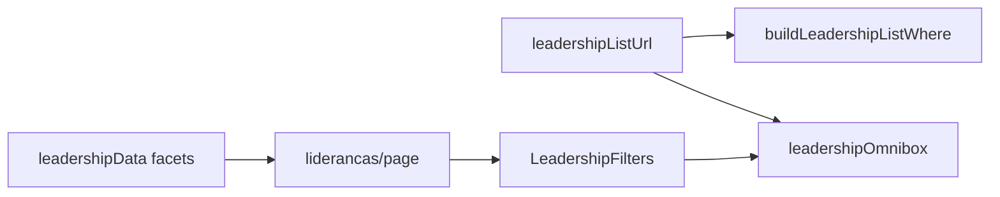

# Impl: Lideranças — filtrar por organização e dobradinha na omnibox

Status: aprovado
Atualizado em: 2026-08-02
Issue: #311
Intenção: docs/plans/liderancas-omnibox-org-dobradinha.md
Appetite restante: herdado (~0,5–1 dia eng)

## Leitura da intenção

- **Outcome:** Staff filtra a lista `/campanha/liderancas` por organização e/ou dobradinha via omnibox (sugestões tipadas + chips), com semântica OR inclusiva por dimensão, sem expor estimativas.
- **O que NÃO negociar:** lista continua staff-only; sem criação de org/dobradinha na barra; sem filtro “sem organização/dobradinha”; sem estimatedVotes.
- **O que reavaliar:** facet cross-filtered (como município) em vez de carregar catálogo inteiro; params URL `organization` / `stateDeputy` (singular, espelho de `municipality`).

## Abordagem recomendada

**Opções consideradas:** A) facet cross-filtered + omnibox · B) catálogo completo no client · C) só uma dimensão  
**Recomendação:** A — precedente município/status; busca tipada escala; URL canônica reutiliza `campaignListUrl` helpers.  
**Rejeitadas:** B (lista grande, sem cross-filter); C (aceite pede ambas).

### Componentes / mudanças

- **`leadershipListUrl.ts`:** state `organizations` / `stateDeputies`; parse/serialize `organization` / `stateDeputy`; `where` com `in` OR.
- **`leadershipListFilters.ts`:** toggles multi-valor (mesmo contrato de município).
- **`leadershipData.ts`:** facets `organizationIDs` / `stateDeputyIDs` (ignoram próprio filtro, unem seleção).
- **`leadershipOmnibox.ts`:** chips, seeds, apply/remove para `organization:` / `stateDeputy:`.
- **`LeadershipFilters.tsx` + `page.tsx`:** opções de facet com rótulos; placeholder atualizado.
- **Migration:** sem migration.
- **Access / Consent:** inalterado (staff guard existente).
- **UI:** Impeccable B — encaixe na omnibox existente; sem header filter novo.

## Fases verificáveis

1. **URL + where + filters** — parsers, toggles, `buildLeadershipListWhere`; unit `leadershipListUrl`.
2. **Facets + page wiring** — `leadershipData`; int filter por organização.
3. **Omnibox** — adapter + `LeadershipFilters`; unit B128.
4. **Gates** — `pnpm gate:fast`; push via `pnpm push`.

## Rabbit holes / Não escopo (engenharia)

- Header filter popover para org/dobradinha (só omnibox neste item).
- Saved filters; sentinela “sem vínculo”.
- Alterar omnibox de organizações/dobradinhas (Issues irmãs).

## Riscos e mitigação

- **Facet pesado:** `select` só do campo relacional, `limit: 0` — mesmo padrão município.
- **Rótulo de chip ausente:** unir ID selecionado no facet mesmo fora do recorte atual.

## Aceite de engenharia

- [x] Aceite de produto da intenção ainda coberto
- [x] Invariantes AGENTS/engineering-standards
- [x] Testes de domínio previstos (unit URL/omnibox; int filter org)
