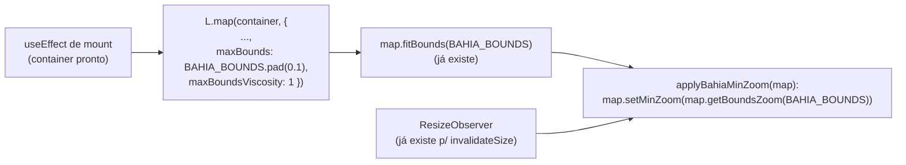

# Limitar o mapa da Bahia a pan/zoom dentro do estado

Status: rascunho
Atualizado em: 2026-07-26
Item do roadmap: [docs/roadmap.md](../roadmap.md) (Fill-ins abertos)
Impeccable: B — encaixe em `BahiaMap`/`MunicipalityMapPanel` (mapa do Início staff); muda só comportamento de interação, sem layout novo
Appetite: ~0,25–0,5 dia eng; sem migration, sem UI nova — só opções de `L.map`
Responsável: —

## Design (Impeccable)

Âncoras: `PRODUCT.md` § Design Principles, princípio 2 "Clarity under pressure" (toda tela ganha o próprio lugar; evitar que um gesto acidental — arrastar ou dar zoom-out demais — jogue o usuário para fora da geografia que importa, no meio da pressão de campo). Tema `data-theme='campaign'` (irrelevante aqui — não há CSS/token novo).

Na implementação (`implement-roadmap-item`): craft compacto → critique → polish. Não há shape a fazer (não é UI nova) nem harden/optimize previsto (mudança pequena e isolada).

Brief compacto (B ambíguo — aqui pouco ambíguo, registrado por completude):

- **Persona / contexto:** Alex (coordenador) ou um assessor, olhando o mapa do Início ou o painel de comparação de candidatos, muitas vezes no celular, em campo.
- **Job principal:** ler a distribuição de um valor pela Bahia sem se perder da geografia que importa.
- **Estratégia de cor:** N/A — item não toca cor/paleta, só bounds/zoom.
- **Edit where you see:** N/A — não há dado a editar aqui, é uma restrição de navegação num mapa somente-leitura.
- **Anti-goals:** não adicionar texto instrutivo ("você não pode sair da Bahia") por cima do mapa — o próprio comportamento (bounce-back ao arrastar, botão de zoom-out desabilitado no limite) já comunica a trava; não redesenhar controles do Leaflet.

## Dados → decisão → apresentação

Dados: N/A — o item não adiciona, agrega nem reformata nenhuma métrica exibida no mapa; restringe apenas a navegação (pan/zoom) da câmera Leaflet sobre os mesmos dados que já são pintados hoje.

## Contexto

`BahiaMap` (`src/components/campaign/map/BahiaMap.tsx:247-259`) cria o mapa Leaflet com:

```ts
const map = L.map(container, {
  zoomControl: true,
  attributionControl: true,
  scrollWheelZoom: false,
})
map.fitBounds(BAHIA_BOUNDS, { padding: [16, 16] })
```

`BAHIA_BOUNDS` (linhas 32-35) já existe como o retângulo `[[-18.5, -46.8], [-8.5, -37.0]]` usado para o enquadramento inicial e para o fallback de `fitMapToHighlights` quando não há chaves destacadas. O tile layer é o OpenStreetMap global (linha 256). Hoje nada impede o usuário de:

- **Arrastar (pan)** o mapa para fora da Bahia — `dragging` está no valor padrão do Leaflet (`true`) e não há `maxBounds`.
- **Dar zoom-out** além do nível em que o estado cabe inteiro na tela — não há `minZoom`; o botão "−" do `zoomControl` e o pinch-zoom em touch continuam ativos até o mínimo absoluto do Leaflet.

`scrollWheelZoom` já está desabilitado (provavelmente para não capturar o scroll da página ao passar o mouse por cima do mapa) — isso é comportamento existente e não faz parte deste pedido.

Único consumidor hoje: `MunicipalityMapPanel.tsx` (`src/components/campaign/map/MunicipalityMapPanel.tsx:713-727`), que renderiza `<BahiaMap mode="municipality" ... />` no Início staff (`/campanha`) tanto no modo normal quanto no modo de comparação de candidatos (escala divergente). Um arrasto ou zoom-out acidental — fácil de fazer com pinch/scroll no celular em campo — leva a tiles vazios (oceano, outros estados) sem nenhum dado pintado, sem indicar como voltar além de dar zoom-in de novo. Pedido de produto (2026-07-26): "fixar o mapa que exibimos apenas a Bahia... para que o usuário não saia da zona de interesse por engano. Ele pode fazer zoom e pan, mas apenas dentro da região da Bahia" — ou seja, não é para desabilitar zoom/pan (já parcialmente restritos hoje via `scrollWheelZoom: false`), é para **limitar seu alcance** ao estado.

## Objetivos

- Arrastar o mapa não consegue sair dos limites geográficos da Bahia (com uma pequena folga de conforto, não a fronteira exata).
- Dar zoom-out não passa do nível em que o estado inteiro cabe na viewport — sem mostrar tiles fora da Bahia.
- Zoom-in continua livre até o `maxZoom: 18` do tile layer, como hoje.
- Dentro dos limites, pan/zoom continuam tão fluidos quanto hoje — a trava só age na borda.
- Comportamento idêntico nos dois `mode` (`municipality` e `territory`) e em qualquer consumidor futuro de `BahiaMap` — a mudança fica dentro do componente compartilhado, não em `MunicipalityMapPanel`.
- O limite de zoom se recalcula quando o contêiner muda de tamanho (mobile vs. desktop, painel normal vs. futuro dialog), usando o mesmo `ResizeObserver` que já existe para `invalidateSize()` — não duplicar observer.
- Sem migration, sem collection, sem server action, sem mudança nas props públicas de `BahiaMap`.

## Decisões travadas

- **Bounds da trava = a mesma constante `BAHIA_BOUNDS` já usada no `fitBounds` inicial**, sem segunda fonte de verdade geográfica. **Rejeitado:** calcular a bounding box a partir do TopoJSON dos 417 municípios (`bahiaGeometries.ts`) — mais "preciso" ao contorno real, mas exigiria esperar o módulo de geometria carregar (é `import()` dinâmico, ~132 KB) antes de a trava existir, e o retângulo já sobra confortavelmente para o único objetivo aqui (não deixar sair do estado por engano, não desenhar uma fronteira exata).
- **`maxBoundsViscosity: 1` (trava rígida), não elástica.** O pedido é explícito — "não sair... por engano" — e uma viscosidade parcial (ex. Leaflet default incremental) ainda deixa arrastar um pouco para fora antes de voltar, que é precisamente o engano que o pedido quer eliminar. **Rejeitado:** viscosidade padrão (`0`, sem trava nenhuma) e viscosidade intermediária (ex. `0.6`) — ambas permitem sair visivelmente da Bahia antes de qualquer resistência.
- **`minZoom` calculado em runtime via `map.getBoundsZoom(BAHIA_BOUNDS)`**, o mesmo cálculo que o `fitBounds` já faz internamente, em vez de uma constante fixa. O zoom em que o estado cabe inteiro depende do tamanho do contêiner (`heightClassName` varia por consumidor — hoje só `MunicipalityMapPanel`, mas o componente é compartilhado) e da largura da viewport (mobile vs. desktop). **Rejeitado:** constante única (ex. `minZoom: 6`) — erra para qualquer contêiner com aspect ratio diferente do testado.
- **i18n e naming**: sem strings novas (nenhuma UI textual nova); identificadores propostos em inglês (`applyBahiaMinZoom`, se extraído como função local) seguem o padrão já usado no arquivo (`fitMapToHighlights`, `resolvePathStyleForFeature`).

## Questões em aberto

- **A folga (`pad`) ao redor de `BAHIA_BOUNDS` para o `maxBounds` deve ser igual ao padding do `fitBounds` inicial ou maior?** Opções: (a) usar `BAHIA_BOUNDS` sem folga extra para `maxBounds`; (b) aplicar `L.latLngBounds(BAHIA_BOUNDS).pad(0.1)` (10%) só para o `maxBounds`, mantendo `BAHIA_BOUNDS` original para o `fitBounds` e o cálculo de `minZoom`. **Recomendação:** (b) — sem folga, a trava "gruda" exatamente na fronteira do retângulo ao arrastar perto da borda, cortando ao meio o último município visível; uma folga pequena (10%) é suficiente para dar conforto tátil ao arrastar sem deixar o usuário perceber que "saiu" da Bahia _(assumido — validar visualmente no craft; se 10% parecer pouco/demais, ajustar o número, não a decisão)_.

## Abordagem proposta



Componentes:

- **`BahiaMap.tsx`** (`src/components/campaign/map/BahiaMap.tsx`, único arquivo tocado):
  - No `useEffect` de criação do mapa (linhas ~247-281), acrescentar `maxBounds` e `maxBoundsViscosity: 1` às opções de `L.map(...)`, calculando o bounds com folga a partir de `L.latLngBounds(BAHIA_BOUNDS).pad(0.1)` (Questão em aberto acima).
  - Extrair um pequeno helper local `applyBahiaMinZoom(map: L.Map)` que chama `map.setMinZoom(map.getBoundsZoom(BAHIA_BOUNDS))`, com guarda para o caso do contêiner ainda ter tamanho zero (`getBoundsZoom` pode retornar `Infinity`/`NaN` num container `0×0` — ex. aba oculta) — só aplicar quando `Number.isFinite(zoom)`. Chamar uma vez logo após o `fitBounds` inicial.
  - Reusar o `resizeObserver` já existente (linhas ~262-269, hoje só chama `map.invalidateSize()`) para chamar `applyBahiaMinZoom(map)` de novo a cada resize — não criar um segundo observer.
  - Nenhuma mudança nas props públicas do componente (`BahiaMapProps` inalterado) — `MunicipalityMapPanel.tsx` e qualquer futuro consumidor não precisam de alteração.
- **Sem migration, sem collection, sem server action.**

## Dependências

Nenhuma de outro plano. Reusa só a constante `BAHIA_BOUNDS` e o `ResizeObserver` já existentes em `BahiaMap.tsx`.

## Não escopo

- **Restringir o viewport ao escopo do assessor** (ex.: só ao portfólio de municípios administrados) em vez de à Bahia inteira — o pedido é sobre não sair do estado, não sobre reforçar RBAC territorial no mapa. `fitToKeys`/`interactiveKeys` (já existentes) fazem um recorte diferente — foco visual e hover, não bloqueio de pan. Um item futuro pode pedir isso explicitamente; não é este.
- **Mudar `scrollWheelZoom: false`** — comportamento pré-existente e não relacionado a bounds; fora deste pedido.
- **Overlay/instrução textual** explicando a trava — o comportamento nativo do Leaflet (bounce-back ao arrastar, botão "−" desabilitado no `minZoom`) já comunica o limite; revisitar só com evidência de confusão real de usuário.
- **Aplicar a mesma trava a outro mapa do produto** — hoje `BahiaMap` é o único componente de mapa Leaflet (usado só por `MunicipalityMapPanel`); a trava, por viver dentro do componente compartilhado, já vale de graça para qualquer consumidor futuro.

## Rabbit holes

- **Calcular bounds "reais" a partir do TopoJSON dos 417 municípios em vez do retângulo `BAHIA_BOUNDS`.** Se alguém "só for mais preciso": passa a depender do módulo de geometria assíncrono (`loadMunicipalityGeometryModule`, ~132 KB) só para travar o pan, atrasando quando a trava passa a existir e complicando o cálculo (bounds de um `MultiPolygon` não é um simples `LatLngBounds` de retângulo). **Mitigação:** manter `BAHIA_BOUNDS` retangular — já é o que o `fitBounds`/fallback existentes usam, e precisão de contorno não é o objetivo (é não deixar sair do estado por engano).
- **"Já que estou mexendo, também limito por escopo do assessor."** Explode em decidir se um assessor deveria sequer _ver_ municípios fora do portfólio dele no mapa (hoje pode, só não interage) e se a trava deveria variar por role — mudança de política de acesso, não de UX de mapa. **Mitigação:** este item trava só no nível estadual, igual para todos os papéis; ver "Não escopo".

## Adiado com gatilho

Nenhum neste item.

## Referências

- `docs/roadmap.md` (Fill-ins abertos)
- `src/components/campaign/map/BahiaMap.tsx` — único arquivo a alterar; `BAHIA_BOUNDS` (linha 32), criação do mapa (linhas 247-259), `resizeObserver` existente (linhas 262-269)
- `src/components/campaign/map/MunicipalityMapPanel.tsx` — único consumidor hoje; confirma que a mudança é transparente às props (`BahiaMapProps` inalterado)
- Leaflet API — opções `maxBounds`/`maxBoundsViscosity`/`minZoom` de `L.Map`, método `getBoundsZoom(bounds)` e `LatLngBounds.pad(bufferRatio)` (`@types/leaflet`)
- `PRODUCT.md` § Design Principles, princípio 2 — "Clarity under pressure"
