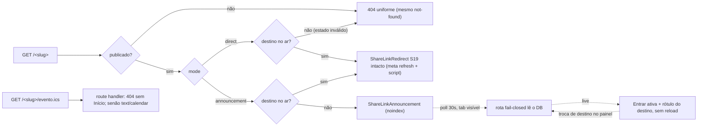

# Impl: Link de compartilhamento com destino trocável e página de anúncio da atividade

Status: aprovado
Atualizado em: 2026-09-23
Issue: #1268
Intenção: docs/plans/link-compartilhamento-destino-trocavel-anuncio.md
Appetite restante: herdado (~2–3 dias eng) — cortes explícitos desta fatia: sem componente admin custom (o "Destino no ar" vira checkbox nativo por linha), sem ETag/304 no `.ics`, sem SSE, sem agenda pública/analytics/UTM, sem PII/Consent novo.

## Leitura da intenção

- **Outcome:** qualquer `jorgesolla1313.com.br/<slug>` pode virar página de anúncio (título, imagem, data/hora Bahia, local, "Entrar" desativado, agenda, compartilhar) configurada pelo painel; a equipe troca o destino "no ar" sem digitar URL; com destino no ar o link volta a levar direto (S19), e quem já está na página vê o botão ativar em ~1 min sem recarregar. Nada hardcoded para 03/10.
- **O que NÃO negociar:** contrato de URL inalterado (1 segmento na raiz); comportamento dos links S19 existentes idêntico; fail-closed (despublicado → 404 uniforme, noindex, destino só `http`/`https`, modo direto sem destino no ar recusado no formulário); sem Consent/PII (não há pessoa); sem analytics/UTM; virada é decisão humana; corpo da página não é CMS; fuso `America/Bahia`, duração padrão 2h.
- **O que reavaliar (e fica registrado):**
  - O `select` "Destino no ar" da cena 05 do design não é nativo no Payload (`SelectField.options` é estático; `filterOptions` só reduz no servidor). **Trigger (b) resolvido com o `designer` (tier primário, certificado):** a cena 05 foi estendida para checkbox "Destino no ar" por linha do array (linha marcada em destaque; nenhuma = pré-transmissão; apenas um no ar) — o storage é o flag `live` na própria linha, sem id órfão. O artefato é a fonte de verdade do port.
  - A URL do arquivo `.ics` não está fixada pela intenção; decidida em D2 como `/<slug>/evento.ics` (subpath do próprio slug, rota estática irmã de `[category]`).
  - A copy do estado desativado é proposta; o design manda ("A transmissão ainda não começou." / "A transmissão começou.").

## Abordagem recomendada

**Opções consideradas (decisões caras):**

- **D1 — como escolher o "no ar":** A) `select` + `liveDestinationId` (id da linha) com componente admin custom (`useField`/`useAllFormFields`); B) collection nova `shareLinkDestination` + relationships; C) checkbox `live` por linha do array `destinations`. **Recomendação: C** — decidido pelo `designer` no trigger (b) e certificado na cena 05 estendida: nativo (o repo só tem 2 componentes de campo admin, ambos para algo sem equivalente nativo), sem id órfão (duplicar documento/copiar/remover linha não quebra nada — o flag viaja com a linha), e entrega a mesma ação do dia: marcar um + salvar; nenhum = pré-transmissão. **Rejeitadas:** A — armazenar id de linha cria classe de bug (duplicate/copy/delete) e acopla o form state interno do Payload, com custo de componente + e2e admin; B — collection nova (access, grupo, tela, migration) para um pool que pertence a um único link, overkill; ambas rejeitadas por robustez/appetite, não por impossibilidade.
- **D2 — URL do `.ics`:** A) `src/app/(frontend)/[type]/evento.ics/route.ts` → `/<slug>/evento.ics` (segmento estático irmão de `[category]`; estático vence o dinâmico, sem colisão com a listing); B) `/api/share-link/<slug>/evento.ics`; C) Blob gerado no cliente. **Recomendação: A** — fica no namespace do slug, com `Content-Type`/`Content-Disposition` no servidor e 404 fail-closed para link sem data; o manifest já cobre `src/app/(frontend)/[type]`. **Rejeitadas:** B — sai do namespace e não ganha nada (fica como fallback se o Next recusar o sibling estático); C — sem URL real, sem header de download para Apple/Outlook/desktop e a garantia de "nunca arquivo vazio" viraria só do cliente.
- **D3 — ativação sem reload:** A) rota pública fail-closed (`GET /api/share-link/<slug>/live`, `no-store`) + poll de 30s por `fetch` (imediato ao montar/voltar à aba visível, pausa em hidden); B) SSE/WebSocket; C) server action pública + poll (molde `getSignatureCount`); D) `router.refresh()`. **Recomendação: A** — o padrão do site é polling; a rota devolve só `{ target }` e não acopla a resposta a RSC. **Rejeitadas:** B — infra inexistente, overkill para ~1 min; C — **medido em e2e**: a resposta de server action faz o Next re-renderizar a árvore da rota e, com o link já no ar, o refresh aplica o redirect no cliente e tira o visitante da página em vez de ativar o botão (além do Fast Refresh de compilação em dev); D — idem C por construção (o refresh puxaria o redirect). A rota mantém a página cacheada; quem chega depois é resolvido no servidor.
- **D4 — compartilhar:** A) menu local `ShareLinkShareMenu` reusando `src/lib/contentShare.ts` + `useCopyFeedback` + `Popover`/`WhatsAppIcon`; B) generalizar `ContentShareButton` com variante de trigger. **Recomendação: A** — o `ContentShareButton` é o botão-ícone de canto do card (1 call site na home) e o design pede um botão rotulado com chevron e popover próprio; a lógica compartilhada (mensagem/link/feedback) já está em lib, então a duplicação é só apresentação. **Rejeitada:** B — mexer no controle da home cujo e2e (`frontend`) **não** roda no PR de alto risco (migration ⇒ curated only), risco sem rede de browser por 2 call sites.
- **D5 — coluna `destination`:** A) dropar depois do backfill (pool é a fonte única; modo direto = destino no ar do pool); B) manter como fonte do modo direto. **Recomendação: A** — a cena 05 não tem campo escalar de destino e duas fontes para a mesma URL é dívida; backfill lossless no up, down lossy por política (precedente `20260811_111828_add_contact_phones_array.ts`). **Rejeitada:** B — exige `admin.condition` extra, `NOT NULL` condicional e deixa o "direct exige no-ar" com duas formas.
- **D6 — header da página:** A) extrair `CampaignPageHeader` de `JinglePageHeader` (brand + badge opcional) e usar nos dois; B) duplicar. **Recomendação: A** — 30 linhas movidas, cobertas pelo e2e curado `frontendJingles` (afirma o badge "Jingles oficiais"); duplicar seria o gêmeo que a doutrina proíbe.

**Recomendação (resumo):** D1-C (certificado pelo designer) · D2-A · D3-A · D4-A · D5-A · D6-A — schema e URL públicos resolvidos agora; sem abstração nova (as libs puras têm ≥1 dono real e testes), sem custom admin.

### Componentes / mudanças

- **`ShareLink` (`src/collections/ShareLink.ts`)** — dono do cadastro. Campos novos (ordem do design): `mode` (`select`, required, defaultValue `'direct'`, label "Modo do link", options "Levar direto ao destino"|"Página de anúncio"); `destinations` (`array`, label "Destinos", `admin.description` "Pré-cadastre os lugares para trocar sem digitar URL no dia. Marque 'Destino no ar' em um único destino; nenhum marcado = pré-transmissão.") com `label` (text, required, "Rótulo"), `url` (text, required, "URL do destino", trim + `validateDestination` existente reusando `SHARE_LINK_DESTINATION_INVALID_MESSAGE`) e `live` (checkbox, "Destino no ar", defaultValue false); `startsAt`/`endsAt` (`date`, "Início"/"Fim", opcionais, `admin.date.pickerAppearance: 'dayAndTime'`, description "Horário da Bahia."/"Opcional. Sem fim, a agenda usa duração padrão de 2 horas.") e `location` (text, "Local", opcional, ex.: "Online"), os três com `admin.condition: (_, siblingData) => resolveShareLinkMode(siblingData?.mode) === 'announcement'` (precedente `AllocationDecision.ts:136`). `destination` **sai**. Hook `beforeValidate` `validateShareLinkConfiguration` (molde `Activity.ts:109-151`, merge `{...originalDoc, ...data}`): >1 `live` → APIError `SHARE_LINK_LIVE_DUPLICATE_MESSAGE`; `direct` sem live → `SHARE_LINK_DIRECT_WITHOUT_LIVE_MESSAGE`; `startsAt`/`endsAt` com fim ≤ início → `SHARE_LINK_EVENT_END_BEFORE_START_MESSAGE` (mesma frase do Activity). `defaultColumns: ['title','slug','mode','published']` e `admin.description` atualizada para os dois modos. Access inalterado (`publishedOrPanelAccess`/`canManagePublishedContent`); docstring S19 atualizada.
- **`src/lib/shareLink.ts`** — dono do contrato puro. `resolveShareLinkMode(value)` (null/desconhecido → `'direct'`), `resolveLiveShareLinkDestination(destinations)` (primeira linha `live` com URL `http`/`https` válida; tipo estrutural, sem importar Payload), `shareLinkIcsPath(slug) => '/<slug>/evento.ics'`, mensagens novas. Nada de I/O.
- **`src/lib/ical.ts` (novo)** — extração dos primitivos `escapeICalText` e `formatICalDate` hoje privados em `src/utilities/calendarFeed.ts:22-26`; `calendarFeed.ts` passa a importar daqui (comportamento pinado por `tests/unit/calendarFeed.unit.spec.ts`). Evita duas implementações de escape.
- **`src/lib/calendarEvent.ts` (novo)** — builders puros de evento: `DEFAULT_EVENT_DURATION_MS` (2h), `resolveCalendarEventWindow(startsAt, endsAt)` (fallback 2h; `endsAt` inválido/≤ início cai no default), `buildGoogleCalendarEventUrl({title, details, location, startsAt, endsAt})` (`calendar.google.com/calendar/render?action=TEMPLATE`, datas UTC `YYYYMMDDTHHMMSSZ`, `URLSearchParams`) e `buildCalendarEventIcs({uid, title, description, location, startsAt, endsAt, updatedAt})` (VCALENDAR de um VEVENT, CRLF, `UID:<slug>@teqo.jorgesolla.com.br`, null sem `startsAt`).
- **`src/lib/campaignTime.ts`** — dono do fuso; novo `formatBahiaEventDateLabel(iso)` → "Sábado, 3 de outubro · 19h" (minutos só quando ≠ 00), ao lado dos formatadores existentes (`formatBahiaDateTimeLabel` etc.).
- **`src/lib/shareLinkAnnouncement.ts` (novo)** — view model serializável para o client (molde `src/lib/jingle.ts`): `ShareLinkAnnouncementView` (`slug`, `title`, `description`, `imageUrl`, `imageAlt`, `eventLabel`, `startsAt`, `endsAt`, `location`) e `buildShareLinkAnnouncementView({ link, imageUrl })`.
- **`src/utilities/shareLinkReads.ts`** — dono das leituras. Novo `loadPublishedShareLinkLiveTarget(slug)`: `payload.find` **sem cache**, `where {slug, published:true}`, depth 0, comentário de justificativa do bypass (exigido pelo `codebaseConventions`), retorno `{ href, label } | null` via `resolveLiveShareLinkDestination`. O loader cacheado (`getCachedPublishedShareLinkBySlug`, tag `shareLinks`) continua sendo o das páginas.
- **`src/app/(frontend)/api/share-link/[slug]/live/route.ts` (novo)** — `GET` fina fail-closed (D3-A): valida `isValidShareLinkSlug`, delega para `loadPublishedShareLinkLiveTarget` com `try/catch` → `{ target: null }` (nunca 5xx nem campo privado), `Cache-Control: no-store` e `dynamic = 'force-dynamic'`.
- **`src/app/(frontend)/[type]/page.tsx`** — dono do slug de 1 segmento. `loadPublishedShareLink` passa a devolver `{ link, live }`; `generateMetadata` inalterado no conteúdo (OG card via `resolveShareLinkOgImageUrl`, noindex, `{}` sem link); no `Page`: `live` → `<ShareLinkRedirect destination={live.href} />` (S19 intacto); announcement sem live → `<ShareLinkAnnouncement view={...} />` com a **URL relativa** do media proxy para renderizar (o absoluto do deployment origin fica só no card OG — mesmo-origem evita depender de `remotePatterns`); direct sem live → `notFound()`.
- **`src/app/(frontend)/[type]/evento.ics/route.ts` (novo)** — `GET` com `params.type` = slug; loader cacheado depth 0; 404 (sem `startsAt`, draft ou slug desconhecido); `Content-Type: text/calendar; charset=utf-8`, `Content-Disposition: attachment; filename="<slug>.ics"`, `Cache-Control: public, no-cache`; corpo por `buildCalendarEventIcs`.
- **`src/components/CampaignPageHeader.tsx` (novo, extraído)** — brand + `badge?: ReactNode` (o atual `JinglePageHeader` generalizado); `jingles/page.tsx` passa `badge="Jingles oficiais"`; a página de anúncio passa `badge="Ao vivo"` (só no estado live). `src/components/jingles/JinglePageHeader.tsx` sai.
- **`src/components/shareLink/ShareLinkAnnouncement.tsx` (novo, client)** — corpo da página (port classe-a-classe do design): wrapper `data-theme="campaign-site"` + `min-h-full bg-(--campaign-cream)` dentro do scroll do `[type]/layout.tsx`; header, card (imagem opcional sem caixa vazia, eyebrow "Transmissão"→"Ao vivo agora", título, descrição, `dl` com `view.eventLabel` + "Horário da Bahia" e local, chip "Destino no ar" quando live), CTA "Entrar" (`<button disabled aria-disabled>` → `<a href>`), aviso, menus, `CampaignFooter`. Estado `live: {href,label}|null`; efeito: poll imediato + `setInterval` 30s com pausa em `hidden` e checagem ao voltar (molde `SignatureCounter.tsx:63-106`); para de atualizar só ao desmontar (troca Meet→YouTube atualiza o href).
- **`src/components/shareLink/ShareLinkAgendaMenu.tsx` (novo, client)** — botão rotulado + `Popover` (design cena 04): "Google Agenda" (`buildGoogleCalendarEventUrl`, nova aba `noopener noreferrer`) e "Baixar arquivo .ics" (`shareLinkIcsPath(slug)`); **não renderiza sem `startsAt`** (nunca arquivo vazio).
- **`src/components/shareLink/ShareLinkShareMenu.tsx` (novo, client)** — botão rotulado + `Popover`: "Compartilhar no WhatsApp" (`buildContentShareWhatsAppUrl('event', title, link)`) e "Copiar link" (`useCopyFeedback` + `buildContentShareLink`); compartilha o link curto com o título.
- **`src/lib/contentShare.ts`** — `ContentShareKind` ganha `'event'` com prefixo `'Participe: '` (mensagem = `Participe: {title} — {link}`); `Record<ContentShareKind,…>` garante exaustividade no typecheck.
- **Migration:** `pnpm migrate:create add_share_link_announcement` (gera `share_link_destinations` com `id varchar PK`, `_order`, `_parent_id`, `label`, `url`, `live`; colunas `mode` enum + `starts_at`/`ends_at`/`location`; drop de `destination`) e **edição à mão**: `INSERT INTO share_link_destinations (id,_parent_id,_order,label,url,live) SELECT gen_random_uuid()::text, id, 0, 'Destino', destination, true FROM share_link WHERE destination IS NOT NULL` **antes** do `DROP COLUMN destination`; `mode` com `DEFAULT 'direct'`/backfill para as linhas antigas (modo null = direct é só defesa). Down lossy por política: restaura `destination` da linha live (fallback `_order 0`) e derruba tabela/colunas. Rodar `pnpm migrate` local e `pnpm generate:types`.
- **Access / Consent:** inalterados — `publishedOrPanelAccess` no read (o `where` publicado é a barreira anônima), `canManagePublishedContent` na escrita; sem Consent/PII novo, sem join com Contact; sem transação multi-collection (escritas são de um doc).
- **UI (Impeccable D):** superfícies = página de anúncio (desktop 1280 e mobile 390, pré e no-ar), menus de agenda/compartilhar e cadastro admin. Port **classe-a-classe** do HTML aprovado (`docs/plans/...-ui-design.html`, cenas 01–05, cena 05 estendida pelo designer no trigger b) usando os tokens de `styles.css:168-196`; ciclo shape→craft→critique→polish na fase 2, com a crítica final do `designer` (tier primário) **CERTIFICADA**. Admin é formulário nativo Payload (sem navegação paralela): "Destino no ar" é checkbox por linha certificado na cena 05; a densidade da cena usa `row` nativo (Rótulo 30% / URL 45% / checkbox 25%, Slug+Modo 50/50, Início+Fim 50/50), a seção "Dados do evento" é um `collapsible` nativo aberto com helper, e o cabeçalho de cada destino é um `RowLabel` read-only (`src/components/admin/ShareLinkDestinationRowLabel.tsx`, `useRowLabel`) que mostra `01 · Google Meet` + pill "no ar" na linha ativa — o container do array é chrome nativo sem hook de estilo por linha, adaptação aceita na crítica.

### Dados → forma

Não se aplica — a intenção não apresenta dado agregado (sem contagem/analytics); a página mostra horário/local do evento.

## Fases verificáveis

1. **Tracer / schema+server (quota ~1 dia):** libs puras (`shareLink` resolvers/mensagens/`shareLinkIcsPath`, `ical` extraído, `calendarEvent`, `campaignTime` formatter) + unit; migration/collection/hook + `generate:types` + `pnpm migrate` local; `loadPublishedShareLinkLiveTarget` + rota `live` + branch do `[type]/page.tsx` (anúncio ainda sem estilo) + rota `.ics`; atualizar seeds de int/e2e para o shape novo e ver o **S19 redirect/404/kill-switch verde** (regressão). Critério: link direct continua idêntico; anúncio sem live responde 200 sem interstício; `.ics` responde 200/404 certo.
2. **UI (quota ~1 dia):** `ShareLinkAnnouncement` + `CampaignPageHeader` extraído + menus, port classe-a-classe; labels/descriptions/condition do admin; unit dos contratos puros; screenshots 1280/390 contra as cenas (crítica final do designer); a ativação sem reload é coberta pelo e2e; `frontendJingles` verde (header extraído).
3. **Gates (quota ~0.5 dia):** e2e novos em `frontendShareLink`; entradas do manifest; `pnpm gate:fast` (lint+typecheck+unit) + `pnpm test:int` + e2e selecionado (lembrar: PR com migration é alto risco ⇒ curated, que inclui `frontendShareLink`/`frontendJingles`); entrada em `docs/changelog/2026-09-23-s29-link-anuncio.md`; `pnpm push` (PR pronta).

## Rabbit holes / Não escopo (engenharia)

- **Não criar rota raiz nova** (`evento.ics` é subpath sob `[type]`; a raiz é o contrato do slug) nem entrada em `SHARE_LINK_RESERVED_SLUGS` — o drift test varre só segmentos estáticos da raiz de `(frontend)`.
- **Não manter `destination` em paralelo** ao pool (duas fontes) nem usar `push`/edição manual de schema: schema só por migration.
- **Não depender de `revalidateTag` para a ativação**: a página segue cacheada e o poll lê o DB; quem chega depois resolve no servidor.
- **Não mexer no 404 uniforme**: sem `[type]/not-found.tsx`; anúncio sem live é 200; link ausente/rascunho é o not-found padrão do Next.
- **Não trocar a origem da imagem OG** (`resolveShareLinkOgImageUrl` = deployment origin); não usar a URL canônica do global.
- **Não expor `activity` da campanha** (PUB3), nem richText/CMS da página, nem embed/chat/RSVP, nem agendamento automático/expiração, nem analytics/UTM/QR/múltiplos links, nem picker de data customizado em Bahia no admin (fase futura se o time pedir), nem ETag/304 no `.ics`.
- **Não criar arquivo novo em `src/utilities/` top-level** (o `codebaseConventions` pina a lista): a leitura fresca entra em `shareLinkReads.ts`.

## Riscos e mitigação

- **Sibling estático `[type]/evento.ics` recusado pelo Next** → fallback imediato para `/api/share-link/[slug]/evento.ics` (só muda o href do menu; contrato do slug intacto). Verificar no build da fase 1.
- **Shape REST do `shareLink` muda** (some `destination`, entram `destinations`/`mode`): consumidores são só o admin e os testes (int/e2e atualizados); nenhum integrador externo conhecido.
- **Migration irreversível na prática** (drop de `destination`): backfill antes do drop, down lossy documentado no próprio arquivo (precedente `contact_phones`).
- **Poll + cache**: ativação nunca depende do cache; chegada pós-live depende do contrato de tag já provado pelo e2e de kill-switch do S19. Falha de poll é tick perdido (silencioso), e a rota nunca devolve 5xx nem campo privado.
- **Fuso do admin**: o picker nativo mostra o fuso do browser; a página sempre formata em Bahia (descrição "Horário da Bahia."). Se o time pedir lock, é follow-up.
- **Manifest drift**: entradas novas — `src/components/shareLink`, `src/components/CampaignPageHeader.tsx` (→ também `frontendJingles`), `src/app/(frontend)/api/share-link` e `src/lib/calendarEvent.ts`/`src/lib/ical.ts` (esta também em `campaignAgendaFeed`), `src/lib/contentShare` (→ `frontend`); `src/components/CampaignFooter.tsx`, `src/collections/ShareLink.ts`, `src/utilities/shareLinkReads.ts`, `src/app/(frontend)/[type]` e `src/lib/shareLink*` já estão mapeados.
- **Sem risco de PII/Consent** (não há pessoa) e sem novo write multi-collection.

## Aceite de engenharia

- [ ] Aceite de produto da intenção ainda coberto (modo por link; pool com rótulo; direct sem no-ar recusado; anúncio com data/local; Entrar desativado→ativo ~1 min; agenda Google+.ics com data e sem data esconde o botão; compartilha o link curto; despublicado 404; nada hardcoded para 03/10)
- [ ] Invariantes AGENTS/engineering-standards (URL pública intacta; S19 sem mudança de comportamento; fail-closed/noindex; sem Consent/PII; schema só por migration `push:false`; `overrideAccess` documentado; lib→utilities→components→app; pt-BR em copy, inglês em identificador)
- [ ] Testes de domínio previstos (unit/int) onde access/write paths mudam — obrigatórios: unit `shareLink` (modo/live/`shareLinkIcsPath`), unit `calendarEvent` (Google/ICS/2h), unit `shareLinkAnnouncement` (view model), unit `contentShare` (`event`); int `shareLink` (hook cross-field com mensagens, loader publicado, live target fail-closed). Discricionários: admin e2e do checkbox; ETag do `.ics`. E2E obrigatório estendendo `frontendShareLink`: página de anúncio 200/noindex/sem refresh, `.ics` 200/404, redirect pós-live, e a regressão S19 (redirect/meta/no-JS/404/republicação) — o spec já é do conjunto curado. A **ilha de ativação** é coberta por e2e (client real, prod e dev) em vez de unit jsdom.

## Self-score (decision-quality)

1. **Decisões caras com rejeitadas:** 5 — D1 (A/B/C), D2 (A/B/C), D3 (A/B/C), D4 (A/B), D5 (A/B), D6 (A/B), todas com recomendação e porquê.
2. **Cabe no appetite:** 4 — ~2–3 dias com tracer cedo e cortes explícitos (sem custom admin/SSE/ETag); o teto é a extração do header + rota `.ics` + 3 libs puras, todos pequenos e testáveis.
3. **Rabbit holes nomeados:** 5 — rota raiz/reserved slug, duas fontes de destino, ativação via cache, 404 uniforme, origem OG, agenda/CMS/analytics, lista pinada de utilities.
4. **Reusa shells/helpers:** 5 — `shareLinkReads`, `calendarFeed`/primitivos iCal, `campaignTime`, `CampaignFooter`, padrão de polling, `contentShare`/`useCopyFeedback`/`Popover`, `CampaignPageHeader`; nenhuma abstração nova com <3 call sites.
5. **Intenção satisfeita:** 5 — todos os bullets do aceite mapeados em componentes/fases/testes, incluindo a questão em aberto aprovada (B: link volta a levar direto).

Média 4.8/5 — plano aprovado no modo `--auto`.

## Débitos triados (review do PR #1280)

- **Folding RFC 5545 (75 octets) no `.ics`** — registrado como **#1281** (`S29-FOLLOWUP`, kind chore, P3): owner `src/lib/ical.ts`, 2 call sites (`lib/calendarEvent.ts`, `utilities/calendarFeed.ts`).
- **`importMap.js` tracked apesar do OPS99** — descartado: dívida pré-existente do `main`, classe já rastreada em #772/#791 + postmortem 2026-09-12; reavaliar `git rm --cached` quando o guard do #772 fechar.
- **Rate limiting da rota `live`** — deferido: gatilho = pico anômalo de requisições na rota (mitigação barata: cache in-memory de 5–10s no loader).
- **Settle dev-only de 6s no e2e `frontendShareLink`** — deferido: gatilho = primeira flake local do spec (trocar por condição observável); o SQL cru é deliberado e documentado (isola a race de revalidação/HMR).
