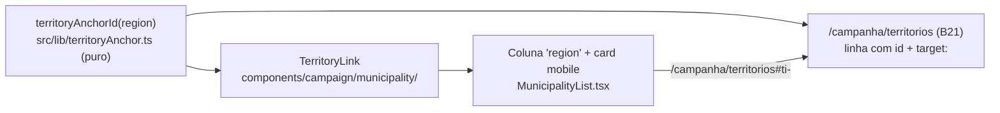

# B25 — Link do território na lista de municípios

Status: entregue
Atualizado em: 2026-07-26
Item do roadmap: [docs/roadmap.md](../roadmap.md) (Trilha B — superfícies de coordenação, item B25; entrada da página entregue por B21)
Impeccable: B — encaixe na célula "Território" da lista existente (`MunicipalityList`), mais o `id` de âncora nas linhas da tabela do B21
Appetite: ~0,25 dia eng; sem migration, sem collection, sem server action, sem loader novo — uma célula vira link, um helper puro e um `id` por linha
Responsável: —

## Design (Impeccable)

Âncoras: `PRODUCT.md` (princípio 2 — a tela leva à decisão seguinte; anti-goals §5) / `DESIGN.md` (register `product`, Field Desk) · tema `data-theme='campaign'` · sistema de listas do Pass 2 W1 (`CampaignTable` + colunas como dado) · precedente de âncora com destaque em `/campanha/conceitos` (`scroll-mt-6 target:bg-muted/50`).

Na implementação (`implement-roadmap-item`): craft compacto → critique → polish. Sem `harden`/`optimize` (nenhuma escrita, nenhuma query nova, nenhum dado sensível).

Brief compacto:

- **Persona / contexto:** Coordenador ou assessor varrendo `/campanha/municipios`; lê "Sertão Produtivo" na coluna Território e quer saber o peso e a cobertura daquele território antes de decidir se remaneja carteira ou giro. Hoje precisa sair pelo sidebar e reencontrar a linha na tabela dos 27.
- **Job principal:** do município para o território em um clique, sem perder a comparação regional.
- **Estratégia de cor:** Restrained. Link no mesmo padrão do nome do município (sublinhado no hover, `text-primary` só onde já é o padrão da célula); o realce no destino é o `target:` neutro do precedente, não uma cor nova.
- **Edit where you see:** **não** — TI não é entidade editável (malha estática em `bahiaTerritories.ts`); a affordance aqui é navegação de leitura.
- **Anti-goals:** linha inteira clicável (a lista já tem controles editáveis do coordenador na mesma linha); segundo estilo de link na tabela; badge/ícone extra na célula só para anunciar que é clicável.

## Dados → decisão → apresentação

- **Vou apresentar dados?** **Não (N/A)** — este item não calcula, agrega nem exibe número novo; é navegação entre duas superfícies existentes. Os dados do destino são os do rollup do E17 ✓ já renderizado pelo B21.
- **Decisão que a navegação serve (contexto, não dado novo):** coordenador — "este território está descoberto o bastante para eu remanejar carteira/giro?" — respondida pela página do B21, que este link torna alcançável do lugar onde a pergunta nasce.
- **Anti-goals de dado:** não repetir números do TI dentro da célula da lista (tooltip com agregados regionais = superfície de dado nova, fora deste appetite e do escopo do B22/B23).

## Contexto

Na lista `/campanha/municipios` a coluna "Território" é texto morto: em `src/components/campaign/municipality/MunicipalityList.tsx` a definição de coluna `region` tem `cell: (municipality) => municipality.region`, e no card mobile o território aparece dentro de `formatMunicipalityGeographyLabel(...)` como parágrafo. A única coisa que se pode fazer com o território ali é usá-lo como **filtro** (Popover do header, B16 ✓).

A navegação inversa já existe e é assimétrica: em `/campanha/territorios` (B21 ✓), cada linha de TI linka para `/campanha/municipios?region=<TI>` (rollup herdado do E17 ✓). Ou seja, do território se chega aos municípios, mas do município não se chega ao território.

O pedido (2026-07-25) fecha essa assimetria: clicar no território da lista deve levar à página daquele território. A superfície de comparação dos 27 TIs é o **B21** (`/campanha/territorios`), que **exclui explicitamente** uma rota de detalhe por TI ("o drill continua sendo a lista de municípios filtrada"). Este item é, portanto, a entrada de navegação para a página do B21 — não uma tela nova.

## Objetivos

- **Célula "Território" vira link** na tabela desktop de `/campanha/municipios`, apontando para a linha daquele TI em `/campanha/territorios`.
- **Card mobile** ganha o mesmo destino no trecho de território da linha de geografia (sem quebrar o sufixo "· ZE N" das zonas de Salvador).
- **Linhas do B21 ganham `id` de âncora** e realce de chegada, no precedente de `/campanha/conceitos` (`scroll-mt-*` + `target:bg-muted/50`) — quem chega pelo link sabe onde caiu.
- **Um único cálculo de âncora** compartilhado pelas duas pontas (helper puro), para o link e o `id` nunca divergirem.
- Alvo de toque `min-h-11`, sem novo tab stop além do próprio link, sem linha clicável.
- Guardrails: sem migration, sem collection, sem `Consent`, sem server action, sem query nova; nenhuma mudança no contrato de URL da lista de municípios (B15/B16/B18 congelados).

## Decisões travadas

- **Destino = página dos TIs (B21) ancorada na linha do território, não rota de detalhe `/campanha/territorios/<slug>`.** O B21 rejeitou a rota de detalhe em 2026-07-25 e nada mudou desde então: um "detalhe de TI" seria a linha do rollup + a lista de municípios daquele TI — conteúdo que já existe em duas telas (a linha do B21 e `/campanha/municipios?region=<TI>`). Uma terceira superfície duplicaria a leitura regional que o E12 vai enriquecer. **Rejeitado:** rota de detalhe (duplica superfície e reabre um Não escopo recém-decidido, sem evidência nova); link para `/campanha/municipios?region=<TI>` (é a lista onde o usuário já está — auto-loop; e é justamente a direção que o E17 ✓ já cobre no sentido contrário).
- **Âncora (`#`) em vez de filtro (`?region=`) no destino.** A página do B21 existe para **comparar** os 27 territórios; chegar nela filtrada a uma linha destrói o job da tela e ainda deixa o usuário com um chip para limpar. A âncora entrega a linha pedida **dentro** da comparação. **Rejeitado:** `?region=<TI>` (tabela de uma linha; parece tela quebrada e exige um clique de "Limpar" para virar útil); scroll programático em client component (JS para o que `#` + `scroll-mt` resolvem, e sem URL compartilhável).
- **Dependência dura do B21; nada de destino provisório.** Enquanto a página não existir, o link não entra — não vale apontar para o painel do Início (âncora dentro do dashboard) nem deixar o link levar a 404. **Rejeitado:** enviar para `/campanha#territorios` antes do B21 (cria um destino que o B21 vai ter de desfazer no mesmo mês).
- **Âncora derivada do nome do TI por helper puro, não por slug persistido.** Os TIs não têm slug — `bahiaTerritories.ts` os identifica por `name` (é o que o `?region=` já canonicaliza, acento-insensível). Um `territoryAnchorId(region)` sobre o `slugify` existente (`src/lib/slug.ts`) resolve as duas pontas sem tocar em schema. **Rejeitado:** adicionar `slug` aos registros de TI (mudança de dado estático + migração de contrato de URL para ganho zero); usar o nome cru como `id` (espaços e acentos em fragmento de URL).
- **i18n e naming:** identificadores em inglês (`territoryAnchorId`, `buildTerritoryPageHref`, `TerritoryLink`); copy pt-BR (o texto do link é o próprio nome do território; `title`/`aria-label` do tipo "Ver o território Sertão Produtivo").

## Questões em aberto

- **O link também entra no cabeçalho do detalhe do município (e no dossiê E16)?** **Opções:** (A) só a lista nesta entrega; (B) lista + cabeçalho do detalhe; (C) lista + detalhe + dossiê. **Recomendação: A** — a lista é onde o pedido nasceu e onde a varredura acontece; o dossiê é uma peça de impressão (link não imprime) e o cabeçalho do detalhe entra de graça depois, já que o `TerritoryLink` é compartilhado. Registrado em "Adiado com gatilho". _(assumido — validar na primeira demo.)_
- **A célula linkada atrapalha quem usa a coluna como filtro?** **Recomendação:** não — filtrar continua sendo o funil no header (B16 ✓), que é onde o padrão da lista já colocou a ação de filtro; clicar no valor da célula é navegação. Se em uso real a mesa clicar no território esperando filtrar, o sinal é do B16, não deste item.
- **Territórios sem linha correspondente no destino?** **Recomendação:** impossível por construção (o rollup cobre os 27 TIs do catálogo e todo município tem `region` validado contra `bahiaTerritories.ts`); se o `id` não existir, a página abre no topo — degradação aceitável, sem tratamento especial.

## Abordagem proposta

Componentes:

- **`src/lib/territoryAnchor.ts`** (novo, puro/client-safe): `territoryAnchorId(region: BahiaIdentityTerritory): string` (`ti-${slugify(region)}`) e `buildTerritoryPageHref(region)` (`/campanha/territorios#${territoryAnchorId(region)}`). Reusa `slugify` de `src/lib/slug.ts`. Unit test curto garantindo estabilidade e unicidade sobre `bahiaIdentityTerritories` (27 âncoras distintas) — é o pino que impede link e `id` de divergirem.
- **`TerritoryLink`** (novo, em `src/components/campaign/municipality/`): `<Link>` com o nome do TI, `min-h-11`, estilo alinhado ao link do nome do município (`underline-offset-4 hover:underline`), porém em `text-muted-foreground` para manter a hierarquia atual da coluna. **Depth check:** é um wrapper fino de `Link` **com** duas responsabilidades reais (href canônico + rótulo acessível) e 2–3 call sites imediatos (célula desktop, card mobile, futuro cabeçalho do detalhe); se ficar em 1 call site na implementação, inline o `Link` e mantenha só o helper de href.
- **`src/components/campaign/municipality/MunicipalityList.tsx`** (alterado): coluna `region` passa a renderizar `<TerritoryLink region={municipality.region} />`; no card mobile, o parágrafo de geografia usa o link no trecho do território, preservando o sufixo `· ZE N` das zonas (hoje montado por `formatMunicipalityGeographyLabel` em `src/utilities/municipalityLabels.ts` — dividir a formatação em rótulo + sufixo em vez de duplicar a regra).
- **`CampaignTable`** (alterado): prop opcional `rowId` para expor `id` no `<TableRow>` sem duplicar tabelas.
- **`TerritoryList`** (B21, alterado): `rowId` nas linhas `parent` com `territoryAnchorId(row.region)` e classes de chegada (`scroll-mt-*` + `target:bg-muted/50`), no precedente de `src/app/(campaign)/campanha/(app)/conceitos/page.tsx`.
- **Sem migration, sem collection, sem `Consent`, sem server action, sem alteração de loader.**

## Dependências

- **Duras:** **B21** (`/campanha/territorios`) — o destino. Sem ele não há link.
- **Suaves:** **B17** (se a coluna "Território" for ocultável, o link some junto — comportamento correto, nada a fazer). **E12** não é dependência: é o gatilho registrado para revisitar a decisão "âncora vs rota de detalhe" ("Adiado com gatilho").
- Reusa: `src/lib/slug.ts`, `src/lib/bahiaTerritories.ts`, `src/utilities/municipalityLabels.ts`, `src/components/campaign/shared/CampaignTable.tsx`, e o padrão de âncora de `/campanha/conceitos`.

## Não escopo

- Criar a página dos territórios: **B21**.
- Rota de detalhe por TI (`/campanha/territorios/<slug>`): permanece Não escopo do **B21**; reabre só com **E12**.
- Métricas regionais na célula ou em tooltip do território: **E12** (dado) / **B23** (mecanismo de tooltip de célula) — este item não introduz dado novo na lista.
- Link do território no cabeçalho do detalhe do município e no dossiê (E16 ✓): "Adiado com gatilho" abaixo.
- Qualquer mudança no filtro de território do header (B16 ✓) ou no contrato de URL da lista.

## Rabbit holes

- **"Já que a célula é clicável, deixa a linha inteira clicável."** A linha da lista carrega controles editáveis do coordenador (assessores, tendência, votos estimados) — linha-link engole tap e teclado. **Mitigação:** o alvo clicável é só o texto do território, como já é o nome do município.
- **"Aproveita e mostra os números do TI no hover."** Vira superfície de dado nova (denominador, salvaguarda MAUP, quem vê) dentro de um item de 0,25 dia. **Mitigação:** tooltip de célula é capacidade do **B23** e conteúdo é **E12**; aqui, nada além do rótulo.
- **Slug persistido para TI.** "Se vai ter âncora, o TI devia ter slug" abre migração de dado estático + contrato de URL (`?region=` hoje casa por nome normalizado). **Mitigação:** âncora derivada em runtime por helper puro, pinada por teste.
- **Refatorar `formatMunicipalityGeographyLabel` para "componentizar geografia".** **Mitigação:** expor o rótulo em partes (território + sufixo de zona) e parar aí; nada de componente genérico de geografia.

## Adiado com gatilho

- **Link do território no cabeçalho do detalhe do município.** Revisitar quando o `TerritoryLink` existir e alguém pedir a mesma navegação a partir do detalhe (ou na primeira demo do B21) — é encaixe de minutos, não vale ampliar o appetite agora.
- **Voltar a considerar rota de detalhe por TI.** Gatilho: **E12** entregar métricas regionais que não caibam em uma linha da tabela (captura, amplitude, município crítico) **ou** a mesa pedir uma "página do território" em sessão real depois de usar o B21.

## Referências

- `docs/roadmap.md` (Trilha B / "Demais itens abertos", B25; Janela 1–2; cortes seguros)
- [pagina-territorios-identidade.md](pagina-territorios-identidade.md) (B21 — o destino, incl. o Não escopo da rota de detalhe) · [tabela-ti-inicio.md](tabela-ti-inicio.md) (E17 ✓ — rollup e o link inverso) · [camada-territorios-identidade.md](camada-territorios-identidade.md) (E12) · [tooltip-celulas-listas.md](tooltip-celulas-listas.md) (B23 — por que o hover de dado não é deste item)
- `src/components/campaign/municipality/MunicipalityList.tsx` — coluna `region` e card mobile a alterar
- `src/components/campaign/municipality/TerritoryList.tsx` — linhas parent que recebem o `id` de âncora (link inverso para municípios em `TerritoryListColumns.tsx`)
- `src/utilities/municipalityLabels.ts` (`formatMunicipalityGeographyLabel`), `src/lib/slug.ts`, `src/lib/bahiaTerritories.ts` — o que o helper reusa
- `src/app/(campaign)/campanha/(app)/conceitos/page.tsx` — precedente de âncora com `scroll-mt` + `target:`
- AGENTS.md — Campaign auth e acesso por papel (a página destino é staff-only; `leader` nunca vê a coluna), naming (identificadores em inglês, copy pt-BR), sem migration neste item
- `PRODUCT.md` / `DESIGN.md` — Field Desk, anti-goal de dashboard/spreadsheet, hierarquia de links na lista

## Revisão (2026-07-26)

Auditoria pré-implementação: o painel `TerritoryOverviewTable` saiu do Início com o B21 — âncoras e link inverso vivem em `TerritoryList` + seam `rowId` em `CampaignTable`.

## As built (2026-07-26)

- `src/lib/territoryAnchor.ts` — `territoryAnchorId` / `buildTerritoryPageHref`; unit test com 27 âncoras distintas.
- `TerritoryLink` — coluna desktop e trecho de território no card mobile (`municipalityGeographyParts` preserva `· ZE N` fora do link).
- `CampaignTable.rowId` — linhas parent em `TerritoryList` com `id` + `scroll-mt-6 target:bg-muted/50`.
- Escopo A (só lista); detalhe/dossiê permanecem adiados.
