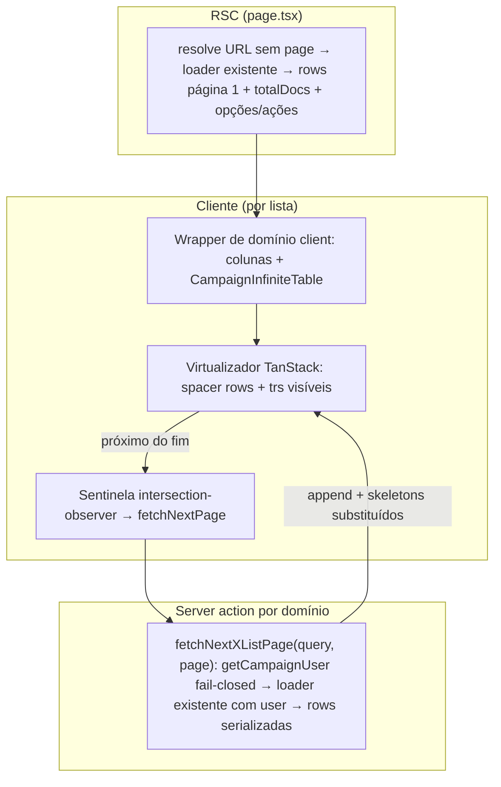

# Impl: Listas de tabela da campanha: scroll infinito virtualizado + controles fixos

Status: entregue (aguardando merge)
Atualizado em: 2026-08-05
Issue: #382
Intenção: docs/plans/lista-municipios-scroll-infinito.md
Appetite restante: herdado (~2–3 dias eng; primitivo compartilhado + 5 listas, sem migration)

## Leitura da intenção

- **Outcome:** as 5 listas de tabela do `/campanha` (municípios, lideranças, dobradinhas, demandas, organizações) viram contínuas — rolar até o fim e as linhas continuam carregando (skeletons otimistas, sem "carregando…") — com omnibox e cabeçalho sempre visíveis, total discreto ao lado do rótulo do filtro, território colado ao nome do município e sem scrollbar interno: o scroll da página é a única superfície de rolagem.
- **O que NÃO negociar:** acesso por papel preservado na carga incremental (assessor só vê seus municípios; `leader` não chega nessas telas — lockdown); editores de célula inline funcionando nas 5 listas; lista mobile (cards) intocada em comportamento; coorte `apoiadores`/`atividades`/`assessores` mantém paginação; nada de novo `Consent`/PII; filtros/ordenação/seletor de colunas com o mesmo padrão.
- **O que reavaliar:** a hipótese de "um único upgrade da camada compartilhada". As células de `CampaignTable` são `ReactNode` montados em servidor — linhas anexadas no cliente **não podem** passar por elas. A mudança é um primitivo novo de renderização client-side + módulos de coluna por lista, não um patch no componente existente. Page size real é **25**, não 20. B158 já moveu o território para baixo do nome em municípios (o que falta é a geometria do alvo de toque, §Componentes) e já declara thead sticky em municípios — hoje inerte (§Decisão 5).

## Abordagem recomendada

**Opções consideradas:**

- **A) Primitivo client novo (`CampaignInfiniteTable`) + server actions por lista reutilizando os loaders existentes + TanStack Virtual + react-intersection-observer.**
- B) TanStack Virtual + TanStack Query `useInfiniteQuery` + rota API JSON.
- C) `react-virtuoso` (infinite scroll out of the box).
- D) Converter `CampaignTable` em componente client e migrar os 8 consumidores.
- E) Sem virtualização: append progressivo de todas as linhas (listas ≤435 docs).

**Recomendação: A** — mantém o transporte de dados que já existe (server actions/Local API com `user`, view models serializados), não introduz camada de cache client-side, e o primitivo headless não compete com o design system. É a opção A da própria intenção (assumida lá), validada contra o código.

**Rejeitadas:**

- **B** porque TanStack Query só se justificaria com plano de migrar `/campanha` para dados client-first (não existe); adicionaria cache/invalidação paralelos ao RSC.
- **C** porque react-virtuoso é mais pesado e impõe estrutura própria de DOM/scroller — conflita com o requisito de o scroll da página ser a única superfície e com o sistema de sticky existente.
- **D** porque `CampaignTable` (server) segue servindo a coorte paginada (`apoiadores` via `SupporterList`, `territórios` via `TerritoryList`), que fica fora deste item por decisão de produto; converter forçaria migrar colunas de 3 superfícies fora de escopo agora.
- **E** porque o aceite e o canvas pedem virtualização ("só as linhas visíveis existem na tela"); 435 linhas × células com popover/editor/drawer pesam em tablet.

### Decisões de engenharia

**D1 — Transporte das próximas páginas: server action por domínio reutilizando o loader.**
Opções: (a) server action por lista recebendo a query canônica + página; (b) route handler JSON genérico; (c) `useInfiniteQuery` + API.
Recomendação: (a) — `fetchNextXListPage(query, page)` em cada módulo de actions do domínio faz o parse da query com o mesmíssimo parser da URL (`parseXListParams`), chama o loader existente com `user` (acesso idêntico ao da página, `overrideAccess: false`) e devolve `{ status, rows, totalDocs, hasMore, extras? }`. Sem sessão → `{ status: 'error' }` (fail-closed; a lista exibe linha de erro discreta com retry). Rejeitadas: (b) duplicaria auth/parse fora do padrão de actions da área; (c) ver opção B acima.

**D2 — Acúmulo client-side e reset por assinatura.**
Opções: (a) estado client `initialRows + páginas anexadas`, resetado quando muda uma `signature` (href canônico sem `page`, fornecida pelo servidor); (b) remontar o componente via `key` no RSC.
Recomendação: (a) — reset determinístico quando filtro/ordenação mudam (navegação `router.replace` do `useCampaignListFilterNavigation`), sem depender de reconciliação de `key`; primeira montagem não pula o scroll. `router.refresh()` disparado por editores de célula re-alimenta só a página 1; linhas anexadas mantêm estado local (os autosave via `useCampaignCellAutosave` já adotam o valor salvo da resposta — sem regressão). Rejeitada: (b) perderia menos estado, mas a remontagem por `key` interage mal com transições pending e sheet providers.
**Limitação conhecida (v1):** `LeadershipContactFieldControl` chama `router.refresh()` após salvar; numa linha de página 2+, a UI derivada (ex.: link de WhatsApp) só atualiza no próximo reload de filtros. Barato de revisitar junto com B160 (serialização de mutações).

**D3 — Virtualização dentro de `<table>` real: spacer rows.**
Opções: (a) `<table>` + 2 `<tr>` espaçadores (altura = offset do virtualizador) + `<tr>`s reais medidos (`measureElement`); (b) trocar para grid de divs com roles ARIA; (c) `tbody` com padding (não confiável em display table).
Recomendação: (a) — preserva semântica, `ui/Table`, sticky-left de municípios (B158) e os seletores existentes. Rejeitada: (b) reescreveria a superfície (anti-goal "não virar spreadsheet mode" e apetite). Alturas dinâmicas (chips que quebram linha) são resolvidas por ResizeObserver do próprio TanStack Virtual; `estimateSize` conservador + overscan ~8. **Print:** hook `matchMedia('print')` desliga a virtualização e renderiza todas as linhas carregadas (preserva o padrão E16).

**D4 — Elemento de scroll: o scroller da shell, nunca um novo.**
O scroll das páginas campanhadas acontece em `CampaignContentScroll` (`data-slot="campaign-content-scroll"`, layout `(app)`). O virtualizador faz `closest('[data-slot="campaign-content-scroll"]')`; a sentinela usa esse elemento como `root` com `rootMargin` inferior (~600px). Sem fallback de scroller próprio: criar um violaria o aceite ("scroll da página é a única superfície"). Se o scroller não existir (defensivo), renderiza sem virtualizar.

**D5 — Sticky chrome: controles fixos + thead logo abaixo, via variável CSS medida.**
Opções: (a) o primitivo dono das duas faixas: barra de controles sticky (`top: 0`, fundo opaco) medida por ResizeObserver → `--campaign-list-controls-height` na raiz; `thead` sticky com `top: var(--campaign-list-controls-height, 0px)`; (b) componente de chrome separado + thead com `top` fixo; (c) sticky apenas com CSS e `top` hardcoded.
Recomendação: (a) — a altura da omnibox varia (chips quebram linha); um módulo profundo dono do assunto. Rejeitadas: (b)/(c) quebram com omnibox de 2 linhas ou divergem por lista.
**Correção do scroller de tabela (o "scrollbar interno que rola quase nada"):** o wrapper `ui/Table` deixa de ser scroller — nada de `overflow-x-auto` herdado; a nova moldura usa `overflow-x-clip` + `overflow-y-visible` (clip não cria scroll container), então o sticky resolve contra o `CampaignContentScroll` e o scrollbar horizontal residual desaparece. Isso também **ativa** o thead sticky declarado por B158 em municípios (hoje inerte porque `overflow-x-auto/hidden` cria scroll container). Custo: overflow horizontal largo é clipado, não rolado — municípios já resolve largura com colunas responsivas por container query (B158); as demais listas serão verificadas na fase craft (persona desktop/tablet + seletor de colunas disponível); se alguma estourar de fato, esconder colunas por container query no mesmo padrão local de B158 — nunca reintroduzir scroller.

**D6 — `?page=` sai do contrato de URL das 5 listas (opção A da intenção).**
`parse` ignora `page`; a serialização canônica nunca o emite; nos três domínios com `resolveListUrl` (municípios, lideranças, dobradinhas) a segunda passada (clamp por `totalPages`) deixa de existir. URLs antigas com `?page=N` recebem o redirect canônico que remove o parâmetro (comportamento já existente para params desconhecidos). `CampaignListFooter`/`CampaignListPagination` permanecem para a coorte paginada. Estados guardam `page: 1` constante (tipo `ListStateWithPage` compartilhado com assessores), nunca serializado.

**D7 — Total no topo, ao lado do rótulo do filtro.**
`CampaignListOmnibox` ganha `totalLabel?: string` renderizado discreto dentro do `<label>` ("Filtrar municípios · 435"). As 5 `*Filters` recebem `totalDocs` da página. Valor vem do RSC; durante o pending de filtro o número anterior esmaece junto (padrão do `data-pending` existente) — refletindo os filtros ativos após a navegação, como pede o aceite.

**D8 — Território colado ao nome (municípios): geometria do alvo de toque.**
O território já está na segunda linha (`MunicipalityList` L292–294, entregue por B158); o afastamento vem do `min-h-11 py-2` do link do nome (caixa de 44px para ~20px de texto). Correção: manter alvo ≥44px expandindo a área clicável com pseudo-elemento (`after:absolute` com inset vertical) e soltar a altura mínima visual do texto — o toque continua garantido e o território encosta no nome. Decisão final de craft (fase 2), pinada pelo aceite + teste visual E2E.

### Componentes / mudanças

**Novos:**

- **`CampaignInfiniteTable`** (`src/components/campaign/shared/CampaignInfiniteTable.tsx`, `'use client'`): o primitivo — barra de controles sticky + medida da altura → variável CSS, `CampaignListResults` interno (dim no pending), `<table>` virtualizado com spacer rows, skeletons de linha (contagem = `min(pageSize, restantes)`; substituem as linhas ao chegar — sem texto "carregando"), sentinela + `fetchNextPage`, linha de erro discreta com retry, reset por `signature`, bypass de print, estado vazio (`empty` prop, mesmo padrão atual). Slots: `controls` (omnibox) e `resultsHeader` (opcional, acima da tabela — municípios usa para a seção de cards mobile, que continua renderizando as linhas acumuladas).
- **5 wrappers de domínio client** (colunas saem de servidor para cliente — recebem opções/ações/flags serializadas, como a página já faz hoje):
  - `MunicipalityList` vira client (já recebe props serializadas + ações; verificar imports server-only na conversão) e adota o primitivo; cards mobile intactos como `resultsHeader`.
  - `src/components/campaign/leadership/LeadershipListTable.tsx` (colunas hoje inline em `liderancas/page.tsx`).
  - `src/components/campaign/stateDeputy/StateDeputyListTable.tsx` (idem `dobradinhas/page.tsx`).
  - `src/components/campaign/demand/DemandListTable.tsx` e `src/components/campaign/organization/OrganizationListTable.tsx` (read-only).
- **5 server actions** `fetchNextXListPage(query, page)` nos módulos de actions existentes dos domínios (municípios: `src/app/(campaign)/campanha/(app)/municipios/municipalityStaffFormActions.ts` ou módulo irmão; demais: `actions/*.ts` dos domínios). Municípios devolve também `leadershipNamesById` da página (o wrapper acumula o mapa client-side para os chips de lideranças).

**Modificados:**

- As 5 `page.tsx`: sem `CampaignListFooter`; montam o wrapper de domínio com `initialRows`/`totalDocs`/`signature` (= href canônico) e a action de próxima página.
- `CampaignListOmnibox` (+ as 5 `*Filters`): `totalLabel`.
- URL utils dos 5 domínios (`municipalityListUrl`, `leadershipListUrl`, `stateDeputyListUrl`, `demand/demandListUrl`, `organization/organizationListUrl`): `page` fora do parse/serialização; `buildXListHref` perde o parâmetro de página; fim da segunda passada com clamp (call sites: 3 páginas + `campaignHomeActions`).
- `MunicipalityList` célula do nome: geometria do link (D8).
- `ui/Table`: nenhuma mudança — o primitivo novo usa `Table` com `containerClassName` sem scroller (JSDoc do `containerClassName` já prevê o caso sticky).

**Migration:** nenhuma. **Access / Consent:** D1 fail-closed; nenhum novo Consent. **UI:** Impeccable B — shape (este plano) → craft (sticky, skeletons, geometria do nome, clip vs largura) → critique → polish. Tokens `data-theme='campaign'`; shells existentes (`CampaignPageShell`, `CampaignListSheetProvider` onde já existe).

### Dados → forma (se aplicável)

N/A — é o mesmo total filtrado de hoje, deslocado do rodapé para o rótulo do filtro (pergunta 3 de data-presentation: nenhuma métrica nova, nenhuma forma nova).

## Fases verificáveis

1. **Tracer — demandas (read-only, a mais simples) de ponta a ponta.** Primitivo `CampaignInfiniteTable` + `DemandListTable` + `fetchNextDemandListPage` + URL sem `page` + `totalLabel` + sticky. Validar no browser real: scroller da shell como root, sticky das duas faixas com omnibox de 2 linhas, skeletons, sentinela, reset por filtro, print. (~40% do appetite)
2. **Organizações** (mesmo molde read-only) + correções que o tracer revelar. (~10%)
3. **Listas interativas:** lideranças e dobradinhas (extração de colunas, `CampaignListSheetProvider`, editores de célula funcionando sobre linhas virtualizadas — inclusive página 2+) e municípios (cards mobile como `resultsHeader`, mapa de nomes de lideranças acumulado, geometria nome/território D8, colunas responsivas B158 convivendo com virtualização). (~35%)
4. **Contrato de URL + testes:** unit specs (`leadershipListUrl`, `stateDeputyListUrl`, `municipalityList`, `campaignEntityListParsers`, `campaignHomeActions`) atualizados para o contrato sem `page`; novos units (parse de query na action, fail-closed sem sessão, contagem de skeletons, reset por signature); E2E `campaignSavedFilters` (único que usa `?page=2`) + smoke de scroll/sticky nas listas; rodar E2E de municípios/lideranças existente. (~15%)
5. **Gates:** `pnpm gate:fast` na iteração; entrega com `pnpm push` (gates completos do AGENTS.md, incluindo knip/ciclos).

## Rabbit holes / Não escopo (engenharia)

- Migrar a coorte paginada (`apoiadores`, `atividades`, `assessores`, `territórios`) — o `CampaignTable` server continua deles; migração futura se o padrão validar (decisão de produto da intenção).
- TanStack Query / camada de cache client-side.
- Restauro de posição de rolagem na URL (opção A da intenção).
- Indicador de "fim da lista" (opção A da intenção: silêncio; o total no topo fecha a conta).
- Reescrever `CampaignListFooter`/`CampaignListPagination` (seguem usados) ou o sistema de filtros/ordenação/seletor de colunas.
- "Completar" a abstração para todas as listas antes de validar o padrão.

## Riscos e mitigação

- **Sticky vs scroll containers (CSS):** `overflow-x-clip`/`overflow-y-visible` e sticky resolvido contra o scroller da shell precisam de verificação em Chromium, Firefox e WebKit (iPad — persona). Mitigação: tracer valida primeiro; fallback por lista é esconder colunas por container query (nunca reintroduzir scroller).
- **Medição de `<tr>` com altura dinâmica (chips):** TanStack Virtual mede via ResizeObserver, mas `<tr>` pode ser caprichoso. Mitigação: `estimateSize` conservador + overscan; se a medição falhar em algum browser, fallback é estimativa fixa por lista (regressão visual menor, função preservada).
- **`router.refresh()` de editores de célula re-alimenta só a página 1** (D2): limitação registrada; autosave cells não são afetadas; B160 (#378, ainda `ready`) é o lugar natural de revisitar. Coordenar review se B160 sair em paralelo.
- **Bundle client:** colunas das 5 listas + TanStack Virtual viram JS client. Área interna autenticada; First Load menos crítico. Monitorar no build; primitivo pode ser lazy se necessário.
- **Municípios com sort derivado:** cada append reexecuta o caminho de load-all (~435 docs) — mesmo custo por página que hoje; sem regressão.
- **Cards mobile + sentinel:** a sentinela fica após o conteúdo (cards e tabela), então o carregamento incremental funciona nas duas apresentações; a virtualização é inerte enquanto a tabela está oculta (auto-corrige ao redimensionar).

## Aceite de engenharia

- [x] Aceite de produto da intenção coberto (5 listas contínuas, controles fixos, total no topo, território colado, sem scrollbar interno, células inline funcionando, acesso por papel na carga incremental, estado vazio, skeletons otimistas)
- [x] Invariantes AGENTS/engineering-standards: Local API com `user`/`overrideAccess: false` nas actions; fail-closed sem sessão; nenhum Consent novo; identificadores em inglês / copy pt-BR; sem migration (não há schema)
- [x] Testes: contrato de URL sem `page` pinado; actions fail-closed; reset por signature; E2E de scroll/sticky + suíte existente de listas verde

## Adiado com gatilho (triage confirmado pelo humano em 2026-08-05)

- **S1** variante page-only dos loaders (append hoje re-executa facets/scope; municípios re-executa o full-scan no sort derivado — mesmo custo por página que a paginação já pagava). Gatilho: catálogo crescer ou 4ª lista adotar o primitivo.
- **S2** teto do estado acumulado no mount. Gatilho: lista > 5k rows.
- **S3** `scrollIntoView`/overscan p/ tab rápido além da janela virtual. Gatilho: auditoria a11y ou relato real.
- **S4** print via `beforeprint`+`flushSync` (Firefox). Gatilho: relato de impressão no Firefox.
- **S5** consolidar `CampaignTable` × `CampaignInfiniteTable`. Gatilho: decisão de produto de migrar a coorte paginada (apoiadores/atividades/assessores/territórios).

## Explicitamente fora

- S6 (tipo de erro re-escrito em `MunicipalityListNextPageResult`) — descartado (rename de pureza, score 1).
- S7 (`resolveListUrl.totalPages`/`page` "mortos") — descartado: falsos positivos, vivos na coorte paginada.
- S8 (flake do e2e B32/B34 de lideranças sob cold-compile) — pré-existente em main (baseline falhou igual); bug separado só se pedido.

## Validação realizada

- Browser real (Chromium, 1280px e ~1500px): append por scroll nas 5 listas; sticky omnibox+thead sem bleed-through; total ao lado do rótulo refletindo filtros; reset de scroll no filtro; empty state; território colado ao nome; editores inline funcionando em linha anexada; POSTs das server actions observados no network.
- Gates: tsc; lint `--max-warnings=0`; prettier; madge 0 ciclos; unit 174 arquivos; int 75 (1 flake conhecido `testDatabaseLease`, verde no rerun); e2e alvo verde exceto B34 (flake pré-existente; main baseline idem).
