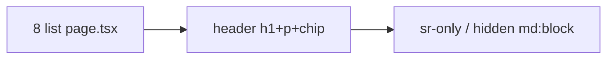

# Listas mobile — ocultar título, subtítulo e chip de escopo

Status: ready
Atualizado em: 2026-08-01
Issue: #205
Priority: P1
Model: composer-2.5
Impeccable: B — chrome das list pages (não UI nova)
Appetite: ~0,5–1 dia eng; `hidden md:*` / shell compartilhado leve; sem migration
Responsável: —

## Design (Impeccable)

Âncoras: `PRODUCT.md` (Clarity under pressure) / `DESIGN.md` · tema `campaign` · sidebar já nomeia a área.

Na implementação: craft compacto → critique → polish (densidade thumb-zone).

Brief compacto:

- **Persona:** staff no celular abre Municípios / Lideranças / etc. — o h1 + parágrafo + chip comem viewport antes dos filtros/cards.
- **Job principal:** cair direto na ferramenta da lista; identidade da página via nav/sidebar/top bar.
- **Estratégia de cor:** Restrained.
- **Edit where you see:** não.
- **Anti-goals:** esconder títulos em **detalhe** / **nova** / **editar**; remover footer “N encontrados”; matar heading no desktop.

### Wireframe (texto)

```text
Mobile (md:hidden)          Desktop (md+)
┌─ Municípios ──────┐       ┌─ Municípios ─────────────┐
│ [filtros/lista…]  │       │ h1 Municípios            │
│                   │       │ subtítulo…               │
│                   │       │ [chip escopo]            │
│                   │       │ [filtros…]               │
└───────────────────┘       └──────────────────────────┘
  a11y: h1 sr-only no mobile OU landmark via document.title.
```

## Dados → decisão → apresentação

Dados: N/A — chrome; o chip de escopo é metadado de access, não KPI de decisão nesta entrega (continua no footer/`md+`).

## Contexto

Pedido (2026-08-01): em mobile, nas listas **municípios, territórios, lideranças, dobradinhas, atividades, demandas, apoiadores, assessores** — remover título, subtítulo e chip de quantos itens/escopo.

Não há `CampaignPageHeader` compartilhado: cada `page.tsx` inlineia `<header>` + `h1` + `p` + às vezes `CampaignScopeBadge` (municípios, apoiadores) ou `Badge` (demandas abertas).

## Objetivos

- Em viewport &lt; `md`, ocultar visualmente h1 + subtítulo + chip de escopo/contagem no **header da list page** das 8 rotas acima.
- Preservar a11y: `h1` permanece no DOM (`sr-only md:not-sr-only` ou equivalente) e/ou `document.title` já suficiente — escolher um padrão e aplicar em todas.
- Desktop inalterado.
- Preferir extrair `CampaignListPageHeader` **só se** reduzir duplicação de verdade (≥3 call sites com a mesma API); senão `className` consistente por página.
- Sem migration / Consent.

## Decisões travadas

- **Só list index das 8 rotas pedidas.** **Rejeitado:** organizações/conceitos “porque é lista”; detalhe/`nova`.
- **Chip = header scope/count apenas** (`CampaignScopeBadge` / badge de abertas no header). **Rejeitado:** esconder `CampaignListFooter` / paginação.
- **Ocultar com CSS responsivo**, não deletar copy do RSC. **Rejeitado:** dois trees condicionais por breakpoint.
- **i18n:** copy existente; ids em inglês se extrair componente (`CampaignListPageHeader`).

## Questões em aberto

- **Demandas: badge “N em aberto” no header** — conta como chip? **Opções:** A) sim, ocultar no mobile | B) manter (é fila, não escopo). **Recomendação:** A — pedido agrupa “chip de quantos itens”; a fila ainda aparece na lista _(assumido — validar)_.

## Abordagem proposta



Componentes:

- Cada `…/(app)/{area}/page.tsx` listado: classes no `<header>` / filhos.
- Opcional: `CampaignListPageHeader` em `components/campaign/shared/` se a assinatura fechar limpa.
- Pin visual/e2e leve opcional: um viewport mobile em municípios sem h1 visível.
- **Migration:** Sem.

## Dependências

- Soft serialize com **B120** (mesma `municipios/page.tsx`) — este item pode landar antes; B120 não reintroduce o header.

## Não escopo

- Densificar filtros/cards de municípios → **B120**.
- Organizações / conceitos / perfil.
- Mudar copy dos subtítulos no desktop.

## Rabbit holes

- **Document.title dinâmico por filtro.** Fora do appetite. **Mitigação:** title de rota estático basta.
- **Bottom drawer título da área.** Não pedido. **Mitigação:** ignorar.

## Adiado com gatilho

- **Organizações na mesma regra.** Revisitar se produto incluir na lista de chrome mobile.

## Referências

- GitHub Issue #205
- `municipios/page.tsx`, `territorios/page.tsx`, `liderancas/page.tsx`, `dobradinhas/page.tsx`, `atividades/page.tsx`, `demandas/page.tsx`, `apoiadores/page.tsx`, `assessores/page.tsx`
- `CampaignScopeBadge.tsx`
- `sistema-listas-campanha.md` — headers duplicados
- PRODUCT.md — Clarity under pressure
