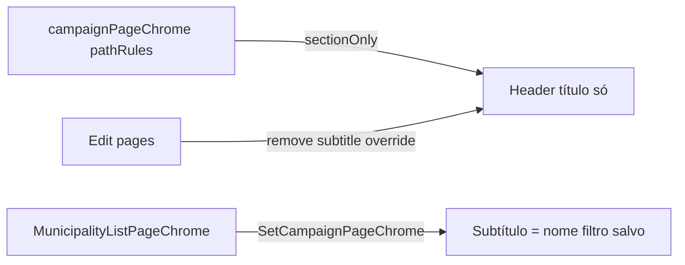

# Impl: Listas `/campanha` — subtítulos curtos (sem prosa; filtro salvo em Municípios)

Status: aprovado
Atualizado em: 2026-08-02
Issue: #283
Intenção: docs/plans/listas-sem-subtitulo-prosa.md
Appetite restante: ~0,5 dia eng (herdado)

## Leitura da intenção

- **Outcome:** Header das listas citadas, Quadro e create/edit estáticos mostram só o título — sem parágrafo de prosa. Em `/campanha/municipios`, quando a URL casa com um filtro salvo (B18), o subtítulo do header passa a ser o **nome** do filtro; a label de resumo duplicada some da barra.
- **O que NÃO negociar:** Organizações, Conceitos, Perfil, Contatos mantêm subtítulos atuais; chips/omnibox como editor de filtro ficam; leader lockdown intocado; não puxar serializador pesado de URL para o layout `(app)`.
- **O que reavaliar:** A label de resumo (`formatMunicipalityActiveFiltersSummary`) ao lado da busca **já foi removida** no B127 (omnibox). O aceite de “sumir a label duplicada” está satisfeito — só garantir que não reintroduzimos resumo visível na barra.

## Abordagem recomendada

**Opções consideradas:**
- A) Apagar `subtitle` no catálogo e manter `pathRules` com `resolveCatalogEntry` — catálogo ainda carrega prosa morta.
- B) **`pathRules` → `sectionOnly(title)`** para rotas no escopo; catálogo limpo nas entradas afetadas; metadata já usa só `title`.
- C) `SetCampaignPageChrome` em cada rota create/edit — duplica o catálogo.

**Recomendação:** B — o dono (`campaignPageChrome.ts`) já resolve chrome por pathname; overrides pontuais só onde o estado é client-side (filtro salvo) ou dinâmico (editar com nome da entidade).

**Rejeitadas:** C (twins); A (prosa morta no catálogo).

### Componentes / mudanças

- **`campaignPageChrome.ts`**: `sectionOnly` nas listas citadas, Quadro, create/edit estáticos; remove prosa das entradas de catálogo afetadas; mantém subtítulos em org/conceitos/perfil/contatos.
- **`MunicipalityListPageChrome.tsx`** (novo): client; `useMunicipalitySavedFilters` + `isSameListHref` (mesmo contrato da sidebar B18); `SetCampaignPageChrome` só quando há match.
- **Edit pages** (`municipios/.../editar`, `atividades/.../editar`): chrome/metadata sem `subtitle`.
- **Migration:** sem migration.
- **Access / Consent:** nenhum.
- **UI:** B — encaixe no chrome B123; sem redesign.

### Dados → forma

- Não há dados novos — só orientação espacial no header.

## Fases verificáveis

1. **Chrome catálogo + edit** — `campaignPageChrome.ts`, edit pages, testes unitários.
2. **Filtro salvo** — `MunicipalityListPageChrome` na página de lista; teste unitário do match.
3. **Gates** — `pnpm gate:fast`; push via `pnpm push`.

## Rabbit holes / Não escopo (engenharia)

- Reescrever subtítulos de Organizações/Conceitos/Perfil/Contatos.
- Subtítulo para URL filtrada ad hoc (só filtro salvo casado).
- Reintroduzir `formatMunicipalityActiveFiltersSummary` visível na barra.

## Riscos e mitigação

- **Acoplamento layout ↔ URL municípios:** `isSameListHref` já é client-safe e usado na sidebar — reusar, não importar `buildMunicipalityListHref` no layout.
- **Regressão E2E filtros salvos:** sidebar + Renomear intactos; só chrome do header muda.

## Aceite de engenharia

- [x] Aceite de produto da intenção ainda coberto
- [x] Invariantes AGENTS/engineering-standards
- [x] Testes de domínio previstos (unit chrome + saved-filter match)
