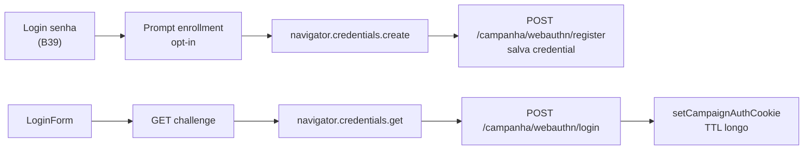

# Login com biometria (WebAuthn) em `/campanha`

Status: rascunho
Atualizado em: 2026-07-26
Item do roadmap: [docs/roadmap.md](../roadmap.md) (Trilha B, item B40)
Impeccable: C — fluxo novo na tela de login + registro pós-primeiro-login; brief compacto
Appetite: ~1,5–2 dias eng; WebAuthn platform authenticator + storage server-side + UI login/perfil; migration leve
Responsável: —

## Design (Impeccable)

Âncoras: `PRODUCT.md` (Field Desk; PWA de campo) / `DESIGN.md` · tema `data-theme='campaign'` · `LoginForm` + shell de auth.

Na implementação (`implement-roadmap-item`): **shape → craft → critique → polish** (fluxo multi-passo; shape compacto basta).

Brief compacto:

- **Persona / contexto:** Assessor no PWA/iPhone com Face ID / Android com digital, depois do primeiro login com senha; quer reabrir o app sem digitar senha a cada sessão curta.
- **Job principal:** no dispositivo já confiável, autenticar com biometria do SO e obter sessão `campaign-token` válida.
- **Estratégia de cor:** Restrained — botão secundário "Entrar com digital / Face ID" abaixo do form; sem branding de "passwordless startup".
- **Edit where you see:** não — auth.
- **Anti-goals:** substituir senha por completo no v1; biometria como único fator sem enrollment consciente; SDK nativo fora do browser; misturar com auth de `/admin`.

## Dados → decisão → apresentação

Dados: N/A — credenciais WebAuthn; nenhum KPI/série/mapa.

## Contexto

Hoje o único caminho de login é senha (`payload.login` → cookie `campaign-token`). **B39** alonga a sessão (checkbox "Lembrar de mim"), mas quando a sessão expira o usuário digita de novo. Em dispositivos com Secure Enclave / StrongBox, o browser expõe **WebAuthn** (`navigator.credentials`) com *platform authenticator* — a UI do SO pede digital/Face ID e devolve uma asserção verificável no servidor.

Pedido de produto (2026-07-26): após o primeiro login, oferecer login com digital nos aparelhos que tiverem leitor.

Não há WebAuthn / passkey / Credential Management de produto no código hoje. O PWA (D1 ✓) é o melhor host (standalone), com as mesmas limitações do Safari iOS (WebAuthn suportado em versões recentes; validar no craft).

## Objetivos

- Após login com senha bem-sucedido **neste dispositivo**, oferecer enrollment opt-in ("Usar digital / Face ID neste aparelho").
- Na próxima visita à tela de login (sessão expirada), se houver credencial local discoverable / allowCredentials, mostrar botão de biometria que completa login sem senha.
- Credenciais amarradas a um `campaignUser`; revogáveis (remover neste dispositivo / remover todas no `/campanha/perfil`).
- Sessão resultante = mesmo cookie `campaign-token` (TTL alinhado a B39: preferir o TTL "lembrar" no login biométrico, pois o dispositivo já é o opt-in de confiança).
- Guardrails: migration para armazenar credenciais; **sem** Consent novo (fator de auth da conta staff/leader já autenticada — não é coleta de PII de apoiador); access: só o dono gerencia as próprias credenciais; `overrideAccess: false` nas mutações com `user`.

## Decisões travadas

- **WebAuthn platform authenticator (passkey/device-bound), não "ler a digital e comparar com hash nosso".** O SO faz a biometria; o app só verifica a asserção. **Rejeitado:** (a) Credential Management API só para autofill de senha (não é feature de produto); (b) armazenar senha cifrada e "desbloquear" com WebAuthn sem asserção server-side (pior modelo); (c) SDK nativo / Capacitor (fora do app Next).
- **Enrollment só depois de sessão senha válida** (ou reset de senha recente). **Rejeitado:** registrar passkey a partir de e-mail mágico sem senha no v1 (explode recovery).
- **Storage server-side das credenciais** (collection ou campo array versionado em `campaignUser`) com `credentialID`, `publicKey`, `counter`, `transports`, label do dispositivo. **Rejeitado:** só `localStorage` (não autentica no servidor); depender só do password manager do browser sem registro nosso (não controlamos UX "Entrar com digital").
- **Login biométrico emite o TTL longo (B39 "lembrar")** — o enrollment no dispositivo *é* o consentimento de confiança. **Rejeitado:** TTL curto no biométrico (derrota o job); exigir checkbox remember no fluxo biométrico.
- **i18n e naming:** `campaignWebAuthn`, `passkey`/`webauthnCredential` nos identificadores; copy pt-BR ("Entrar com digital ou Face ID", "Ativar neste aparelho").

## Questões em aberto

- **Collection nova `campaignWebAuthnCredential` vs array no `campaignUser`?** **Opções:** A) collection join (1:N, admin-visível, delete fácil) | B) array no user. **Recomendação:** A — contadores WebAuthn e revogação por dispositivo ficam limpos; access `create/read/delete` = self. _(assumido.)_
- **Mostrar o botão biométrico antes de digitar o identificador (discoverable credentials) ou depois?** **Opções:** A) botão sempre visível se o browser reportar platform authenticator + há credencial no device | B) só após blur do identificador. **Recomendação:** A com conditional UI (`PublicKeyCredential.isUserVerifyingPlatformAuthenticatorAvailable`).

## Abordagem proposta

Componentes:

- **Lib pura** de challenge/verify (preferir pacote maduro tipo `@simplewebauthn/server` + browser pair — depth: não reinventar CBOR/COSE).
- **Routes / server actions** sob `/campanha`: challenge de registro, registro, challenge de login, verificação → cookie.
- **UI:** `LoginForm` (botão biométrico); banner/dialog pós-login ou toggle em `/campanha/perfil`.
- **Migration:** `pnpm migrate:create add_campaign_webauthn_credentials` (collection ou fields).
- **Testes:** unit dos helpers de verify com fixtures; int do register/login happy path + reject counter replay; e2e condicional (mock de WebAuthn no Playwright).

Depth check: reusa `setCampaignAuthCookie` / `getCampaignUser`; não cria segundo cookie. Não acoplar ao D2 push.

## Dependências

- Soft: **B39** (sessão longa / "lembrar") — ideal landar antes para TTL e copy coerentes no mesmo `LoginForm`. Sem B39, B40 ainda funciona com o default atual.
- Soft: D1 ✓ PWA (melhor host; não bloqueia).

## Não escopo

- Remover senha / passwordless-only.
- Passkeys cross-device (iCloud/Google sync) como requisito — aceitar se o SO oferecer, não construir conta de sync.
- Biometria para `users` / `/admin`.
- MFA obrigatória para coordenador.

## Rabbit holes

- **Attestation enterprise / MDM.** **Mitigação:** `none` attestation no v1.
- **Polyfill WebAuthn em browsers velhos.** **Mitigação:** feature-detect; esconder botão; senha continua.
- **Recovery se o aparelho morre.** **Mitigação:** senha + "esqueci senha" já existem; listar/revogar credenciais no perfil.

## Adiado com gatilho

- **Passkeys sincronizadas multi-device como copy de produto.** Revisitar quando: mesa pedir login no laptop novo sem senha após enrollment no celular.
- **Exigir re-senha a cada N dias mesmo com biometria.** Revisitar se assessoria jurídica pedir após lote Onda 0.

## Referências

- `docs/roadmap.md` (Trilha B · B40)
- [`lembrar-de-mim-sessao-campanha.md`](lembrar-de-mim-sessao-campanha.md) (B39)
- `src/utilities/campaignAuth.ts`, `LoginForm.tsx`, `actions/auth.ts`
- `docs/plans/pwa-campanha.md`, `docs/plans/reset-senha-foto-perfil.md`
- AGENTS.md — Campaign auth
- `PRODUCT.md` / `DESIGN.md`
