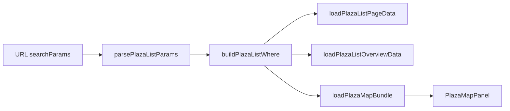

# Mapa das Praças filtrado pela lista

Status: entregue
Atualizado em: 2026-07-21
Item do roadmap: [docs/roadmap.md](../roadmap.md) (Trilha B, item B7 — entregue 2026-07-21)
Impeccable: B — encaixe em `/campanha/pracas` (`PlazaMapPanel` + loader; sem rota nova)
Appetite: ~0,5 dia eng; wire `buildPlazaListWhere` no loader do mapa + teste + empty state
Responsável: —

_Revisão 2026-07-21 (pós-implementação + `/simplify`): `loadPlazaMapBundle` aceita `rawSearchParams`; `loadScopedPlazas` usa `buildPlazaListWhere(state)`; tipo `PlazaListSearchParams` exportado de `plazaUi.ts`; testes em `tests/int/plazaMapData.int.spec.ts`. Cleanup simplify: parse único no map loader (`PlazaListState` passado a `loadScopedPlazas`). Débito de perf triplicado → **A9+ entregue** (`buildPlazaMapBundleFromPlazas` recebe agregados do bundle da lista)._

## Design (Impeccable)

Âncoras: `PRODUCT.md` / `DESIGN.md` (register product — Field Desk) · tema `data-theme='campaign'` · shells existentes (`CampaignPageShell`, `PlazaFilters`, `PlazaMapPanel`).

Na implementação (`implement-roadmap-item`): craft compacto → critique → polish (sem shape longo — superfície já existe).

Brief compacto:

- **Persona / contexto:** Alex (coordenador geral) ou Assessor filtra Praças por TI / tipo / cobertura / tendência e espera que o mapa acima diga a mesma coisa que a lista.
- **Job principal:** o coroplético reflete **exatamente** o conjunto filtrado da URL (não só o escopo de access).
- **Estratégia de cor:** Restrained (inalterada); modo comparativo divergente permanece.
- **Anti-goals:** não mover filtros neste item; não redesenhar o mapa; não filtrar por `page` (paginação da lista não reduz o mapa).

## Contexto

Em `/campanha/pracas` a lista e o overview já aplicavam `buildPlazaListWhere(state)` a partir da URL (`q`, `region`, `kind`, `coverage`, `priority`, `trend`). O mapa carregava **todas** as Praças acessíveis ao papel (`where: {}` em `loadScopedPlazas`). Pedido de produto (2026-07-21): o Mapa das Praças deve usar o mesmo filtro da lista abaixo.

**Entregue 2026-07-21:** `loadPlazaMapBundle(payload, user, rawSearchParams)` em `page.tsx`; `loadScopedPlazas` com `buildPlazaListWhere`; conjunto vazio → `null` (painel omitido); `compare` só modo comparativo.

## Objetivos

- Com qualquer combinação de filtros da URL (exceto `compare` e `page`), o bundle do mapa agrega votos **somente** das Praças que passam em `buildPlazaListWhere`.
- Conjunto filtrado vazio → mapa omitido (`null`), alinhado ao overview que já retorna `null` sem docs.
- `compare` continua só modo do mapa (não filtra lista nem mapa); `page` continua só paginação da lista.
- Guardrails: sem migration, sem collection, sem Consent, sem server action; leituras com `user` + `overrideAccess: false`.

## Decisões travadas

- **Item próprio B7 (não absorver em R6 nem em B6).** É correção de produto/contrato lista↔mapa, não polish visual (R6) nem `setStyle` incremental (B6). (2026-07-21, classificação roadmap-item.) **Rejeitado:** fill-in sem plano (perde o contrato e o teste); fase de [remodelagem-pracas.md](remodelagem-pracas.md) (R0–R5 já entregues).
- **Mesmo `Where` da lista/overview — reusar `buildPlazaListWhere`.** Uma fonte de verdade; overview já é o precedente (conjunto filtrado inteiro, `pagination: false`). **Rejeitado:** filtro client-side no `PlazaMapPanel` (vazaria dados não filtrados no HTML/Flight); segundo builder de where só para o mapa.
- **Mapa sobre o conjunto filtrado inteiro, não a página corrente.** Paridade com `loadPlazaListOverviewData`. **Rejeitado:** respeitar `page`/`plazaPageSize` no mapa (mapa paginado não faz sentido geográfico).
- **Empty → omitir o painel do mapa.** Mesma regra do overview. **Rejeitado:** Bahia cinza vazia com lista empty (dois empty states competindo).
- **i18n e naming** (AGENTS.md): identificadores em inglês (`loadPlazaMapBundle`, `PlazaListState`, `buildPlazaListWhere`); strings visíveis inalteradas salvo copy mínima se o empty do mapa precisar (preferir só omitir o painel).

## Questões em aberto

- **Mover `PlazaFilters` para cima do mapa?** **Opções:** A) neste item | B) R6 | C) deixar. **Recomendação:** B/C — fora do appetite; o filtro já é URL-driven e o mapa reage no refresh RSC. Marcar como polish visual em R6 se a coordenação reclamar da ordem.
- **Highlight / fitBounds só nos municípios do filtro?** **Opções:** A) só coroplético nos valores filtrados (polígonos restantes cinza) | B) além disso `fitBounds` no footprint filtrado. **Recomendação:** A neste item (já é o comportamento natural quando `values` só tem as chaves filtradas); B como polish se o Assessor filtrar uma TI e a Bahia inteira continuar no viewport — gatilho abaixo.

## Abordagem proposta

Componentes:

- **`loadScopedPlazas` / `loadPlazaMapBundle`** (`src/utilities/plazaMapData.ts`): `searchParams` → `parsePlazaListParams` → `buildPlazaListWhere(state)` no `payload.find` (`user` + `overrideAccess: false`). `loadScopedPlazas` recebe `PlazaListState` (parse único no bundle). Zero docs → `null`. `compare` de `state.compare`.
- **`pracas/page.tsx`**: `loadPlazaMapBundle(payload, user, rawSearchParams)` — paridade com lista/overview.
- **Depth check:** não criar `plazaMapFilters.ts` pass-through; não duplicar clauses de `q`/`region`/… — só reusar `buildPlazaListWhere` de `plazaUi.ts`.
- **Teste:** int (ou unit com Payload mock) garantindo que com `region` (ou `kind`) o bundle só contém `ibgeCode`s das Praças filtradas; e que conjunto vazio → `null`. Precedente de access já comentado no loader (assessor).
- **Migration:** Sem migration, sem collection, sem server action.

## Dependências

- **Dura:** R2 superfícies core (mapa + filtros) — já entregue.
- **Suave:** A9 ([estimativa-votos-praca.md](estimativa-votos-praca.md)) — métrica 2026 passa a `expectedVotes ?? effectiveTotal`; B7 continua válido só com pledges até A9. B6 (`setStyle`) independente.
- Reusa: `buildPlazaListWhere` / `parsePlazaListParams` (`plazaUi.ts`), padrão overview em `plazaPageData.ts`, `PlazaMapPanel` / `BahiaMap`.

## Não escopo

- Reordenar mapa vs filtros / redesign do painel → **R6**.
- `BahiaMap` setStyle incremental → **B6** ([escala-dry-pos-b3.md](escala-dry-pos-b3.md)).
- Hover / destaque + total de votos no polígono → **B10** ([hover-mapa-pracas.md](hover-mapa-pracas.md)).
- Polígonos por zona / painel de zona → **B8** ([poligonos-pracas-zona.md](poligonos-pracas-zona.md)).
- Novos filtros de lista; alterar semântica de `compare`.

## Rabbit holes

- **Filtro no cliente após carregar Bahia inteira.** Se alguém “só esconder no Leaflet”: vaza números no Flight e o Assessor ainda baixa dados fora do filtro. **Mitigação:** where no servidor.
- **FitBounds / zoom automático por filtro.** Explode em edge cases (TI pequena vs Salvador multi-zona). **Mitigação:** defer com gatilho.
- **Unificar list+overview+map num único fetch.** DRY prematuro (&lt;3 call sites já compartilham o where). **Mitigação:** só compartilhar o `Where`; fetch único só se profiling pós-B7 mostrar triplo load caro.

## Adiado com gatilho

- **`fitBounds` ao footprint filtrado.** Revisitar quando coordenação filtrar TI/região e reportar que a Bahia inteira no viewport atrapalha a leitura.
- **Mover filtros acima do mapa.** Revisitar no ciclo R6 se critique/smoke apontar ordem confusa.

## Referências

- `docs/roadmap.md` (Trilha B, item B7; Remodelagem R2)
- `src/app/(campaign)/campanha/(app)/pracas/page.tsx` — composição mapa + filtros + lista
- `src/utilities/plazaMapData.ts` — `loadScopedPlazas` / `loadPlazaMapBundle`
- `src/utilities/plazaUi.ts` — `buildPlazaListWhere`, `PlazaListState`, `PlazaListSearchParams`
- `tests/int/plazaMapData.int.spec.ts` — contrato filtro + access
- `src/utilities/plazaPageData.ts` — precedente overview filtrado (`pagination: false`)
- `docs/plans/mapa-bahia-geometrias.md` — contrato histórico “mapa escopado pelos mesmos filtros”
- `docs/plans/remodelagem-pracas.md` — mapa v1 / access do assessor
- AGENTS.md — Campaign auth, `overrideAccess: false`, naming
- `PRODUCT.md` / `DESIGN.md` — Field Desk; mapa como instrumento de coordenação, não dashboard SaaS
