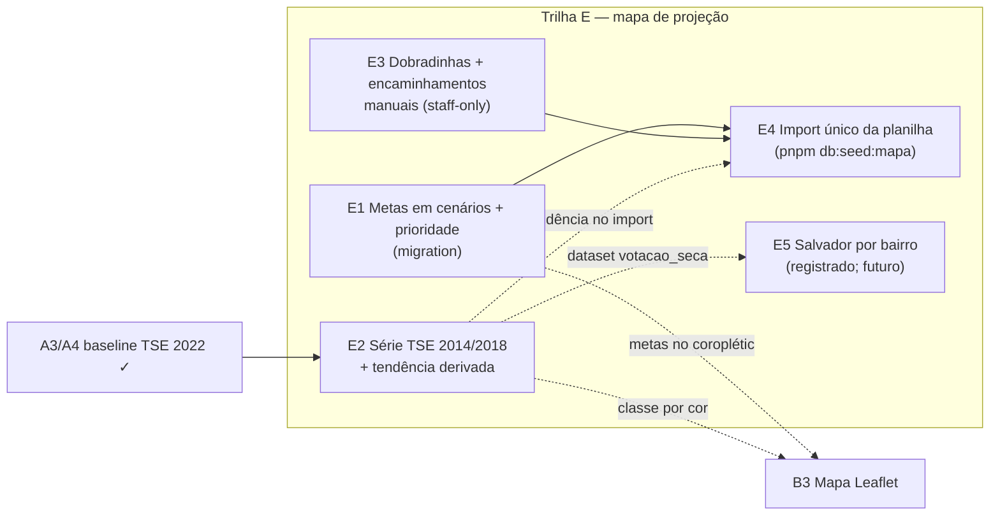

# Mapa de projeção de votos por município (equiparar e superar as planilhas 2026)

Status: rascunho
Atualizado em: 2026-07-19
Item do roadmap: [docs/roadmap.md](../roadmap.md) (Trilha E — itens E1–E5, "Ciclo 3")
Responsável: —

## Contexto

A campanha opera hoje sobre duas planilhas Excel versionadas em `docs/sheets/` ("Mapa projeção de votos Solla 2026.xlsx" e `Mapa_projecao_votos_Solla_2026.xlsx` — a segunda é a rica). Elas cobrem os 417 municípios da Bahia com: série histórica de votos de Solla (2014/2018/2022), classificação de tendência (Queda/Mantém/Aumento), metas de votos em três cenários (Bom/Regular/Mínimo), lista de ~50 municípios prioritários com meta estadual de 71.000 votos, rede política por município (assessor responsável, lideranças, dobradinhas negociadas), encaminhamentos operacionais e um drill de Salvador por bairro (reconciliação não-oficial local↔bairro).

A vertical `/campanha` já cobre ou supera parte disso: baseline TSE 2022 por geografia do núcleo (A3/A4, mais rico que a planilha), CRM de lideranças (`leadership`↔`Contact`), responsável por território (`coordinators`), overview agregado do conjunto filtrado (B1) e Salvador por zona (baseline município×zona). Os gaps que este plano fecha: metas em cenários, prioridade, série histórica além de 2022 com tendência automática, dobradinhas/encaminhamentos manuais e o import único da planilha. Decisão de produto de 2026-07-19: equiparar e superar as planilhas dentro do produto, sem manter a planilha como fonte paralela.

## Objetivos

- Metas de votos em três cenários e flag de prioridade por núcleo, com escrita staff e leitura pelos três papéis (E1).
- Série histórica TSE 2014/2018/2022 (deputado federal, turno 1, BA) com classificação automática de tendência por núcleo (E2) — dado público, sem `Consent`.
- Campos manuais staff-only de dobradinhas e encaminhamentos na inteligência do núcleo (E3), excluídos dos view models de `lideranca`.
- Import único e idempotente da planilha rica para núcleos (E4), **sem criar `Contact`/`leadership`** (sem telefone nem consent — bloqueador LGPD da Onda 0 se aplica).
- Registrar Salvador por bairro como item futuro (E5), sem implementar.
- Migrations somente em E1+E3 (campos novos em `electoralNucleus`); E2 e E4 não alteram schema.

## Decisões travadas

- **Sem entidade nova por município** — `electoralNucleus` absorve a camada estratégica (metas, prioridade, dobradinhas). A visão município-a-município é derivada: núcleos + baseline TSE agregados por `cities[]`. _(decisão de produto 2026-07-19; evita cadastro paralelo e reusa access/UI de núcleos)_
- **Série histórica 2014/2018 vem do TSE oficial**, estendendo o seed A3 (`pnpm db:seed:tse` parametrizado por ano) — não dos números da planilha. _(decisão de produto 2026-07-19; mesma proveniência e idempotência por escopo `(year, office, turn)` já existentes)_
- **Lideranças e assessores da planilha entram como texto staff-only, nunca como `Contact`/`leadership`.** Não há telefone nem consent na planilha; o CRM real é alimentado depois pelo fluxo normal com `Consent`. _(AGENTS.md — pessoa = `Contact` + junção com consent; Onda 0)_
- **Tendência é derivada, não persistida** — `computeVoteTrend` calcula em leitura a partir das collections A3, com limiares versionados como constantes (mesmo padrão de `computeGapVs2022` em `src/lib/electionInsights.ts`).
- **i18n e naming** seguem o AGENTS.md: identificadores em inglês (`voteGoals.good/regular/minimum`, `priority`, `dobradinhaNotes`, `nextSteps`, `computeVoteTrend`), strings visíveis e valores de enum de dados em pt-BR (`alta|normal`, `queda|mantem|aumento`).

## Questões em aberto

- **Banda de estabilidade da tendência?** Queda/Mantém/Aumento precisa de limiar. **Recomendação:** ±10% entre eleições consecutivas, constante versionada em `electionInsights.ts`; validar com produto.
- **E4 cria núcleo para todo município com dado estratégico (≈193) ou só para os ~50 prioritários?** **Recomendação:** default = municípios com qualquer preenchimento estratégico (metas, dobradinha, encaminhamento), flag `--priority-only` para restringir. Definir com produto antes de rodar em produção.
- **Meta estadual (71.000) fica onde?** **Recomendação:** derivada — soma das metas dos núcleos no dashboard; sem campo global novo. Se produto quiser meta editável independente da soma, vira campo em global de campanha (fase posterior).

## Abordagem proposta

### E1 — Metas em cenários + prioridade no Núcleo (migration)

- **`electoralNucleus`** (`src/collections/ElectoralNucleus.ts`): grupo `voteGoals` (`good`/`regular`/`minimum`, numbers opcionais, validação `good ≥ regular ≥ minimum`) e `priority` (select `alta|normal`, default `normal`, indexado). Escrita staff — `geral` ou coordenador designado, mesma regra da estimativa confirmada (`canSetDerivedNucleusField`/padrões em `src/utilities/campaignAccess.ts`); leitura para os três papéis.
- **UI:** card "Metas 2026" na aba Visão geral (3 cenários + `Progress` da estimativa confirmada vs. meta regular, ao lado de `NucleusElectoralBaseline`); filtro `priority` na lista (padrão dos filtros existentes em `src/utilities/nucleusUi.ts` / `buildNucleusListWhere`); bloco no overview B1 (`src/components/campaign/NucleusListOverview.tsx`): soma das metas por cenário no conjunto filtrado + contagem de prioritários; dashboard: soma estadual das metas (equivalente à "META: 71.000").
- **Migration:** `pnpm migrate:create add_nucleus_goals_strategy` (uma migration só para E1+E3), `pnpm generate:types` (skill `payload-migrations`).

### E2 — Série histórica TSE 2014/2018 + tendência automática

- **Seed:** estender `scripts/seed-tse-results.mjs` para parametrizar o ano (2014/2018; URLs `*_YYYY.zip` das mesmas famílias TSE, SHA-256 no header). Escopo v1: **só `deputado_federal`, turno 1, BA** (limita volume; a tendência só precisa disso). Verificar na implementação se o TSE republicou 2014 no formato CSV com header — o parser (`src/lib/electionResultsParse.ts`) assume colunas nomeadas. Número do candidato configurável por ano (1313 nos três pleitos). Idempotência por `(year, office, turn)` e collections A3 com `year` na unique key já existem — **sem migration**.
- **Insight:** `computeVoteTrend(votes2014, votes2018, votes2022)` → `queda|mantem|aumento|semBaseline` em `src/lib/electionInsights.ts`, limiares como constantes versionadas.
- **UI:** série 2014→2018→2022 no card `NucleusElectoralBaseline` (`src/components/campaign/NucleusElectoralBaseline.tsx`); badge de tendência no detalhe + linha no `NucleusInsights` (mesma família de Alert do Gap vs 2022); no overview da lista, distribuição Queda/Mantém/Aumento do conjunto filtrado (espelha a aba RESUMO da planilha).
- **Custo de I/O:** estender `getNucleusElectoralBaseline` (`src/utilities/nucleusElectoralBaseline.ts`) para aceitar ano multiplica as leituras já sinalizadas em [A7](escala-dry-pos-a4.md) — preferir levar A7 F1 (agregar federal no detalhe) junto ou antes.

### E3 — Inteligência estratégica manual: dobradinhas + encaminhamentos

- Campos staff-only no bloco de inteligência do núcleo (mesma redação/access dos campos estratégicos existentes — `strengths`, `risks`): `dobradinhaNotes` (textarea — quem dobra ali hoje, estado da negociação) e `nextSteps` (textarea — encaminhamentos). Editados via `NucleusIntelligenceDialog` (`src/components/campaign/NucleusIntelligenceDialog.tsx` + `nucleusIntelligenceUi.ts`).
- Excluídos dos view models de `lideranca` (`src/utilities/nucleusViewModels.ts`, padrão já existente de campos sensíveis).
- Não conflita com A6 (dobradinha automática pós-TSE-2026) nem C4 (Demandas estruturadas): E3 é a versão manual imediata; os planos futuros complementam sem substituição forçada.
- Migration compartilhada com E1 (acima).

### E4 — Import único da planilha (`pnpm db:seed:mapa`)

- Script `scripts/seed-mapa-projecao.mjs` que lê `docs/sheets/Mapa_projecao_votos_Solla_2026.xlsx` (a rica) e cria/atualiza núcleos por município via Local API em transação: `voteGoals` (parse "Bom: X | Regular: Y | Mínimo: Z"), `priority` (`alta` quando flagado ou presente na aba PRIORITÁRIAS), `dobradinhaNotes`, `nextSteps` (encaminhamentos + observações). Município → nome canônico via `canonicalizeMunicipalityName` (`src/lib/bahiaMunicipalityCodes.ts`); região derivada no servidor (A1).
- Nomes de assessores/lideranças da planilha entram como texto nos campos staff-only — **nunca criam `Contact`/`leadership`** (decisão travada acima).
- Guard de banco local (mesma família dos outros seeds: `pnpm db:seed:posts` / `db:seed:tse`; override `ALLOW_REMOTE_DB=true` com o runbook documentado); idempotente por slug de núcleo; municípios sem nenhum dado estratégico não geram núcleo. Sem revalidate (páginas de campanha são dinâmicas).

### E5 — Salvador por bairro (registrar, não implementar)

- A aba SALVADOR da planilha usa uma reconciliação não-oficial local-TSE→bairro (DE-PARA). Reproduzir exigiria o dataset TSE `votacao_secao` + tabela de mapeamento versionada — custo alto para valor incerto. Fica registrado no roadmap como item futuro condicionado a decisão de produto; a visão por **zona** de Salvador já é coberta pelo baseline município×zona atual.

## Dependências

- **E2 ← A3/A4** (entregues): collections `electionTally`/`electionCandidateVote`/`electionCandidate`, seed `db:seed:tse`, `getNucleusElectoralBaseline`, `computeGapVs2022`.
- **E4 ← E1 + E3** (duras): os campos precisam existir antes do import. **E4 ← E2** (suave): tendência já visível ao revisar o import.
- **E1/E3** não dependem de nada novo — paralelizáveis com o restante da Janela 2.
- Suaves para B3 (mapa Leaflet): metas e classe de tendência como métricas do coroplético.
- Reusa: `withPayloadTransaction`, locks advisory, padrões de filtro/overview B1, skill `payload-migrations`.

## Não escopo

- Criar `Contact`/`leadership` a partir da planilha — vai para o fluxo normal com `Consent` (Onda 0 / [cadastro-nominal-apoiadores.md](cadastro-nominal-apoiadores.md)).
- Dobradinha automática por dados TSE 2026 — [insight-dobradinha-2026.md](insight-dobradinha-2026.md) (A6).
- Encaminhamentos estruturados com status/responsável — [demandas-campanha.md](demandas-campanha.md) (C4).
- Classificação territorial por limiares de produto — [insight-classificacao-territorial.md](insight-classificacao-territorial.md) (A5); `computeVoteTrend` é série própria do candidato, não classificação de território.
- Salvador por bairro (E5) — registrado, sem plano de implementação neste ciclo.
- Previsão estatística de votos — fora de escopo do ciclo (roadmap, revisão 2026-07-17).

## Referências

- `docs/roadmap.md` — Trilha E / Ciclo 3, janelas 2–3
- `docs/sheets/Mapa_projecao_votos_Solla_2026.xlsx` e `docs/sheets/Mapa projeção de votos Solla 2026.xlsx` — planilhas-fonte (estrutura, abas RESUMO/PRIORITÁRIAS/SALVADOR)
- `src/collections/ElectoralNucleus.ts` — campos, hooks e access do núcleo (E1/E3)
- `src/lib/electionInsights.ts` + `src/utilities/nucleusElectoralBaseline.ts` — padrão de insight derivado e agregação do baseline (E2)
- `scripts/seed-tse-results.mjs` + `src/lib/electionResultsParse.ts` — seed TSE a parametrizar por ano (E2)
- `src/components/campaign/NucleusElectoralBaseline.tsx`, `NucleusListOverview.tsx`, `NucleusIntelligenceDialog.tsx` — superfícies de UI a estender
- `src/lib/bahiaMunicipalityCodes.ts` (`canonicalizeMunicipalityName`) — reconciliação de nomes no import (E4)
- [escala-dry-pos-a4.md](escala-dry-pos-a4.md) — A7 F1, custo de I/O do loader do baseline
- AGENTS.md — Campaign auth, pessoa = `Contact` + junção, `overrideAccess: false`, migrations com `push: false`, naming
