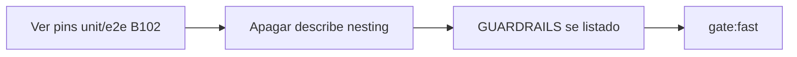

# Matar guarda JSX de nesting `TooltipProvider` (B102)

Status: registrado
Atualizado em: 2026-08-02
Issue: #242 (OPS15)
Priority: P2
Model: composer-2.5
Impeccable: A — N/A (sem superfície UI; remover convention spec)
Appetite: ~0,25 dia eng; apagar um `describe` + atualizar GUARDRAILS; sem migration
Responsável: —

## Dados → decisão → apresentação

Dados: N/A — remoção de guardrail frágil; sem métrica de produto.

## Contexto

B102 (#129 / miss #133/#135): o drawer de ações rápidas monta como **irmão** do scrollport dentro de `CampaignAppScrollChrome`. `TooltipProvider` só em volta de `{children}` deixava focus→suggest (hits `priority:alta` → `CampaignHoverTooltip`) sem provider → crash da página.

**Fix real:** elevar o provider para envolver `CampaignAppScrollChrome` no layout `(app)`.

**Guarda adicionada** em `tests/unit/codebaseConventions.unit.spec.ts` (`campaign TooltipProvider wraps quick-actions chrome (B102)`): regex que exige

```tsx
<TooltipProvider>
  …<CampaignAppScrollChrome>…</CampaignAppScrollChrome>…
</TooltipProvider>
```

e proíbe o nesting invertido **no source** de `layout.tsx`.

Problema (review 2026-08-02, item 5): o pin congela **forma JSX incidental**. Agentes satisfazem a regex com wrappers estranhos; um refactor legítimo (provider dentro de um shell component que já envolve o chrome) quebra o build sem regressão; a proteção real do crash já está (ou deve estar) nos **pins comportamentais** de focus→suggest / type→search com hits prioritários (`campaignQuickActionsDrawer` unit + e2e da miss).

Pedido: **matar esta guarda** — sem substituto source-shape.

## Objetivos

- Remover o `describe('campaign TooltipProvider wraps quick-actions chrome (B102)', …)` de `codebaseConventions.unit.spec.ts` por completo.
- Confirmar que os pins comportamentais da regressão B102/miss (#133/#135) **permanecem** (unit drawer focus→suggest com hit prioritário; e2e se existir). Se algum tiver sido apagado, **restaurar** nesse PR — a remoção da guarda source só é segura com a rede comportamental viva.
- Atualizar `docs/GUARDRAILS.md` se a guarda estiver listada; senão nota no PR + referência à Issue.
- Guardrails: sem migration; **não** mover o `TooltipProvider` neste item (layout fica como está).
- **Tracer bullet:** delete do describe → `pnpm gate:fast` verde → checklist dos pins comportamentais no body do PR.

## Decisões travadas

- **Delete da guarda source-shape; não “afrouxar” a regex.** Opções: A) delete | B) mover o pin para outro arquivo/componente | C) ESLint react-tree. **Recomendação: A.** O valor está no pin de crash (comportamento), não na árvore textual do layout. **Rejeitado:** B/C (mesmo cheiro / appetite).
- **Não adicionar judgment-only substituto obrigatório** além de uma linha em GUARDRAILS/CHANGELOG se útil — o layout comentado + pins de miss bastam.
- **Kind: `chore` (OPS15).**
- **i18n:** N/A.

## Questões em aberto

- **Onde documentar “provider deve envolver o chrome do drawer”?** **Opções:** A) só comentário no layout | B) GUARDRAILS judgment-only | C) nada. **Recomendação:** **A** (já deve existir contexto B102 no layout); B só se a linha já existir e precise de “removido”. _(assumido)_

## Abordagem proposta



Componentes:

- **`tests/unit/codebaseConventions.unit.spec.ts`:** remover o bloco B102 (~L671–688).
- **Verificação:** `rg TooltipProvider|priority:alta|CampaignHoverTooltip tests/unit tests/e2e` — garantir cobertura comportamental; restaurar se faltar.
- **`docs/GUARDRAILS.md`:** remover/ajustar linha se houver.
- **Migration:** nenhuma.

## Dependências

- Nenhuma dura. Independente de OPS13/OPS14.
- Soft: Issues #129 / #133 / #135 (histórico da miss) — só referência.

## Não escopo

- Mudar posição do `TooltipProvider` no layout.
- Reabrir investigação do crash.
- OPS13/OPS14.

## Rabbit holes

- **"Substituir por teste de árvore React renderizada do layout."** Layout é RSC/async — painel de dor; os pins do drawer já exercitam o caminho. **Mitigação:** não.
- **Aproveitar para “limpar” outros describes do conventions.** Fora de escopo.

## Adiado com gatilho

- **Pin e2e dedicado se unit do drawer for flaky.** Revisitar só com evidência de regressão pós-remoção.

## Referências

- GitHub Issue #242 (OPS15)
- Review de guardrails (chat 2026-08-02) — item 5
- `tests/unit/codebaseConventions.unit.spec.ts` — describe B102
- `src/app/(campaign)/campanha/(app)/layout.tsx` — TooltipProvider atual
- Issues #129 (B102), #133, #135 (miss)
- `tests/unit/campaignQuickActionsDrawer.unit.spec.tsx` — pins comportamentais esperados
