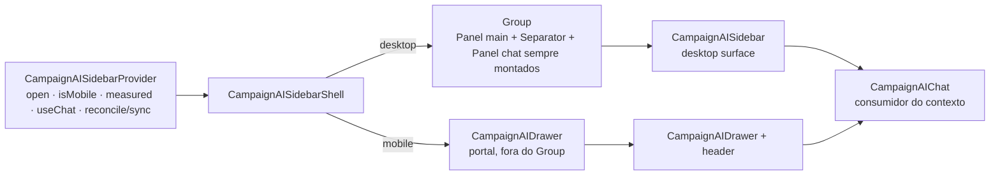

# Impl: Migrar o chat Sollinha entre painel e drawer ao redimensionar

Status: aprovado — em execução (design final conforme entregue)
Atualizado em: 2026-08-08
Issue: #416
Intenção: docs/plans/migrar-chat-painel-drawer-resize.md
Appetite restante: herdado (~1–1,5 dia eng; sem migration)

## Leitura da intenção

- **Outcome:** ao cruzar a borda 768 px com o chat aberto, o chat migra aberto para a outra superfície (painel↔drawer) com a conversa atual; fechado permanece fechado; a conversa dura a sessão do site (navegação interna, abrir/fechar, resize) e reinicia em nova aba.
- **O que NÃO negociar:** não fechar um chat aberto; não abrir um chat fechado; `open` é a fonte da verdade (sem flag nova); sem histórico entre sessões (LGPD); abrir/fechar em tela fixa como hoje (painel desktop continua abrindo em 25% no load); sem tocar a largura default (irmão B166); sem migration/collection/Consent.
- **O que foi reavaliado (tudo reproduzido em dev + e2e):**
  1. `useChat` sem store por `id`: em `@ai-sdk/react@4.0.50` as mensagens vivem na instância `Chat` — `id` estável NÃO sobrevive a desmonte. A conversa foi **erguida para o provider** (persiste no layout `(app)`), e `CampaignAIChat` virou consumidor.
  2. `react-resizable-panels@4` aplica `display:flex` inline no elemento do `Panel` e roteia className/style para o wrapper interno — o `hidden md:block` antigo não zerava a pegada flex (coluna fantasma no mobile). Além disso, **mudar a contagem de painéis do `Group` em runtime força uma navegação full-page** nesta app. Solução: panel+separator sempre montados; a pegada do panel é zerada por uma classe com `display:none !important` alternada via `elementRef` no elemento OUTER (sobrevive aos re-renders async do RRP).
  3. `collapse()/expand()` imperativos do RRP são sobrepostos pelo próprio re-layout do RRP no cruzamento (raças). O design **nunca** os usa no caminho do cruzamento; só um drag-collapse do usuário (gated por `meta.isUserInteraction`) fecha o chat.

## Abordagem final entregue

**Sem "migração" no cruzamento:** as duas superfícies derivam do MESMO `open` + viewport (`chatVisible = measured && !isMobile && open`). Cruzar a borda só re-deriva a superfície. O trabalho é manter `open` fiel:

- **Reconcile no settle desktop:** o panel abre no default RRP (25%) com `open=false`; no primeiro settle medido desktop, `open := !panelRef.isCollapsed()` — um chat visível é "aberto" (X fecha, drawer abre no resize). Visita mobile mantém `open=false` (gated por `!isMobile`).
- **Drag-collapse:** `Group.onLayoutChanged((_, meta) => sync(meta.isUserInteraction))` — só o drag do usuário (isUserInteraction) fecha; o auto-collapse que o RRP faz no próprio re-layout (panel display:none mede 0) NÃO fecha o drawer recém-aberto no lado mobile.
- **Reopen pós-collapse:** effect `[open, isMobile]` expande se `open && !isMobile && isCollapsed()` (no-op nos caminhos normais — sem raça).
- **Pré-medição:** `chatVisible = measured ? … : true` — o frame de hidratação não esconde o panel (evita o piscar 100%→75% no load desktop).

### Componentes / mudanças

- **`CampaignAISidebarContext.tsx`**: dono único — `open`, `isMobile`/`measured` (`useIsMobileMeasured`), `useChat` erguido (transport memoizado, `id: 'campaign-sollinha'`), reconcile no settle, `syncPanelVisibility(isUserInteraction)`, effect de reopen. Removeu `setOpenMobile` (unificado em `setOpen`).
- **`CampaignAISidebarShell.tsx`**: `Group`/`Separator`/`Panel` chat sempre montados; `elementRef` + `useLayoutEffect` alterna a classe `b167-ai-chat-hidden`; `CampaignAIDrawer` como irmão no mobile; foco para o textarea ao migrar mobile→desktop com chat aberto.
- **`src/app/(frontend)/styles.css`**: utility `.b167-ai-chat-hidden { display:none !important }` (vence o inline `display:flex` do RRP).
- **`src/hooks/use-mobile.ts`**: refatorado — `useMobileMeasured()` interno + `useIsMobile()` (compat) + `useIsMobileMeasured()` (expoe `measured`).
- **`CampaignAIDrawer.tsx` (novo)**: surface mobile (Drawer + header + chat), portado do branch removido de `CampaignAISidebar`.
- **`CampaignAISidebar.tsx`**: só a surface desktop (header + chat).
- **`CampaignAIChat.tsx`**: consumidor do contexto (remove `useChat` local e o `viewportRef` morto).
- **`CampaignAIFab.tsx`**: `setOpen(true)` (era `setOpenMobile(true)`).
- **Migration:** nenhuma. Access/Consent/RBAC/cache: intocados.

### Abordagens rejeitadas (registradas)

- **Migração explícita por resolver puro** (`resolveAISidebarOpenOnResize` + unit tests): descartada quando se provou que, com `open` reconciliado, o cruzamento é automático (`open && viewport`). O resolver virou código morto e foi removido.
- **Panel condicional (desmonta no mobile):** força navegação full-page do RRP nesta app.
- **`display:none` via className/style do RRP:** vão no wrapper interno, não zeram a pegada.
- **`collapse()/expand()` no cruzamento:** sobrepostos pelo re-layout do RRP (raças).
- **`collapsible` no Panel do chat:** o RRP auto-colapsa um painel `display:none` (largura 0) durante o próprio re-layout, e no build de produção o painel voltava ao desktop colapsado (largura 0) sem nada para expandir de forma confiável. Removido — mostrar/esconder é 100% CSS; o painel sempre mantém um tamanho RRP real quando visível.

### Dados → forma

- **Apresento dados?** Não (N/A — correção de estado de UI). Item 3 de data-presentation não se aplica.

## Fases verificáveis

1. **Núcleo + surfaces** — provider (open/isMobile/measured/useChat/reconcile/sync), shell montado-constante, `CampaignAIDrawer`, chat consumidor, FAB unificado, utility CSS.
2. **Verificação no navegador** — 4 fluxos da intenção por viewport (1280↔500) em dev real.
3. **Gates + e2e** — unit (full), lint/tsc/prettier/cycles; e2e `campaignAiChatResize.e2e.spec.ts` com mock SSE: desktop→mobile (drawer + conversa + sem coluna), mobile→desktop (painel + conversa, sem reload), fechado-fica-fechado (2 direções), visita mobile nova fechada, conversa sobrevive à navegação interna, nova aba recomeça vazia. Entrega com `pnpm push`.

## Rabbit holes / Não escopo (engenharia)

- **sessionStorage/localStorage p/ reload na mesma aba:** reload não está no aceite; o provider cobre navegação interna/abrir-fechar/resize sem storage. Deferir (gatilho: produto pedir reload-persistência).
- **Largura default / persistência de tamanho / drag handle:** terreno do B166 (#414, in-progress separada) — aqui só migrar, não remodelar.
- **Debounce de resize rápido:** intenção resolveu "aceitar".
- **Extrair `AISidebarHeader` compartilhado:** 2 call sites com classes diferentes = módulo raso; mantido inline.
- **Foco/AT no drawer×painel:** foco do textarea coberto no mobile→desktop; anúncio AT de troca de superfície deferido (gate) se o produto quiser.

## Riscos e mitigação

- **RRP + panel sempre montado + display:none:** utility `!important` sobrevive aos re-renders async do RRP; auto-collapse do RO não fecha o chat (gated por isUserInteraction). Verificado em e2e.
- **Load desktop sem piscar 100%→75%:** `chatVisible` cai para `true` pré-medição.
- **Flakiness local (dev server 2 workers):** conhecida no repo; CI roda e2e sobre o build de produção (`pnpm start`), sem compilações a frio nem hard-nav — stável.
- **Foco ao migrar:** foco vai para o textarea do painel no mobile→desktop com chat aberto.

## Aceite de engenharia

- [x] Aceite de produto da intenção coberto (migração aberto→aberto; fechado→fechado; conversa por sessão da aba; tela fixa intacta; visita mobile fecha)
- [x] Invariantes AGENTS/engineering-standards (sem migration; sem Consent; `open` fonte da verdade; identificadores EN / copy pt-BR; transações não tocadas)
- [x] Testes: e2e com mock SSE (6 cenários) + full unit/lint/tsc/prettier/cycles
