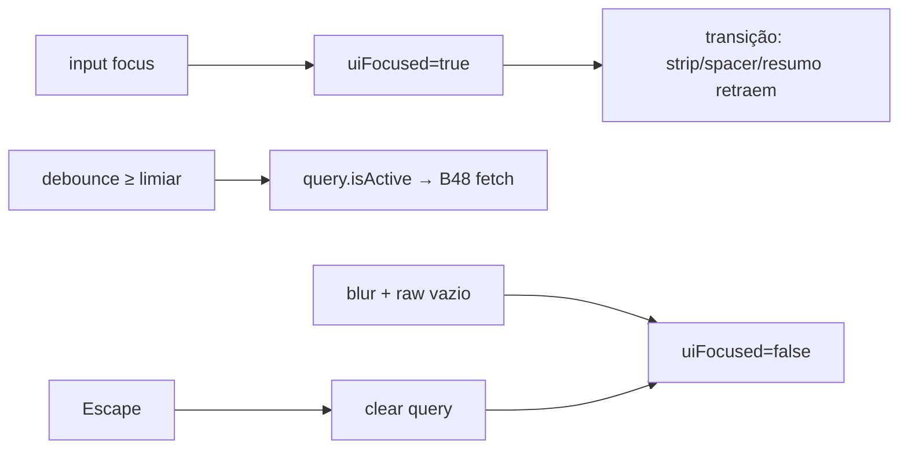

# Modo focado da busca no focus (não na digitação)

Status: rascunho
Atualizado em: 2026-07-29
Item do roadmap: [docs/roadmap.md](../roadmap.md) (Trilha B, item B66 — UX-1 busca Início)
Impeccable: B — encaixe de motion/estado no chrome do Início (`CampaignHomeLayout` / `CampaignHomeStaffChrome`) sob tema `campaign`
Appetite: ~0,5–0,75 dia eng; estado `focused` ≠ `query.isActive` + transição CSS; sem migration
Responsável: —

## Design (Impeccable)

Âncoras: `PRODUCT.md` (Clarity under pressure; Feel the action) / `DESIGN.md` · B47 `CampaignHomeSearch` / B46 layout · tema `data-theme='campaign'`.

Na implementação (`implement-roadmap-item`): craft compacto → critique → polish.

Brief compacto:

- **Persona / contexto:** CG/assessor toca a busca no Início para achar um município; ainda não digitou — quer a tela limpa **já**, sem esperar a 1ª letra.
- **Job principal:** ao focar o input, o resto do Início cede espaço com animação (como se a barra expandisse para ocupar a tela); resultados só quando a query passar o limiar B47/B48.
- **Estratégia de cor:** Restrained — motion de layout/opacity, sem overlay escuro tipo modal.
- **Edit where you see:** não — chrome de descoberta.
- **Anti-goals:** modo focado só após digitar (decisão B47 supersedida); sumir o input; command palette ⌘K; `position:fixed` full-screen que compete com bottom nav / teclado.

## Dados → decisão → apresentação

Dados: N/A — chrome + motion; hits continuam em **B48–B55**.

## Contexto

**B47 ✓** entregou input + modo focado, com decisão travada: **expand = query não vazia** (rejeitou focus-only para “não roubar o ritual de ações”). Em produção visual, quem foca a barra ainda vê strip/resumo/dock até digitar — atrito no gesto de busca.

**Pedido de produto (2026-07-29):** limpar a tela **ao focar** a barra (não ao começar a digitar) e **animar** a redução do resto do conteúdo, como se a busca expandisse para tomar a tela.

Isto **emenda** B47 (não reabre B48+). Hits, debounce 250 ms e limiar ≥2 chars permanecem.

Código vivo: `focused = searchState.query.isActive` em [`CampaignHomeStaffChrome.tsx`](../../src/components/campaign/dashboard/CampaignHomeStaffChrome.tsx); `CampaignHomeLayout` esconde spacer/strip com `focused`; contrato em [`campaignHomeSearchContract.ts`](../../src/lib/campaignHomeSearchContract.ts).

## Objetivos

- Separar **`uiFocused`** (input com foco **ou** query ativa) de **`query.isActive`** (debounced ≥ limiar — dispara fetch B48).
- Ao **focus** do input: entrar em modo focado imediatamente — strip de ações, spacer B46/B65, resumo B56 (quando landar) e demais chrome do Início fora da região busca+resultados **retraem com transição** (altura/opacity/transform — “expandir a busca”), não sumir em hard cut.
- Ao **blur** com query vazia (após trim): sair do modo focado e restaurar o chrome (mesma transição inversa).
- Com query ativa: permanecer focado mesmo se o foco for para um hit (Tab / toque na lista) — igual espírito atual, sem reaparecer strip no meio da leitura.
- Escape: limpa query (**B47**) e, se ficar vazia, sai do modo focado (blur ou `uiFocused=false`).
- `prefers-reduced-motion: reduce` → sem animação (só estado final).
- Soft: se **B65** já ancorou o dock no inferior, a animação parte dessa posição; se não, anima a partir do layout atual.
- Soft: etapa **B60** (busca só município) herda o mesmo critério se houver chrome residual no shell — senão N/A.
- Sem migration / collection / Consent / mudança de contrato JSON de busca.
- Pins: unit no predicado `uiFocused` / saídas blur+Escape; e2e leve “focus esconde strip antes de digitar” se estável.

## Decisões travadas

- **Focus dispara limpeza; digitação dispara só hits.** Opções rejeitadas: A) manter B47 “só query” (pedido explícito anula); B) focus **e** fetch com 0 chars (ruído / custo). **Escolhido:** `uiFocused = inputFocused || query.isActive`; fetch continua gated por `isActive`.
- **Animação = retração do chrome, não overlay modal.** **Rejeitado:** scrim escuro / Sheet full-screen / `fixed inset-0` que tapa bottom nav; teleportar o input para outro nó DOM (quebra foco/teclado).
- **Blur vazio restaura; blur com query ativa mantém focado.** **Rejeitado:** sticky forever até Escape (rouba Início se o usuário toca fora sem limpar).
- **Emenda B47, não novo input.** Reusa `CampaignHomeSearch` + layout; só o predicado e a transição mudam. Fonte: produto 2026-07-29.
- **i18n:** ids `uiFocused` / `home-search-expanding`; copy intacta.

## Questões em aberto

- **Duração / easing da transição?** **Opções:** A ~200–250 ms `ease-out` (paridade Feel the action) | B ~150 ms | C só opacity sem height. **Recomendação:** A com height/opacity no grupo chrome; medir jank no mobile — se layout thrash, cair para C. _(assumido — craft)_
- **Pointer coarse: focus via tap já abre teclado — animar em paralelo ao teclado?** **Opções:** A animar sempre | B adiar animação até `visualViewport` estabilizar. **Recomendação:** A na v1; B só se critique mostrar salto. _(assumido)_

## Abordagem proposta

Componentes:

- **`useHomeSearchQuery` / `HomeSearchController`**: expor `inputFocused` + setters, ou mover `uiFocused` para `CampaignHomeStaffChrome` com `onFocus`/`onBlur` no input — depth: um predicado documentado, sem segundo hook.
- **`CampaignHomeSearch`**: encaminhar `onFocus`/`onBlur` (cuidado com blur→click em hit: `relatedTarget` / `pointerdown` prevent — padrão lista; não fechar antes do click no resultado).
- **`CampaignHomeLayout`**: `focused` passa a significar `uiFocused`; classes de transição (`transition-[…]`, `data-home-focused`) no spacer/actions; results slot inalterado.
- **`campaignHomeSearchContract`**: helper puro `homeSearchUiFocused({ inputFocused, isActive })` + unit spec; JSDoc atualiza a semântica supersedida de B47.
- **Migration:** Sem migration, sem collection, sem server action.

## Dependências

- Dura: **B47 ✓** (chrome existe).
- Soft: **B65** (âncora inferior — animação parte do dock certo); **B56** (resumo some no focus como o resto); **B60** (paridade visual se couber).

## Não escopo

- Providers / layout de hits → **B48–B55**.
- Âncora inferior idle → **B65**.
- Chassis wizard / município sticky → **B59**.
- Atalho ⌘K / busca na sidebar.

## Rabbit holes

- **Framer Motion / lib de spring.** **Mitigação:** CSS transitions + tokens; lib só se 3º call site de motion complexo.
- **Sincronizar pixel-perfect com teclado iOS.** **Mitigação:** não amarrar a `visualViewport` na v1.
- **Reescrever B47 plan como se nunca tivesse rejeitado focus.** **Mitigação:** as-built B47 fica; este item documenta a emenda.

## Adiado com gatilho

- **Persistir `?q=` na URL do Início.** Já adiado em B47 — reabrir só com pedido de shareable search.
- **Gesture “puxar para baixo para fechar” no modo focado.** Revisitar se mesa pedir dismiss sem Escape/blur.

## Referências

- [busca-global-inicio-input.md](busca-global-inicio-input.md) — decisão supersedida (“expand = query”)
- [ancorar-busca-acoes-inicio-mobile.md](ancorar-busca-acoes-inicio-mobile.md) — dock idle
- `src/components/campaign/dashboard/CampaignHomeStaffChrome.tsx`
- `src/components/campaign/dashboard/CampaignHomeLayout.tsx`
- `src/components/campaign/dashboard/CampaignHomeSearch.tsx`
- `src/components/campaign/dashboard/useHomeSearchQuery.ts`
- `src/lib/campaignHomeSearchContract.ts`
- `PRODUCT.md` / `DESIGN.md` — Field Desk / Feel the action
- AGENTS.md — naming; sem Consent
