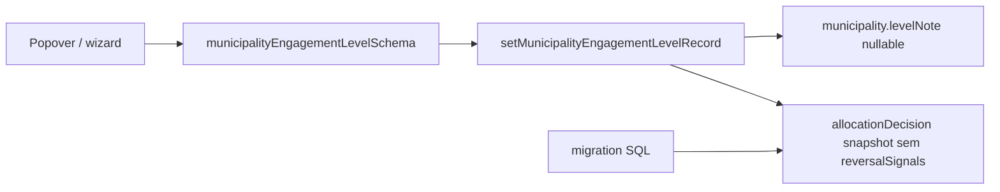

# Impl: Motivo opcional — tendência (wizard) + nível; remover voltar atrás do DB (B134)

Status: aprovado
Atualizado em: 2026-08-02
Issue: #288
Intenção: docs/plans/motivo-opcional-tendencia-e-nivel.md
Appetite restante: herdado (~1 dia eng)

## Leitura da intenção

- **Outcome:** staff grava tendência ou nível sem texto obrigatório; Motivo permanece opcional nos dois ritos; `reversalSignals` some da UI, write path e snapshots persistidos.
- **O que NÃO negociar:** histerese/override/choque triangulado intactos; `leader` lockdown; sem auto-save no nível; motivo vazio grava `null` (não preserva anterior); dados históricos de `reversalSignals` apagados do DB.
- **O que reavaliar:** não há coluna dedicada — `reversalSignals` vive só no JSON `allocation_decision.snapshot`; migration é data-only, sem alterar `AllocationDecision` config.

## Abordagem recomendada

**Opções consideradas:** A remover só da UI/schema | B migration JSON strip + schema/UI/action  
**Recomendação:** B — aceite exige apagar do banco, não só esconder.  
**Rejeitadas:** A (órfãos no snapshot); tornar `rationale` opcional na collection (escopo desnecessário — string vazia basta quando motivo ausente).

### Componentes / mudanças

- **`municipalityEngagementLevelSchema`** (`src/lib/schemas/municipality.ts`): `note` → `trimmedNullableText`; remover `reversalSignals`.
- **`setMunicipalityEngagementLevelRecord`** (`actions/municipality.ts`): snapshot sem `reversalSignals`; `rationale: note ?? ''`.
- **`MunicipalityListLevelControl`**: um campo Motivo (opcional); `canSubmit` só exige movimento + override quando violações.
- **`WizardTrendNoteStep`**: remover `required`; label com “(opcional)”.
- **Migration:** `20260802_*_strip_engagement_reversal_signals` — `UPDATE allocation_decision SET snapshot = snapshot - 'reversalSignals' WHERE …`.
- **Access / Consent:** inalterado (`canManageMunicipalityEngagementLevel`).

### Dados → forma

- Tendência: schema já usa `trimmedNullableText` — só UI wizard tinha `required` HTML.
- Nível: `levelNote` nullable no município; `allocationDecision.rationale` string (vazia se sem motivo).

## Fases verificáveis

1. **Schema+server** — schema, action, migration, int test com motivo vazio + snapshot sem reversalSignals.
2. **UI** — labels “(opcional)”, remover segundo textarea.
3. **Gates** — `pnpm gate:fast`; push via `pnpm push`.

## Rabbit holes / Não escopo (engenharia)

- Alterar copy do glossário `campaignIntelligenceConcepts` (prosa conceitual, não o campo).
- `rationale` required na collection — string vazia, não relaxar schema Payload.

## Riscos e mitigação

- **Rationale vazio rejeitado pelo Payload:** int test com `note` omitido; se falhar, usar `''` explicitamente (textarea required aceita vazio).
- **Migration idempotente:** operador JSONB `-` só onde chave existe; log de row count.

## Aceite de engenharia

- [x] Aceite de produto da intenção ainda coberto
- [x] Invariantes AGENTS/engineering-standards
- [x] Testes de domínio previstos (int engagement level + migration unit)
