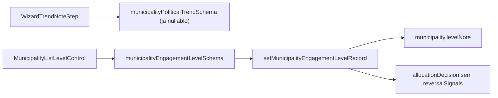

# Impl: B134 — Motivo opcional — tendência (wizard) + nível; remover voltar atrás do DB

Status: aprovado
Atualizado em: 2026-08-02
Issue: #288
Intenção: docs/plans/motivo-opcional-tendencia-e-nivel.md (ausente no repo — aceite inferido do título da Issue e do código E14/B64)
Appetite restante: ~meio dia eng

## Leitura da intenção

- **Outcome:** coordenação pode registrar mudança de tendência (wizard) e de nível de envolvimento sem obrigar texto de justificativa; o campo "O que faria voltar atrás" deixa de existir (UI + payload + snapshot de `allocationDecision`).
- **O que NÃO negociar:** movimento de nível continua submit explícito com regras de histerese/override; tendência no wizard mantém Salvar explícito; `leader` lockdown; gravação transacional em `allocationDecision` para movimentos de nível.
- **O que reavaliar:** a hipótese E14 de motivo + sinais de reversão obrigatórios no schema — produto pede relaxar motivo e eliminar reversão por completo.

## Abordagem recomendada

**Opções consideradas:** A) tornar motivo opcional só na UI mantendo schema | B) relaxar schema + remover reversalSignals do snapshot | C) migration para apagar coluna reversalSignals  
**Recomendação:** B — `reversalSignals` nunca foi coluna de banco, só JSON no snapshot e campo do body Zod; remover do schema, action e UI. Motivo vira `trimmedNullableText` no Zod de nível; wizard remove `required` HTML.  
**Rejeitadas:** C (não há coluna); A (schema e UI divergiriam).

### Componentes / mudanças

- **`src/lib/schemas/municipality.ts`**: `note` opcional em `municipalityEngagementLevelSchema`; remover `reversalSignals`.
- **`src/app/(campaign)/campanha/actions/municipality.ts`**: snapshot sem `reversalSignals`; `rationale` aceita string vazia quando nota omitida.
- **`src/components/campaign/municipality/MunicipalityListLevelControl.tsx`**: remover campo "O que faria voltar atrás"; `canSubmit` só exige movimento (+ override se violações).
- **`src/components/campaign/municipality/WizardTrendNoteStep.tsx`**: remover `required` do textarea; label indica opcional.
- **`src/lib/campaignIntelligenceConcepts.ts`**: copy do verbete E14 sem exigir sinais de reversão.
- **Migration:** sem migration (snapshot JSON é schema-less; dados históricos com `reversalSignals` permanecem legíveis).
- **Testes:** int `campaignMunicipalityEngagementLevel` atualizado + caso movimento sem nota.

## Fases verificáveis

1. **Schema/server** — Zod + action + int tests
2. **UI** — level control + wizard note step
3. **Gates** — `pnpm gate:fast`; push via `pnpm push`

## Rabbit holes / Não escopo

- Tornar motivo opcional no popover de tendência da lista (B24 já aceita nota vazia via autosave)
- Backfill ou limpeza de `reversalSignals` em snapshots antigos
- Alterar `allocationDecision.rationale` para `required: false` no Payload

## Riscos e mitigação

- `rationale` required no Payload com nota vazia → enviar `''` (válido para textarea required)
- Testes int que passam `reversalSignals` → remover do fixture

## Aceite de engenharia

- [x] Aceite de produto da intenção ainda coberto
- [x] Invariantes AGENTS/engineering-standards
- [x] Testes de domínio previstos (int engagement level)
