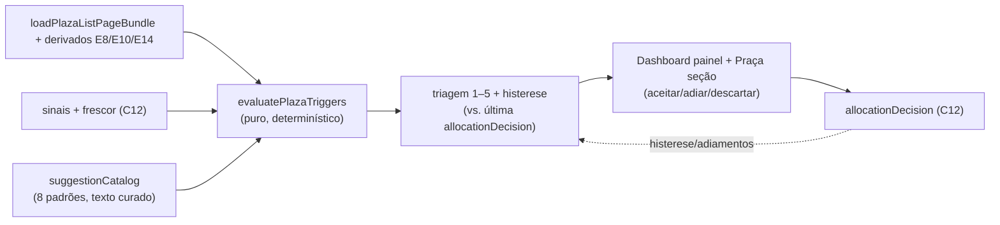

# E11 — Motor de sugestões v1 (dado → decisão com humano no loop)

Status: rascunho
Atualizado em: 2026-07-21
Item do roadmap: [docs/roadmap.md](../roadmap.md) (seção "Inteligência de campanha", E11; plano-mestre [inteligencia-campanha.md](inteligencia-campanha.md))
Impeccable: C — superfície nova de sugestões (painel/fila em `/campanha`), sem design-ref
Appetite: ~3 dias eng; sem migration própria (lê E8/E10/E14 e grava via `allocationDecision` de C12)
Responsável: —

## Design (Impeccable)

Âncoras: `PRODUCT.md` (princípios 2, 5 e 7) / `DESIGN.md` (register `product`) · `CampaignPageShell`/`CampaignMetricStrip` · precedente de stack de insights (Alert + badge) do detalhe da Praça.

Na implementação: shape → craft → critique → polish (classe C).

Brief compacto:

- **Persona / contexto:** coordenador abrindo o Teqo segunda de manhã ("o que mudou? onde ajo?"); assessor com 20 Praças recebendo as checagens baratas da semana.
- **Job principal:** o grosso da análise chega pronto — praças com gatilho, diagnóstico diferencial e menu de ações; o humano escolhe, e o descarte também é registro.
- **Estratégia de cor:** Restrained; urgência via posição na triagem (níveis 1–5), não via alarme colorido — só o nível 1 usa o vermelho de campanha.
- **Edit where you see:** sim — aceitar/adiar/descartar direto no card da sugestão; descarte exige leitura alternativa (1 campo).
- **Anti-goals:** sugestão executada automaticamente; feed infinito estilo rede social; score numérico com falsa precisão ("87% de chance"); expor limiares exatos na UI (gaming — G4).

## Contexto

Relatório §6: catálogo de 25 padrões dado→decisão (P/T/I/J/K) com triagem (§6.2), divisão análise×julgamento (§6.3 — máquina detecta e diagnostica o estrutural; humano escolhe/executa) e modos de falha com mitigação (§6.4 — falso positivo de registro, viés da base, gaming, oráculo, churn). Pós-E8/E10/E14/C12, todos os insumos dos 8 padrões de maior confiança existem: P1 (reduto dormente/ameaçado), P2 (ataque campo forte), P3 (correligionário na frente — `runningAgain2026` dá a herança aberta), P5 (expansão acima do padrão), P6 (praça grande sem rede), P7 (pledges estagnados), K-A (não responde a investimento), K-B (perdida vestida de oportunidade). A "pauta do silêncio" (praças sem gatilho nenhum, revisadas como pergunta mensal) integra a v1 por ser barata e antídoto do viés da base.

## Objetivos

- **Avaliador de gatilhos** puro e determinístico: praça + derivados (E8/E10/E14) + sinais/frescor (C12) → lista de `TriggeredPattern` (patternId, fatores, nível de triagem 1–5, leitura provável, descartes, menu de ações com estatuto/fonte, contraindicação) — conteúdo textual vem de um catálogo versionado em código espelhando o relatório §6.
- **Superfície:** painel "Sugestões" no dashboard (top-N por triagem) + seção na Praça (gatilhos dela); visão do assessor filtrada às suas Praças com as checagens baratas ("checar rede em 48h") destacadas.
- **Ações:** aceitar (vira nota/encaminhamento e grava `allocationDecision` com snapshot), adiar (some por X dias), descartar (exige `alternativeReading`); tudo transacional.
- **Regras anti-falha (§6.4):** gatilho de ausência gera "auditar registro", nunca ação de campo; histerese — sugestão de realocação cara só aparece com persistência de 2 avaliações semanais (persistência via snapshot em `allocationDecision` de avaliações, sem tabela nova: recomputa e compara com a última decisão/adiamento registrado); limiares nunca renderizados com número exato.
- **Pauta do silêncio:** lista mensal das praças N2+ sem nenhum gatilho e sem sinal — "silêncio é pergunta, não conforto".
- Access: staff; visão do assessor escopada (`getAccessiblePlazaIds`); `leader` não vê nada disso.

## Decisões travadas

- **Motor é avaliador em leitura, não job persistido.** Roda no load (dados de 436 praças já vêm no bundle A9+); persistência só de DECISÕES (C12). **Rejeitado:** cron + tabela de sugestões (estado duplicado que dessincroniza; nada aqui exige assincronia); LLM gerando sugestões em runtime (indeterminístico, não auditável — o catálogo é curado em código a partir do relatório).
- **8 padrões na v1, catálogo fechado.** **Rejeitado:** 25 padrões de uma vez (metade depende de semanas de sinais C12; falso positivo mata a confiança na primeira semana — E1 do relatório).
- **Descartar exige leitura alternativa.** É o antídoto metodológico do oráculo (§6.4) e o dado que o backtest precisa. **Rejeitado:** descarte de 1 clique sem motivo.
- **i18n e naming:** `evaluatePlazaTriggers`, `TriggeredPattern`, `triageLevel`, `suggestionCatalog`; patternIds estáveis (`P1`…`K-B`); textos pt-BR citando estatuto ("hipótese de literatura — relatório §6.1").

## Questões em aberto

- **Onde mora a superfície principal?** Opções: painel no dashboard | rota `/campanha/sugestoes` | aba na lista de Praças. **Recomendação:** painel no dashboard (top-5) + seção completa no detalhe da Praça; rota dedicada só se o volume real pedir (adiado com gatilho). _(shape na implementação decide o layout final)_
- **Adiamento por quanto tempo?** **Recomendação:** 7 dias default, 14 para nível 4–5; registrado como `decision: adiada`.

## Abordagem proposta

Componentes:

- **`src/lib/suggestionCatalog.ts`**: os 8 padrões com gatilho (função pura sobre derivados), textos (leitura/descartes/menu/contraindicação com estatuto) e nível de triagem — espelho versionado do relatório §6.1.
- **`src/utilities/plazaTriggers.ts`**: avaliação por praça + agregação/ordenação por triagem; consulta últimas `allocationDecision` para histerese/adiamento (1 query por load, `where` em plaza in […]).
- **UI:** `SuggestionCard`/`SuggestionPanel` em `src/components/campaign/` (compõe Alert/Badge existentes do stack de insights); painel no dashboard (`campaignDashboardData.ts` estende o load); seção no detalhe da Praça.
- **Action:** `recordAllocationDecision` (C12) reusada; wrapper `resolveSuggestion` valida `alternativeReading` no descarte.
- **Sem migration.**

## Dependências

- Duras: **E8**, **E10**, **C12**; **E9** (a fila de colunas é onde o coordenador confere o contexto da sugestão). Suaves: **E14** (nível no snapshot e em K-B→N0/N1), dados reais da Onda 0 (motor é inútil com praças vazias — smoke com dados fictícios apenas).
- Reusa: bundle A9+, `campaignDashboardData.ts`, `campaignAccess.ts`, `withPayloadTransaction`.

## Não escopo

- Padrões T (TI — E12), I/J (alienação/agenda — fase 2), G2-hierarquia completa entre praças de níveis diferentes além da triagem 1–5; notificação push (D2); qualquer automação de ação.

## Rabbit holes

- **Catálogo virar motor de regras genérico** (DSL, editor de regras). 8 funções puras nomeadas bastam; DSL é plataforma white-label, não este ciclo.
- **Histerese exigir tabela de avaliações.** Comparar com a última `allocationDecision`/adiamento cobre a v1; se falhar na prática, aí sim revisitar persistência.
- **Explicabilidade virar relatório longo.** Card mostra 2 fatores + estatuto + link "por quê" (relatório §6.1); não gerar texto por praça.

## Adiado com gatilho

- **Fase 2 do catálogo (T1–T5, I-A/I-B/I-C, J-A/J-B/J-C, P4/P8–P12, K-C).** Gatilho: 2 semanas de uso real + primeiras 20 `allocationDecision`.
- **Rota dedicada `/campanha/sugestoes`.** Gatilho: >15 sugestões ativas recorrentes tornando o painel do dashboard insuficiente.
- **Digest semanal (e-mail/push).** Gatilho: D2 entregue.

## Referências

- `docs/roadmap.md` (Inteligência de campanha, E11) · [plano-mestre](inteligencia-campanha.md) (fila canônica, G4-mitigações)
- `docs/research/relatorio-entrevista-persona-campanha.md` §6.1 (padrões), §6.2 (triagem), §6.3 (divisão análise×julgamento), §6.4 (modos de falha)
- `src/utilities/plazaPageData.ts`, `src/utilities/campaignDashboardData.ts`, `src/utilities/campaignAccess.ts`, `src/collections/ElectionCandidate.ts` (`runningAgain2026`)
- `PRODUCT.md` princípio 5 / `DESIGN.md` — âncoras da superfície
- AGENTS.md — access, transações, naming
