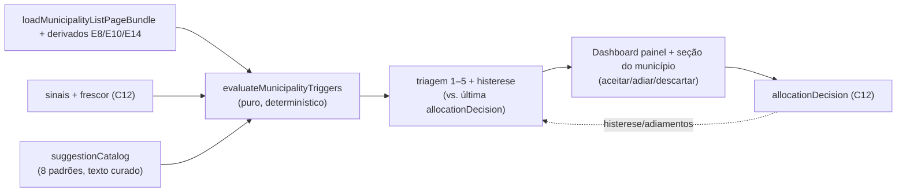

# E11 — Motor de sugestões v1 (dado → decisão com humano no loop)

Status: entregue (2026-07-28)
Atualizado em: 2026-07-28 (as-built; revisões da auditoria pré-implementação registradas abaixo)
Item do roadmap: [docs/roadmap.md](../roadmap.md) (seção "Inteligência de campanha", E11; plano-mestre [inteligencia-campanha.md](inteligencia-campanha.md))
Impeccable: C — superfície nova de sugestões (painel/fila em `/campanha`), sem design-ref
Appetite: ~3 dias eng; **uma migration mínima** (`20260728_041547_add_allocation_decision_adiada_outcome` — o plano dizia "sem migration", ver revisão)
Responsável: —

## As-built (2026-07-28)

- **Catálogo:** `src/lib/suggestionCatalog.ts` (client-safe — o formulário de descarte oferece os "descartes" do padrão como quick-picks, então o browser precisa dos textos): 8 padrões com predicados puros sobre `MunicipalityTriggerInput` (números já derivados, sem artefato), textos do §6.1, triagem 1–5 com rótulos do §6.2 (`suggestionTriageLabels`), âncoras ilustrativas em `SUGGESTION_ANCHORS` (interno), janelas de supressão (`aceita` 14d / `descarta` 30d / `adiada` até `suppressUntil` do snapshot) e `isSuggestionSuppressedByDecision` — pura, com a regra "nível 1 fura a fila": um gatilho que volta como nível 1 atravessa supressão registrada em urgência menor. Diferencial estrutural codificado (§6.3): P2 cede a P3 e K-B; P7 cede a K-A quando há esforço registrado no ciclo.
- **Avaliador:** `src/utilities/municipalityTriggers.ts` (`server-only`), no molde de `visitPlannerData.ts` (leitura própria de `municipality` — o select do scope compartilhado não tem `engagementLevel`/`lastUpdateAt`): 6 leituras em `Promise.all` (pledges, contagem de lideranças exportada de `visitPlannerData`, metas `cache()`, sinais `kind: 'sinal'` ≤28d, atividades ≥now−42d, últimas `allocationDecision` ≤90d por padrão), LQ por ano com a fórmula exata do E10, cortes de catálogo memoizados por processo (mediana + quartil superior + padrão intracampo estadual). Pauta do silêncio = alta/N2+ sem gatilho DISPARADO (supressão não conta como silêncio) e sem sinal ≥30d.
- **Decisão:** `resolveSuggestionRecord` (`actions/suggestion.ts`) **reavalia o padrão server-side** — o snapshot registra os fatores do momento da decisão, nunca os do render; padrão fora da fila recusa com `SUGGESTION_STALE_MESSAGE` (safe message). Transação + lock `municipality-suggestion:{id}:{patternId}` antes de reler a última decisão. `adiada` deriva a duração do nível recomputado (7d; 14d nos níveis 4–5) e grava `suppressUntil` no snapshot. Aceite exige a ação do menu (zod valida contra o catálogo); descarte exige `alternativeReading` (zod + hook da collection). Casca `runCampaignFormAction` em `(app)/suggestionFormActions.ts` — compartilhada pelas duas superfícies.
- **UI:** `src/components/campaign/suggestion/` — `SuggestionsPanel` (RSC; estatuto no rodapé; `CampaignInfoHint` → conceitos) + `SuggestionCard` (ilha client: Aceitar com radios do menu — 1º item pré-selecionado, é a checagem barata — + nota opcional; Adiar em um toque com a duração no rótulo; Descartar com quick-picks + textarea obrigatória; submit explícito — a exceção prevista para flows com nota/confirmação, mesmo precedente do E14). Dashboard: slot Suspense `suggestionsSlot` (top-5 + pauta do silêncio com chips). Detalhe do município: card na `OverviewTab` após elegibilidade de visita, lista completa; município silencioso diz isso no empty state. Foco gerenciado na troca trigger↔form (abrir foca o primeiro campo; cancelar devolve ao trigger). Cor contida: só nível 1 usa `destructive`.
- **Conceitos (E18):** `triagem-de-sugestoes` e `pauta-do-silencio` em `diagnostico`.
- **Testes:** `suggestionCatalog.unit.spec.ts` (45 casos — red/green por predicado, exclusividade dos diferenciais, supressão incl. pierce de nível 1 e snapshot malformado) e `campaignSuggestions.int.spec.ts` (9 casos — P7 end-to-end com decisões governando a fila, K-A vs P7, P6 com priorização mudando a triagem, escopo do advisor/leader, silêncio, action: aceite/adiamento/descarte/stale/fora-de-escopo). Padrões ancorados no artefato (P1/P2/P3/P5/K-B) não são encenáveis por linhas do banco — os int tests que precisam de propriedade de artefato alocam municípios pelo alocador das fixtures até um qualificar (taxas medidas: 109/435 quartil superior, 205/435 quietos; slug explícito colidiria com o alocador, que é uma sequence com wrap).
- **Medidas:** First Load JS de `/campanha` 268 → 277 kB (catálogo + ilha do card; medido pós-simplify); suíte completa 453 testes em ~84s.

## Pós-`/simplify` (mesma sessão, 2026-07-28)

Três revisores paralelos (qualidade, performance, reuso); tudo aplicado sem mudança de comportamento observável, exceto onde dito:

- **Perf P1 — o dashboard varria `votePledge` duas vezes por request:** o avaliador re-agregava com `aggregatePledgesByMunicipality` o que `loadMunicipalityScope` (React `cache()`, já pago pelo `getCampaignDashboardData` no mesmo request) segura em `pledgeAggregates`. O caminho sem filtro agora reusa o scope; o caminho com `municipalityID` (detalhe/action) mantém a agregação de 1 município — puxar o scope inteiro ali seria o erro inverso.
- **Janela de decisões derivada, não chutada:** buscava 90 dias de `allocationDecision` quando nada acima de `max(supressões, adiamento máximo)` = 30d pode suprimir — `SUGGESTION_INPUT_WINDOWS.decisionDays` agora é computada das constantes (linhas jsonb crescem com uso real).
- **Bundle do cliente — a lição do B14 de novo:** o catálogo importava `ELECTION_YEAR_*` de `lib/electionResults`, cujo primeiro import é `bahiaTerritories` — três números arrastavam a tabela de territórios para o chunk do card. Anos locais com comentário apontando o espelho.
- **`triggerSummary` era copy morta** (8 parágrafos que nada renderizava — o card mostra leitura + fatores + menu): campo deletado do tipo e dos 8 padrões.
- **`silence.totalCount` era estado derivado** (sempre `entries.length`): o bundle expõe `silence: MunicipalitySilenceEntry[]` e a faixa deriva as contagens.
- **Filtro de tipo de sinal desceu para o `where`** (`signalType: { in: [invasao, visita_adversario, proposta_broker] }`) — menos linhas trafegadas e morreu o único cast do delivery.
- **LQ 2022 reusa `classification.lq`** (mesma fórmula, memoizada) em vez de recomputar ao lado — `lqForYear` fica só para 2014/2018.
- **Copy dos fatores alinhada ao canônico** de `formatDominanceAgainstOwnStandard` ("… o padrão estadual **do candidato**", sem prefixo "LQ") — "próprio" era uma terceira variação do possessivo que a docstring do E10 já proibia.
- **Card adotou os primitivos `ui/field`** (`FieldSet`/`FieldLegend`/`FieldLabel`, idioma do `ActivityForm`) no lugar de fieldset/legend/label à mão; `DAY_MS` (3 declarações no delivery) e `SUGGESTION_TEXT_MAX_LENGTH` unificados no catálogo; `formatSilenceAgeLabel` mudou para `municipalitySignal.ts`, ao lado do formatter irmão de idade de sinal.
- **Correção de registro:** as suítes são **685 unit / 453 int** — o número anterior desta página ("suíte 453") era só a fase int.

**Recomendações que ficaram (maiores que o cleanup):** consolidar as ~4 leituras de pledges/lideranças que a `OverviewTab` do detalhe faz por três loaders não coordenados (conta da cadeira + elegibilidade + sugestões — composição pré-existente, o E11 só somou o 4º caminho barato); extrair `firstErrorMessage`/`toMessageOnlyState` (card + apoiadores) para `campaignFormActionError.ts` **no 3º call site** — hoje arrastaria zod para o bundle do card; mover `formatDominanceAgainstOwnStandard` para `lib/` (cadeia com `formatRatioAsPercentLabel`) quando um segundo módulo `lib` precisar dele; os memos de estatística do catálogo (quartil superior, padrão intracampo estadual) migram para `municipalityPotential.ts` quando ganharem um 2º consumidor (precedente E13).

## Revisões da auditoria (2026-07-28)

- **"Sem migration" caiu:** o enum real de `allocationDecision.outcome` era `aceita | descarta | movimento` — o plano citava `aceita|descartada|adiada` (valores que nunca existiram). "Adiar" exigiu a migration `add_allocation_decision_adiada_outcome` (precedente exato: E14 adicionou `movimento`). Registrar adiamento como descarte especial foi rejeitado — envenenaria o dado de leitura alternativa do backtest (E15).
- **Refs mortas corrigidas:** `electionInsights.ts` (deletado no Pass 2) e o stack `NucleusInsights` (não existe; o precedente vivo é `MunicipalityVisitEligibilityCard`) saíram da abordagem; "bundle A9+ no dashboard" — o dashboard usa `loadMunicipalityScope`, e o avaliador faz leitura própria (mesma justificativa do planner E13).
- **P3 sem `runningAgain2026`:** o campo existe mas está 100% `desconhecido` e sem read path — o gatilho usa só o artefato (campo forte + fatia intracampo < 0,5× o padrão estadual próprio, com gate de volume na mediana); "concorre de novo?" é o 1º item do menu (inteligência), não gatilho.
- **Proxies assumidos (calibráveis, E15):** P7 "delta ≈ 0" = cobertura < meta + `lastPledgeAt` ≥ 21d (trajetória por versions fica para a fase 2); P2 sem NEC (mesmo corte do E10 — gatilho segue sendo E11 fase 2 precisar do eixo de competição); persistência/histerese sem tabela nova — janelas temporais nos próprios gatilhos + supressão pela última decisão; o rebaixamento caro continua protegido no write path do E14.
- **Pauta do silêncio inclui `priority: alta`** além de N2+ — E14 nasceu sem backfill; só N2+ daria pauta vazia até a triagem de níveis acontecer.

## Design (Impeccable)

Âncoras: `PRODUCT.md` (princípios 2, 5 e 7) / `DESIGN.md` (register `product`) · `CampaignPageShell`/`CampaignMetricStrip` · precedente de stack de insights (Alert + badge) do detalhe do município.

Na implementação: shape → craft → critique → polish (classe C).

Brief compacto:

- **Persona / contexto:** coordenador abrindo o Teqo segunda de manhã ("o que mudou? onde ajo?"); assessor com 20 municípios recebendo as checagens baratas da semana.
- **Job principal:** o grosso da análise chega pronto — municípios com gatilho, diagnóstico diferencial e menu de ações; o humano escolhe, e o descarte também é registro.
- **Estratégia de cor:** Restrained; urgência via posição na triagem (níveis 1–5), não via alarme colorido — só o nível 1 usa o vermelho de campanha.
- **Edit where you see:** sim — aceitar/adiar/descartar direto no card da sugestão; descarte exige leitura alternativa (1 campo).
- **Anti-goals:** sugestão executada automaticamente; feed infinito estilo rede social; score numérico com falsa precisão ("87% de chance"); expor limiares exatos na UI (gaming — G4).

## Contexto

Relatório §6: catálogo de 25 padrões dado→decisão (P/T/I/J/K) com triagem (§6.2), divisão análise×julgamento (§6.3 — máquina detecta e diagnostica o estrutural; humano escolhe/executa) e modos de falha com mitigação (§6.4 — falso positivo de registro, viés da base, gaming, oráculo, churn). Pós-E8/E10/E14/C12, todos os insumos dos 8 padrões de maior confiança existem: P1 (reduto dormente/ameaçado), P2 (ataque campo forte), P3 (correligionário na frente — `runningAgain2026` dá a herança aberta), P5 (expansão acima do padrão), P6 (município grande sem rede), P7 (pledges estagnados), K-A (não responde a investimento), K-B (perdida vestida de oportunidade). A "pauta do silêncio" (municípios sem gatilho nenhum, revisados como pergunta mensal) integra a v1 por ser barata e antídoto do viés da base.

## Objetivos

- **Avaliador de gatilhos** puro e determinístico: município + derivados (E8/E10/E14) + sinais/frescor (C12) → lista de `TriggeredPattern` (patternId, fatores, nível de triagem 1–5, leitura provável, descartes, menu de ações com estatuto/fonte, contraindicação) — conteúdo textual vem de um catálogo versionado em código espelhando o relatório §6.
- **Superfície:** painel "Sugestões" no dashboard (top-N por triagem) + seção no município (gatilhos dela); visão do assessor filtrada às seus municípios com as checagens baratas ("checar rede em 48h") destacadas.
- **Ações:** aceitar (vira nota/encaminhamento e grava `allocationDecision` com snapshot), adiar (some por X dias), descartar (exige `alternativeReading`); tudo transacional.
- **Regras anti-falha (§6.4):** gatilho de ausência gera "auditar registro", nunca ação de campo; histerese — sugestão de realocação cara só aparece com persistência de 2 avaliações semanais (persistência via snapshot em `allocationDecision` de avaliações, sem tabela nova: recomputa e compara com a última decisão/adiamento registrado); limiares nunca renderizados com número exato.
- **Pauta do silêncio:** lista mensal dos municípios N2+ sem nenhum gatilho e sem sinal — "silêncio é pergunta, não conforto".
- Access: staff; visão do assessor escopada (`getAccessibleMunicipalityIds`); `leader` não vê nada disso.

## Decisões travadas

- **Motor é avaliador em leitura, não job persistido.** Roda no load (dados de 435 municípios já vêm no bundle A9+); persistência só de DECISÕES (C12). **Rejeitado:** cron + tabela de sugestões (estado duplicado que dessincroniza; nada aqui exige assincronia); LLM gerando sugestões em runtime (indeterminístico, não auditável — o catálogo é curado em código a partir do relatório).
- **8 padrões na v1, catálogo fechado.** **Rejeitado:** 25 padrões de uma vez (metade depende de semanas de sinais C12; falso positivo mata a confiança na primeira semana — E1 do relatório).
- **Descartar exige leitura alternativa.** É o antídoto metodológico do oráculo (§6.4) e o dado que o backtest precisa. **Rejeitado:** descarte de 1 clique sem motivo.
- **i18n e naming:** `evaluateMunicipalityTriggers`, `TriggeredPattern`, `triageLevel`, `suggestionCatalog`; patternIds estáveis (`P1`…`K-B`); textos pt-BR citando estatuto ("hipótese de literatura — relatório §6.1").

## Questões em aberto

- **Onde mora a superfície principal?** Opções: painel no dashboard | rota `/campanha/sugestoes` | aba na lista de municípios. **Recomendação:** painel no dashboard (top-5) + seção completa no detalhe do município; rota dedicada só se o volume real pedir (adiado com gatilho). _(shape na implementação decide o layout final)_
- **Adiamento por quanto tempo?** **Recomendação:** 7 dias default, 14 para nível 4–5; registrado como `decision: adiada`.

## Abordagem proposta

Componentes:

- **`src/lib/suggestionCatalog.ts`**: os 8 padrões com gatilho (função pura sobre derivados), textos (leitura/descartes/menu/contraindicação com estatuto) e nível de triagem — espelho versionado do relatório §6.1.
- **`src/utilities/municipalityTriggers.ts`**: avaliação por município + agregação/ordenação por triagem; consulta últimas `allocationDecision` para histerese/adiamento (1 query por load, `where` em municipality in […]).
- **UI:** `SuggestionCard`/`SuggestionPanel` em `src/components/campaign/` (compõe Alert/Badge existentes do stack de insights); painel no dashboard (`campaignDashboardData.ts` estende o load); seção no detalhe do município.
- **Action:** `recordAllocationDecision` (C12) reusada; wrapper `resolveSuggestion` valida `alternativeReading` no descarte.
- **Sem migration.**

## Dependências

- Duras: **E8**, **E10**, **C12**; **E9** (a fila de colunas é onde o coordenador confere o contexto da sugestão). Suaves: **E14** (nível no snapshot e em K-B→N0/N1), dados reais da Onda 0 (motor é inútil com municípios vazios — smoke com dados fictícios apenas).
- Reusa: bundle A9+, `campaignDashboardData.ts`, `campaignAccess.ts`, `withPayloadTransaction`.

## Não escopo

- Padrões T (TI — E12), I/J (alienação/agenda — fase 2), G2-hierarquia completa entre municípios de níveis diferentes além da triagem 1–5; notificação push (D2); qualquer automação de ação.

## Rabbit holes

- **Catálogo virar motor de regras genérico** (DSL, editor de regras). 8 funções puras nomeadas bastam; DSL é plataforma white-label, não este ciclo.
- **Histerese exigir tabela de avaliações.** Comparar com a última `allocationDecision`/adiamento cobre a v1; se falhar na prática, aí sim revisitar persistência.
- **Explicabilidade virar relatório longo.** Card mostra 2 fatores + estatuto + link "por quê" (relatório §6.1); não gerar texto por município.

## Adiado com gatilho

- **Fase 2 do catálogo (T1–T5, I-A/I-B/I-C, J-A/J-B/J-C, P4/P8–P12, K-C).** Gatilho: 2 semanas de uso real + primeiras 20 `allocationDecision`.
- **Rota dedicada `/campanha/sugestoes`.** Gatilho: >15 sugestões ativas recorrentes tornando o painel do dashboard insuficiente.
- **Digest semanal (e-mail/push).** Gatilho: D2 entregue.

## Referências

- `docs/roadmap.md` (Inteligência de campanha, E11) · [plano-mestre](inteligencia-campanha.md) (fila canônica, G4-mitigações)
- `docs/research/relatorio-entrevista-persona-campanha.md` §6.1 (padrões), §6.2 (triagem), §6.3 (divisão análise×julgamento), §6.4 (modos de falha)
- `src/utilities/municipalityPageData.ts`, `src/utilities/campaignDashboardData.ts`, `src/utilities/campaignAccess.ts`, `src/collections/ElectionCandidate.ts` (`runningAgain2026`)
- `PRODUCT.md` princípio 5 / `DESIGN.md` — âncoras da superfície
- AGENTS.md — access, transações, naming
