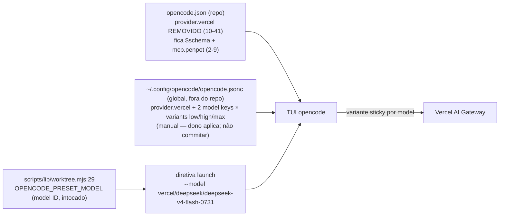

# Impl: Mover as variantes do provider Vercel AI Gateway para a config global do opencode

Status: rascunho
Atualizado em: 2026-08-24
Issue: #836
Intenção: docs/plans/mover-variantes-vercel-global.md
Appetite restante: ~0,25–0,5 dia herdado (config-only + prosa; sem migration, sem testes novos)

## Leitura da intenção

- **Outcome:** o repo `opencode.json` fica mínimo (só `$schema` + `mcp.penpot`); as variantes low/high/max dos dois DeepSeek V4 Flash do Vercel AI Gateway passam a viver no global `~/.config/opencode/opencode.jsonc` (manual, fora do repo — nada é commitado); os textos vivos do repo que localizam as variantes passam a apontar para a config global; comportamento do opencode inalterado antes/depois (`opencode debug config` mostra vercel com variants, `opencode run --model vercel/deepseek/deepseek-v4-flash-0731 --variant max` responde, TUI cicla variantes); `pnpm worktree next` segue emitindo `--model vercel/deepseek/deepseek-v4-flash-0731` com o teste unit intacto.
- **O que NÃO negociar:** anti-goals da intenção — NÃO mover o preset de launch para o repo (fica no script — model ID, não bloco de config); NÃO mexer em auth/rota do gateway Vercel; NÃO editar docs históricos congelados (`docs/plans/*`, `docs/CHANGELOG-AGENTS.md`, `docs/changelog/*`). Aceite **condicionado à edição manual do global pelo dono** (arquivo fora do repo).
- **O que reavaliar:** hipóteses da "Direção no codebase" — confirmadas ao vivo com os números exatos: o bloco a mover é `opencode.json:10-41` (fecha em `}` na linha 41; sobram `$schema` + `mcp.penpot`, linhas 2–9); o docblock que localiza as variantes é o de `OPENCODE_PRESET_MODEL` em `scripts/lib/worktree.mjs` (frase em `:26-27` pré-edição, `:26-28` pós; constante `:30`, intocada); a prosa é `.agents/skills/worktree-next-issue/SKILL.md:34`. Verificado também: **nenhum teste lê `opencode.json` estruturalmente** (`readFileSync`/`JSON.parse` em `tests/`: zero) e nenhum gate/lint/CI o lê (`.github/` zero matches) — a remoção do bloco não tem ponto de quebra automatizado. O estilo JSONC do global é `//` em pt-BR (visto no arquivo real: `cheapestinception`, `deepinfra`, comentários de MCP) — o bloco colado segue esse estilo.

## Abordagem recomendada



**Opções consideradas (onde vivem as variantes):** A | B | C
**Recomendação:** A — remover `provider.vercel` inteiro do repo (`opencode.json:10-41`) e colar o mesmo bloco no global `~/.config/opencode/opencode.jsonc`, com comentário explicativo no estilo JSONC do arquivo. É o dono natural da preferência: as variantes não carregam secret (auth vive em `~/.local/share/opencode/auth.json`), configs do opencode são merged (global + projeto somam — a remoção do repo não quebra nada), o precedente OPS82 já removeu o twin `cheapest-inference` do repo com "edit the owner, don't twin", e o anti-goal original do OPS78 era não commitar config de opencode no repo. O preset de launch referencia o MODEL ID, não o bloco — nada de launch depende do bloco no repo.
**Rejeitadas:**

- **B — manter cópia no repo + adicionar no global (twin):** viola engineering-standards ("edit the owner, don't twin") e o precedente OPS82; as duas cópias divergem cedo ou tarde, e o repo volta a commitar config opencode (anti-goal OPS78).
- **C — status quo (manter só no repo, atualizar só os textos):** não atende o outcome — o repo continua com `provider.vercel` commitado e as variantes seguem presas à máquina errada.

**Opções consideradas (textos vivos):** A | B
**Recomendação:** A — atualizar os dois textos que localizam as variantes (`worktree.mjs` docblock + `worktree-next-issue/SKILL.md`) na **mesma** mudança, junto da remoção. Senão os textos mentem para o próximo dev que ler o docblock ou a skill. **Rejeitada: B** (só o docblock, adiar a skill) porque a prosa da skill é o texto que um agente lê ao executar o fluxo worktree — ficaria apontando para um bloco que não existe mais.

**Preset de launch (não-decisão):** `OPENCODE_PRESET_MODEL` (`scripts/lib/worktree.mjs:29`), a interpolação do help em `scripts/worktree.mjs`, o comentário de `.agents/shell/worktree.sh:10` e os pins do teste unit ficam exatamente como estão — o preset é um model ID, não um bloco de config; movê-lo seria anti-goal explícito.

### Componentes / mudanças

- **`opencode.json`** (raiz, `:10-41`): **remover inteiro** o bloco `provider.vercel` (2 model keys × variants low/high/max). O `},` da linha 9 vira `}` (JSON estrito — sem trailing comma); o arquivo final fica com 10 linhas: `$schema` + `mcp.penpot`, sem `provider`.
- **`scripts/lib/worktree.mjs`** (`:26-27`, docblock de `OPENCODE_PRESET_MODEL`): substituir a frase "the low/high/max variants are exposed by the `provider.vercel` override in `opencode.json`." por:
  ```
   * `-0731` flavor (input $0.076/M vs $0.13/M); the low/high/max variants are
   * exposed by the `provider.vercel` override in the global opencode config
   * (`~/.config/opencode/opencode.jsonc`, outside the repo — OPS89).
  ```
  (linhas 24–25 do docblock — histórico OPS78/OPS82 — permanecem; a frase editada ocupa `:26-28` pós-edição e a constante `:30` fica intocada)
- **`.agents/skills/worktree-next-issue/SKILL.md`** (`:34`): na frase "variantes low/high/max do model override em `opencode.json`, selecionáveis no TUI e sticky por model", substituir "do model override em `opencode.json`" por "do model override na config global do opencode (`~/.config/opencode/opencode.jsonc`)". O literal `--model vercel/deepseek/deepseek-v4-flash-0731` na mesma linha **fica**.
- **Global `~/.config/opencode/opencode.jsonc`** (FORA do repo — **MANUAL, o dono aplica; não commitar**): inserir `provider.vercel` como sibling dentro do objeto `"provider"` existente — após o fechamento do bloco `deepinfra` (linha ~156 atual) e antes do `}` que fecha `provider` (~157). Bloco a colar, no estilo JSONC do arquivo (comentário `//` pt-BR):
  ```jsonc
      "vercel": {
        // Vercel AI Gateway (built-in models.dev). Variantes low/high/max dos
        // dois DeepSeek V4 Flash — selecionáveis no TUI (Ctrl+T) ou
        // `opencode run --variant max`. Migrado do `opencode.json` do repo em
        // OPS89: variantes são preferência de máquina (auth vive em auth.json)
        // e o repo fica mínimo (só mcp.penpot). Sem este bloco, o Vercel não
        // expõe as variantes.
        "models": {
          "deepseek/deepseek-v4-flash": {
            "variants": {
              "low": {
                "reasoningEffort": "low"
              },
              "high": {
                "reasoningEffort": "high"
              },
              "max": {
                "reasoningEffort": "max"
              }
            }
          },
          "deepseek/deepseek-v4-flash-0731": {
            "variants": {
              "low": {
                "reasoningEffort": "low"
              },
              "high": {
                "reasoningEffort": "high"
              },
              "max": {
                "reasoningEffort": "max"
              }
            }
          }
        }
      }
  ```
  (formato expandido igual ao do bloco repo atual e ao estilo do `cheapestinception` global; provider `vercel` é built-in/models.dev — sem `npm`/`options`; sem trailing comma, pois vira o último membro de `"provider"` — o `deepinfra` anterior mantém a vírgula dele)
- **Migration:** sem migration — configuração/tooling + prosa; nenhum schema de Payload muda.
- **Access / Consent:** N/A — não há collection nem dado de cidadão envolvido; não afeta login de campanha nem LGPD.
- **UI:** N/A — o TUI do opencode é consumidor (verificação do aceite), não produto deste plano.

## Fases verificáveis

1. **Repo (tracer)** — `opencode.json`: remover `:10-41` (o `},` da linha 9 vira `}` — resultado: 10 linhas, JSON válido); `scripts/lib/worktree.mjs:26-27` (docblock); `.agents/skills/worktree-next-issue/SKILL.md:34` (prosa). Verificar: `node -e "JSON.parse(require('fs').readFileSync('opencode.json','utf8'))"` e `git diff` mostrando **apenas** esses 3 arquivos. Quota: maior parte do appetite (é todo o código do plano).
2. **Gates** — `pnpm gate:fast` (guards → lint → format → typecheck → knip → cycles → unit) verde: `tests/unit/worktree.unit.spec.ts` intacto continua pinando o literal do model ID (`:151,159,165,171,177,180,185,196`) e a constante (`:185`) — nenhuma asserção lê `opencode.json`. Push via `pnpm push` → CI PR (`checks`). Quota: resto do appetite.
3. **Global (MANUAL — dono; condiciona o aceite)** — colar o bloco `provider.vercel` no `~/.config/opencode/opencode.jsonc`; `opencode debug config` mostra vercel com variants; `opencode run --model vercel/deepseek/deepseek-v4-flash-0731 --variant max` responde; TUI mostra as variantes (Ctrl+T). Ordem recomendada: **global primeiro, PR depois** (merge soma — sem janela de perda).

## Rabbit holes / Não escopo (engenharia)

- NÃO reorganizar o `opencode.jsonc` global inteiro (corte: tocar apenas vercel/variantes; `permission`, `mcp`, `cheapestinception`, `deepinfra` ficam intactos).
- NÃO manter o bloco no repo por medo (twin — corte: o aceite cobre o launch via `worktree next` + `debug config`; se algo quebrar, o plano volta ao repo com evidência).
- NÃO tocar em `scripts/worktree.mjs:240,345`, `.agents/shell/worktree.sh:10`, `AGENTS-infra.md:13` — citam `opencode.json` só pelo `mcp.penpot`/`penpot-token` (o MCP penpot fica; remover o `mcp` sim quebraria o launch).
- NÃO mexer em `tests/unit/opencodeCommands.unit.spec.ts` (frontmatter `model:` dos comandos de execução, provider direto, sem vercel — anti-goal) nem em `tests/unit/worktree.unit.spec.ts` (nada muda).
- NÃO editar docs históricos congelados (`docs/CHANGELOG-AGENTS.md`, `docs/changelog/*`, `docs/plans/*` — a entrada de changelog desta entrega é criada depois, no fluxo padrão `docs/changelog/<data>-<id>.md` + `pnpm changelog:build`).
- NÃO mudar `OPENCODE_PRESET_MODEL`, a auth nem a rota do gateway Vercel.

## Riscos e mitigação

- **Dono não aplicar o bloco global (ou aplicar depois do merge do PR)** → a entrega só fecha com o aceite da Fase 3 (a intenção condiciona o aceite à edição pelo dono). Enquanto o global não tem o bloco, `opencode debug config` deixa de mostrar as variants do Vercel (o repo já não as tem) — janela aceita e documentada; ordem recomendada: global primeiro. Se o dono não aplicar, volta ao repo com evidência (o inverso do rabbit hole "manter por medo" — gatilho explícito).
- **Divergência de variants entre global e repo durante a transição** → configs do opencode são merged (soma, não substitui): com os dois blocos idênticos presentes, o conjunto resolvido é o mesmo; sem janela de perda. A única divergência possível é a ausência temporária (risco acima).
- **JSONC inválido no global** → o loader do opencode falha alto em config inválida; o dono valida com `opencode debug config` imediatamente após colar (Fase 3).
- **`opencode.json` inválido no repo** (JSON estrito, sem comentários) → `node -e "JSON.parse(...)"` na Fase 1 antes de commit.
- **Referência viva a `opencode.json` fora da lista** → pós-mudança, `grep -rn "opencode.json" scripts .agents AGENTS-infra.md` deve retornar só as refs de `mcp.penpot`/`penpot-token` (`scripts/worktree.mjs:240,345`, `AGENTS-infra.md:13`) e nenhuma menção a `provider.vercel`.
- **Sticky variant preso ao model key** → os model keys não mudam (`vercel/deepseek/...`); o sticky de variante por model key sobrevive à troca de origem da config — comportamento upstream já documentado na OPS82, sem ação do plano (só nota no PR).

## Aceite de engenharia

- [ ] Aceite de produto da intenção coberto: repo `opencode.json` sem `provider.vercel` (só `$schema` + `mcp.penpot`); global com `provider.vercel` e os 2 model keys × variants low/high/max no estilo JSONC do arquivo (manual, dono — nada commitado); textos vivos do repo apontando para a config global; `opencode debug config` / `opencode run --variant max` / TUI com variantes (Fase 3, com o global aplicado).
- [ ] Anti-goals preservados: preset de launch no script (model ID) intocado; auth/rota do gateway Vercel intactas; cardápio de execução (`work-issue.md`/`plan-issue.md` + `opencodeCommands.unit.spec.ts`) intacto; docs históricos intactos; config-only + prosa (sem migration, sem código novo).
- [ ] Invariantes AGENTS/engineering-standards: sem twin — o global vira o owner das variantes (precedente OPS82); textos do repo não mentem; nada de config opencode commitado no repo.
- [ ] Testes de domínio previstos: **nenhum teste novo** — verificado que `tests/` não lê `opencode.json` estruturalmente (zero `readFileSync`/`JSON.parse`); `tests/unit/worktree.unit.spec.ts` intacto e verde no `pnpm gate:fast`; verificação manual via `node -e JSON.parse` + grep pós-mudança + Fase 3 executada pelo dono.

## Self-score decision-quality

1. **Decisões caras têm rejeitadas?** Sim — Decisão 1 (A | B | C: B é twin/anti-goal, C não atende o outcome) e Decisão 2 (A | B: B deixa a skill mentindo); o preset de launch é não-decisão por anti-goal explícito, registrado como tal.
2. **Cabe no appetite?** Sim — config-only + 2 edições de prosa; ~0,25–0,5 dia herdado mantido; sem migration, sem testes novos.
3. **Rabbit holes nomeados?** Sim — reorganizar o global inteiro, manter o bloco por medo (twin), refs de `mcp.penpot`, docs congelados, cardápio de execução, preset/auth/rota.
4. **Depth check reusa?** Sim — nenhum helper novo; espelha o bloco OPS82/OPS78 e o estilo JSONC existente do global; reaproveita os pins de teste existentes (que não leem `opencode.json`) como verificação.
5. **Intenção (aceite de produto) permanece satisfeita?** Sim — a engenharia não reescreveu o outcome; a única reavaliação (números exatos do bloco/textos, confirmados ao vivo) não muda resultado nem escopo.

**Score: 5/5**
