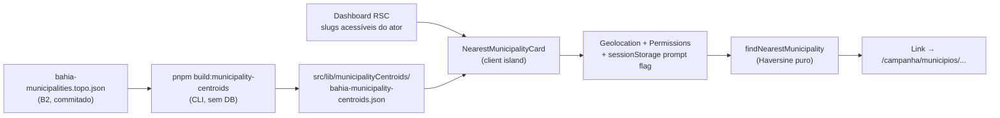

# B14 — Município mais próximo (acesso rápido por geolocalização)

Status: rascunho
Atualizado em: 2026-07-24
Item do roadmap: [docs/roadmap.md](../roadmap.md) (Demais itens abertos, B14; superfície de coordenação)
Impeccable: B — encaixe no dashboard staff (`/campanha`), sem rota nova
Appetite: ~1 dia eng; artefato estático de centroides + ilha cliente no Início; sem migration, sem collection, sem Consent
Responsável: —

## Design (Impeccable)

Âncoras: `PRODUCT.md` (princípios 2 — clareza sob pressão — e 8 — Feel the action) / `DESIGN.md` (register `product`; Field Desk) · tema `data-theme='campaign'` · precedente de ilha client-side [`RecentlyVisitedCard`](../plans/visitados-recentemente.md).

Na implementação (`implement-roadmap-item`): craft compacto → critique → polish.

Brief compacto:

- **Persona / contexto:** assessor ou CG em campo (telefone, deslocamento entre municípios), abrindo o Início sob pressão de tempo — precisa chegar na ficha do município onde está sem digitar na lista.
- **Job principal:** com um toque, abrir o município operacional mais próximo da localização atual.
- **Estratégia de cor:** Restrained — card/atalho sóbrio ao lado de "Visitados recentemente", sem mapa embutido nem badge de GPS gamificado.
- **Edit where you see:** não — só leitura/navegação (atalho); sem mutação de dados.
- **Anti-goals:** segundo mapa; lista "próximos N" tipo Places; sync de localização no servidor; prompt de permissão em loop; superfície para `leader` (lockdown).

## Dados → decisão → apresentação

- **Vou apresentar dados?** Sim, superfície neste item — um resultado geo (município mais próximo ± distância opcional), não série/KPI eleitoral.
- **Decisões desbloqueadas:**
  - Staff (assessor/CG/candidato): "abrir agora a ficha do município em que estou (ou o mais próximo no meu escopo)?"
- **Forma escolhida:** **número + contexto mínimo** (nome do município + CTA "Abrir" + distância relativa opcional, ex. "~8 km") — **por quê:** uma decisão, um destino; degrau mais pobre que resolve. **Rejeitado:** mapa de proximidade (já há mapa no Início com outro job); ranking dos 5 mais próximos (ruído); chart/gauge.
- **Profile:** geo pontual → 1 entidade do catálogo (ou lista filtrada Salvador); tamanho típico = 1 sugestão; absoluto (km) só como contexto de confiança, não como KPI.
- **Anti-goals de dado:** sem telemetria de posição; sem choropleth de "densidade de visitas"; sem % estadual.

Self-check dados: 5/5.

## Contexto

O Início staff já oferece mapa, KPIs, filas curtas e **Visitados recentemente** (histórico local). Em deslocamento, o atalho que falta é "onde estou → ficha do município". O catálogo tem 435 unidades (`municipalityCatalog.ts`); Salvador é 19 Municípios-zona com o mesmo IBGE — a proximidade por centroide de município IBGE não desambigua ZE. Geolocalização é API do browser (`navigator.geolocation`); a posição **não precisa** ir ao servidor se o matching for client-side sobre um artefato de centroides.

Decisão de produto (2026-07-24, pedido explícito): sugerir acesso rápido ao município mais próximo e, **uma vez por sessão**, pedir automaticamente a permissão de localização se ainda não houver.

## Objetivos

- No dashboard staff (`/campanha`), card/atalho **"Município mais próximo"** (ou copy equivalente) com link para `/campanha/municipios/[slug]` (ou lista filtrada quando a cidade for multi-zona).
- **Uma vez por sessão de aba:** se a permissão de geolocalização ainda não estiver concedida/negada de forma estável, disparar automaticamente o pedido do browser; marcar em `sessionStorage` que o prompt automático já ocorreu (não repetir na mesma sessão).
- Se a permissão já estiver `granted`, resolver a posição sem prompt e mostrar a sugestão.
- Se `denied` / indisponível / fora da Bahia / sem match no escopo: card ausente ou estado curto com CTA manual "Usar minha localização" (sem loop de prompt).
- Matching **só no cliente**; coordenadas nunca enviadas a server actions/API Payload.
- Filtrar candidatos ao **escopo de acesso** do ator (advisor: só municípios administrados; coordinator/candidate: catálogo completo do que a UI já enxerga).
- Sem migration, sem collection, sem server action de escrita, sem nova chave `Consent`.
- Staff only; `leader` permanece no `LeaderContactsPanel` (sem mudança).

## Decisões travadas

- **Client-only + artefato de centroides (sem modelo no servidor).** Posição fica no browser; nearest = Haversine (ou equivalente) sobre centroides IBGE commitados. Análogo a visitados recentes. **Rejeitado:** POST de lat/lng ao servidor (PII de localização + Consent + superfície de abuso); reverse-geocode comercial (custo/vendor); PostGIS (fora de escopo do AGENTS.md sem query espacial real).
- **Prompt automático no máximo 1× por sessão (`sessionStorage`).** Cumpre o pedido de produto sem martelar o usuário a cada navegação no Início. Chave estável: `teqo:campaign:geo-prompted-session`. **Rejeitado:** prompt a cada mount do card; `localStorage` "nunca mais perguntar" como único gate (impediria retry legítimo em sessão nova após o usuário mudar a permissão no SO).
- **Sem `Consent` / sem lote jurídico.** Tratamento local da própria localização do usuário autenticado, sem transmissão — mesmo racional de visitados. **Rejeitado:** chave `Consent` só para UX de GPS (multiplica lead time jurídico sem dado no servidor).
- **Malha de matching = município IBGE (417), depois mapear ao catálogo operacional.** Centroides por `ibgeCode`; entradas `kind: 'municipio'` 1:1; entradas `kind: 'zona'` (Salvador) **não** recebem ZE automática na v1 — se o mais próximo for Salvador, CTA para `/campanha/municipios?q=Salvador` (ou filtro equivalente já existente). **Rejeitado:** escolher ZE aleatória/primeira; inventar centroides de zona sem polígonos (B8 F2).
- **Staff only no Início.** Leader lockdown intacto. **Rejeitado:** expor municípios ao leader via atalho geo.
- **i18n e naming:** identificadores em inglês (`NearestMunicipalityCard`, `municipalityCentroids`, `findNearestMunicipality`, `sessionGeoPrompt`, `PROMPT_SESSION_KEY`); strings visíveis em pt-BR ("Município mais próximo", "Abrir", "Usar minha localização").

## Questões em aberto

- **Posição no Início: acima dos KPIs, junto a Recentes, ou sob o mapa?** **Opções:** A) imediatamente sob o header (máxima descoberta em campo) | B) ao lado/abaixo de `RecentlyVisitedCard` (família de atalhos) | C) sob o mapa. **Recomendação:** **B** — agrupa atalhos de navegação sem competir com o hero espacial do mapa; em mobile, card curto acima de Recentes. _(assumido — validar no craft/critique)_
- **Mostrar distância em km?** **Opções:** sempre | só se &lt; limiar | nunca. **Recomendação:** mostrar quando a precisão/resolução for confiável (ex. &lt; 50 km do centroide); omitir se o usuário parecer fora da BA (e aí não sugerir).
- **Limiar "fora da Bahia"?** **Recomendação:** se o nearest &gt; ~80–100 km do ponto, tratar como fora do teatro e não sugerir (evita "Abrir Mucugê" com usuário em SP). Valor exato no craft com fixture.

## Abordagem proposta

Componentes:

- **`pnpm build:municipality-centroids`** (`scripts/build-municipality-centroids.mjs`): lê o TopoJSON já commitado (ou IBGE Localidades se for mais estável — preferir TopoJSON para zero rede no rebuild), emite centroides `{ [ibgeCode]: { lat, lng } }` em `src/lib/municipalityCentroids/`; snapshot/int test de cobertura vs `bahiaMunicipalityCodes` / catálogo (padrão do artefato TSE). **Não** entra em `pnpm build` de deploy.
- **`src/lib/municipalityCentroids.ts`** (loader client-safe do JSON) + **`src/lib/municipalityProximity.ts`** (puro): `haversineKm`, `findNearestByIbgeCode(lat, lng, candidates)`, `resolveCatalogTargets(ibgeCode)` → slug único ou `{ kind: 'salvadorZones', listHref }`.
- **`NearestMunicipalityCard`** (`src/components/campaign/`, `'use client'`):
  - Props: `{ accessible: { slug, name, ibgeCode, kind }[] }` (mínimo necessário; sem docs Payload inteiros).
  - No mount: lê `sessionStorage` flag; consulta `navigator.permissions` quando disponível; se ainda não prompted na sessão e estado ≠ `granted`/`denied` estável, chama `getCurrentPosition` **uma vez** e seta a flag; se `granted`, resolve silencioso.
  - Hidratação segura (estado inicial vazio/`null` até o efeito — sem mismatch).
  - CTA principal = `Link` shadcn/`Button`; pending honesto enquanto `getCurrentPosition` resolve (Feel the action); erro/negado → CTA manual sem re-prompt automático.
- **Encaixe** em `CampaignDashboard.tsx` (junto a `RecentlyVisitedCard`); página `page.tsx` já restringe staff vs leader — passar só a lista acessível derivada de `getCampaignDashboardData` / scope já carregado (`loadMunicipalityScope` / view).
- **Sem migration, sem collection, sem server action de escrita.**

## Dependências

- Nenhuma dura de outro item aberto. Reusa B2 (TopoJSON), catálogo `municipalityCatalog.ts`, shells do dashboard, padrão client-storage de visitados.
- **Suave:** **B8 F2** (polígonos das ZE de Salvador) — quando existir, permite point-in-polygon para desambiguar ZE; até lá, lista filtrada Salvador.

## Não escopo

- Geolocalização para `leader` / ferramenta de contatos.
- Enviar ou armazenar posição no servidor / analytics.
- Navegação turn-by-turn, ranking dos N mais próximos, mapa de "perto de mim".
- Matching por seção eleitoral ou bairro (fora de escopo AGENTS; B8 F2 é zona Salvador apenas).
- Pedir permissão em outras rotas além do Início staff (v1).

## Rabbit holes

- **Point-in-polygon no client com TopoJSON completo.** Explode bundle e conflita com lazy do mapa (B5). **Mitigação:** só centroides (~poucos KB); polígonos ficam no path do mapa.
- **"Completar" Salvador por ZE sem malha.** Chute de ZE erra operação de campo. **Mitigação:** lista filtrada até B8 F2.
- **Abstração genérica de "location services".** Um card, um helper. **Mitigação:** sem provider/context até 3º call site.
- **Consent/RIPD por precaução.** Sem dado no servidor não há lote jurídico. **Mitigação:** boundary explícito no plano; se no futuro houver sync, aí sim Consent + defer.

## Adiado com gatilho

- **Desambiguação Salvador ZE por ponto-em-polígono.** Revisitar quando: **B8 F2** entregue (polígonos no mapa).
- **Atalho também na lista `/campanha/municipios`.** Revisitar quando: evidência de uso no Início (campo pede o mesmo atalho na lista).
- **Lembrar última sugestão em `sessionStorage` para paint imediato.** Revisitar quando: critique acusar flash/vazio perceptível no card.

## Referências

- `docs/roadmap.md` (B14; Demais itens abertos; grafo; cortes)
- [visitados-recentemente.md](visitados-recentemente.md) — precedente client-storage + card no dashboard
- [poligonos-pracas-zona.md](poligonos-pracas-zona.md) — B8 F2 (gatilho Salvador ZE)
- [mapa-bahia-geometrias.md](mapa-bahia-geometrias.md) — TopoJSON fonte dos centroides
- `src/components/campaign/CampaignDashboard.tsx`, `RecentlyVisitedCard.tsx`, `src/utilities/recentVisits.ts`
- `src/lib/municipalityCatalog.ts`, `src/lib/bahiaMunicipalityCodes.ts`, `src/lib/geometries/bahia-municipalities.topo.json`
- `PRODUCT.md` / `DESIGN.md` — Field Desk, clareza sob pressão, Feel the action
- AGENTS.md — leader lockdown, naming, sem PostGIS sem query espacial, artefatos commitados via script (não no `pnpm build`)
