# B14 — Município mais próximo (acesso rápido por geolocalização)

Status: entregue (2026-07-26)
Atualizado em: 2026-07-26
Item do roadmap: [docs/roadmap.md](../roadmap.md) (Demais itens abertos, B14; superfície de coordenação)
Impeccable: B — encaixe no dashboard staff (`/campanha`), sem rota nova
Appetite: ~1 dia eng (gasto ~0,75d: o artefato de centroides e seu script saíram do escopo); ilha cliente no Início; sem migration, sem collection, sem Consent
Responsável: —

## Como ficou (as-built, 2026-07-26)

O casamento é **point-in-polygon**, não centroide: a premissa do plano original (polígonos explodem o bundle) caiu ao medir o repositório de hoje — [`MunicipalityMapPanel`](../../src/components/campaign/map/MunicipalityMapPanel.tsx) monta sempre em `mode="municipality"` e `BahiaMap` chama `loadMunicipalityGeometryModule()` no mount, então os 417 polígonos (132 KB crus, **41 KB gzip**, chunk próprio memoizado) já estão no browser de quem abre `/campanha`. Com isso o card responde "o município **onde estou**" em vez de "o mais próximo", e caíram do escopo `pnpm build:municipality-centroids`, `src/lib/municipalityCentroids/` e o snapshot test do artefato. Centroide sobrevive apenas como critério de ordenação do fallback (`featureCentroid` + Haversine), onde errar por quilômetros não muda a decisão.

Entregue:

- [`src/lib/municipalityProximity.ts`](../../src/lib/municipalityProximity.ts) — matemática pura sobre as features que o chamador já tem: `haversineKm`, ray casting com buracos (`featureContainsPoint`), `featureCentroid` (média ponderada por área) e `resolveNearbyMunicipality` devolvendo união discriminada `inScope | zoneCity | outOfScope | outsideBahia`. Carteira vazia **não** é um caso desta função: o card não renderiza nem pede posição nessa situação, e duplicar a política aqui custava ramos inalcançáveis (removido no `/simplify`).
- [`src/utilities/campaignGeolocation.ts`](../../src/utilities/campaignGeolocation.ts) — irmão de `recentVisits.ts`: flag `teqo:campaign:geo-prompted-session`, leitura de permissão guardada (Safari sem o descriptor → `unknown`, que é resposta normal) e `requestCurrentPosition` com falha tipada. `COARSE_ACCURACY_M = 10 km` separa fix de aparelho de chute de rede.
- [`NearestMunicipalityCard`](../../src/components/campaign/dashboard/NearestMunicipalityCard.tsx), ao lado de `RecentlyVisitedCard` numa linha de duas colunas escrita **direto em `CampaignDashboard`** e escondida em CSS (`hidden … has-[>*]:grid`) quando os dois cards renderizam `null`. Houve um wrapper `DashboardShortcuts` no meio do caminho; sem estado nem lógica ele era só um `div`, e o `/simplify` o inlinou.
- `StaffDashboardView` publica `accessibleMunicipalities` (slug/name/ibgeCode); o href da lista de zonas é serializado por `CampaignDashboard` (o RSC que já monta hrefs de lista) e desce como prop `zoneCityHrefs` — o loader Payload não guarda URL.

**Decisão de produto nova (usuário, 2026-07-26):** assessor fisicamente fora da carteira é informado de onde está **e** recebe o município mais próximo que pode abrir, com a distância; acima de 150 km (`NEAREST_IN_SCOPE_MAX_KM`) a sugestão vira ruído e o card diz que não há nada por perto.

**Medições (as-built).** Payload RSC de `/campanha` com 435 entradas: ~6,6 KB gzip — abaixo do teto de ~10 KB do plano, então o campo ficou como objetos legíveis em vez de tuplas. First Load JS de `/campanha`: **265 kB → 268 kB**. A primeira versão chegou a 286 kB porque o card chamava `buildMunicipalityListHref` para o link das zonas de Salvador, e o serializador canônico arrasta `bahiaTerritories` + `municipalityCatalog` (que puxa códigos IBGE e zonas TSE) para o bundle do cliente: **21 kB por um único link**. Corrigido serializando o href no servidor (`zoneCityHrefs`, chaveado por IBGE, uma entrada só quando o ator enxerga mais de uma zona da cidade) — a regra "client components não importam módulos de dado do servidor para obter valores" também vale para serializadores de URL. No `/simplify` esse cálculo saiu do loader `server-only` para `CampaignDashboard`, reusando `buildMunicipalitiesByIbgeCode` (o índice por código IBGE que o painel do mapa já usa) em vez de contar linhas à mão.

**Medições de CPU (feitas no `/simplify`, sobre o artefato real — não estimadas).** A malha decodifica em **417 features, todas `Polygon` simples**: 417 anéis, **zero buracos, zero MultiPolygon**, 15.111 pares de coordenadas, anel mais longo com 147 pontos. Varredura point-in-polygon completa (o caminho "fora da Bahia", sem acerto): **0,106 ms**; até acertar Salvador: 0,143 ms; `resolveNearbyMunicipality` inteiro com carteira de 435: **0,32 ms**, dos quais 0,26 ms são os 417 centroides. Com penalidade de 6× para celular médio, ~2,6 ms — **um oitavo de um frame**, então não há caminho quente aqui e o artefato de centroides continuaria sem se pagar. Construir um `Map<codarea, feature>` novo por chamada mediu **0,337 ms, mais lento** que o `find`; o índice `getMunicipalityFeature` é usado porque o módulo **já o construiu** para o mapa, não como otimização. Chunk de geometria no build: 134.488 B crus / **42.158 B gzip**, referenciado por um único arquivo (o chunk da página), confirmando um download e um decode (1,69 ms) para os dois consumidores. O que muda com o card é o **agendamento**: a geometria passa a ser pedida na hidratação da página, competindo com Leaflet (42.675 B gzip), em vez de só depois do chunk do painel. Aceito — mas **não** porque o `Promise.all` esconderia o decode atrás do fix de GPS: o decode roda no topo do módulo, ou seja, quando o chunk baixa e executa, independente do fix. Ele é aceito porque é **barato** (`JSON.parse` 1,62 ms + `topojson.feature()` 0,41 ms ≈ 2 ms no desktop, ~10 ms num celular 5× mais lento — abaixo da barra de 50 ms de long task) e porque a alternativa sequencial (fix primeiro, geometria depois) é **pior** no caso comum: com `maximumAge` de 5 min um fix em cache volta em milissegundos e aí os 42 KB cairiam inteiros no caminho crítico do card. O download também nunca é especulativo — `MunicipalityMapPanel` monta sempre em `mode="municipality"`, então todo staff em `/campanha` precisa desse chunk de qualquer forma.

**Débito registrado (não corrigido aqui).** As 435 linhas de `accessibleMunicipalities` (~6,6 KB gzip) duplicam o `municipalitiesByIbgeCode` que `MunicipalityMapBundle` já serializa na mesma página, a partir do mesmo `loadMunicipalityScope`. Unificar exige mexer na fronteira de Suspense do mapa (o painel só monta atrás dela, e pode ser `null`), o que é reestruturação, não limpeza. Tuplas em vez de objetos economizariam apenas 398 B gzip — medido, e não vale o tipo auto-descritivo. A 3ª rodada de `/simplify` afiou o caminho da correção: publicar `MunicipalitiesByIbgeCode` no lugar do array plano faria `resolveNearbyMunicipality` trocar o `filter` sobre 435 linhas por uma busca por chave, e a página pararia de montar o mesmo agrupamento duas vezes (`buildZoneCityHrefs` reconstrói o índice a partir do array). Só que exige mover `municipalityMapNavigation.ts` para `src/lib/` — hoje em `utilities/` **sem nenhum import**, portanto já puro e mal-alojado — e tocar os importadores do domínio do mapa. Continua reestruturação, não limpeza.

## Design (Impeccable)

Âncoras: `PRODUCT.md` (princípios 2 — clareza sob pressão — e 8 — Feel the action) / `DESIGN.md` (register `product`; Field Desk) · tema `data-theme='campaign'` · precedente de ilha client-side [`RecentlyVisitedCard`](../plans/visitados-recentemente.md).

Na implementação (`implement-roadmap-item`): craft compacto → critique → polish.

Brief compacto:

- **Persona / contexto:** assessor ou CG em campo (telefone, deslocamento entre municípios), abrindo o Início sob pressão de tempo — precisa chegar na ficha do município onde está sem digitar na lista.
- **Job principal:** com um toque, abrir o município operacional mais próximo da localização atual.
- **Estratégia de cor:** Restrained — card/atalho sóbrio ao lado de "Visitados recentemente", sem mapa embutido nem badge de GPS gamificado.
- **Edit where you see:** não — só leitura/navegação (atalho); sem mutação de dados.
- **Anti-goals:** segundo mapa; lista "próximos N" tipo Places; sync de localização no servidor; prompt de permissão em loop; superfície para `leader` (lockdown).

## Dados → decisão → apresentação

- **Vou apresentar dados?** Sim, superfície neste item — um resultado geo (município mais próximo ± distância opcional), não série/KPI eleitoral.
- **Decisões desbloqueadas:**
  - Staff (assessor/CG/candidato): "abrir agora a ficha do município em que estou (ou o mais próximo no meu escopo)?"
- **Forma escolhida:** **número + contexto mínimo** (nome do município + CTA "Abrir" + distância relativa opcional, ex. "~8 km") — **por quê:** uma decisão, um destino; degrau mais pobre que resolve. **Rejeitado:** mapa de proximidade (já há mapa no Início com outro job); ranking dos 5 mais próximos (ruído); chart/gauge.
- **Profile:** geo pontual → 1 entidade do catálogo (ou lista filtrada Salvador); tamanho típico = 1 sugestão; absoluto (km) só como contexto de confiança, não como KPI.
- **Anti-goals de dado:** sem telemetria de posição; sem choropleth de "densidade de visitas"; sem % estadual.

Self-check dados: 5/5.

## Contexto

O Início staff já oferece mapa, KPIs, filas curtas e **Visitados recentemente** (histórico local). Em deslocamento, o atalho que falta é "onde estou → ficha do município". O catálogo tem 435 unidades (`municipalityCatalog.ts`); Salvador é 19 Municípios-zona com o mesmo IBGE — a proximidade por centroide de município IBGE não desambigua ZE. Geolocalização é API do browser (`navigator.geolocation`); a posição **não precisa** ir ao servidor se o matching for client-side sobre um artefato de centroides.

Decisão de produto (2026-07-24, pedido explícito): sugerir acesso rápido ao município mais próximo e, **uma vez por sessão**, pedir automaticamente a permissão de localização se ainda não houver.

## Objetivos

- No dashboard staff (`/campanha`), card/atalho **"Município mais próximo"** (ou copy equivalente) com link para `/campanha/municipios/[slug]` (ou lista filtrada quando a cidade for multi-zona).
- **Uma vez por sessão de aba:** se a permissão de geolocalização ainda não estiver concedida/negada de forma estável, disparar automaticamente o pedido do browser; marcar em `sessionStorage` que o prompt automático já ocorreu (não repetir na mesma sessão).
- Se a permissão já estiver `granted`, resolver a posição sem prompt e mostrar a sugestão.
- Se `denied` / indisponível / fora da Bahia / sem match no escopo: card ausente ou estado curto com CTA manual "Usar minha localização" (sem loop de prompt).
- Matching **só no cliente**; coordenadas nunca enviadas a server actions/API Payload.
- Filtrar candidatos ao **escopo de acesso** do ator (advisor: só municípios administrados; coordinator/candidate: catálogo completo do que a UI já enxerga).
- Sem migration, sem collection, sem server action de escrita, sem nova chave `Consent`.
- Staff only; `leader` permanece no `LeaderContactsPanel` (sem mudança).

## Decisões travadas

- **Client-only, casando contra a malha que o mapa já carrega (sem modelo no servidor).** Posição fica no browser; containment por point-in-polygon sobre o chunk memoizado de `bahiaMunicipalityGeometries`, e Haversine sobre centroides derivados na hora só para ordenar o fallback. Análogo a visitados recentes. **Rejeitado:** POST de lat/lng ao servidor (PII de localização + Consent + superfície de abuso); reverse-geocode comercial (custo/vendor); PostGIS (fora de escopo do AGENTS.md sem query espacial real); **artefato commitado de centroides** — era a decisão de 2026-07-24 e foi revertida em 2026-07-26 por ser menos precisa a custo de bundle zero (o chunk já está no browser).
- **Prompt automático no máximo 1× por sessão (`sessionStorage`).** Cumpre o pedido de produto sem martelar o usuário a cada navegação no Início. Chave estável: `teqo:campaign:geo-prompted-session`. **Rejeitado:** prompt a cada mount do card; `localStorage` "nunca mais perguntar" como único gate (impediria retry legítimo em sessão nova após o usuário mudar a permissão no SO).
- **Sem `Consent` / sem lote jurídico.** Tratamento local da própria localização do usuário autenticado, sem transmissão — mesmo racional de visitados. **Rejeitado:** chave `Consent` só para UX de GPS (multiplica lead time jurídico sem dado no servidor).
- **Malha de matching = município IBGE (417), depois mapear ao catálogo operacional.** Polígonos por `ibgeCode`; entradas `kind: 'municipio'` 1:1; entradas `kind: 'zona'` (Salvador) **não** recebem ZE automática na v1 — quem está em Salvador vai para `/campanha/municipios?q=Salvador`, com o href serializado no servidor e a contagem de zonas limitada ao que o ator pode abrir (um assessor com três zonas não é informado de dezenove). **Rejeitado:** escolher ZE aleatória/primeira; inventar centroides de zona sem polígonos (B8 F2).
- **Staff only no Início.** Leader lockdown intacto. **Rejeitado:** expor municípios ao leader via atalho geo.
- **i18n e naming:** identificadores em inglês (`NearestMunicipalityCard`, `municipalityProximity`, `resolveNearbyMunicipality`, `GEO_PROMPT_SESSION_KEY`); strings visíveis em pt-BR (título "Onde estou", "Abrir <município>", "Usar minha localização", "Ver zonas de Salvador").
- **Precisão declarada, nunca escondida.** Fix com raio acima de 10 km (rede/IP, típico de desktop) mostra o resultado com a ressalva "Localização aproximada — confira o município antes de agir", entre o título e o CTA. **Rejeitado:** descartar o fix grosseiro (o município costuma estar certo) e confiar nele em silêncio (nomear o município errado com confiança total é o pior dos dois).

## Questões em aberto

Todas resolvidas na entrega:

- **Posição no Início:** B — o card fica ao lado de `RecentlyVisitedCard` (`grid gap-6 lg:grid-cols-2`, primeiro no mobile), e a linha inteira desaparece quando os dois cards não têm o que dizer.
- **Mostrar distância em km?** Só no fallback ("Mais próximo na sua carteira: X, a 38 km"). Quando o ponto cai **dentro** de um município não há distância a mostrar — containment não é aproximação.
- **Limiar "fora do teatro"?** 150 km do centroide para a sugestão de carteira (`NEAREST_IN_SCOPE_MAX_KM`). Fora da malha da Bahia o card diz que está fora, e só oferece atalho se houver algo dentro desse raio.

## Abordagem (como implementada)

```mermaid
flowchart LR
    Scope["loadMunicipalityScope<br/>(slug, name, ibgeCode)"] --> View["StaffDashboardView<br/>accessibleMunicipalities"]
    View --> Hrefs["CampaignDashboard (RSC)<br/>zoneCityHrefs"]
    Hrefs --> Card
    View --> Card["NearestMunicipalityCard<br/>(client island)"]
    Card --> Perm["permissions + sessionStorage<br/>prompt 1x por sessao"]
    Perm --> Fix["getCurrentPosition"]
    Fix --> Geo["loadMunicipalityGeometryModule<br/>(chunk compartilhado com o mapa)"]
    Geo --> Resolve["resolveNearbyMunicipality<br/>(point-in-polygon + fallback)"]
    Resolve --> Link["Link /campanha/municipios/[slug]<br/>ou lista filtrada (Salvador)"]
```

Componentes:

- **`src/lib/municipalityProximity.ts`** (puro, client-safe, recebe a malha já carregada — `features` + o índice memoizado `getMunicipalityFeature` — em vez de importar geometria ou re-varrer as 417 features por município da carteira): `haversineKm`, `featureContainsPoint`, `featureCentroid`, `findContainingMunicipality`, `resolveNearbyMunicipality`.
- **`src/utilities/campaignGeolocation.ts`**: flag de sessão, permissão guardada, `requestCurrentPosition` com resultado tipado (`denied | unavailable | timeout | unsupported`).
- **`NearestMunicipalityCard`** (`src/components/campaign/dashboard/`, `'use client'`):
  - Props: `{ accessible: { slug, name, ibgeCode }[]; zoneCityHrefs }` — nada de doc Payload inteiro, nada de serializador de URL no cliente.
  - No mount: estado `starting` (explicação sem CTA, para não convidar um toque que dispararia um segundo pedido de posição), lê permissão; `granted` resolve silencioso; `prompt`/`unknown` ainda não perguntado na sessão → **uma** chamada e marca a flag; `denied` → estado acionável com "Tentar de novo", sem re-prompt. Guarda de `useRef` para o Strict Mode não pedir posição duas vezes.
  - Pending honesto (`aria-busy` + spinner) e um `aria-live="polite"` `sr-only` montado desde o início, para o desfecho ser anunciado.
- **Encaixe** em `CampaignDashboard.tsx`; `page.tsx` já separa staff de leader.
- **Sem migration, sem collection, sem server action.**

## Dependências

- Nenhuma dura de outro item aberto. Reusa B2 (TopoJSON), catálogo `municipalityCatalog.ts`, shells do dashboard, padrão client-storage de visitados.
- **Suave:** **B8 F2** (polígonos das ZE de Salvador) — quando existir, permite point-in-polygon para desambiguar ZE; até lá, lista filtrada Salvador.

## Não escopo

- Geolocalização para `leader` / ferramenta de contatos.
- Enviar ou armazenar posição no servidor / analytics.
- Navegação turn-by-turn, ranking dos N mais próximos, mapa de "perto de mim".
- Matching por seção eleitoral ou bairro (fora de escopo AGENTS; B8 F2 é zona Salvador apenas).
- Pedir permissão em outras rotas além do Início staff (v1).

## Rabbit holes

- ~~**Point-in-polygon no client com TopoJSON completo.** Explode bundle e conflita com lazy do mapa (B5).~~ **Não era rabbit hole:** o dashboard já monta o mapa, que carrega o mesmo chunk memoizado no mount. O card reusa `loadMunicipalityGeometryModule()` e não adiciona um byte de geometria. O rabbit hole real, encontrado ao medir, foi **importar o serializador da lista** no cliente (+21 KB) — resolvido serializando o href no servidor.
- **"Completar" Salvador por ZE sem malha.** Chute de ZE erra operação de campo. **Mitigação:** lista filtrada até B8 F2.
- **Abstração genérica de "location services".** Um card, um helper. **Mitigação:** sem provider/context até 3º call site.
- **Consent/RIPD por precaução.** Sem dado no servidor não há lote jurídico. **Mitigação:** boundary explícito no plano; se no futuro houver sync, aí sim Consent + defer.

## Adiado com gatilho

- **Desambiguação Salvador ZE por ponto-em-polígono.** Revisitar quando: **B8 F2** entregue (polígonos no mapa).
- **Atalho também na lista `/campanha/municipios`.** Revisitar quando: evidência de uso no Início (campo pede o mesmo atalho na lista).
- **Lembrar última sugestão em `sessionStorage` para paint imediato.** Revisitar quando: critique acusar flash/vazio perceptível no card. _(Não acusou: o chunk de geometria costuma estar resolvido antes do fix chegar.)_
- **Atalho geo também para `leader`.** Permanece fora: liderança não sai do `LeaderContactsPanel`.
- **Reusar `resolveMunicipalityMapNavigation` no branch `none|navigate|zones`.** Revisitar quando: um 3º chamador precisar do `zoneCount`/da entrada casada. Hoje a união existente descarta justamente o que o card precisa, então reusar significa alargar um contrato de que duas superfícies do mapa dependem para servir um caller — mais caro que as ~18 linhas duplicadas.
- **Helper compartilhado para flags de sessão (`sessionStorage`).** Revisitar quando: nascer a 3ª flag. Hoje são duas (`campaignGeolocation` e `InstallPwaToast`) e elas **discordam de propósito** no fallback de leitura — em modo privado o geo suprime o prompt automático e o toast continua aparecendo —, o que é a maior parte do que o helper faria.

## Referências

- `docs/roadmap.md` (B14; Demais itens abertos; grafo; cortes)
- [visitados-recentemente.md](visitados-recentemente.md) — precedente client-storage + card no dashboard
- [poligonos-pracas-zona.md](poligonos-pracas-zona.md) — B8 F2 (gatilho Salvador ZE)
- [mapa-bahia-geometrias.md](mapa-bahia-geometrias.md) — TopoJSON fonte dos centroides
- `src/components/campaign/dashboard/CampaignDashboard.tsx`, `RecentlyVisitedCard.tsx`, `src/utilities/recentVisits.ts`
- `src/lib/municipalityCatalog.ts`, `src/lib/bahiaMunicipalityCodes.ts`, `src/lib/bahiaGeometries.ts`, `src/lib/geometries/bahia-municipalities.topo.json`
- Testes: `tests/unit/municipalityProximity.unit.spec.ts`, `tests/unit/campaignGeolocation.unit.spec.ts`, `tests/int/bahiaGeometries.int.spec.ts`, `tests/e2e/campaignNearestMunicipality.e2e.spec.ts`
- `PRODUCT.md` / `DESIGN.md` — Field Desk, clareza sob pressão, Feel the action
- AGENTS.md — leader lockdown, naming, sem PostGIS sem query espacial, artefatos commitados via script (não no `pnpm build`)
