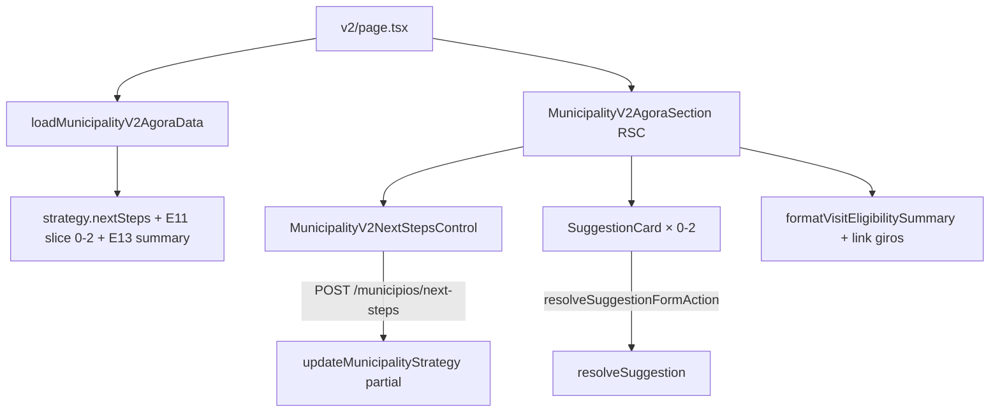

# Impl: Município v2 — Agora (encaminhamento + sugestão + visita)

Status: aprovado
Atualizado em: 2026-08-03
Issue: #333
Intenção: docs/plans/municipio-v2-agora.md
Appetite restante: herdado (~0,5–1 dia eng)

## Leitura da intenção

- **Outcome:** Bloco “Agora” na rota v2 com encaminhamento editável no lugar, até duas sugestões acionáveis (ou silêncio explícito) e visita condensada em uma linha.
- **O que NÃO negociar:** um só motor E11; resolve/dispensa existente; `nextSteps` como fonte única; sem checklist E13 expandida; staff only (`noLeader`); silêncio explícito.
- **O que reavaliar:** hipótese de componente monolítico — separar loader server, controle client de `nextSteps` e seção RSC; JSON route (precedente political-trend) vs form action (precedente AdvisorDebouncedTextCell).

## Abordagem recomendada

**Opções consideradas:** A) reutilizar `SuggestionsPanel` inteiro | B) compor loader + peças novas enxutas | C) novo motor de sugestão v2  
**Recomendação:** B — mesmos loaders/ações; UI condensada sem statute/card E13.  
**Rejeitadas:** A (torre de chrome do dashboard); C (twin motor).

### Componentes / mudanças

- **`formatVisitEligibilitySummary`** (`src/utilities/visit/visitEligibility.ts`): headline + frase curta; teste unitário.
- **`loadMunicipalityV2AgoraData`** (`src/utilities/municipality/municipalityV2AgoraData.ts`): `Promise.all` detail VM + suggestions + visit.
- **`MunicipalityV2NextStepsControl`** + **`/municipios/next-steps/route.ts`**: autosave debounced (precedente political-trend JSON).
- **`MunicipalityV2AgoraSection`**: RSC que monta os três sub-blocos.
- **`resolveSuggestion`**: `revalidateMunicipalityListPaths` inclui v2.
- **Migration:** sem migration.

### Dados → forma

- Encaminhamento: textarea auto-save (edit where you see).
- Sugestões: 0–2 `SuggestionCard` compactos; silêncio copiado do OverviewTab.
- Visita: uma linha “Elegível|Não elegível · motivo” + link compositor.

## Fases verificáveis

1. **Schema/server** — summary helper, loader, next-steps route, revalidation fix.
2. **UI** — section + control + wire v2 page.
3. **Gates** — `pnpm gate:fast`; push via `pnpm push`.

## Rabbit holes / Não escopo (engenharia)

- FAB B151; Conta/Rede B148–B149; compositor completo.
- **Defer:** unificar `resolveAccessibleMunicipalityContext` entre `loadMunicipalityV2StatusData` e `loadMunicipalityV2AgoraData` quando B148–B149 compuserem um loader de página único.

## Riscos e mitigação

- Partial strategy update sobrescrever outros campos → action só envia `nextSteps`.
- Sugestão stale na v2 → revalidate v2 no resolve.

## Aceite de engenharia

- [x] Aceite de produto da intenção ainda coberto
- [x] Invariantes AGENTS/engineering-standards
- [x] Testes de domínio previstos (unit summary visit)
