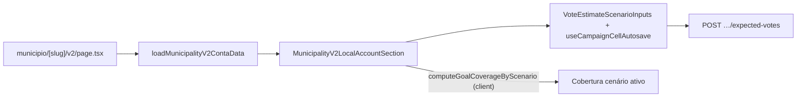

# Impl: Município v2 — conta local (P/M/O + cobertura + classe)

Status: aprovado
Atualizado em: 2026-08-03
Issue: #331
Intenção: docs/plans/municipio-v2-conta-local.md
Appetite restante: ~1 dia eng (herdado)

## Leitura da intenção

- **Outcome:** na dobra principal da v2, staff vê e edita meta P/M/O no lugar; clicar/focar um cenário ativa cobertura/déficit daquele cenário; classe territorial com destaque e fatores; tooltips com one-liner + link a conceitos; sem abrir Eleições.
- **O que NÃO negociar:** leader lockdown; um único número escondendo P/M/O; três coberturas simultâneas; grade E8 completa na 1ª dobra; % estadual absoluto; segundo significado de cenário.
- **O que reavaliar:** hipótese de “bloco na composição v2” (ok); reusar popover da lista vs inline edit-in-place; estender `loadMunicipalityV2StatusData` vs loader conta dedicado.

## Abordagem recomendada

**Opções consideradas:**

|     | A — Popover list control na v2               | B — Inline P/M/O + cenário local + cobertura reativa | C — Card E8 completo na dobra |
| --- | -------------------------------------------- | ---------------------------------------------------- | ----------------------------- |
|     | Reusa `MunicipalityListExpectedVotesControl` | Inputs visíveis; cenário ativo local                 | Viola anti-goal produto       |

**Recomendação:** B — produto pede campos editáveis no lugar e clique ativa cenário; popover esconde P/M/O; card E8 é fora de escopo.

**Rejeitadas:** A (popover ≠ in-place); C (corte explícito na intenção).

### Componentes / mudanças

- **`loadMunicipalityV2ContaData`** (`src/utilities/municipality/municipalityV2ContaData.ts`): composer server-only — context + expectedVotes + pledge aggregate + `loadStatewideSuggestedGoals` + `computeGoalCoverageByScenario` + territorial class.
- **`MunicipalityV2ContaViewModel`** (`src/utilities/municipality/municipalityV2ContaView.ts`): tipo serializável para a seção.
- **`MunicipalityV2LocalAccountSection`** (`src/components/campaign/municipality/`): client; inline autosave (mesmo endpoint B9); `activeScenario` local; cobertura recalculada com `computeGoalCoverageByScenario` ao editar; progress + déficit; classe com fatores.
- **`MunicipalityTerritorialClassRow`** (extract de `MunicipalityGoalAccountCard`): dono compartilhado da linha classe+fatores+tooltip — editar o owner, não twin.
- **`page.tsx`**: substituir placeholder pela seção; `Promise.all` status + conta.
- **Migration:** nenhuma.
- **Access:** page gate `noLeader`; write via `setMunicipalityExpectedVotes` existente.
- **UI:** Impeccable B — shape denso na dobra; `CampaignHoverTooltip` + `campaignConceptOneLiner`; `Progress` h-2 como no card E8.

### Dados → forma

- P/M/O: três inputs compactos numa linha (mesmo `VoteEstimateScenarioInputs` compact).
- Cobertura: uma leitura grande (% + barra + déficit) do cenário ativo; meta e comprometido em sublinha.
- Classe: pill + dois fatores (reuso `TerritorialClassRow`).

## Fases verificáveis

1. **Loader + view model** — `municipalityV2ContaData` + unit smoke se helper puro.
2. **UI** — seção client + extract territorial row + wire page.
3. **Gates** — `pnpm gate:fast`; push via `pnpm push`.

## Rabbit holes / Não escopo (engenharia)

- Cenário global `MunicipalityEstimateScenarioProvider` na v2.
- Diagnósticos E8 (teto, captura, roll-off) na dobra.
- `router.refresh()` obrigatório — cobertura recalcula client-side com `computeGoalCoverageByScenario`.

## Riscos e mitigação

- **Drift cobertura pós-save:** `useCampaignCellAutosave` adota `savedExpectedVotes` da resposta; recomputamos cobertura localmente com os mesmos pure helpers do servidor.
- **Twin TerritorialClassRow:** extract para componente compartilhado no mesmo PR.

## Aceite de engenharia

- [x] Aceite de produto da intenção coberto
- [x] Invariantes AGENTS/engineering-standards
- [x] Testes: unit no loader/view se lógica pura; int opcional (cobertura já testada em `goalCoverage.unit.spec.ts`)

## Débitos deferidos (capture-review-debts)

- Link “mais detalhe da conta” para overview/E8 — gatilho: entrega B151 ou pedido explícito de deep-link.
