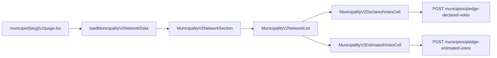

# Impl: Município v2 — rede (lista edit-in-place)

Status: aprovado
Atualizado em: 2026-08-03
Issue: #332
Intenção: docs/plans/municipio-v2-rede.md
Appetite restante: ~1 dia eng (herdado)

## Leitura da intenção

- **Outcome:** rede na dobra principal da v2 — lista densa (tabela desktop / lista mobile) com top-N lideranças, declarado e estimado editáveis no lugar (auto-save B9), caminho para ver todas e criar liderança; leader não vê estimado.
- **O que NÃO negociar:** assimetria estimado (staff-only); leader lockdown na página; não cards empilhados; não spreadsheet de colunas da ficha global; não substituir ficha completa (link ao detalhe).
- **O que reavaliar:** reusar `DeclareVotesForm`/`PledgeEstimateForm` (rejeitados — têm botão Salvar); twin de loaders vs composer fino; N do top-N.

## Abordagem recomendada

**Opções consideradas:**

| | A — Reusar panels atuais (cards + forms) | B — Lista densa + B9 cell autosave + JSON routes | C — CampaignTable completo com colunas B17 |
| --- | --- | --- | --- |
| | Rápido mas cards + Salvar | Alinha B9 e aceite | Overkill sem picker de colunas |

**Recomendação:** B — lista densa com `CampaignCellEditOverlay` + `useCampaignCellAutosave`; writes via `declareVotes`/`estimateVotes` existentes; revalidate v2 via `revalidateMunicipalityListPaths`.

**Rejeitadas:** A (cards + botão Salvar violam aceite). C (B17 não pedido; 4 colunas fixas).

### Decisões de engenharia

1. **Top-N = 8** — mesmo cap do dossiê (`DOSSIER_LEADERSHIP_LIMIT`). Ordenação: `effective(central)` desc, depois `declared` desc (assumido na intenção).
2. **Merge leadership × pledge** em pure `buildMunicipalityV2NetworkRows` — liderança sem pledge aparece com declarado/estimado vazios; estimado só editável quando existe `pledgeID`.
3. **JSON routes** em `municipios/pledge-declared-votes` e `municipios/pledge-estimated-votes` (paridade `expected-votes`); `safeMessages` de `votePledge` schemas.
4. **Estimado na célula** — trigger mostra média (cenário central); popover/sheet com `VoteEstimateScenarioInputs` compact (precedente `MunicipalityListExpectedVotesControl`).
5. **Declarado na célula** — popover/sheet com input numérico; autosave debounce 600ms + flush no close.
6. **CTAs** — "Ver todas" → `?tab=leaderships`; "Nova liderança" → `/campanha/liderancas/nova?municipality=` (textual, não FAB — B151).

### Componentes / mudanças

- **`loadMunicipalityV2NetworkData`** (`utilities/municipality/municipalityV2NetworkData.ts`): composer sobre `loadMunicipalityLeaderships` + `loadMunicipalityPledges`.
- **`municipalityV2NetworkView.ts`**: tipos + sort/merge puros (unit-tested).
- **`MunicipalityV2NetworkSection` + `MunicipalityV2NetworkList` + células** (`components/campaign/municipality/`).
- **Routes:** `pledge-declared-votes/route.ts`, `pledge-estimated-votes/route.ts` + `types.ts`.
- **`pledgeFormActions.ts`:** revalidate via `revalidateMunicipalityListPaths` (inclui v2).
- **Migration:** nenhuma.
- **Access:** `declareVotes`/`estimateVotes` existentes; página `noLeader`.
- **UI:** Impeccable B — lista densa; shells B9; `data-theme='campaign'`.

### Dados → forma

- Tabela 4 colunas (nome · status · declarado · estimado); mobile = mesma informação em linhas densas, não cards empilhados por pessoa com forms longos.

## Fases verificáveis

1. **Server** — view puro + loader + JSON routes + revalidate paths.
2. **UI** — section na página v2 + células autosave + CTAs.
3. **Gates** — unit sort/merge; `pnpm gate:fast`; `pnpm push`.

## Rabbit holes / Não escopo (engenharia)

- FAB B151; conta B148; agora B150; cutover B152.
- Edição de status de apoio na rede (fora das 4 colunas).
- Nota de estimativa na lista (ficha completa / popover longo).

## Riscos e mitigação

- **Conta não atualiza após edit:** `revalidateMunicipalityListPaths` busta página v2; aceite permite conta refresh posterior (B148).
- **Pledge inexistente:** declarado cria via `declareVotes`; estimado disabled até existir pledge.

## Aceite de engenharia

- [ ] Aceite de produto da intenção coberto
- [ ] Invariantes AGENTS/engineering-standards
- [ ] Unit tests em `municipalityV2NetworkView`

Self-score decision-quality: 4/5
