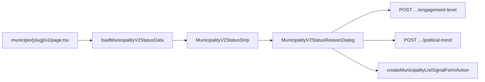

# Impl: Município v2 — shell + faixa de status

Status: aprovado
Atualizado em: 2026-08-02
Issue: #330
Intenção: docs/plans/municipio-v2-shell-status.md
Appetite restante: ~1–1,5 dia eng (herdado)

## Leitura da intenção

- **Outcome:** rota paralela `/campanha/municipio/<slug>/v2` com faixa de status operável (nível · tendência · sinal · classe · silêncio/frescor · agregado de notas); select abre modal de motivo opcional; confirmação grava; rota antiga intacta; leader lockdown.
- **O que NÃO negociar:** leader fora; auto-save no select; motivo obrigatório; hero nome/TI no corpo; painel de ajuda inline; padrão distinto para sinal; expor estimado; matar `/municipios/[slug]`.
- **O que reavaliar:** “nova rota + composição municipality/” (ok); hipótese de só reusar loaders vs extrair view model de status; soft-dep B134 (schema de nível ainda exige motivo + reversalSignals).

## Abordagem recomendada

**Opções consideradas:**

|     | A — Thin page + extract shared list controls into strip | B — V2-owned status strip + shared optional-reason dialog; reuse write endpoints | C — Full dual-path ops-sync surface for v2 |
| --- | ------------------------------------------------------- | -------------------------------------------------------------------------------- | ------------------------------------------ |
|     | Reusa UI da lista                                       | UI nova densa; writes iguais                                                     | Prematuro (OH cutover)                     |

**Recomendação:** B — because the list cells are Popover/Sheet autosave (trend) or multi-field E14 popover (level), which violate the product rite (select → optional reason modal → confirm). A new strip that calls the same endpoints keeps one write policy without twinning actions.

**Rejeitadas:** A because list UX ≠ select+modal (would force a second mode into list cells or ship the wrong rite). C because B147 is shell-only and appetite forbids dual-path.

### Decisões de engenharia

1. **Rota singular nova** `src/app/(campaign)/campanha/(app)/municipio/[slug]/v2/page.tsx`  
   Opções: sob `municipios/…/v2` | singular `municipio/…/v2` | query `?v=2`.  
   **Rec:** singular — matches locked product URL. Rejected: plural (breaks contract); query (pollutes old detail).

2. **Dados da faixa** — thin loader `loadMunicipalityV2StatusData` composing existing detail VM + territorial class + last typed signal preview.  
   Opções: only `getMunicipalityDetailViewModel` | new loader | dossier loader.  
   **Rec:** new thin composer over `resolveAccessibleMunicipalityContext` + strategy fields + `computeMunicipalityTerritorialClass` + latest `sinal` update (for type/note aggregate). Rejected: dossier (heavy); detail-only (no last signal type).

3. **Motivo opcional no nível (soft-dep B134)** — relax engagement write schema so empty note OK; stop requiring `reversalSignals` on new writes (omit/empty in snapshot). Align list level control to the same rite (optional note only; drop reversal field from UI).  
   Opções: leave schema + break “vazio OK” | v2-only bypass with placeholder text | relax schema + update list owner in this PR.  
   **Rec:** third — product acceptance requires empty OK; edit the owner (schema + list control + action). Historical snapshot scrub / wizard trend step remain on #288 (B134). No Payload migration: `reversalSignals` lives only in `allocationDecision.snapshot` JSON.

4. **Sinal frio (questão aberta da intenção)** — assume A: select value = sentinel “Sem sinal / frio” when cold; age in aggregate/tooltip.  
   Threshold: `MUNICIPALITY_COLD_SIGNAL_DAYS` (21) from `municipalitySignal.ts` (lista).

5. **Chrome / nome** — no body hero. Path rule → section title `Municípios`; `generateMetadata` uses municipality name. B145 entity-title-in-header stays soft-dep (no twin).

6. **Nível só unrestricted** — strip shows level as readout for advisors; selects for trend/signal for all staff. Gate mirrors list (`canMoveEngagementLevel`).

### Componentes / mudanças

- **`MunicipalityV2Page`** (`src/app/(campaign)/campanha/(app)/municipio/[slug]/v2/page.tsx`): RSC; `requireCampaignPageActor({ gate: 'noLeader' })`; status strip; empty slots for conta/rede/agora (children).
- **`loadMunicipalityV2StatusData`** (`src/utilities/municipality/municipalityV2StatusData.ts`): server-only composer.
- **`buildMunicipalityV2StatusAggregate`** (`src/utilities/municipality/municipalityV2StatusView.ts`): pure aggregate text + cold sentinel helpers (unit-tested). Client-safe utilities (depends on `municipalitySignal`).
- **`MunicipalityV2StatusStrip`** + **`MunicipalityV2StatusReasonDialog`** (`src/components/campaign/municipality/`): client strip + shared Dialog (motivo opcional).
- **Schema/action/list level:** `municipalityEngagementLevelSchema` note → optional; drop `reversalSignals` from write; list control drops reversal field; int tests updated.
- **Chrome:** path rule `/campanha/municipio/[^/]+/v2`.
- **Form action:** thin alias over `createMunicipalityListSignalFormAction`.
- **Migration:** nenhuma.
- **Access / Consent:** existing municipality access; no Consent; leader blocked by page gate.
- **UI:** Impeccable C — shape → craft → critique → polish; tokens `data-theme='campaign'`; `CampaignHoverTooltip` + `campaignConceptHref` / `campaignConceptOneLiner`.

### Dados → forma

- Forma: dense control strip (native selects + readouts), not cards/KPIs — qualitative status for CG decisions. Rejected: card tower (old overview); pill cluster for signal (product locked select parity).

## Fases verificáveis

1. **Tracer / server** — schema note optional + reversal optional; loader + pure aggregate; page RSC with strip read-only first; unit tests for aggregate/cold.
2. **UI** — three selects + modal + writes + tooltips + class/silence; placeholders for children sections.
3. **Gates** — `pnpm gate:fast`; entrega via `pnpm push`.

## Rabbit holes / Não escopo (engenharia)

- Conta / rede / agora / FAB / cutover (B148–B152).
- Wizard de tendência (resto B134).
- Scrub histórico de `reversalSignals` em snapshots.
- Dual-path / ops-sync.
- Redesign hysteresis UI beyond override/shock checkboxes already in list (keep minimal in modal when violations apply).
- Extrair helper compartilhado `confirmLevel`/`ListLevelControl.submit` — 2 call sites; gatilho: 3º writer do mesmo endpoint+blocked path.

## Riscos e mitigação

- **B134 race:** #288 blocked; we land write-policy subset needed for aceite; comment on #288 that schema/list already optional.
- **Hysteresis in modal:** keep override + triangulatedShock checkboxes when violations present (same as list), else confirm is one-tap.
- **Signal body required by schema for non-semanal:** modal “motivo” maps to `body`; empty fails today — relax sinal body to optional in create schema when kind=sinal (motivo opcional), keeping signalType required.

## Aceite de engenharia

- [x] Aceite de produto da intenção ainda coberto
- [x] Invariantes AGENTS/engineering-standards
- [x] Testes de domínio: unit aggregate/cold; int engagement level empty note; list control still submits

Self-score decision-quality: 4/5
