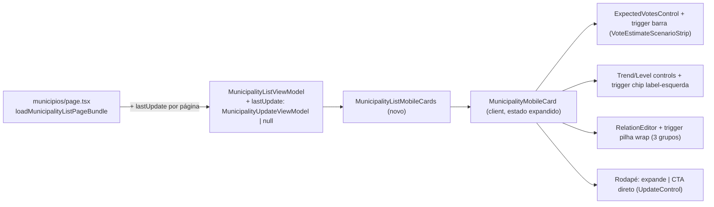

# Impl: B193 — Card de município mobile: composição densa + edit-where-you-see + última atualização expandível

Status: aprovado
Atualizado em: 2026-08-10
Issue: #542
Intenção: docs/plans/municipios-card-mobile-edit-where-you-see.md
Appetite restante: herdado (~1–1,5 dia eng; recomposição de card + fiação de affordances sobre sheets existentes)

## Leitura da intenção

- **Outcome:** no mobile (`md:hidden`), o card de `/campanha/municipios` vira composição densa na ordem do wireframe (cabeçalho nome+território com posição de voto 2022 à direita; barra de cenários com marcador do ativo; chips classe/tendência/nível; pilhas de avatares sem cap; rodapé última atualização com chevron) com edit-where-you-see em bottom sheets já existentes; toque atravessado abre o detalhe; prioritário ganha borda lateral direita ~6px; rodapé expande revelando o último card de atualização + CTA de registrar; sem atualização → CTA direto.
- **O que NÃO negociar:** assimetria staff/leader (estimativas nunca para liderança — página já é `gate: noLeader`); B13: classe nunca sem razão acessível; Salvador (linha agregada) read-only; desktop da lista e demais listas inalterados; não adicionar dado novo ao card; expansão ≠ feed completo; não recriar editors (reusar variantes `sheet`).
- **O que reavaliar:** (1) a intenção assume que os controles `variant="sheet"` servem o card novo como estão — os **triggers são internos** a cada controle, e a composição densa exige trigger customizado por alvo (barra de cenários, chip com label à esquerda, pilha de avatares com wrap); (2) a intenção não diz de onde vem o "último card de atualização" — o view model da lista **não carrega a última atualização** (só `lastUpdateAt`/`lastSignalAt`), então é dado novo no _load_ da página (não no card); (3) o rodapé hoje usa frescor (max atualização/pledge) — a expansão exige idade da **atualização**, não do sinal.

## Abordagem recomendada

**Opções consideradas:**

- **A — Controles ganham prop `trigger` opcional (recomendada).** Cada controle de edição (`MunicipalityListExpectedVotesControl`, `MunicipalityListLevelControl`, `MunicipalityListTrendControl`, `MunicipalityRelationEditor` + os 3 wrappers de relação) passa a aceitar um `trigger` customizado que substitui o interno; o `CampaignCellEditOverlay` já tem o `aria-label` que cobre a11y de qualquer conteúdo. O card compõe label+valor/barra/pilha dentro do botão, então o toque no **label** abre a sheet (aceite), e o trigger continua `relative` acima do overlay `after:inset-0` (invariante B42 documentado no próprio `CampaignCellEditOverlay`).
- **B — Card posiciona label e trigger como irmãos, e o label abre a sheet via handler próprio.** Duplica o estado de abertura do sheet (dois triggers para um overlay) e fura a maquinaria `openSheet/dismissSheet` do host compartilhado — o host guarda `activeOnOpenChangeRef` e o segundo trigger entraria em conflito. Rejeitada: é a C109 que se descartou; quebraria a invariante "um control = um onOpenChange".
- **C — Recriar o editor no card (componentes novos de sheet).** Rejeitada: rabbit hole "recriar editors" nomeado na intenção; anti-goal explícito.
- **D — Barra/pilhas como affordances estáticas + navegação para a página de edição.** Rejeitada: viola edit-where-you-see (editar "sem sair do card", aceite).

**Decisões de engenharia:**

1. **Dado da expansão — última atualização no view model** (custo de reverter: médio — toca loader e tipo).
   - Opções: (a) `lastUpdate: MunicipalityUpdateViewModel | null` no `MunicipalityListViewModel`, carregado em batch por página; (b) fetch per-card no client (N+1, e o read precisa de access server-side); (c) `lastUpdateAt` sozinho (não dá o corpo/autoria do card).
   - Recomendação: (a) — um `payload.find` em `municipalityUpdate` com `where: { municipality: { in: idsDaPágina } }`, `sort: '-createdAt'`, select enxuto, `overrideAccess: false` (o `canReadMunicipalityUpdate` escopa por portfólio), primeiro doc por município; nomes de autor via `loadCampaignUserNamesByIds` (mesmo padrão de `loadMunicipalityUpdatesFeed`). Alternativas rejeitadas: (b) porque explode o número de reads por página e expõe o access no client; (c) porque o card expandido precisa de corpo/polaridade/autor (aceite).
   - Gatilho de revisitação (barato, não agora): se um município tiver centenas de updates, o batch puxa tudo — `DISTINCT ON` via drizzle quando houver medição (mesma política de `supporterListOverviewAggregate`).
2. **Cobertura (conta da cadeira) sai do card mobile.** O wireframe não a inclui; o card atual mostra "Cobertura" (goal coverage). Fica na tabela desktop e no detalhe. Sinalizo no gate como remoção de dado da superfície (não é "dado novo", é composição nova do wireframe).
3. **Rodapé passa a medir a idade da ATUALIZAÇÃO, não o frescor (update∨pledge).**
   - O wireframe é explícito ("Última atualização há X dias", "sem nenhuma atualização registrada → CTA direto") e o estado vazio é chaveado na existência de update, não de pledge. O `SignalAgeReadout`/frescor continua na coluna desktop (`lastSignal`), intacto. A cor de "sinal frio" (`estimate-pending`) é mantida no rodapé quando a **atualização** está fria (≥21 dias), preservando o alerta da fila.
   - Sinalizo como divergência pequena de produto no gate (a intenção herda o vocabulário frescor; troco para update-only no card).
4. **Borda de prioridade** — `border-r-[6px] border-primary` no `<article>` quando `isPriority && isStaffView && !isCity`, mantendo o `border-b` separador do B184. O `MunicipalityPriorityIndicator` (flag) sai do card mobile; a coluna desktop e o detalhe não mudam.
5. **Pilha de avatares com wrap** — estender `MunicipalityRelationAvatarStack` (owner, não twin) com modo wrap: `flex-wrap`, sem cap (`maxVisible` indefinido = todos), avatares densos (`size-7`); os três grupos (Assessores/Lideranças/Dobradinhas) são label + pilha dentro do trigger de cada relation editor via prop `trigger` (decisão A).
6. **Chip de classe** — mantém `TerritorialClassCardReadout` (só o rótulo + tooltip com a razão; `CampaignHoverTooltip` já abre no toque — `openOnTouch` default true, satisfaz "razão via tooltip/sheet" sem linha extra). Sem sheet nova.
7. **Barra de cenários** — trigger = `VoteEstimateScenarioStrip` com `markerMode="active-only"` + `labelMode="all"` (os três valores; ativo em destaque — igual ao canvas). Cenário ativo vem do `MunicipalityEstimateScenarioProvider` (já envolve a lista staff). Cidade: sem barra.
8. **Expansão** — estado `expanded` por card (`MunicipalityMobileCard` client); rodapé é `<button>` com `aria-expanded` + chevron rotacionando; conteúdo expandido = último card de atualização **sem moldura** (mesmo fundo; badges polaridade/urgente/adversário + corpo + autor · data — projeção enxuta do `CampaignUpdatesFeedItem` sem borda) + CTA "Registrar atualização" = trigger do `MunicipalityListUpdateControl` (sheet existente). Sem update → rodapé = trigger do `MunicipalityListUpdateControl` estilizado como CTA (sem chevron, sem expansão).

### Componentes / mudanças

- **`MunicipalityListViewModel`** (`src/utilities/municipality/municipalityViewModels.ts`): campo novo `lastUpdate: MunicipalityUpdateViewModel | null` (server-only, staff; leader nunca chega à página). `toMunicipalityListViewModel` ganha parâmetro com default.
- **`loadMunicipalityListPageBundle`** (`src/utilities/municipality/municipalityPageData.ts`): batch de última atualização dos ids da página (`isStaff`), mesmo `Promise.all` das demais leituras.
- **`loadMunicipalityLastUpdates`** (novo, em `municipalityUpdatePageData.ts` — dono dos reads de update): `Map<municipalityID, MunicipalityUpdateViewModel>` com `payload.find` + `overrideAccess: false` + nomes de autor.
- **`MunicipalityRelationEditor`** (`src/components/campaign/shared/`): prop opcional `trigger?: (entries: MunicipalityRelationEntry[]) => ReactNode` (default = avatar stack atual). Precedente: `RelationChipCell.trigger`.
- **`MunicipalityListAdvisorsControl` / `MunicipalityListLeadershipsControl` / `MunicipalityStateDeputyRelationCell`**: passthrough de `trigger`.
- **`MunicipalityListExpectedVotesControl` / `MunicipalityListLevelControl` / `MunicipalityListTrendControl`**: prop opcional `trigger?: ReactNode` (substitui o trigger interno).
- **`MunicipalityRelationAvatarStack`**: modo wrap (prop `wrap` + `maxVisible?: number` sem cap) — editar o owner.
- **`MunicipalityListMobileCards.tsx`**: recompõe o card; extrai `MunicipalityMobileCard.tsx` (client, estado de expansão). Mantém `data-view="mobile-cards"` + `<article>` (contrato de e2e B42/B184).
- **Migration:** sem migration (dado derivado; nenhum campo novo em collection).
- **Access / Consent:** nenhum; `canReadMunicipalityUpdate` já escopa por portfólio; `overrideAccess: false` em tudo.
- **UI:** Impeccable C — recomposição do card existente; tokens `data-theme='campaign'`; reusa shells (`CampaignCellEditOverlay`, host de sheet compartilhado, `VoteEstimateScenarioStrip`, badges, `Drawer`); shape → craft → critique → polish.

### Dados → forma (pergunta 3)

- **Barra de cenários:** forma = faixa com três valores + marcador do ativo (`VoteEstimateScenarioStrip` `markerMode="active-only"` `labelMode="all"`). Rejeitadas: % estadual absoluto (proibido pela intenção), barras empilhadas (custo de leitura alto para uma olhada), somente o valor do ativo (esconde o intervalo pessimista→otimista que a decisão desbloqueia — "a barra mostra onde a estimativa está no intervalo").
- **Idade do rodapé:** "há N dias" (padrão `formatMunicipalitySignalAgeLabel` aplicado a `lastUpdate.createdAt`), frio ≥21 dias.
- **Classe:** só o rótulo (chip) + razão em tooltip que abre no toque — flexiona B13 sem linha extra.

## Fases verificáveis

1. **Server/dados** — `loadMunicipalityLastUpdates` + campo no view model + bundle; `pnpm gate:fast` (tsc/lint/unit). Sem migration.
2. **Controles** — prop `trigger` nos 4 controles + `MunicipalityRelationEditor` + passthroughs; modo wrap na pilha. Unit onde o comportamento dos controles for tocado.
3. **Card novo** — `MunicipalityMobileCard` + recomposição da lista (cabeçalho/barra/chips/avatares/rodapé/expansão/CTA/prioridade/cidade).
4. **E2E** — atualizar B42 (alvo do tap-through: área não-control; trigger de tendência mantém nome), novos testes: expansão (último card + CTA abre sheet), sem-atualização → CTA direto, borda de prioridade, barra abre sheet de votos; rodar `pnpm test:e2e` no spec de municípios + atualizações.
5. **Gates finais** — `pnpm gate:push` completo (incl. knip, cycles, format, build) + Aikido nos arquivos editados.

## Rabbit holes / Não escopo (engenharia)

- Não mexer na maquinaria do sheet host / `CampaignCellEditOverlay` (estado saudável — C109 descartado).
- Não criar variante de card desktop nem tocar tabela/colunas (frescor desktop intacto).
- Não adicionar dado novo ao card (nada de meta da cadeira na barra, nada de contagem de apoios).
- Não otimizar o batch de updates com `DISTINCT ON` sem medição (registrado como gatilho).
- Não recriar o card de atualização do feed: projeção enxuta no card, feed completo fica em `/campanha/atualizacoes`.

## Riscos e mitigação

- **Sobreposição de toque (overlay `after:inset-0` × novos alvos):** todo alvo novo passa pelo trigger `relative` do `CampaignCellEditOverlay` ou recebe `relative` explícito (rodapé, CTA); o tap-through do e2e cobre o contrato.
- **`aria-label` substitui conteúdo do trigger:** os triggers mantêm `triggerLabel` verbosos ("Editar tendência política em X — Favorável"); o `VoteEstimateScenarioStrip` dentro do botão mantém `role="img"` + aria-label próprio (anuncio único, sem interativo aninhado).
- **E2E B42/B184 sensíveis a estrutura:** manter `data-view="mobile-cards"` + `article` + bordas `border-b`; o teste B42 de tap-through troca o alvo (label "Tendência" vira trigger — alvo novo: readout de posição de voto ou subtítulo, garantido não-control).
- **Rodapé muda de frescor para update-only:** divergência pequena de produto — apresentada no gate; coluna desktop preserva frescor.
- **Batch de updates grande:** página = 25 municípios; updates são relatos de campo enxutos; select limita payload; gatilho de revisitação registrado.

## Aceite de engenharia

- [ ] Aceite de produto da intenção ainda coberto (composição, edit-where-you-see, expansão, CTA vazio, borda de prioridade, cidade read-only, assimetria)
- [ ] Invariantes AGENTS/engineering-standards (nada de prod; `overrideAccess: false`; sem migration; identificadores em inglês; copy pt-BR)
- [ ] Testes previstos: e2e de expansão/CTA/borda/barra; tap-through re-verificado; unit onde controles mudam
