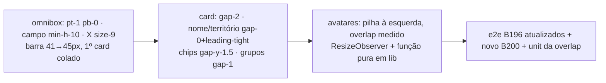

# Impl: Municípios mobile: encaixes dos cards — densidade, alinhamento e avatares (pós-B196)

Status: aprovado
Atualizado em: 2026-08-11
Issue: #704
Intenção: docs/plans/municipios-mobile-ajustes-cards.md
Appetite restante: herdado (~0,5–1 dia eng) — superfície em 1 chassis + 1 card + 1 avatar + 1 lib pura + testes

## Leitura da intenção

- **Outcome:** em `/campanha/municipios` mobile (< md) o card lê como um bloco só: barra de filtro ~48px no total com o primeiro card colado, nome/território colados, ritmo vertical enxuto entre votos/chips/avatares, labels e valores dos seis blocos alinhados à esquerda, avatares agrupados à esquerda com sobreposição mínima garantida e nenhum avatar cortado ou invadindo o grupo vizinho.
- **O que NÃO negociar:** desktop (`md+`) intacto; sheets/edit-where-you-see e o que cada controle edita intactos; labels/dados dos chips intactos; sem cap de avatares com "…"; toques `min-h-11` dos triggers de chip/sheet e `text-sm` do input do omnibox intactos; sr-only com os nomes dos avatares.
- **O que reavaliar:** a hipótese da intenção aponta o acerto para as células `flex-1 justify-center` do modo `overlapRow` — confirmado como origem dos sintomas, mas a correção "por caixa" não basta: o draft exige sobreposição MÍNIMA garantida mesmo com 2 avatares e fit exato em qualquer quantidade/viewport, o que células flex-1 (que espalham com poucos) ou margem fixa por contagem (que invade o vizinho em viewport < 390px com 5+) não dão. Decisão de engenharia no Passo "Abordagem" (opção B).

## Abordagem recomendada

**Opções consideradas:** A | B
**Recomendação:** B — pilha à esquerda com sobreposição **medida** (ResizeObserver no grupo, `overlap = max(8, (28n − W)/(n−1))` por contagem/largura reais, via função pura `relationAvatarOverlapPx` em `src/lib/`). É a única opção que satisfaz o aceite literalmente em toda a faixa mobile real: "sobreposição mínima garantida" mesmo com 2 avatares (8px, `-ml-2`), "nenhum avatar cortado", "nada invade o grupo vizinho" (fit exato por construção, qualquer n, qualquer viewport 320–430px) e "a sobreposição pode crescer com a quantidade" (sem teto: n grandes degradam para pilha). O draft gateado mostra exatamente essa pilha à esquerda (primeiro avatar sem margem, seguintes `-ml-2`/`-ml-3` crescendo) — B é o draft sem hardcode de viewport.
**Rejeitadas:**

- **A — pilha com margem fixa por contagem (draft-faithful, CSS puro):** classes `-ml-2`/`-ml-3` escolhidas por `n`, sem células flex-1, sem `overflow-hidden`. Zero JS e bate com o draft no viewport 390px, mas a margem fixa não conhece a largura do grupo: a 360px (Android médio, comum no BR) o grupo tem ~101px e 5 avatares a `-ml-2` esticam 108px → 7px invadindo o grupo vizinho; 6+ a 390px idem. O aceite "nada invade o grupo vizinho" quebra justamente no caso que o aceite pede. Revisitável se um dia quisermos zero JS, com gatilho: produto aceitar overlap fixo profundo demais para o caso extremo.
- **C — células flex-1 com margem negativa (fit por construção, CSS puro):** mantém o fit exato dos cells atuais, mas a sobreposição só nasce com n≥5 (célula < 28px) — com 2–4 avatares eles voltam a se espalhar pela largura do grupo, contradizendo "sobreposição mínima garantida" e o draft (2 avatares ligeiramente sobrepostos). Rejeitada.

### Componentes / mudanças

- **`campaignListOmniboxFormClassName`** (`src/components/campaign/shared/CampaignListOmnibox.tsx`): `py-1` → `pt-1 pb-0` no mobile (`md:py-0` intacto). Efeito: barra 41 → 45px (40 do campo `min-h-10` + 4 do pt-1 + 1 do border). **Divergência descoberta na execução (medida ao vivo, não na exploração do plano):** o vão entre a barra e o primeiro card NÃO era (só) o pb do form — o form é filho DIRETO da coluna do shell (`CampaignPageShell`, `gap-8` = 32px), e o vão real era esse gap entre o form e a região de resultados (form.bottom 100.67 vs card.top 132.67). Fix: `max-md:-mb-8` no mesmo chassis (cancela exatamente o gap-8; o resto das seções do shell mantém o ritmo; `md:mb-0` restaura o desktop). O `pb-0` continua (tira os 4px residuais) mas não era o dominante. Chassis, vale para as 11 listas (mesmo precedente B196). O sticky/`-mx-4`/border-b ficam. **Nota de divergência:** o aceite diz "≈48px", mas o draft gateado desenha campo `min-h-10` + `pt-1 pb-0` = 45px; voltar a `min-h-11` seria o "campo alto do B184" que o próprio aceite proíbe. Draft é a autoridade; 45px.
- **Campo do omnibox** (mesmo arquivo): container `min-h-8` → `min-h-10`; input `min-h-8` → `min-h-10`; botão X `size-8` → `size-9` (span interno `size-6` e ícone `size-3.5` intactos). `text-sm` do input INTOCADO (contrato B183). `md:min-h-11` do desktop intacto. Anel de foco continua só `md:` (sem anel mobile — caret é o indicador).
- **`MunicipalityMobileCard`** (`src/components/campaign/municipality/MunicipalityMobileCard.tsx`):
  - Article: `gap-2.5` → `gap-2` (ritmo vertical de todos os blocos; toques `min-h-11` intactos).
  - Header: `gap-0.5` → `gap-0`; o parágrafo de território ganha `leading-tight` (a linha-box enxuta fecha o vão visual; `text-sm` intacto).
  - Linha de chips: `gap-y-2` → `gap-y-1.5`; blocos `ChipBlock` internos (`gap-0.5`, label acima) intactos.
  - Grupos de relação: colunas label→avatares `gap-1.5` → `gap-1` nos 3 caminhos (`RelationGroupTrigger`, bloco read-only de assessores, fallback `CityDash`).
- **`MunicipalityRelationAvatarStack`** (`src/components/campaign/shared/MunicipalityRelationAvatarStack.tsx`), modo `overlapRow` (só o card mobile usa; desktop `-space-x-2`/cap 3/tooltip intocado): sai a linha de células `flex-1 justify-center` com `overflow-hidden`; entra pilha à esquerda — avatares `size-7` em sequência, primeiro sem margem, seguintes `marginLeft: -overlap` medido; `data-view="relation-avatars"` e o sr-only dos nomes permanecem; `overflow-hidden` PERMANECE como guarda de último recurso (fit correto nunca o ativa; e2e prova que nada clipa). O arquivo ganha `'use client'` (hooks). Modo default (não-overlapRow) intocado.
- **`src/lib/relationAvatarOverlap.ts`** (novo, puro): `RELATION_AVATAR_SIZE_PX = 28`, `RELATION_AVATAR_MIN_OVERLAP_PX = 8` e `relationAvatarOverlapPx(count, groupWidthPx)`: 0 para n≤1; `Math.max(8, (28·n − W)/(n−1))` — 2 avatares → 8px (mínimo garantido), n≥5 → fit exato por construção (total = W). Invariante testável: para qualquer n, o total `28 + (n−1)·(28 − overlap) ≤ W`.
- **Componente usa a função** via `ResizeObserver` no próprio elemento da linha (`clientWidth` → overlap em estado; inicial 8px; correção pós-mount imperceptível). Precedente de RO no repo: `RelationChipCell`, `BahiaMap`, `ActivityAgenda`.
- **Migration:** sem migration (zero schema).
- **Access / Consent:** nenhum (zero paths de escrita).
- **UI:** Impeccable B — encaixe; shape (classes acima) → craft (browser 390px + 360px) → critique (vãos, alinhamento de eixo label/valor, overlap/clipping) → polish.

### Dados → forma

N/A — nenhuma métrica nova (intenção: "Vou apresentar dados? Não").

## Fases verificáveis

1. **Tracer — chassis da barra** (menor parte do appetite): `pt-1 pb-0` + `min-h-10`/`size-9`. Verificar: tsc + e2e B196 da barra atualizado (altura 44–48) + e2e do feed de atualizações (sticky/border intactos) + `campaignIosInputZoom` (16px/14px intactos).
2. **UI — card + avatares**: `gap-2`/`gap-0`/`leading-tight`/`gap-y-1.5`/`gap-1` no card; pilha medida no avatar stack. Verificar: e2e B196 de nome/território (folga ≤2px) e de avatares reescrito (2 avatares levemente sobrepostos, pilha à esquerda, 5–6 todos visíveis e inteiros), novo e2e B200 (barra 44–48 + primeiro card colado + eixo label/valor).
3. **Unit da função pura** (`tests/unit/relationAvatarOverlap.unit.spec.ts`): n≤1 → 0; n=2 → 8; n=5/6/8/12 → fit exato (invariante total ≤ W); mínimo garantido nunca abaixo de 8.
4. **Gates**: `pnpm gate:fast` (tsc, lint, format, knip, cycles, unit+int, e2e do conjunto afetado) e `pnpm build`.

## Rabbit holes / Não escopo (engenharia)

- Não tocar o modo default do avatar stack (desktop), `MunicipalityRelationEditor`, `TerritoryListColumns`, tooltips.
- Não mudar `text-sm` do input nem `min-h-11` dos triggers do card.
- Não criar sistema de avatares global — só o modo `overlapRow` do componente existente.
- Não polir outras arestas do card/feed/agenda (item separado se o product pedir).
- Não mexer em sheets, busca/sugestões do omnibox, FAB, rodapé de atualização.

## Riscos e mitigação

- **e2e B196 regressar:** a altura da barra (≤44) e o "2 avatares sem overlap" PINAM o comportamento antigo — são as duas asserções que B200 muda por design; reescritas na Fase 1/2 com os novos contratos. Nada mais das specs atuais conflita (verificado: `campaignUpdatesMobile` pina sticky/border; `campaignIosInputZoom` pina font-size; B193 clica labels que permanecem).
- **`'use client'` novo no avatar stack:** o desktop (`MunicipalityList` é server) passa a renderizar o stack como cliente — sem dependência server-only no módulo (`campaignUserInitials` é util puro), sem impacto de bundle relevante; `TerritoryListColumns`/`MunicipalityRelationEditor` usam o modo default intocado.
- **RO medir antes do layout assentar:** RO dispara em layout estável; o estado inicial (8px) cobre o primeiro paint; correção é subpixel na prática.
- **Overlap exata com n gigante lê como pilha ilegível:** aceite do draft ("degradam para pilha"); sr-only lista todos os nomes.
- **Chips de cidade (Tendência/Nível "Não registrada")**: blocos intactos — apenas o gap da linha muda.

## Aceite de engenharia

- [ ] Aceite de produto da intenção ainda coberto (barra mais alta + 1º card colado; nome/território colados; ritmo enxuto; labels e valores no mesmo eixo; avatares à esquerda, sobrepostos, nunca cortados, nada invade o vizinho; desktop intacto)
- [ ] Invariantes AGENTS/engineering-standards (sem schema/access/Consent; nomes de props em inglês; copy pt-BR preservada; função pura testada em `src/lib/`)
- [ ] Testes previstos: unit `relationAvatarOverlap` (fit invariante por contagens); e2e B196 da barra/avatares atualizados; novo e2e B200 (barra 44–48, colagem do 1º card, eixo label/valor, pilha à esquerda sem clipping)

Self-score decision-quality: 5/5 — decisão cara (estratégia de overlap) com A/C rejeitadas e porquês; cabe no appetite; rabbit holes nomeados; depth check: reusa chassis/card/stack existentes e a convenção de matemática pura em `src/lib/` (mapScaleClasses, engagementLevel); intenção preservada — engenharia não reescreveu o outcome, só escolheu como garantir "nunca cortado e nada invade" sem hardcode de viewport.
