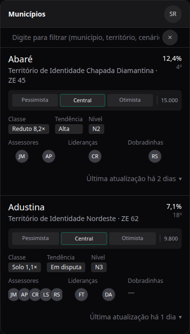
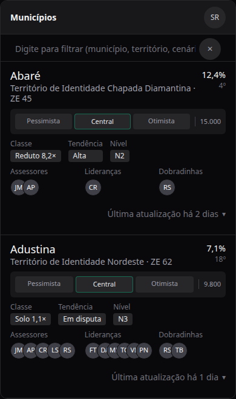

# Municípios mobile: encaixes dos cards — densidade, alinhamento e avatares (pós-B196)

Status: rascunho
Atualizado em: 2026-08-11
Issue: #704
Priority: P2
Model: composer-2.5
Impeccable: B — encaixe na tela existente `/campanha/municipios` (mobile < md), sem rota nova
Rascunho UI: docs/plans/municipios-mobile-ajustes-cards-ui-draft.html (PNGs embutidos abaixo)
Appetite: ~0,5–1 dia eng; um encaixe de densidade/alinhamento em superfície já entregue
Responsável: —

## Intenção

O B196 densificou o card mobile de `/campanha/municipios`, mas a varredura no celular ainda tropeça em arestas finas: a barra de filtro fica baixa para tocar e há um vão entre ela e o primeiro card; nome e território do município ainda respiram demais entre si e entre o bloco de votos estimados; as labels dos blocos (Classe, Tendência, Nível, Assessores, Lideranças, Dobradinhas) e seus valores não lêem como uma coluna alinhada à esquerda; e os avatares — que deveriam ser um grupo sobreposto à esquerda — ficam espalhados (dois avatares saem "um em cada canto") ou têm as pontas cortadas quando passam de 4. Queremos o card lendo como um bloco só: colado à barra, com ritmo vertical enxuto e os avatares sempre agrupados à esquerda, sobrepostos e inteiros.

## Persona e fluxo

- **Persona / contexto:** coordenador(a) e assessores(as) no celular, no campo ou entre reuniões; varredura rápida da lista para priorizar municípios.
- **Job principal:** ler nome/território e sinais (votos, tendência, nível, rede) de uma olhada, sem tropeçar em vãos ou em avatares cortados/espalhados.
- **Fluxo desejado:** abre a lista → barra de filtro um pouco mais alta, confortável para tocar → primeiro card começa colado na barra → cada card lê como um bloco: nome com território colado, ritmo vertical enxuto entre votos/chips/avatares, labels e valores alinhados à esquerda, avatares agrupados e sobrepostos à esquerda (nunca cortados) → toca qualquer dado e edita no sheet (inalterado).
- **Anti-goals de produto:** não mexer nos edit-where-you-see (sheets) nem no que cada controle edita; não mudar labels/dados dos chips; não tocar o desktop (`md+`); não esconder pessoas atrás de "…" (continua valendo o anti-goal B196 de não limitar avatares).

### Rascunho UI (B)

## Objetivo e aceite

- Barra de filtro mobile visivelmente um pouco mais alta que hoje (≈40px → ≈48px no total da barra), sem voltar o anel vermelho de foco nem o campo alto do B184.
- Primeiro card começa encostado na barra de filtro (sem vão entre o topo do card e a barra); demais cards mantêm o ritmo atual.
- Nome do município e território colados verticalmente (vão ≈0–2px, sem sobrepor).
- Vão entre o bloco nome/território e a barra de votos estimados reduzido; vão entre a barra de votos e a linha Classe/Tendência/Nível reduzido; vão entre a linha Classe/Tendência/Nível e a linha Assessores/Lideranças/Dobradinhas reduzido — sem encolher área de toque dos controles (min 44px dos triggers de chip/sheet permanece).
- Labels e valores dos seis blocos (Classe, Tendência, Nível, Assessores, Lideranças, Dobradinhas) alinhados à esquerda: cada label e seu valor começam no mesmo eixo; nenhum valor (especialmente avatares) fica centralizado ou espalhado sob a label.
- Avatares sempre agrupados à esquerda do bloco e com sobreposição mínima garantida (ex.: dois avatares ligeiramente sobrepostos, não um em cada canto).
- Nenhum avatar cortado na borda do bloco, qualquer que seja a quantidade (ex.: 5–6 avatares todos visíveis; a sobreposição pode crescer com a quantidade, desde que nada invada o grupo vizinho).

## Dados (intenção)

- **Vou apresentar dados?** Não — sem métrica nova; é densidade e alinhamento da superfície existente.
- **Decisões desbloqueadas:** nenhuma leitura nova de dado. Guardrail: nomes/iniciais dos avatares continuam acessíveis (sr-only) e os chips mantêm os valores atuais.

## Direção no codebase (hipótese)

- **Áreas prováveis:**
  - Omnibox (chassis compartilhado): `src/components/campaign/shared/CampaignListOmnibox.tsx` — campo mobile `min-h-8`/`size-8` (barra ≈40px; subir ~8px sem inflar), e o `campaignListOmniboxFormClassName` (`py-1` — o pb de 4px é o vão atual entre a barra e o primeiro card).
  - Card mobile: `src/components/campaign/municipality/MunicipalityMobileCard.tsx` — ritmo vertical `gap-2.5` entre blocos, `gap-0.5` entre nome/território, labels via `ChipLabel`/`ChipBlock`.
  - Avatares: `src/components/campaign/shared/MunicipalityRelationAvatarStack.tsx` (modo `overlapRow` do B196 — células `flex-1 justify-center` com `overflow-hidden`; é isso que espalha 2 avatares e corta as pontas com 5+).
- **Precedente a olhar:** plano pai `docs/plans/municipios-mobile-polimento-omnibox-cards.md` (B196, #607) e `docs/plans/municipios-card-mobile-edit-where-you-see.md` (B193); desktop usa `-space-x-2` com cap 3 em `MunicipalityList.tsx`.
- **Risco de acoplamento:** o omnibox é chassis de TODAS as listas — mexer na altura da barra muda as outras listas de uma vez (padrão já aceito no B196: "vale para todas"). O avatar stack `overlapRow` só é usado pelo card mobile; o modo com cap do desktop não deve mudar.

## Dependências

- Nenhuma (sucessor de B196, já em produção). Soft: manter o padrão visual do desktop intacto.

## Fora de escopo

- Desktop (`md+`) da lista de municípios e das demais listas.
- Comportamento de edição (sheets/edit-where-you-see), ferramentas de busca/sugestões do omnibox, labels/dados dos chips.
- Outras superfícies mobile (feed de atualizações, agenda…) — só o que o chassis compartilhado carregar.
- Limite de avatares com "…" (anti-goal B196 continua valendo).

## Rabbit holes de produto

- **"Já que vai mexer no omnibox, ajusta as outras listas também."** O pedido é altura + vão do primeiro card; o chassis leva isso para todas as listas por padrão (como no B196). **Corte:** nada além do chassis e do card de municípios; o resto vira item separado.
- **Sistema de avatares para o app inteiro.** O pedido é sobre os três grupos do card mobile. **Corte:** só o card; o modo desktop (cap 3 + tooltip) permanece.
- **"Aproveitar e polir" mais a tela.** A lista mobile ainda tem outras arestas. **Corte:** somente os pontos do aceite; o resto vira item separado.

## Questões em aberto (produto)

- **Com 6+ avatares num bloco de ~110px, o que vence: sobreposição mais profunda ou avatar menor?** **Opções:** A — sobreposição cresce com a quantidade (todos visíveis, tamanho fixo); B — avatar encolhe a partir de um limite (tamanho variável). **Recomendação:** A — preserva a leitura de "pilha de pessoas" e não muda o toque; o caso extremo (7+) é raro e a sobreposição de ~14px ainda lê como grupo. _(assumido — validar no gate)_
- **A barra mais alta vale para todas as listas?** O omnibox é chassis compartilhado. **Recomendação:** A — vale para todas (mesmo padrão do B196); é a área de toque que melhora. _(assumido — validar no gate)_

## Referências

- GitHub Issue: #704 (registrada 2026-08-11, blocked até o plano em main)
- Rascunho UI (gate): `docs/plans/municipios-mobile-ajustes-cards-ui-draft.html` + PNGs embutidos acima
- Pai: `docs/plans/municipios-mobile-polimento-omnibox-cards.md` (B196, #607) · `docs/plans/municipios-card-mobile-edit-where-you-see.md` (B193, #576) · `docs/plans/municipios-mobile-sem-moldura.md` (B184)
- Arquivos a abrir primeiro: `src/components/campaign/shared/CampaignListOmnibox.tsx` · `src/components/campaign/municipality/MunicipalityMobileCard.tsx` · `src/components/campaign/shared/MunicipalityRelationAvatarStack.tsx`
