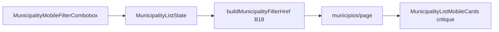

# Municípios mobile — filtro combobox + densificar lista

Status: implemented
Atualizado em: 2026-08-02
Issue: #207
Priority: P1
Model: cursor-grok-4.5-medium
Impeccable: C — UI nova do filtro + critique do card (lista existente)
Appetite: ~2 dias eng; combobox multi-filtro + remoções + critique/polish do card; URL B18 intacta; sem migration
Responsável: pool worker

## Freshness audit (2026-08-02)

- Arquivos citados existem; `municipalityFilterDefinitions` / toggles / `useCampaignListFilterNavigation` / `StrictCombobox`+`ui/combobox` intactos.
- B119 (`#206`) done+in-prod — hit-target `relative` no `CampaignCellEditOverlay` já verde.
- B118 ainda in-progress — soft serialize; este item **não** remove o h1 (fica com B118).
- Overview no desktop: manter `md+` (recomendação A).
- Sem migration / schema.

## Entrega

- Mobile: `MunicipalityMobileFilterCombobox` (Filter + chips + typeahead) sobre B18.
- Overview KPI + sort notice: `hidden` &lt;md.
- Cards densificados (cobertura/nível + controles; sem Classe/2022).
- Pins unit: chip/URL round-trip; filter navigation atualizado.

## Design (Impeccable)

Âncoras: `PRODUCT.md` (Clarity under pressure; Feel the action; Edit where you see) / `DESIGN.md` · tema `campaign` · referência mental GitHub Issues/PR filters · B16/B18 URL.

Na implementação (`work-issue`): **shape → craft → critique → polish** no card; no combobox craft → critique → polish (shape curto no plano). `harden` se URL/chips dessincronizarem.

Brief compacto:

- **Persona / contexto:** coordenador/assessor no celular prioriza municípios; hoje a página abre com overview + pilha de NativeSelects + card denso — scroll eterno antes da decisão.
- **Job principal:** filtrar com um campo (chips + typeahead) e escanear cards enxutos o bastante para escolher o próximo município.
- **Estratégia de cor:** Restrained (Mandate Red só em prioridade/ações).
- **Edit where you see:** sim — manter quick-edits no card **após** critique (nível/tendência/votos/sinal/assessores conforme papel); não voltar a `/editar` como único caminho. Rabbit hole: spreadsheet mode.
- **Anti-goals:** segundo sistema de URL; redesenhar tabela desktop; reintroduzir overview “porque é útil no desktop”; inventar paleta; filtro que exige igualdade em todas as dimensões quando vazio.

### Wireframe (texto)

```text
┌─ /campanha/municipios (mobile) ───────────────────────┐
│ (sem h1 — B118)                                       │
│ ┌─ 🔎/filter  Cobertura:baixa ×  TI:Sertão ×  |____│ │
│ │             ▾ typeahead                             │
│ │  Prioridade · Alta                                  │
│ │  Cobertura · Sem meta                               │
│ │  Região · …                                         │
│ │  Ordenar · Cobertura (maior déficit)                │
│ └─────────────────────────────────────────────────────┘
│ [Limpar] [Salvar filtro]   ← ações compactas          │
│                                                       │
│ ┌ card ─────────────────────────────────────────────┐ │
│ │ Nome · TI                          ★?             │ │
│ │ Cobertura · Nível · (1 linha meta)                │ │
│ └───────────────────────────────────────────────────┘ │
│ …                                                     │
└───────────────────────────────────────────────────────┘
  Sem: overview KPI strip; “Ordenado por Cobertura…”.
  Drawer de busca geral (B91) intacto.
```

## Dados → decisão → apresentação

- **Vou apresentar dados?** Sim na lista/cards; **não** no overview (este item **remove** a strip mobile).
- **Decisões desbloqueadas:**
  - Staff: “quais municípios atacar nesta sessão (déficit / nível / carteira)?”
  - Staff: “este card merece abrir o detalhe / editar nível agora?”
- **Forma escolhida:** lista de cards ranqueados (já existe) + filtro pobre (chips). **Rejeitado:** overview com 4 KPIs no mobile (vaidade + custo de viewport); chart; mapa nesta página.
- **Profile:** ~dezenas–centenas de linhas no scope; métricas relativas (cobertura/meta); staff-only em estimates.
- **Anti-goals de dado:** sem % estadual absoluto; sem reintroduzir média agregada no topo mobile neste item.

## Contexto

Pedido (2026-08-01), só mobile na lista de municípios:

1. Remover seletores de filtro empilhados; o campo de busca da **página** (não o do drawer) vira combobox multi-filtro estilo GitHub (ícone filtro; digitar → opções; clique → chip; continuar digitando). Semântica: dimensão sem seleção = todas; com 1+ = OR dentro da dimensão; dimensões AND entre si (já é o contrato atual).
2. Remover `MunicipalityListOverview` (média / declarações / cobertura assessoria / cobertura meta).
3. Remover aviso “Ordenado por Cobertura…”.
4. Sessão Impeccable critique no card (`MunicipalityListMobileCards`) — hoje grande e com informação demais.
5. Crash do nível → Issue **B119** (P0), não bloqueia o desenho mas deve estar verde antes/paralelamente.

Estado: `MunicipalityFilters` mobile = pilha `CampaignMobileMultiFilterField` + NativeSelects + sort + scenario; busca = `CampaignSearchInput` (`q`). URL/list state em `municipalityListUrl` / `municipalityListFilters` (**B18 congelado**). Overview: `MunicipalityListOverview` + `CampaignMetricStrip`. Sort summary: `formatMunicipalityListSortSummary` como `<p>` acima dos cards.

## Objetivos

- Mobile: substituir a pilha de filtros + search por **um** combobox input com chips (filtro icon); desktop (`md+`) mantém barra atual (search + header filters B16).
- Mapear opções do typeahead a `municipalityFilterDefinitions` + prioridade + sort (+ scenario staff se couber no appetite).
- Texto livre sem chip selecionado continua alimentando `q` (busca por nome), com debounce/`useCampaignListFilterNavigation` existente.
- Remover overview e o `<p>` de sort summary no mobile (caption a11y da tabela desktop pode permanecer).
- Critique + polish do card: cortar campos que não mudam a decisão de “abrir ou agir”; manter edit-in-place nos que restarem.
- Pins: URL round-trip dos chips; empty dimension = all; unit do parser inalterado.
- Sem migration / Consent / mudança de access.

## Decisões travadas

- **Contrato de URL B18 intocado** — chips só são UI sobre `MunicipalityListState` / `buildMunicipalityFilterHref`. **Rejeitado:** encoding tipo `is:open label:bug` na query string.
- **Só mobile** para combobox + remoção overview/sort notice/card critique. **Rejeitado:** forçar o mesmo chrome no desktop neste appetite.
- **Semântica multi = OR na dimensão, AND entre dimensões; vazio = todos** — já documentada nos filtros atuais; o combobox não inventa outra. **Rejeitado:** AND dentro de região/assessor.
- **Sort e scenario entram como opções do combobox** (single-select) para cumprir “remover todos os seletores”. **Rejeitado:** deixar NativeSelect de sort órfão “só um”.
- **Salvar/Limpar** ficam fora do input (botões), como GitHub. **Rejeitado:** esconder B18 saved filters no mobile.
- **Overview: apagar do tree mobile** (`hidden md:` ou não montar &lt;md). Desktop: **recomendação manter** a strip em `md+` _(assumido — validar)_; se produto quiser matar em todo breakpoint, fazer no mesmo PR.
- **Card critique em work-issue** (não neste fluxo plan-issue). Plano só semeia anti-goals e alvo de densidade.
- **i18n:** labels de dimensão em pt-BR; ids `MunicipalityMobileFilterCombobox`, etc.

## Questões em aberto

- **Overview no desktop?** **Opções:** A) manter `md+` | B) remover em todo breakpoint. **Recomendação:** A — pedido citou mobile e espaço; desktop aguenta a strip _(assumido)_.
- **Ícone: Filter vs Search?** Pedido: trocar para ícone de filtro. **Recomendação:** `Filter` (lucide) como leading icon; placeholder “Filtrar municípios…”.

## Abordagem proposta



Componentes:

- **`MunicipalityMobileFilterCombobox`** (novo, `components/campaign/municipality/`): input + chips + listbox; reusa defs/toggles de `municipalityListFilters`; ícone Filter; `min-h-11`.
- **`MunicipalityFilters`:** branch `md:hidden` → combobox; `hidden md:flex` → UI atual.
- **`MunicipalityList` / page:** não renderizar overview &lt;md; ocultar sort summary paragraph no mobile.
- **`MunicipalityListMobileCards`:** pós-critique — menos `dl` rows; possível fundir meta numa linha; hit-area do Link não cobrir controles (alinhar com fix B119).
- **Não criar** abstração “GitHubFilterCombobox” genérica no 1º call site; extrair a `shared/` no 2º domínio.
- **Migration:** Sem.

Fases sugeridas (quota appetite):

1. Remoções overview + sort notice mobile (tracer visual).
2. Combobox ↔ URL (happy path + Limpar).
3. Critique/polish card.
4. Pins + gate.

## Dependências

- Dura soft: **B119** (crash nível) — ideal verde antes do polish do card que mexe no mesmo hit-target.
- Soft: **B118** (header) — serialize em `municipios/page.tsx`.
- Soft: B16/B18/B42 ✓.

## Não escopo

- Crash nível → **B119**.
- Busca geral geo → **B117**.
- Filtros salvos UX redesign além de continuar acessíveis.
- Tabela desktop / column picker.

## Rabbit holes

- **Cmdk/Command palette package novo.** **Mitigação:** base-ui `Combobox` já no repo (`components/ui/combobox`, `StrictCombobox`) + chips manuais.
- **Sincronizar typeahead com facetas server a cada tecla sem debounce.** **Mitigação:** opções das defs + facetas já carregadas na página; `q` debounced como hoje.
- **Spreadsheet mode no card “já que estamos no critique”.** **Mitigação:** anti-goal; editar só campos que já têm control.

## Adiado com gatilho

- **Mesmo combobox em apoiadores/lideranças.** Revisitar no 2º list domain que pedir a mesma UI → aí extrair `shared/`.
- **Overview morto também no desktop.** Revisitar se analytics/produto disser que ninguém usa.

## Referências

- GitHub Issue #207
- `MunicipalityFilters.tsx`, `municipalityListFilters.ts`, `municipalityListUrl.ts`
- `MunicipalityListOverview.tsx`, `MunicipalityListMobileCards.tsx`
- `CampaignMobileMultiFilterField.tsx` (legado mobile a substituir)
- `StrictCombobox.tsx` / `components/ui/combobox.tsx`
- `filtros-salvos-municipios.md` (B18), `polimento-mobile-lista-municipios.md` (B42)
- PRODUCT.md · campanha-edit-where-you-see · campanha-action-feedback
