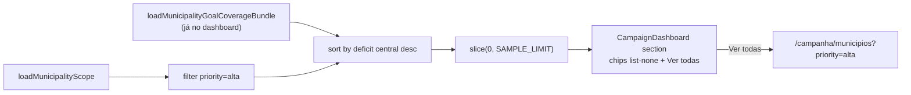

# Municípios prioritários no Início

Status: rascunho
Atualizado em: 2026-07-25
Item do roadmap: [docs/roadmap.md](../roadmap.md) (Demais itens abertos, B20)
Impeccable: B — encaixe na seção existente do dashboard staff (`CampaignDashboard` em `/campanha`); sem rota nova
Appetite: ~0,5 dia eng; semântica da seção + ordenação + link “Ver todas” + markup sem bullets; sem migration
Responsável: —

## Design (Impeccable)

Âncoras: `PRODUCT.md` (princípios 2 clareza sob pressão + 6 inteligência serve organização) / `DESIGN.md` (register `product`; Field Desk; chips de escopo) · tema `data-theme='campaign'` · shell `CampaignPageShell` + padrão de chip-strip já usado em `assessores/[id]` e `RecentlyVisitedCard`.

Na implementação (`implement-roadmap-item`): craft compacto → critique → polish (só a seção prioritários + loader; sem redesign do Início).

Brief compacto:

- **Persona / contexto:** CG/candidato (e assessor no próprio escopo) abrem `/campanha` sob pressão; precisam de atalho para **onde atacar agora** entre as prioritárias da mesa — não do inventário completo.
- **Job principal:** ver um recorte acionável das prioritárias, entender que o conjunto total é maior, e cair na lista filtrada com um toque.
- **Estratégia de cor:** Restrained; chips outline/secondary existentes, sem segundo sistema de badges.
- **Edit where you see:** não — seção só-leitura / navegação; mutação de `priority` continua no form de estratégia.
- **Anti-goals:** inventário de ~50 chips no Início; “top 6” sem critérios; hero-metric SaaS de “prioritários”; lista com bullets visíveis.

## Dados → decisão → apresentação

- **Vou apresentar dados?** Sim, superfície neste item — lista curta de municípios (nome + link) + contagem do conjunto `priority=alta` no escopo.
- **Decisões desbloqueadas:** Staff: “dentre as prioritárias da mesa, quais abro agora (maior buraco de cobertura)?”; “quero o inventário completo → lista filtrada”.
- **Forma escolhida:** lista/chip-strip ranqueada (≤8) + contagem + CTA “Ver todas (N)” — **por quê:** o Início é atalho (E9 já é a fila completa). **Rejeitado:** mostrar os ~50 chips (polui o Início; E4R seedou ~50 `alta`); só KPI numérico sem nomes (perde o atalho de um toque); chart/mapa de prioritárias (vaidade; mapa já está acima).
- **Profile:** categórico (município) + ordenação por déficit numérico derivado (E8/E9, cenário `central`); granularidade município; tamanho típico amostra 6–8 de um conjunto ~50 (coordenador) ou ≤N do escopo (advisor); relativo (déficit de cobertura), não % estadual.
- **Anti-goals de dado:** sem % estadual; sem reorder inventado paralelo a E9; sem inventar segundo campo de “prioridade do dashboard”.

## Contexto

No dashboard staff (`/campanha`), `CampaignDashboard` renderiza a seção **“Municípios prioritários”** a partir de `StaffDashboardView.priorityMunicipalities` (`src/utilities/campaignDashboardData.ts`):

```ts
priorityMunicipalities: municipalities.docs
  .filter((m) => m.priority === 'alta')
  .slice(0, 6)
  .map((m) => ({ name: m.name, slug: m.slug }))
```

Problemas observados (pedido de produto 2026-07-25):

1. **Semântica opaca.** Após **E4R**, ~50 municípios têm `priority=alta` (aba PRIORITÁRIAS da planilha). A seção mostra no máximo 6, na ordem do escopo (não ranqueada), sem dizer que há mais. O usuário lê como “estes são os prioritários” — mentira por omissão. `highPriorityCount` já é calculado no loader e **não é usado** na UI (campo morto no view model).
2. **Markup com bullets.** A strip usa `<ul className="flex flex-wrap gap-2">` **sem** `list-none` / reset de margem — ao contrário de `RecentlyVisitedCard` e da strip de municípios em `/campanha/assessores/[id]`. Resultado: marcadores de lista visíveis nos chips.

A fila canônica de alocação já é `/campanha/municipios` (**E9**, default `?sort=deficit`); o filtro `?priority=alta` e o link da “coluna da vergonha” (`?priority=alta&coverage=sem_assessor`) já existem. O Início deve ser **atalho**, não segundo inventário.

## Objetivos

- Redefinir a seção como **atalho acionável** sobre o conjunto `priority === 'alta'` do escopo do ator (não como inventário truncado).
- Ordenar a amostra pelo mesmo critério E9: déficit de cobertura da meta no cenário `central` (maior buraco primeiro); municípios sem meta/`goal=0` no fim.
- Limite da amostra: **8** (ou todos se o escopo tiver menos); header com contagem total `highPriorityCount` e link **“Ver todas”** → `buildMunicipalityListHref({ priority: 'alta', …defaults })`.
- Corrigir markup: `list-none m-0 p-0` (e `[&>li]:mt-0` se necessário), espelhando o padrão de assessores/recentes — zero bullets.
- Guardrails: sem migration, sem collection, sem Consent, sem server action; `leader` nunca vê o dashboard; advisor continua no próprio escopo (`loadMunicipalityScope`).

## Decisões travadas

- **Semântica = atalho ranqueado + inventário na lista, não “os 6 prioritários”.** A seção responde “quais prioritárias atacar agora?”; o conjunto completo vive em `/campanha/municipios?priority=alta`. **Rejeitado:** mostrar ~50 chips no Início (polui; contradiz Field Desk); manter `.slice(0, 6)` sem sort nem contagem (status quo mentiroso); trocar a seção só por KPI sem nomes (perde o job de um toque); restringir a “sem assessor” só (já coberto pela coluna da vergonha no overview da lista — aqui o critério é déficit entre as `alta`).
- **Ordenação = déficit E9 (`central`), reuso do bundle de cobertura já carregado.** `getCampaignDashboardData` já chama `loadMunicipalityGoalCoverageBundle`; ordenar as `alta` por `coverage.deficit` desc antes do slice. **Rejeitado:** ordem alfabética / ordem do escopo; sort por votos 2022 (A11) nesta seção (a lente de alocação pós-E9 é cobertura); segundo loader só para prioritários.
- **Limite amostral = 8; CTA sempre que `highPriorityCount > amostra`.** Número alinhado a caps de dossiê/filas curtas; não expor constante mágica sem nome (`DASHBOARD_PRIORITY_SAMPLE_LIMIT`). **Rejeitado:** 6 sem copy de “há mais”; paginação no Início; “mostrar tudo” abaixo de um fold.
- **Markup: `ul` com `list-none` (não trocar por `div`).** Preserva lista acessível; precedent `assessores/[id]` + `RecentlyVisitedCard`. **Rejeitado:** deixar bullets; reinventar componente de chip-strip genérico (&lt;3 call sites além destes).
- **i18n e naming** (AGENTS.md): identificadores ingleses (`priorityMunicipalities`, `highPriorityCount`, `DASHBOARD_PRIORITY_SAMPLE_LIMIT`); strings pt-BR (“Municípios prioritários”, “Ver todas”).

## Questões em aberto

- **Copy do subtítulo / CTA?** **Opções:** A) só título + Badge com N + link “Ver todas”; B) linha “N prioritários · mostrando as 8 com maior déficit de cobertura”. **Recomendação:** A (clareza sob pressão; o sort é implícito pelo contexto pós-E9; B é didático demais para o Início). _(assumido — validar com produto na primeira demo)_
- **Incluir chip “sem responsável” na amostra?** **Opções:** A) não neste item (E9 já sinaliza na lista); B) priorizar `alta` sem assessor antes do sort por déficit. **Recomendação:** A — rabbit hole de segunda fila; se a mesa pedir, fill-in.

## Abordagem proposta



Componentes:

- **`getCampaignDashboardData`** (`src/utilities/campaignDashboardData.ts`): após o bundle E8, filtrar `priority === 'alta'`, ordenar por `goalCoverageBundle.byMunicipalityId` (ou equivalente já exposto) no cenário `central` — maior `deficit` primeiro; `null`/sem meta no fim; `slice(0, DASHBOARD_PRIORITY_SAMPLE_LIMIT)`; continuar populando `highPriorityCount` (agora consumido na UI). Extrair helper puro testável se o sort não couber inline (&lt;15 linhas → pode ficar no próprio arquivo; ≥ complexidade → `pickDashboardPriorityMunicipalities` no mesmo módulo ou ao lado de `goalCoverage`).
- **`CampaignDashboard`** (`src/components/campaign/dashboard/CampaignDashboard.tsx`): header da seção com título + `Badge`/`span` com `highPriorityCount`; `ul` com `m-0 flex list-none flex-wrap gap-2 p-0 [&>li]:mt-0`; chips `Button outline` + `Link` como hoje; CTA `Link` “Ver todas” via `buildMunicipalityListHref` com `priority: 'alta'` (defaults de sort da lista — `deficit` desc — alinhados a E9). Esconder CTA se `highPriorityCount <= amostra`.
- **Unit test** do helper de pick/sort (fixture 10 municipíos, assert ordem e limite).
- **Migration:** Sem migration, sem collection, sem server action.

## Dependências

- Duras: nenhuma de item aberto — **E4R ✓** (seed de `priority`), **E8 ✓** / **E9 ✓** (cobertura + sort `deficit`), filtro URL `priority` em `municipalityListUrl.ts`.
- Reuso: `loadMunicipalityScope`, `loadMunicipalityGoalCoverageBundle`, `buildMunicipalityListHref`, padrão `list-none` de assessores/recentes.

## Não escopo

- Ícone Flag na lista de municípios → fill-in [icone-prioridade-lista-municipios.md](icone-prioridade-lista-municipios.md).
- Substituir `priority` por níveis N0–N4 → **E14**.
- Segunda fila “só sem assessor” no Início → já coberto por E9 (“coluna da vergonha”); não duplicar.
- Redesign do restante do dashboard / mapa / tabela TI (**E17**).
- `highPriorityCount` no `CampaignMetricStrip` (KPI vaidade; a seção + lista bastam).

## Rabbit holes

- **“Mostrar todos” com scroll interno.** Vira inventário no Início e compete com a lista. **Mitigação:** amostra fixa + CTA.
- **Sort paralelo inventado (votos, frescor, alfabetic).** Diverge de E9 e confunde. **Mitigação:** só déficit `central`.
- **Componente genérico `CampaignChipStrip`.** 2–3 call sites com markup trivial. **Mitigação:** copiar classes do precedente; abstrair só no 3º copy-paste futuro (gatilho).

## Adiado com gatilho

- **Priorizar “alta sem assessor” na amostra.** Revisitar quando: CG pedir explicitamente no Início **ou** a coluna da vergonha deixar de ser descoberta na lista (evidência de sessão/R6).
- **Expor `highPriorityCount` no metric strip.** Revisitar quando: houver 2º consumidor além do header da seção (hoje seria vaidade).

## Referências

- `docs/roadmap.md` (B20; E9 fila; E4R seed ~50 alta)
- `src/utilities/campaignDashboardData.ts` — loader + `slice(0, 6)` atual + `highPriorityCount` morto
- `src/components/campaign/dashboard/CampaignDashboard.tsx` — seção + `ul` sem `list-none`
- `src/utilities/municipalityListUrl.ts` — `buildMunicipalityListHref` / filtro `priority`
- `src/utilities/municipalityPageData.ts` — `applyDerivedMunicipalitySort` (precedente déficit)
- `src/app/(campaign)/campanha/(app)/assessores/[id]/page.tsx` — strip `list-none` de referência
- `src/components/campaign/dashboard/RecentlyVisitedCard.tsx` — `list-none` de referência
- [fila-de-alocacao.md](fila-de-alocacao.md) (E9) · [import-planilha-projecao.md](import-planilha-projecao.md) (E4R, ~50 alta)
- `PRODUCT.md` / `DESIGN.md` — Field Desk; anti dashboard SaaS
- AGENTS.md — naming, access por escopo, staff-only dashboard
