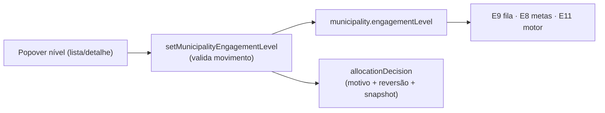

# E14 — Níveis de envolvimento N0–N4 por município

Status: rascunho
Atualizado em: 2026-07-24 (refs sincronizadas pós-remodelagem Municípios + hardening)
Item do roadmap: [docs/roadmap.md](../roadmap.md) (seção "Inteligência de campanha", E14; plano-mestre [inteligencia-campanha.md](inteligencia-campanha.md))
Impeccable: B — campo novo no detalhe/lista do município (Popover B9) + badge staff; sem rota nova
Appetite: ~1 dia eng; migration pequena (campos em `municipality`)
Responsável: —

## Design (Impeccable)

Âncoras: `PRODUCT.md` (princípios 3 e 5) / `DESIGN.md` (register `product`) · controles B9 (`MunicipalityList*Control`).

Na implementação: craft compacto → critique → polish.

- **Persona / contexto:** coordenador na reunião quinzenal de realocação; assessor entendendo o que o município dele "recebe".
- **Job principal:** substituir priorizar/despriorizar binário por 5 níveis com critérios e movimento auditável.
- **Estratégia de cor:** Restrained — nível como badge neutro numerado, sem escala de "importância" colorida (evita leitura de ranking público).
- **Edit where you see:** sim — mudar nível via Popover na lista/detalhe, exigindo motivo (grava `allocationDecision`).
- **Anti-goals:** nível visível para `leader` ou em qualquer superfície não-staff (anti-goal 11 — "a lista de prioridades é o mapa de onde você não vai defender"); mudança de nível sem motivo registrado.

## Contexto

Relatório §6.8: a escala N0 Monitorar → N1 Presença de mandato → N2 Rede sem agenda → N3 Rede+agenda → N4 Investimento pleno, com regras de movimento (promoção: gatilho positivo 2 semanas + capacidade; rebaixamento: não-resposta 3–4 semanas / perda estrutural / rebalanceamento; histerese: sem 2 mudanças no mês, sem pulo de 2 níveis salvo choque triangulado, janela de proteção de 3 semanas pós-promoção) e o rito (registro ex-ante com motivo E sinais de reversão; vocabulário duplo). Hoje `municipality.priority` só tem `alta|normal`. O nível modula a fila (E9), o motor (E11) e as metas (município N0/N1 carrega meta mínima — K-B/FU3).

## Objetivos

- `municipality.engagementLevel` (`n0…n4`, default `n2`), `levelNote` (motivo corrente), `levelChangedAt` (derivado) — todos staff-only (access nega `leader` na leitura, mesmo mecanismo de `supportStatus`).
- Mudança de nível SEMPRE grava `allocationDecision` (patternId `nivel`, snapshot com nível anterior/novo, motivo, sinais de reversão) — histórico auditável sem versionar `municipality`.
- Validações de movimento no server action (pulo de 2 níveis exige flag "choque triangulado" com nota; aviso de janela de proteção) — avisos bloqueiam por default com override explícito do coordenador (registrado).
- `priority` legada: mapeada (`alta`→N3 sugerido) e aposentada da UI; campo permanece no schema até limpeza futura (sem migração destrutiva agora).
- Consumidores: badge staff no detalhe/lista; E9 usa nível na ordenação (N0/N1 fora do topo do déficit); metas E8 leem nível para "meta mínima".

## Decisões travadas

- **Nível é staff-only fail-closed** (field access como `supportStatus`; nunca em view models de liderança). Vocabulário duplo é requisito de produto. **Rejeitado:** badge público "prioridade" (vaza o mapa de defesa).
- **Histórico via `allocationDecision`, não versions em `municipality`** (um mecanismo só para decisões — C12). **Rejeitado:** versions em municipality (custo alto, ruído); array `levelHistory` no doc (cresce sem access próprio).
- **Rebaixar meta ≠ rebaixar município** (K-C): nível e meta são eixos independentes; a UI não acopla os dois automaticamente. **Rejeitado:** auto-derivar nível da cobertura (vira gaming imediato — G4).
- **i18n e naming:** `engagementLevel` (`n0|n1|n2|n3|n4`), `levelNote`, `levelChangedAt`; labels pt-BR ("N1 · Presença de mandato" etc.).

## Questões em aberto

- **Default N2 para todas ou derivar sugestão inicial dos dados (E8/E10)?** Opções: N2 fixo | sugestão computada com aceite em lote. **Recomendação:** N2 fixo + tela de revisão em lote ordenada por sugestão — decisão continua humana, custo de setup ~1h de reunião. _(validar com produto)_
- **Quem pode mudar nível?** Opções: só `coordinator` | `advisor` nos seus municípios com aprovação. **Recomendação:** só `coordinator` (é decisão de realocação — rito §6.8); assessor propõe via nota/sinal.

## Abordagem proposta

Componentes:

- **`src/collections/Municipality.ts`**: 3 campos novos com access staff (padrão `politicalTrend`); `priority` sai da UI.
- **`src/utilities/municipalityStaffFormActions.ts`** (ou action irmã): `setMunicipalityEngagementLevel` transacional (municipality + allocationDecision com `req`), validações de histerese puras em `src/lib/engagementLevel.ts` (unit-testável).
- **UI:** `MunicipalityListLevelControl` no padrão dos `MunicipalityList*Control` (B9); badge no header do detalhe.
- **Migration:** `pnpm migrate:create add_municipality_engagement_level`.

## Dependências

- Duras: **C12** (`allocationDecision` existir). Suaves: E8 (metas por nível), E9 (ordenação), E11 (nível no snapshot dos gatilhos).
- Reusa: `municipalityStaffFormActions.ts`, `campaignAccess.ts`, padrão de field access de `supportStatus` (`Leadership.ts`).

## Não escopo

- Sugerir promoções/rebaixamentos automaticamente (E11, padrões K-A/P5); relatório de movimentos (E15); redeployment de brokers (processo humano — relatório K3).

## Rabbit holes

- **Workflow de aprovação multi-etapa.** Vira mini-Jira; o rito é reunião quinzenal + registro, não máquina de estados. **Mitigação:** action única com validações; nada de status "pendente de aprovação".
- **Migrar `priority` destrutivamente agora.** Coluna fica; remoção em migração futura de limpeza pós-estabilização.

## Adiado com gatilho

- **Notificação de mudança de nível ao assessor do município.** Gatilho: D2 (sino) entregue.

## Referências

- `docs/roadmap.md` (Inteligência de campanha, E14) · [plano-mestre](inteligencia-campanha.md) (G7)
- `docs/research/relatorio-entrevista-persona-campanha.md` §6.8 (escala, movimento, rito, custo político), K1–K4
- `src/collections/Municipality.ts` (priority/politicalTrend/access), `src/collections/Leadership.ts` (padrão supportStatus)
- `src/utilities/municipalityStaffFormActions.ts`, `src/components/campaign/MunicipalityListTrendControl.tsx` (padrão de controle B9)
- AGENTS.md — field access fail-closed, transações, migrations
