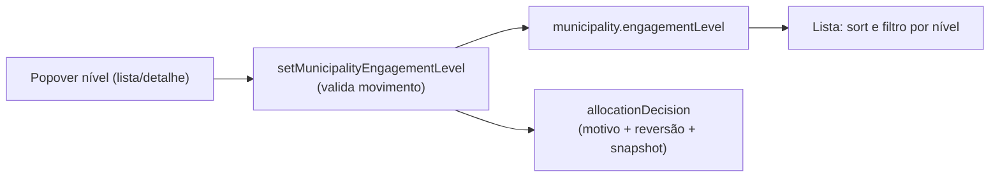

# E14 — Níveis de envolvimento N0–N4 por município

Status: entregue (2026-07-27)
Atualizado em: 2026-07-27 (entregue: migration `20260727_161752_add_municipality_engagement_level`, action transacional com lock gravando `municipality` + `allocationDecision`, rota JSON com terceiro estado `blocked`, Popover de submit explícito, coluna/sort/filtro na lista, verbete E18 — as-built no fim do arquivo)
Item do roadmap: [docs/roadmap.md](../roadmap.md) (seção "Inteligência de campanha", E14; plano-mestre [inteligencia-campanha.md](inteligencia-campanha.md))
Impeccable: B — campo novo no detalhe/lista do município (Popover) + badge staff; rota nova só de mutação JSON (`POST /campanha/municipios/engagement-level`)
Appetite: ~1,25 dia eng; migration pequena (3 campos em `municipality` + um valor no enum de `allocationDecision.outcome`)
Responsável: —

## Dados → decisão → apresentação

- **Vou apresentar dados?** Sim — uma classificação decidida por humano (não derivada), em **badge categórico** de 5 estados + "sem nível", na célula da lista e no card de estratégia do detalhe.
- **Que decisão ela serve?** Onde a campanha coloca presença, rede e agenda nas próximas semanas — e o registro de por que mudou.
- **Forma escolhida:** pill **outline numerada** ("N3"), rótulo longo e motivo no `cellTooltip` (seam do B23 ✓). A linha já carrega prioridade (vermelho), classe (5 variantes) e tendência (3): o nível não pode competir por cor.
- **Anti-goals de dado:** escala de cor de "importância" (vira ranking público — anti-goal 11); qualquer visibilidade para `leader`; gráfico ou série do nível.

## Design (Impeccable)

Âncoras: `PRODUCT.md` (princípios 3 e 5) / `DESIGN.md` (register `product`) · controles B9 (`MunicipalityList*Control`).

Na implementação: craft compacto → critique → polish.

- **Persona / contexto:** coordenador na reunião quinzenal de realocação; assessor entendendo o que o município dele "recebe".
- **Job principal:** substituir priorizar/despriorizar binário por 5 níveis com critérios e movimento auditável.
- **Estratégia de cor:** Restrained — nível como badge neutro numerado, sem escala de "importância" colorida (evita leitura de ranking público).
- **Edit where you see:** sim — mudar nível via Popover na lista/detalhe, exigindo motivo (grava `allocationDecision`).
- **Anti-goals:** nível visível para `leader` ou em qualquer superfície não-staff (anti-goal 11 — "a lista de prioridades é o mapa de onde você não vai defender"); mudança de nível sem motivo registrado.

## Contexto

Relatório §6.8: a escala N0 Monitorar → N1 Presença de mandato → N2 Rede sem agenda → N3 Rede+agenda → N4 Investimento pleno, com regras de movimento (promoção: gatilho positivo 2 semanas + capacidade; rebaixamento: não-resposta 3–4 semanas / perda estrutural / rebalanceamento; histerese: sem 2 mudanças no mês, sem pulo de 2 níveis salvo choque triangulado, janela de proteção de 3 semanas pós-promoção) e o rito (registro ex-ante com motivo E sinais de reversão; vocabulário duplo). Hoje `municipality.priority` só tem `alta|normal`. O nível modula a fila (E9), o motor (E11) e as metas (município N0/N1 carrega meta mínima — K-B/FU3).

## Objetivos

- `municipality.engagementLevel` (`n0…n4`, **sem default** — ver decisões), `levelNote` (motivo corrente), `levelChangedAt` (derivado) — todos staff-only na leitura (`canReadCampaignStaffField`, o mesmo mecanismo de `priority`/`politicalTrend`) e **unrestricted** na escrita.
- Mudança de nível SEMPRE grava `allocationDecision` (patternId `nivel`, snapshot com nível anterior/novo, motivo, sinais de reversão) — histórico auditável sem versionar `municipality`.
- Validações de movimento no server action (pulo de 2 níveis exige flag "choque triangulado" com nota; aviso de janela de proteção) — avisos bloqueiam por default com override explícito do coordenador (registrado no snapshot).
- Ordenação e filtro por nível na lista de municípios (chave `nivel`, param repetível) — o campo é armazenado, então o filtro é `where` do Payload; o sort roda em memória por causa dos nulos (ver as-built).

## Decisões travadas

- **Nível é staff-only fail-closed** (field access; nunca em view models de liderança). Vocabulário duplo é requisito de produto. **Rejeitado:** badge público "prioridade" (vaza o mapa de defesa).
- **Histórico via `allocationDecision`, não versions em `municipality`** (um mecanismo só para decisões — C12). **Rejeitado:** versions em municipality (custo alto, ruído); array `levelHistory` no doc (cresce sem access próprio).
- **`outcome` ganha um terceiro valor (`movimento`)** em vez de o movimento de nível se disfarçar de `aceita`. O enum nasceu binário (`aceita|descarta`) para a triagem de sugestões do E11, com `alternativeReading` obrigatória no descarte; um movimento de nível não é nenhum dos dois. **Rejeitado:** gravar sempre `aceita` (o campo viraria ruído semântico no primeiro consumidor da collection); usar `municipalityUpdate` kind `sinal` (misturaria decisão de alocação com sinal de campo e contaminaria `lastUpdateAt`/frescor).
- **Só `coordinator`/`candidate` movem o nível** (é decisão de realocação — rito §6.8); o assessor propõe por sinal. O access de `allocationDecision` já permite assessor no escopo dele, então a restrição vive na field access do campo + no `reloadUnrestrictedActor` da action. **Rejeitado:** assessor com aprovação (workflow multi-etapa é rabbit hole declarado abaixo).
- **Sem backfill: o campo nasce nulo, não `n2`.** Carimbar N2 em 435 municípios afirmaria uma decisão que ninguém tomou, e o rito §6.8 é registro ex-ante com motivo. "Sem nível" é um estado honesto, e filtrar por ele **é** a fila de triagem inicial. **Rejeitado:** default N2 no schema (o plano original) — reintroduz o binário que o item existe para substituir, agora com 435 falsos positivos. _(assumido — validar com produto)_
- **Submit explícito, não auto-save.** É a exceção que a regra `campanha-edit-where-you-see` já prevê ("flows que precisam de nota/confirmação"): o movimento exige motivo E sinais de reversão, e pode precisar de override. Efeito colateral bom: o controle não vira o 4º call site da máquina de debounce que o **B32+** ainda vai extrair. **Rejeitado:** auto-save por debounce como B24 ✓/B27 ✓/B32 ✓.
- **Rebaixar meta ≠ rebaixar município** (K-C): nível e meta são eixos independentes; a UI não acopla os dois automaticamente. **Rejeitado:** auto-derivar nível da cobertura (vira gaming imediato — G4).
- **i18n e naming:** `engagementLevel` (`n0|n1|n2|n3|n4`), `levelNote`, `levelChangedAt`; labels pt-BR ("N1 · Presença de mandato" etc.).

## Abordagem proposta

Componentes (caminhos conferidos contra o repo em 2026-07-27):

- **`src/collections/Municipality.ts`**: 3 campos novos; leitura `canReadCampaignStaffField`, escrita `canManageMunicipalityEngagementLevel` (novo, em `src/utilities/access/municipalities.ts`, no molde de `canAssignMunicipalityAdvisors`); hook `beforeChange` carimbando `levelChangedAt`, espelhando `derivePoliticalTrendAudit`.
- **`src/collections/AllocationDecision.ts`**: terceiro valor em `outcome`.
- **`src/app/(campaign)/campanha/actions/municipality.ts`**: `setMunicipalityEngagementLevel[Record]` transacional (municipality + allocationDecision com `req`), com lock `municipality-engagement-level:{id}` via `acquireTextAdvisoryLocks` (`src/utilities/postgresTransactionLocks.ts`) — o "nível anterior" do snapshot precisa ser verdade sob concorrência.
- **`src/lib/engagementLevel.ts`** (novo, puro/client-safe): rótulos, peso ordinal e as violações de histerese (unit-testável).
- **Rota:** `POST /campanha/municipios/engagement-level` (`route.ts` + `types.ts`), espelhando `municipios/political-trend/`.
- **UI:** `src/components/campaign/municipality/MunicipalityListLevelControl.tsx` (Popover com submit explícito); badge no bloco staff de `MunicipalityStrategyCard.tsx`, ao lado de prioridade/tendência.
- **URL:** chave de sort `nivel` e filtro multi estático em `municipalityListUrl.ts` / `municipalityListFilters.ts`; coluna descrita em `municipalityLabels.ts`; verbete no `campaignIntelligenceConcepts.ts` (E18).
- **Migration:** `pnpm migrate:create add_municipality_engagement_level`. `ALTER TYPE … ADD VALUE` roda dentro da transação da migration (PG 12+) desde que o valor novo **não seja usado na mesma migration** — não backfillar aqui.

## Dependências

- Duras: **C12 ✓** (`allocationDecision` existe; o E14 é seu primeiro escritor de produção). Suaves: E11 (nível no snapshot dos gatilhos), B23 ✓ (`cellTooltip`), B41 ✓ (scroll horizontal, que é o que faz caber a 12ª coluna).
- Reusa: `actions/municipality.ts`, `municipalityStaffEditMessages.ts`, `campaignJsonMutationRoute.ts` + `isSameOriginRequest`, `campaignAccess.ts`, `withPayloadTransaction`, `acquireTextAdvisoryLocks`.

## Não escopo

- **Aposentar `priority` da UI** — o plano original previa isso; a auditoria de 2026-07-27 mostrou 18 arquivos em `src` envolvidos (atalho do Início `dashboardPriorityMunicipalities.ts`, link `?priority=alta&coverage=sem_assessor` do E9, filtro de header, card/form de estratégia, dossiê) **e o seed da planilha `projectionSheetParse.ts`, que escreve o campo**. Vira fill-in próprio; `priority` fica intocado aqui.
- **Consumidores a jusante:** nível na ordenação do E9 e "meta mínima" N0/N1 no E8 — mudam semântica travada de `goalCoverage` (`meta = expectedVotes[cenário] ?? suggestedGoal`); item separado.
- Sugerir promoções/rebaixamentos automaticamente (E11, padrões K-A/P5); relatório de movimentos (E15); redeployment de brokers (processo humano — relatório K3).

## Rabbit holes

- **Workflow de aprovação multi-etapa.** Vira mini-Jira; o rito é reunião quinzenal + registro, não máquina de estados. **Mitigação:** action única com validações; nada de status "pendente de aprovação".
- **Migrar `priority` destrutivamente agora.** Coluna fica; remoção em migração futura de limpeza pós-estabilização.
- **Calibrar as regras de histerese.** Os cortes (salto de 2 níveis, 3 semanas de proteção, 1 movimento por mês) são os do relatório §6.8 e são **ilustrativos** — calibração é **E15**, num objeto só.

## Adiado com gatilho

- **Notificação de mudança de nível ao assessor do município.** Gatilho: D2 (sino) entregue.

## As-built (2026-07-27)

O que ficou diferente do plano, e o que só se soube implementando:

- **Migration `20260727_161752_add_municipality_engagement_level`** — `engagementLevel` (select indexado, sem default), `levelNote` (textarea 2000) e `levelChangedAt` (date indexada, `readOnly`, escrita por `canSetCampaignSystemField`), mais o valor `movimento` no enum de `allocationDecision.outcome`. O hook `deriveEngagementLevelAudit` carimba `levelChangedAt` só quando o nível muda **e o zera quando o nível é apagado**: uma data de "registrado em" sem nível não descreve nada, e as regras de histerese a leriam como histórico.
- **O `from` do snapshot é verdade sob concorrência** porque a action segura `municipality-engagement-level:{id}` antes de ler o nível atual. Os dois escritos (update do município + `allocationDecision`) vivem na mesma transação, e o snapshot guarda `{ from, to, reversalSignals, triangulatedShock, violations, overridden, previousLevelChangedAt }` — só os valores sobre os quais a decisão foi tomada, nunca o documento.
- **A rota tem três estados, não dois.** `blocked` (409) devolve as violações tipadas em vez de virar "não foi possível salvar": um movimento barrado pela histerese não é uma falha para repetir, é uma decisão que a coordenação pode tomar mesmo assim — então o Popover mantém o rascunho e oferece o override no lugar. As mesmas regras rodam no cliente (o módulo é puro) para o coordenador ver o motivo antes de submeter; o servidor as roda de novo de qualquer jeito.
- **O filtro é armazenado, então entra no `where`** — ao contrário de `classe` (E10), que é derivada e força o caminho `limit: 0`. "Sem nível" não cabe num `in`, então vira um ramo `or` com `{ engagementLevel: { exists: false } }`; selecionar N0 + sem nível (a fila de triagem) continua sendo uma consulta só. **O sort, não.** `n0…n4` ordena lexicograficamente na ordem ordinal, então parecia nativo — mas o Postgres põe NULL **primeiro** no DESC, e sem backfill "N4 primeiro" entregaria uma página inteira de "Sem nível". Ausência de decisão não é o topo da escada: `nivel` entrou em `applyDerivedMunicipalitySort` com `sortByNullableValue`, que joga nulo para o fim nas duas direções (mesma semântica de `sem_base` em `classe`). Custo: sortear por nível carrega o escopo inteiro — o mesmo que o sort padrão (`deficit`) já faz. Int test pina as duas direções.
- **Descoberto no int test:** com `overrideAccess: false`, o Payload **não** rejeita o update inteiro quando o ator não pode escrever o campo — ele descarta o campo em silêncio. O teste do assessor, então, prova que o nível **não mudou**, não que a chamada lançou.
- **Banco de desenvolvimento local estava fora do histórico de migrations:** `allocation_decision.outcome` era `varchar` e o tipo `enum_allocation_decision_outcome` não existia (o `teqo_test`, construído só por migrations, tinha ambos). Reparado à mão no `teqo` (criar o tipo + cast da coluna) antes de aplicar esta migration; nada a fazer em produção, que segue o histórico.
- **Custo:** `/campanha/municipios` fica em 17,7 kB / 322 kB de First Load JS. Suítes: 64 unit (604 testes) e 53 int (427). Nada novo no bundle do cliente: a revisão de performance conferiu contra o build de produção que todo módulo que a ilha importa já estava nos chunks da rota.
- **O que a revisão pós-entrega corrigiu:** (1) um `blocked` vindo do **servidor** — o caso que só existe sob concorrência, quando outra aba moveu o município — virava string no box de erro, sem o checkbox de override ao lado; agora as violações tipadas voltam ao mesmo lugar que as locais, deduplicadas por `id` e presas ao nível para o qual foram levantadas, que é a única forma de o terceiro estado da rota valer para quem mais precisa dele. (2) `formatEngagementLevelLabel` / `EMPTY_ENGAGEMENT_LEVEL_LABEL` mudaram de `municipalityLabels` para `lib/engagementLevel.ts`: importar um valor daquele módulo arrasta o catálogo de 435 entradas e o glossário de conceitos para dentro da ilha (o padrão de 21 kB do B14), hoje inócuo só porque o controle de tendência já mantém a cadeia viva. (3) `isEngagementLevel` saiu de três chamadas onde o tipo gerado pelo Payload já era a união fechada.
- **Débito conhecido (não é do E14 sozinho):** `levelNote` entrou em `municipalityListSelect`, e o sort padrão do staff (`deficit`) roda esse select sobre os 435 municípios do escopo para renderizar 25 linhas — no teto de 2000 caracteres são ~870 KB lidos por request. Hoje custa zero (o campo nasce nulo em todos), e `politicalTrend.note` tem exatamente a mesma forma e já estava lá: o conserto é dos dois juntos (ler as notas só para a fatia da página), não de um.
- **No rebase, o controle deixou de ter Popover próprio.** O **B42** entrou no `main` durante esta sessão e extraiu `CampaignCellEditOverlay` — Popover no `md+`, Drawer abaixo dele, porque no celular o popover disputa espaço com o teclado virtual. O merge automático encaixou o bloco "Nível" dentro do que virou o Drawer, o que compilava e teria aberto um popover dentro de uma gaveta; o controle passou a receber `variant` como os três irmãos (`popover` na tabela, `sheet` no card). O ramo Popover do container é ponto a ponto o que o E14 tinha escrito à mão (mesma tooltip, mesmas classes de trigger, mesmo `onOpenAutoFocus`), então a troca não muda o desktop — e no toque, onde não há hover, o trigger passa a soletrar o nível em vez de mostrar só o numeral.
- **Fora do escopo, confirmado na entrega:** `priority` continua intocado (18 arquivos + o seed `projectionSheetParse.ts` que escreve o campo), e nem o E8 nem o E9 leem o nível.

## Referências

- `docs/roadmap.md` (Inteligência de campanha, E14) · [plano-mestre](inteligencia-campanha.md) (G7)
- `docs/research/relatorio-entrevista-persona-campanha.md` §6.8 (escala, movimento, rito, custo político), K1–K4
- `src/collections/Municipality.ts` (priority/politicalTrend/access), `src/collections/AllocationDecision.ts` (C12)
- `src/app/(campaign)/campanha/(app)/municipios/municipalityStaffFormActions.ts`, `src/components/campaign/municipality/MunicipalityListTrendControl.tsx` (padrão de controle na célula)
- AGENTS.md — field access fail-closed, transações, migrations
