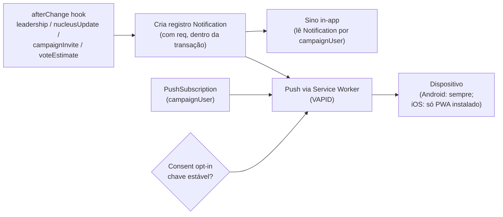

# Notificações (push PWA + sino in-app)

Status: rascunho
Atualizado em: 2026-07-17
Item do roadmap: [docs/roadmap.md](../roadmap.md) (seção "Campanha → Próximos ciclos")
Responsável: —

## Contexto

Coordenadores e lideranças precisam ser avisados de eventos da campanha (convite aceito, novo `nucleusUpdate`, estimativa aguardando confirmação) sem depender só do canal de WhatsApp. Este plano cobre dois canais de notificação dentro da vertical `/campanha`:

- **Push web** via Push API + Service Worker + VAPID (entrega em segundo plano, inclusive com o app fechado).
- **Sino de notificações in-app** dentro do `/campanha` (central de avisos lidos/não lidos).

Notificações por WhatsApp Business API ficam **fora** deste plano — já existem como item separado no roadmap (linha 57), exigem Meta + templates e serão reavaliadas quando o volume justificar.

## Objetivos

- Entregar avisos da campanha por push e por sino, com opt-in explícito (LGPD).
- Manter o padrão arquitetural do projeto: pessoas como `Contact`, transações em writes multi-collection, `Consent` resolvido por chave estável, access control por papel.
- Limitar push ao escopo `/campanha` (alinhado à decisão de PWA só na vertical de campo).

## Decisões travadas

- Push só em `/campanha` (alinhado ao item PWA do roadmap; ver [plans/pwa-campanha.md](./pwa-campanha.md)); site público e `/admin` não recebem push.
- Consentimento LGPD obrigatório antes de qualquer push; reusar a collection `Consent` com a chave estável **`campanha-notificacoes-push`** (falha fechado se ausente, mesmo padrão do fluxo de liderança), não inventar mecanismo novo. O texto deste consentimento entra no **lote jurídico único** de textos de `Consent` da campanha (junto com `lideranca-autopreenchimento`, `apoiador-cadastro` e `apoiador-intencao-voto`) — ver roadmap "Onda 0"; uma única rodada com a assessoria jurídica eleitoral cobre os quatro.
- **Este plano supera o item "Notificações WhatsApp Business API"** (removido do roadmap em 2026-07-17): a Meta veda o uso do WhatsApp Business API por campanhas políticas no Brasil e a Res. TSE 23.610 (art. 33) veda disparo em massa — pesquisa registrada em [cadastro-nominal-apoiadores.md](cadastro-nominal-apoiadores.md). Push web + sino cobrem a mesma necessidade (lembrete de reporte, avisos da coordenação) sem risco legal/de plataforma.
- Pessoas continuam sendo `Contact`; a subscription de push é dado de dispositivo/sessão ligado a `campaignUser`, não a `Contact`.
- iOS só recebe push com o PWA instalado na tela inicial — documentar essa limitação para o usuário no fluxo de opt-in.

## Questões em aberto

- Unificar numa única collection `Notification` (log de eventos) que alimenta tanto o sino quanto o push, ou manter dois caminhos separados? **Recomendação:** unificar — um registro por evento, com canais de entrega como atributo.
- Quais eventos disparam notificação, e qual canal cada evento usa (ex.: estimativa aguardando confirmação → push para `geral`/coordenador; novo update → sino para coordenador do núcleo).
- Políticas de agrupamento/dedupe (ex.: `tag` do Push API por núcleo) e expurgo de notificações antigas.
- Onde guardar as VAPID keys (Vercel env) e política de rotação.

## Abordagem proposta

Componentes:

- **Collection `Notification`** (admin group `Campanha`): `recipient` (rel → `campaignUser`), `type` (enum de evento), `payload` (json/richtext leve), `readAt`, `nucleus` (rel opcional). Access por `recipient = req.user.id`.
- **Collection `PushSubscription`** (admin group `Campanha`): `user` (rel → `campaignUser`), `endpoint`, `keys.p256dh`, `keys.auth`, `expirationTime`. Várias subscriptions por usuário (vários dispositivos).
- **Service Worker** `public/sw.js` com escopo `/campanha`, handler de `push` e `notificationclick` (abre a rota certa via `data.url`).
- **Server action** de subscribe/unsubscribe + pedido de permissão, com opt-in gravando `Consent`.
- **Hooks `afterChange`** nos collections de evento criando o `Notification` dentro da transação (`req: { transactionID }`) e enfileirando o push; usar `context` para evitar loops (padrão do AGENTS.md).
- **Sino** no layout `(app)` lendo `Notification` não lidas do `getCampaignUser()`.

## Dependências

- PWA de `/campanha` — push exige o service worker registrado. Ver [plans/pwa-campanha.md](./pwa-campanha.md). **O sino in-app não depende do PWA** e pode ser entregue antes, se fizer sentido faseá-lo.
- `Consent.key = 'campanha-notificacoes-push'` criada por admin após aprovação jurídica (mesmo padrão fail-closed do `lideranca-autopreenchimento`; texto no lote jurídico único do roadmap).
- Migration para as collections `Notification` e `PushSubscription` (`pnpm migrate:create`).

## Referências

- `docs/roadmap.md` (linhas 57, 60, 61)
- `AGENTS.md` — Campaign auth, Campaign nuclei MVP, transações, `Consent` por chave
- `.cursor/rules/projects/nucleos-eleitorais.mdc`
