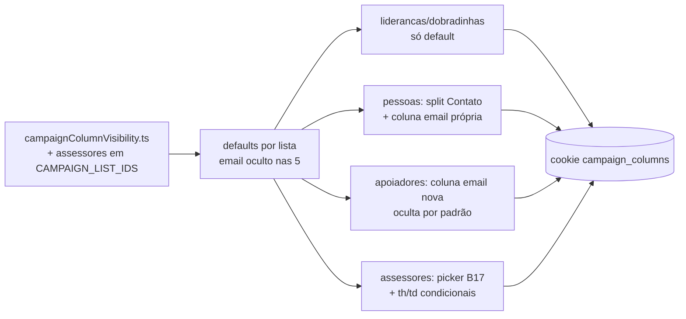

# Impl: Ocultar a coluna de e-mail por padrão nas listas de pessoas

Status: aprovado
Atualizado em: 2026-08-10
Issue: #627
Intenção: docs/plans/ocultar-email-por-padrao-listas.md
Appetite restante: herdado (~0,5–1 dia eng)

## Leitura da intenção

- **Outcome:** nas cinco listas de pessoas (lideranças, dobradinhas, pessoas, apoiadores, assessores) a coluna de e-mail nasce oculta para quem nunca tocou no seletor de colunas, e qualquer um pode religá-la pela mecânica B17 já existente — escolha lembrada por dispositivo (cookie `campaign_columns`). Na lista de pessoas, o e-mail sai da coluna "Contato" (que fica só com telefone) e vira coluna própria oculta. Na lista de assessores (hoje sem seletor), a mecânica B17 chega junto: ocultar por padrão + religar.
- **O que NÃO negociar:** default oculto nas cinco listas; religar manualmente sempre possível (assessores incluído); quem já tem escolha salva no cookie continua com a escolha inteira respeitada (contrato atual do mecanismo — o default vale só para quem nunca mexeu); nada de reordenar colunas, redesenhar tabelas, mexer em fichas/cards mobile ou em outras colunas.
- **O que reavaliar:** a intenção assume "só muda o default" nas quatro listas com seletor. Confirmado na leitura do código: `email` já é coluna própria em lideranças (`liderancas/page.tsx:160`) e dobradinhas (`dobradinhas/page.tsx:163`); em pessoas está embutida na célula "Contato" (`pessoas/page.tsx:135-149`) e em apoiadores **não existe coluna** (`SupporterList.tsx`) — precisa nascer (oculta). Assessores tem tabela própria client-side sem seletor (`AdvisorsTable.tsx`) — o encaixe é o ponto de maior risco.

## Abordagem recomendada

**Opções consideradas:** A (defaults no mecanismo B17 + encaixe assessores) | B (merge do default com cookie existente) | C (converter AdvisorsTable para `CampaignTable`)
**Recomendação:** A — o mecanismo já resolve "cookie ausente → default" (`resolveCampaignColumnVisibility`); as quatro listas `CampaignTable` viram uma linha no `DEFAULT_HIDDEN_COLUMN_IDS`; assessores ganha a MESMA mecânica (picker + cookie) sem reescrever a tabela.
**Rejeitadas:**

- **B (merge default+cookie):** quebra o contrato B17 documentado ("hiding is stored, never the visible set") e a decisão de produto assumida ("quem já tem escolha salva continua" — `resolvedCampaignColumnVisibility` já a implementa). Usuário que mexeu no seletor de `pessoas` antes vê o e-mail visível; o default vale para quem nunca tocou. É o aceite.
- **C (portar AdvisorsTable para CampaignTable):** a tabela tem modos client-side que o shell não modela (linha-draft de criação com validação, edição inline debounced por célula). Redesenho de superfície — corte explícito da intenção ("sem refactor da superfície").
- **D (pessoas: esconder só a linha de e-mail dentro da célula Contato):** fora da mecânica de colunas — quem religa não ganha nada e o picker fica mentindo. Intenção recomenda A (coluna própria) e o código dá suporte trivial.

### Componentes / mudanças

- **`DEFAULT_HIDDEN_COLUMN_IDS`** (`src/lib/campaignColumnVisibility.ts:70`): `liderancas: ['email']`, `dobradinhas: ['email']`, `pessoas: ['email']`, `apoiadores: ['email']`, `assessores: ['email']` — um comentário apontando B197.
- **`CAMPAIGN_LIST_IDS`** (`campaignColumnVisibility.ts:20`): `+ 'assessores'` (primeira lista sem seletor a entrar — o id vira chave do cookie e label do picker).
- **`liderancas/page.tsx` / `dobradinhas/page.tsx`:** zero mudança — o default resolve. (Verificar no e2e.)
- **`pessoas/page.tsx`:** célula `contact` perde o `` de e-mail (fica só telefone, `—` quando vazio); nova coluna `{ id: 'email', label: 'E-mail', cell: row.email ?? '—' }` logo após `contact` (posição de leitura natural; oculta no primeiro paint). Card mobile intocado (anti-goal).
- **`SupporterList.tsx`:** nova coluna `{ id: 'email', label: 'E-mail', cell: (s) => s.email ?? '—' }` após `city` — `SupporterListItemViewModel.email` já existe (`supporterViewModels.ts:29`); `supporterPickerColumns` deriva e ganha a coluna automaticamente. Card mobile intocado.
- **`assessores/page.tsx`:** `readCampaignColumnVisibility('assessores')`; `trailing={<CampaignColumnPickerTrailing columnVisibility={...} columns={advisorPickerColumns} />}` no `AdvisorFilters`; `columnVisibility` passado ao `AdvisorsTable`.
- **`AdvisorFilters.tsx`:** prop `trailing?: ReactNode` repassada ao `CampaignListOmnibox` (slot já existe — padrão de `PeopleFilters`/`StateDeputyFilters`).
- **`AdvisorsTable.tsx`** (client): prop `columnVisibility: CampaignColumnVisibility`; `emailHidden = hiddenColumnIds.includes('email')`; `<TableHead>` "E-mail" e o `<TableCell>` da linha só renderizam quando visível. **Exceção única:** a linha-draft de criação mantém o input de e-mail SEMPRE (e-mail é obrigatório para criar — `saveDraft` valida; coluna oculta esconde leitura, não o formulário). Em modo edição, a coluna oculta esconde também o input de e-mail — quem quer editar liga a coluna (um clique no picker; comportamento consistente com o pedido).
- **Picker de assessores:** array estático no page (`advisorPickerColumns`): Nome (mandatory), E-mail, Celular, Municípios, Ações — rótulos idênticos aos `<th>`.
- **Migration:** sem migration (apresentação pura; nada de schema/access/Consent; páginas já dinâmicas por auth — sem cache a invalidar).
- **Access / Consent:** nenhum.
- **UI:** Impeccable B — reusa integralmente os shells existentes (picker, cookie, trailing); nenhuma superfície nova.

## Fases verificáveis

1. **Mecanismo (lib + unit):** `CAMPAIGN_LIST_IDS` + defaults; atualizar `campaignColumnVisibility.unit.spec.ts` (o teste da linha 35 que espera `assessores` **dropped** pelo parser agora passa a guardá-la; novos asserts de default por lista e do contrato "cookie existente vence o default"). Gate: `pnpm test` (unit do arquivo).
2. **Quatro listas CampaignTable:** pessoas (split + coluna), apoiadores (coluna nova), liderancas/dobradinhas (nada a tocar — conferência visual/e2e). Gate: `pnpm exec tsc --noEmit` + unit.
3. **Assessores (encaixe):** page + AdvisorFilters + AdvisorsTable (th/td condicionais + exceção do draft). Gate: `tsc` + e2e focado.
4. **E2e:** novo `test.describe('E-mail oculto por padrão (B197)')` em `campaignColumnPicker.e2e.spec.ts` — em `/campanha/liderancas` o header "E-mail" nasce ausente, o picker mostra `1 oculta`, religar pinta a coluna e o reload persiste; em `/campanha/assessores` a coluna nasce oculta, o picker existe, religa e persiste, e a linha-draft continua com o input de e-mail. Gate: `pnpm test:e2e` (spec).
5. **Gates finais:** `pnpm gate:fast` (lint zero, format, tsc, knip, cycles), `pnpm test` (unit+int), `pnpm test:e2e` (arquivo), `pnpm build` local; CHANGELOG-AGENTS (uma entrada curta) + planos commitados.

## Rabbit holes / Não escopo (engenharia)

- Merge default↔cookie por coluna (B rejeitada — contrato B17 intacto).
- Portar `AdvisorsTable` para `CampaignTable` (C rejeitada — superfície).
- "Já que estamos aqui": esconder telefone/municípios, reordenar, redesenhar cards mobile — fora de escopo (intenção).
- Sincronizar com C112 (telefones, mesmas páginas): serialização externa — nada a fazer neste código.
- Não mexer na largura `w-[24%]` do th de e-mail de assessores (table-fixed redistribui quando a coluna some).

## Riscos e mitigação

- **AdvisorsTable (client) dessincronizado do cookie:** o picker commita com `router.refresh()`; o server re-renderiza com o cookie novo e passa `hiddenColumnIds` de volta — mesma fonte de verdade das outras listas. Mitigação extra: prop derivada no server, nunca estado local no client.
- **Linha-draft com 5 células vs header com 4 quando oculto:** desalinhamento visual só na linha de formulário; aceito (campo obrigatório). Comentário no código explicando a exceção.
- **Staff com cookie antigo vê e-mail nas 4 listas:** decisão de produto assumida ("escolha existente é respeitada"); para assessores ninguém tem cookie ainda → 100% nascendo oculto.
- **Teste unit existente que pina o parser descartando `assessores`:** atualização explícita (fase 1) — é o contrato MUDANDO de propósito.
- **E2e pesado (duas rotas novas no spec do picker):** spec focado, `test.slow()` no assessores (rota de compilação dev), padrão REFRESH do arquivo.

## Aceite de engenharia

- [ ] Aceite de produto da intenção ainda coberto (5 listas, religável, cookie respeitado, sem outras mudanças de coluna)
- [ ] Invariantes AGENTS/engineering-standards (nada de schema/access/Consent/migration; páginas dinâmicas sem cache)
- [ ] Testes previstos: unit do mecanismo (defaults + parser assessores) e e2e do encaixe assessores + default nas listas
